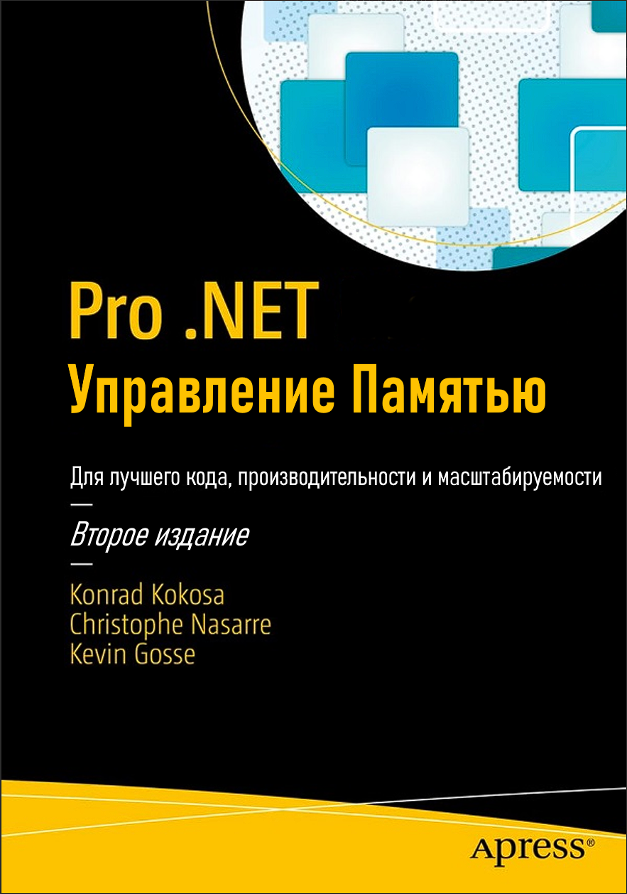
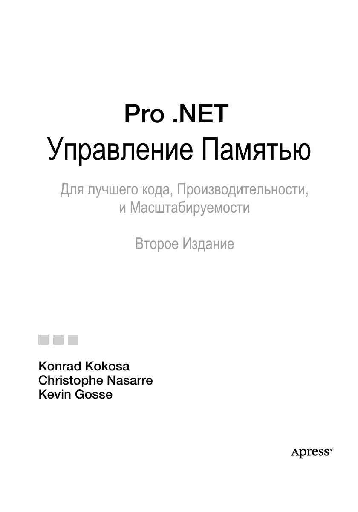

- **Этот репозиторий является авторским переводом на русский язык известной книги:
  Pro .NET Memory Management**
- **Авторы**: Konrad Kokosa, Christophe Nasarre, Kevin Gosse
- Если вы хотите показать, что книга вам нравится или выразить благодарность, ставьте звезду проекту, делайте fork и создавайте Pull Requests!
- Убедительная просьба: Поддержите автора книги купив оригинальную версию по ссылке
  [Pro .NET Memory Management: For Better Code, Performance, and Scalability | SpringerLink](https://link.springer.com/book/10.1007/979-8-8688-0453-3)

***Pro .NET Управление Памятью: для улучшения кода, производительности и масштабируемости, Второе издание.***

| Konrad Kokosa Warsaw, Poland                                               | Christophe Nasarre Paris, France     |
| ----------------------------------------------------------------------------- | --------------------------------------- |
| Kevin Gosse Paris, France                                                  |                                         |
| ISBN-13 (pbk): 979-8-8688-0452-6 https://doi.org/10.1007/979-8-8688-0453-3 | ISBN-13 (electronic): 979-8-8688-0453-3 |
**Авторское право © 2024 Конрад Кокоса, Кристоф Насарре и Кевин Госсе**

Эта работа защищена авторским правом. Все права защищены Издателем, независимо от того, касается ли это всего материала или его части, в частности, права на перевод, перепечатку, повторное использование иллюстраций, декламацию, трансляцию, воспроизведение на микрофильмах или любым другим физическим способом, а также передачу или хранение и извлечение информации, электронную адаптацию, компьютерное программное обеспечение или аналогичные или отличающиеся методологии, известные сейчас или разработанные в будущем.

В этой книге могут появляться товарные знаки, логотипы и изображения. Вместо того, чтобы использовать символ товарного знака с каждым появлением товарного знака, логотипа или изображения, мы используем имена, логотипы и изображения только в редакционной манере и в интересах владельца товарного знака, без намерения нарушить товарный знак.

Использование в данной публикации торговых наименований, товарных знаков, знаков обслуживания и аналогичных терминов, даже если они не обозначены как таковые, не должно рассматриваться как выражение мнения относительно того, распространяются ли на них права собственности.

Хотя советы и информация в этой книге считаются верными и точными на дату публикации, ни авторы, ни редакторы, ни издатель не могут нести никакой юридической ответственности за любые ошибки или упущения, которые могут быть допущены. Издатель не дает никаких гарантий, явных или подразумеваемых, в отношении материалов, содержащихся в настоящем документе.

Управляющий директор Apress Media LLC: Велмоед Спар
Редактор по приобретению: Райан Бирнс
Редактор по развитию: Лора Берендсон
Менеджер редакционного проекта: Джессика Вакили

Дизайн обложки: eStudioCalamar

Распространяется в книжной торговле по всему миру компанией Springer Science+Business Media New York, 1 New York Plaza, Suite 4600, New York, NY 10004-1562, USA.
Телефон 1-800-SPRINGER, факс (201) 348-4505,
электронная почта orders-ny@springer-sbm.com или посетите www.springeronline.com.
Apress Media, LLC является калифорнийской компанией с ограниченной ответственностью,
а ее единственным участником (владельцем) является Springer Science + Business Media Finance Inc (SSBM Finance Inc). SSBM Finance Inc является корпорацией из Делавэра.

Информацию о переводах можно получить по электронной почте
booktranslations@springernature.com;
по вопросам прав на перепечатку, издание в мягкой обложке или аудиоматериалы — по электронной почте bookpermissions@springernature.com.

Названия Apress можно приобретать оптом для академического, корпоративного или рекламного использования. Для большинства названий также доступны версии электронных книг и лицензии. Для получения дополнительной информации посетите нашу веб-страницу оптовых продаж печатных и электронных книг по адресу http://www.apress.com/bulk-sales.

Любой исходный код или другие дополнительные материалы, на которые ссылается автор в этой книге, доступны читателям на GitHub. Для получения более подробной информации посетите https://www.apress.com/gp/services/source-code.

При утилизации данного продукта, пожалуйста, сдайте бумагу на переработку.

---

<i><b>Кевин Госс</b>: Моей любимой жене, которая была бы расстроена, если бы не оказалась первой в этом списке.
Моему сыну, который любезно спал достаточно долго, чтобы я мог написать.
Моим родителям, которые сделали меня тем, кто я есть.</i>

<i><b>Конрад Кокоса</b>: Моей любимой жене Юстине, без которой в моей жизни не произошло бы ничего действительно ценного.</i>

<i><b>Кристоф Насарр</b>: Моей жене и моему отцу.</i>

---
**Броун Александр**: Хочу поблагодарить автора и всех тех кто приложил усилия к созданию этой книги. И очень жаль, что нету возможности приобрести оригинал этой книги на русском языке.

**Публичное заявление:**
- Я ни в коем случае не претендую на авторство публикуемого материала. Я всего лишь стараюсь перевести изложенный материал в этой книги, как можно более точно с технической точки зрения.
- Данный перевод существует с целью личного изучения, ознакомления, не для продажи и не для массового распространения.
- Если перевод вам понравился и у вас начался приступ щедрости, всегда буду рад вашим благотворительным пожертвованиям на https://boosty.to/brown-aleks/donate

 

- А так же пожертвования принимаются на https://www.donationalerts.com/r/brownaleks

 

---
- [Оглавление](https://brown-aleks.github.io/prodotnetmemory.github.io/src)  
- [Об авторах](/about/about-the-authors.md)  
- [О техническом рецензенте](/about/about-the-technical-reviewer.md)  
- [Благодарности](/about/acknowledgments.md)  
- [Предисловие](/about/foreword.md)  
- [Введение](/about/introduction.md)  