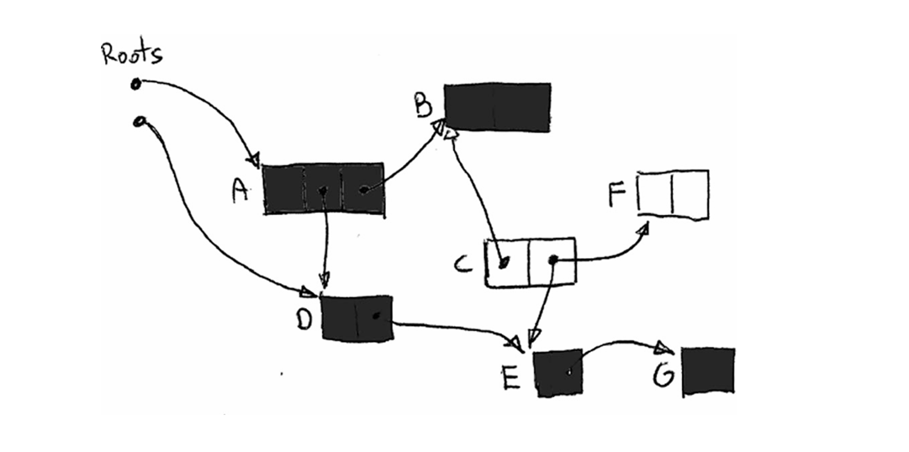

# Автоматическое управление памятью

Чтобы преодолеть проблемы ручного управления памятью и предоставить программисту более удобный способ решения этой проблемы, были предложены различные подходы к автоматическому управлению памятью. Интересно знать, что второй старейший язык программирования высокого уровня — LISP — созданный в 1958 году (всего через несколько лет после FORTRAN), мог многое предложить в этой области. Интересный анекдот рассказывает Джон Маккарти в статье о проектировании LISP «Рекурсивные функции символических выражений и их машинное вычисление, часть I». Он кратко описал этот механизм, но назвал его просто «рекламация». Позже он прокомментировал эту часть:

  


__Цитата

Мы уже называли этот процесс «сборкой мусора», но, видимо, я постеснялся использовать его в статье — иначе мне не разрешили бы грамотеи из Научно-исследовательской лаборатории электроники.

Помимо названия, идея была готова к реализации. В настоящее время названия механизма автоматического управления памятью и сборки мусора используются как взаимозаменяемые. Мы можем определить его как механизм, который снимает с программиста ответственность за ручное управление памятью, так что однажды созданные объекты автоматически уничтожаются (а память после них восстанавливается), когда они больше не нужны.

Одно из главных сообщений, которое мы хотели бы донести в этой книге, заключается в том, что даже когда управление памятью полностью автоматизировано, оно может вызывать проблемы. В качестве небольшого подтверждения стоит привести забавный факт, касающийся первой реализации сборки мусора в LISP. Как вспоминает Маккарти в книге History of Programming Languages I, во время самой первой публичной демонстрации LISP на одном из симпозиумов по связям с промышленностью Массачусетского технологического института из-за незначительной оплошности Flexowriter (электрическая пишущая машинка того времени) начал печатать много страниц с сообщением об ошибке, начинающимся с

  


__Цитата

THE GARBAGE COLLECTOR HAS BEEN CALLED. SOME INTERESTING STATISTICS ARE AS FOLLOWS

вызван сборщик мусора. некоторые интересные статистические данные видны ниже

Из-за этого презентацию пришлось отменить, пока зрители смеялись от души. Никто, кроме самого Джона, не знает, было ли это следствием неправильного использования сборщика мусора. И хотя это была человеческая, а не алгоритмическая ошибка, можно сказать, что сборщики мусора с самого начала создали проблемы!

* * *

## Аллокатор, мутатор и сборщик

Мутаторы и другие концепции являются важными терминами в академических исследованиях автоматического управления памятью. Благодаря четким определениям вы сможете различать их позже в академических и технических работах без двусмысленности. Можно сказать, например, о «накладных расходах на Мутатор» определенных алгоритмов. При рассмотрении различных конструкций сборки мусора часто будет возникать дискуссия о влиянии Сборщика на Мутатор и наоборот. Давайте подробнее рассмотрим эти термины.

### Мутатор

Среди нескольких основных понятий, связанных с управлением памятью, наиболее базовым, но важным является абстракция, называемая Мутатором. В своей простейшей версии Мутатор можно определить как сущность, ответственную за выполнение кода приложения. Его название происходит от того факта, что Мутатор изменяет (мутирует) состояние памяти — объекты выделяются или изменяются, а ссылки между ними изменяются. Другими словами, Мутатор — это движущая машина всех изменений в приложении относительно памяти. Это название было придумано (среди прочих, в той же статье) Эдсгером Дейкстрой в 1978 году в статье «Сборка мусора на лету: упражнение в сотрудничестве», где мы можем найти подробную разработку по этой теме. Интересным побочным фактом является то, что предложение Дейкстры из этой довольно старой статьи все еще используется, например, языком Go в 2015 году, и с хорошими результатами.

Абстракция Мутатор обеспечивает красивую и ясную категоризацию вещей внутри определенного фреймворка или среды выполнения. Вы можете определить Мутатор как все, что может изменять память, либо обновляя существующие объекты, либо создавая новые. Хотя это не строго, мы можем расширить его на все, что может читать память (поскольку чтение является важнейшей операцией для выполнения программы). Это приводит к важному наблюдению — чтобы быть полностью работоспособным, Мутатор должен предоставить три операции работающему приложению:

  * New(amount): Выделяет заданный объем памяти, который затем будет использоваться вновь созданным объектом. Обратите внимание, что на этом уровне абстракции информация о типе объекта не имеет значения. Предоставляется только необходимый размер выделяемой памяти.

  * Write(address, value): записывает указанное значение по указанному адресу. Здесь мы также абстрагируемся от того, рассматриваем ли мы объектное поле (в объектно-ориентированном программировании), глобальную переменную или любой другой тип организации данных.

  * Read(address): считывает значение с указанного адреса.


В простейшем мире, где не существует ни одного алгоритма сборки мусора, эти три операции имеют тривиальные реализации (написанные на псевдокоде в стиле C в [листинге 1-6](<#l-1-6>)).

<a id="l-1-6"></a>
<figure class="custom-code-wrapper"
        markdown="1">

``` C title="listing-1-6.c" linenums="1"
Mutator.New(amount)
{
  return Allocator.Allocate(amount);
}
Mutator.Write(address, value)
{
  *address = value;
}
Mutator.Read(address) : value
{
  return *address;
}
```      

  <figcaption>Листинг 1-6. Реализация трех основных методов Мутатора без автоматизированного управления памятью</figcaption>
</figure>

Но в мире автоматизированной сборки мусора эти три операции являются местами, где Mutator взаимодействует со сборщиком мусора (Collector) и механизмом распределения (Allocator). То, как выглядит это сотрудничество и насколько оно нарушает простоту предыдущих реализаций, является одной из самых важных проблем проектирования. Наиболее распространенным улучшением, с которым вы встретитесь в этой книге, является добавление так называемого барьера — это будет либо барьер чтения, либо барьер записи. Барьер — это способ дополнения операции (либо до, либо после). Барьеры позволяют нам синхронизироваться (прямо или косвенно, синхронно или асинхронно) с механизмом сборщика мусора, чтобы информировать о выполнении программы и использовании памяти. Три метода из [листинга 1-6](<#l-1-6>) являются точками инъекции, к которым может захотеть подключиться каждый сборщик мусора. Мы вернемся к некоторым из наиболее распространенных возможных вариаций в следующих главах при описании различных алгоритмов сборки мусора.

В повседневной реальности разработчиков наиболее распространенной реализацией абстракции Mutator является хорошо известное понятие потока. Он идеально подходит под определение — это единый блок, который запускает код, который мутирует объекты и ссылается на графы между объектами. Для нас это совершенно интуитивно понятно, потому что подавляющее большинство самых популярных сред выполнения используют эту реализацию. Среди множества других функций потоки через некоторый дополнительный уровень взаимодействуют с операционной системой, чтобы разрешить операции New, Write и Read.

Мутаторы не обязательно должны быть реализованы как потоки операционной системы. Популярным примером может быть экосистема Erlang с ее процессами — они управляются как сверхлегкие сопрограммы, живущие в самой среде выполнения. Их можно рассматривать как так называемые «зеленые потоки», но в терминах Erlang VM лучше называть их «зелеными процессами», поскольку разделение, навязываемое средой выполнения, намного сильнее, чем между потокоподобными сущностями. Это сущности, управляемые на уровне среды выполнения, а не на уровне операционной системы. Другая распространенная реализация Мутатора может быть основана на так называемых волокнах, легких единицах выполнения, реализованных как в Linux, так и в Windows.

### Аллокатор

Мутатор должен иметь возможность потреблять операцию «New», которую мы обсуждали в предыдущем пункте. Когда дело доходит до внутреннего устройства этих методов, рано или поздно нужно упомянуть еще одну очень важную концепцию — Аллокатор. Проще говоря, Аллокатор — это сущность, отвечающая за управление динамическим выделением и освобождением памяти.

Распределитель должен обеспечивать две основные операции:

  * Allocate(amount): Выделяет указанный объем памяти. Это, очевидно, может быть расширено методами, способными выделять память для определенного типа объекта, если информация о типе доступна для Allocator. Как мы видели, это внутренне используется операцией Mutator.New.

  * Deallocate(address): Освобождает память по указанному адресу, чтобы сделать ее доступной для будущих выделений. Обратите внимание, что в случае автоматического управления памятью этот метод является внутренним и не отображается для Mutator (и, следовательно, никакой пользовательский код не может вызвать его явно).


Идея может показаться очень простой, если не сказать тривиальной. Но, как мы увидим, это не так просто, как можно было бы ожидать. В дизайне распределителя есть много разных аспектов. И, как всегда, все упирается в компромиссы, в основном между производительностью, сложностью реализации (что напрямую ведет к удобству обслуживания) и другими. Мы углубимся в два самых популярных типа распределителей: последовательный и свободный список. Но поскольку это деталь реализации, будет гораздо лучше узнать о них в конкретном контексте .NET в Главе 4.

### Сборщик

В то время как мы определили Мутатор как сущность, которая отвечает за выполнение кода приложения, мы можем аналогичным образом определить Сборщик как сущность, которая запускает код сборки мусора (автоматического освобождения памяти). Другими словами, вы можете рассматривать Сборщик как часть программного обеспечения (код) или поток, выполняющий его, или и то, и другое. Это зависит от контекста.

Как сборщик узнает, какие объекты больше не нужны и могут быть освобождены? Это неразрешимая задача, потому что ему пришлось бы угадывать будущее. Знание того, будет ли конкретный объект снова использоваться, зависит от кода, который будет выполнен, и это может, кроме того, зависеть от независимых факторов, таких как действия пользователя, внешние данные и т. д. Идеальный сборщик должен знать жизнеспособность объекта — живые объекты — это те, которые понадобятся. Напротив, мертвые (или мусорные) объекты не будут использоваться и могут быть уничтожены. Очевидно, что сборщик называется Сборщиком Мусора или GC сокращённо.

Есть интересное следствие сотрудничества между Mutator, Allocator и Collector. Обратите внимание еще раз, что, поскольку не существует открытого метода Allocator.Deallocate, Mutator не имеет возможности явно освобождать полученную память. Mutators могут только просить выделять все больше и больше памяти, как если бы ее источник был бесконечным. Это действительно означает, что механизм Garbage Collection на самом деле является симуляцией компьютера с бесконечным объемом памяти. То, как работает эта симуляция и насколько она эффективна, зависит от реализации.

Можно придумать специальный сборщик мусора, который вообще не освобождает выделенную память. Он называется Null или Zero Garbage Collector. Он будет работать правильно только на компьютерах с бесконечным объемом памяти, чего, к сожалению, пока не существует. Но Null Garbage Collector не лишены практического применения. Их можно использовать, например, для очень короткоживущих программ, где допустим неограниченный рост памяти. Возможно, они будут становиться все более и более популярными в мире без серверных, коротко работающих одиночных функций. Пример черновика такого Zero Garbage Collector для .NET представлен в Главе 15.

Поскольку невозможно знать жизнеспособность объекта, Сборщик основан на другом, на достижимости любым Мутатором. Достижимость объекта означает, что существует цепочка ссылок (начинающаяся с доступной памяти какого либо Мутатора) между объектами, которая в конечном итоге приводит к этому объекту (см. [Рисунок 1-10](<#f-1-10>)). Достижимость, очевидно, не подразумевает жизнеспособность объекта, но это лучшее приближение, которое у нас есть. Если объект недостижим ни из одного Мутатора, он больше не может использоваться, поэтому он мертв (мусор) и может быть безопасно утилизирован. Обратное, очевидно, неверно. Достижимый объект может оставаться достижимым вечно (хранится некоторым сложным графом ссылок), но из-за условий выполнения к нему никогда не будет доступа, и как таковой он мертв. Фактически, это несоответствие между жизнеспособностью и достижимостью является причиной большинства утечек управляемой памяти.

<a id="f-1-10"></a>
<figure markdown="span" class="custom-figure">
  <figcaption>Рисунок 1-10. Достижимость – объекты C и F недостижимы, поскольку нет пути из корней (местоположений Мутатора), ведущего к ним.</figcaption>
</figure>

Начальные точки Мутатора с точки зрения достижимости называются корнями. Что они собой представляют, зависит от конкретной реализации Мутатора. Но в большинстве распространенных случаев, когда Мутатор — это просто поток (представленный собственным потоком операционной системы), корни могут быть:

  * Локальные переменные и аргументы подпрограмм – помещающиеся в стек или хранящиеся в регистрах.

  * Статически размещенные объекты (например, глобальные переменные) – находящиеся в куче

  * Другие внутренние структуры данных, хранящиеся внутри самого Сборщика.


Рассмотрев три основных строительных блока — мутатор, аллокатор и коллектор — мы теперь можем перейти к знакомству с множеством различных подходов к автоматическому управлению памятью. Хотя и заманчиво предоставить полный список с подробным описанием всех из них, это гораздо больше, чем может охватить эта книга. Вместо этого вы узнаете о некоторых основных, наиболее популярных подходах, которые можно встретить в современных языках.