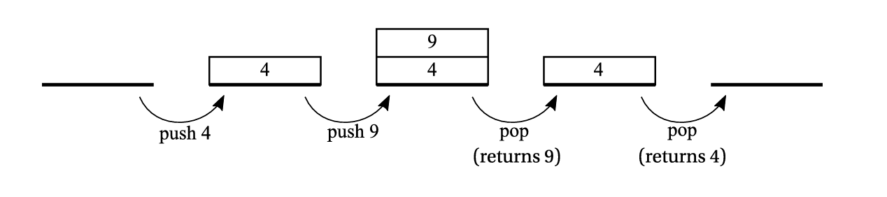
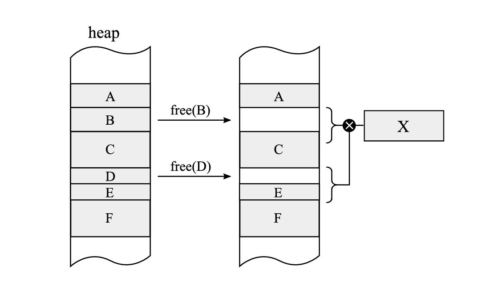
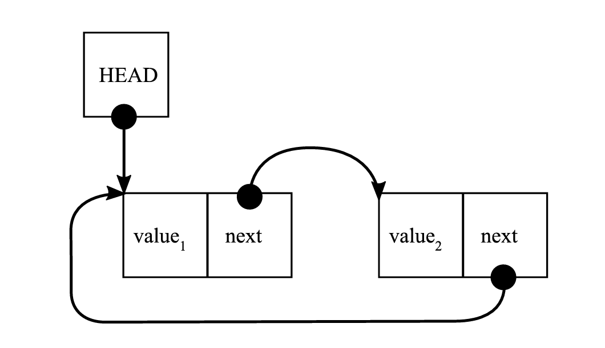
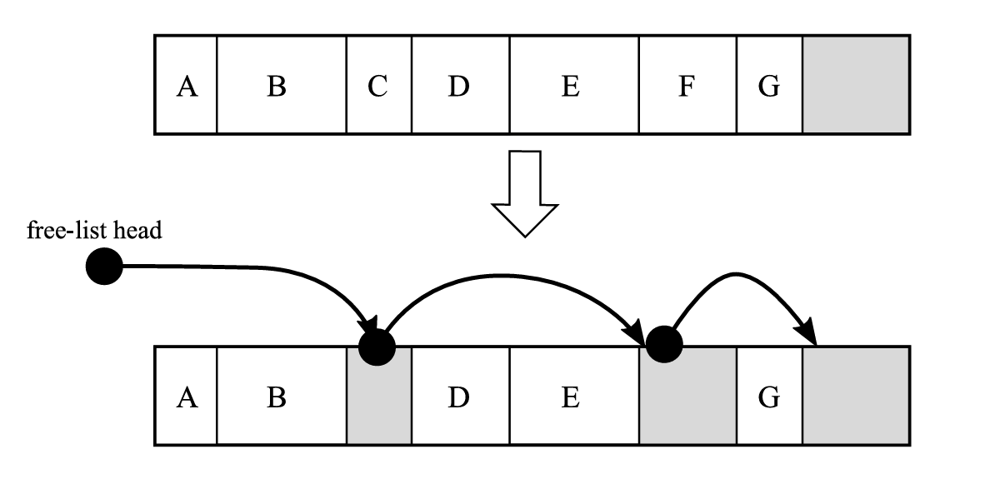

---
title: Chapter1
description: Перевод главы из книги Pro .NET Memory Management
---

Глава 1: Базовые концепции

* * *

Давайте начнем с простого, но важного вопроса. Когда вам следует беспокоиться об управлении памятью .NET, если все автоматизировано? Стоит ли вообще беспокоиться? Как вы, вероятно, ожидаете, учитывая тот факт, что мы написали такую ​​книгу, мы настоятельно рекомендуем вам думать о памяти в ситуации каждого разработчика. Часто это то, что составляет разницу между проверкой концепции на машине разработчика и готовым к производству кодом. Оптимален ли он с точки зрения использования процессора и памяти? Является ли он поддерживаемым, тестируемым, открытым для расширения, но закрытым для модификации? Соответствует ли ваш код SOLID? Мы считаем, что все эти вопросы отличают новичков от более продвинутых, опытных программистов. Первые в основном заинтересованы в том, чтобы выполнить работу, и не слишком заботятся о вышеупомянутых нефункциональных аспектах своей работы. Последние достаточно опытны, чтобы иметь достаточно «умственной вычислительной мощности», чтобы оценить качество своей работы. Мы считаем, что все хотят быть такими. Но это, конечно, нетривиальная задача. Написать элегантный код без каких-либо ошибок, с выполнением каждого возможного нефункционального требования, действительно сложно.

Но должно ли такое стремление к превосходству быть единственной мотивацией для получения глубоких знаний об управлении памятью .NET? Разрушение памяти, вызывающее AccessViolationException чрезвычайно редко. Редкий сценарий неконтролируемого увеличения использования памяти также может вызвать то же исключение. У тебя есть о чем беспокоиться? Благодаря утонченности времени выполнения .NET вам не нужно много думать об аспектах памяти. Но, с другой стороны, при участии в анализе задач производительности крупных приложений на основе .NET проблемы с потреблением памяти всегда были высокими в списке проблем. Это вызывает проблемы в долгосрочном взгляде, если у вас есть утечка памяти после дней непрерывной работы? В Интернете вы можете найти забавный мем об утечке памяти, которая не была зафиксирована в программном обеспечении какой-то конкретной ракеты боевых действий, потому что было достаточно памяти до того, как ракета достигла своего пункта назначения. Ваша система такая бывшая ракета? Может быть, вы могли бы использовать только два сервера вместо десяти? Кроме того, вы должны подумать о потреблении памяти, особенно во времена облачных вычислений без серверов. Одним из примеров может быть функции Azure, которые выставлены на основе меры, называемой «гигабайтными секундами» (GB-S). Он рассчитывается путем умножения среднего размера памяти в гигабайтах к моменту секунд, необходимых для выполнения конкретной функции. Потребление памяти напрямую приводит к потраченным деньгам. 

В каждом случае вы начинаете понимать, что понятия не имеете, где начать искать настоящую причину и значимые измерения. Это то место, где вы начинаете понимать, что стоит разобраться во внутренних механизмах ваших приложений и базовой среде выполнения. 

Чтобы глубоко понять управление памятью в .NET, лучше всего начать с нуля. Неважно, являетесь ли вы начинающим программистом или очень продвинутым. Важно, чтобы вы прошли теоретическое введение в этой главе: это установит необходимый уровень знаний и понимания концепций, которые будут использоваться в остальной части книги. Чтобы это не было просто скучной теорией, иногда мы ссылаемся на конкретные технологии. Если вас интересует управление памятью в истории компьютерных наук, обратитесь к бесплатной главе, доступной по адресу [Chapter01_History.pdf](<https://prodotnetmemory.com/assets/files/Chapter01_History.pdf>)

* * *

Термины, связанные с памятью

Прежде чем начать, полезно рассмотреть некоторые очень важные определения, без которых трудно представить обсуждение темы памяти:

  * Бит: Это наименьшая единица информации, используемая в компьютерных технологиях. Она представляет два возможных состояния, обычно означающих числовые значения 0 и 1 или логические значения true и false. Мы кратко упоминаем, как современные компьютеры хранят отдельные биты в Главе 2. Для представления больших числовых значений необходимо использовать комбинацию нескольких бит для кодирования их в виде двоичного числа, что объясняется следующим образом. При указании размера данных биты указываются строчной буквой b.

  * Двоичное число: это целое числовое значение, представленное в виде последовательности битов. Каждый последующий бит определяет вклад последовательной степени 2 в сумму данного значения. Например, для представления числа 5 используются три последовательных бита со значениями 1, 0 и 1, поскольку 1x1 + 0x2 + 1x4 равно 5. Двоичное число длиной n бит может представлять максимальное значение 2^n – 1. Также часто существует дополнительный бит, выделенный для представления знака значения для кодирования как положительных, так и отрицательных чисел. Существуют также другие, более сложные способы кодирования числовых значений в двоичной форме, особенно для чисел с плавающей точкой.

  * Двоичный код: Вместо числовых значений последовательность битов может представлять определенный набор различных данных, например, символов текста. Каждая последовательность битов назначается определенным данным. Самым базовым и самым популярным на протяжении многих лет был код ASCII, который использует 7-битный двоичный код для представления текста и других символов. Существуют и другие важные двоичные коды, такие как коды операций, кодирующие инструкции, сообщающие компьютеру, что он должен делать.

  * Байт: Исторически это была последовательность битов для кодирования одного символа текста с использованием указанного двоичного кода. Наиболее распространенный размер байта составляет 8 бит, хотя он зависит от архитектуры компьютера и может варьироваться в зависимости от модели. Из-за этой неоднозначности существует более точный термин октет, который означает именно 8-битную единицу данных. Тем не менее, фактическим стандартом является понимание байта как 8-битного значения длины, и как таковой он стал неоспоримым стандартом для определения размеров данных. В настоящее время вряд ли он встретит что-то иное, чем стандартная архитектура с 8-битными байтами. При указании размера данных байты указываются с заглавной буквой B.

Указывая размер данных, мы используем наиболее распространенные кратные (префиксы), определяющие их порядок величины. Это является причиной постоянной путаницы и недопонимания. Такие чрезвычайно популярные термины, как кило, мега и гига, означают умножение тысяч. Один кило равен 1000 (и мы обозначаем его строчной буквой k), один мега равен 1 миллиону (заглавной буквой M) и так далее. С другой стороны, иногда популярным подходом является выражение порядков величины в последовательных умножениях 1024. В таких случаях мы говорим об одном киби, что равно 1024 (обозначается как Ki), один меби равен 1024*1024 (обозначается как Mi), один гиби (Gi) равен 1024*1024*1024 и так далее. Это вносит общую двусмысленность. Когда кто-то говорит об 1 «гигабайте», он может думать о 1 миллиарде байт (1 ГБ) или 1024^3 байт (1 ГиБ) в зависимости от контекста. На практике очень немногие заботятся о точном использовании этих префиксов. В настоящее время принято указывать размер модулей памяти в компьютерах как гигабайты (ГБ), когда они на самом деле являются гибибайтами (ГиБ) или наоборот в случае с жесткими дисками. Даже стандарт JEDEC 100B.01 «Термины, определения и буквенные обозначения для микрокомпьютеров, микропроцессоров и интегральных схем памяти» ссылается на общее использование K, M и G как умножений 1024, не осуждая его явно. В таких ситуациях нам остается только полагаться на здравый смысл в понимании этих префиксов из контекста.

В настоящее время мы очень привыкли к таким терминам, как ОЗУ или постоянное хранилище, установленное в наших компьютерах. Даже умные часы теперь оснащены 32 ГиБ ОЗУ! Вы можете легко забыть, что первые компьютеры не были оснащены такой роскошью. Можно сказать, что они не были оснащены ничем. На [рисунке 1-1](<#f-1-1>) показаны различные элементы компьютера:

  * Память: отвечает за хранение данных и самой программы. Способ реализации памяти со временем значительно изменился, начиная с вышеупомянутых перфокарт, через магнитные типы и электронно-лучевые трубки, до используемых в настоящее время транзисторов. Память можно разделить на две основные подкатегории:

    * Оперативная память (ОЗУ): позволяет считывать данные в одно и то же время доступа независимо от области памяти, к которой осуществляется доступ. На практике, как вы увидите в Главе 2, современная память удовлетворяет этому условию лишь приблизительно по технологическим причинам.

    * Неравномерная память доступа: в отличие от ОЗУ, время, необходимое для доступа к памяти, зависит от ее расположения на физическом носителе. Это, очевидно, включает в себя перфокарты, магнитные типы, классические жесткие диски, CD и DVD и т. д., где носители информации должны быть позиционированы (например, повернуты) в правильное положение перед доступом.

  * Адрес: представляет собой определенное местоположение во всей области памяти. Обычно выражается в байтах, поскольку один байт — это наименьшая возможная адресуемая гранулярность на многих платформах.

  * Арифметико-логическое устройство (АЛУ): отвечает за выполнение таких операций, как сложение и вычитание. Это ядро ​​компьютера, где выполняется большая часть работы. В настоящее время компьютеры включают в себя более одного АЛУ, что позволяет распараллеливать вычисления.

  * Блок управления: декодирует инструкции программы (коды операций), считанные из памяти. На основе описания внутренней инструкции он знает, какую арифметическую или логическую операцию следует выполнить и над какими данными.

  * Регистр: ячейка памяти, быстро доступная из АЛУ и/или блока управления (которые мы можем вместе называть исполнительными блоками), обычно содержащаяся в ней. Упомянутые выше аккумуляторы представляют собой специальный, упрощенный вид регистров. Регистры чрезвычайно быстры с точки зрения времени доступа, и фактически нет данных более близких к исполнительным блокам.

  * Слово: Базовая единица данных фиксированного размера, используемая в конкретном компьютерном проектировании. Она отражена во многих областях проектирования, таких как размер большинства регистров, максимальный адрес или самый большой блок данных, передаваемый за одну операцию. Чаще всего она выражается в количестве бит (называемых размером слова или длиной слова). Большинство современных компьютеров являются 32- или 64-разрядными, поэтому они имеют длину слова 32 и 64 бита соответственно, регистры длиной 32 или 64 бита и т. д.

Блок управления использует дополнительный регистр, называемый указателем инструкций (IP) или счетчиком программ (PC), для указания на текущую выполняемую инструкцию. Обычное выполнение программы так же просто, как увеличение адреса, хранящегося в PC, на следующие инструкции. Такие вещи, как циклы или переходы, так же просты, как изменение значения указателя инструкций на следующую инструкцию для выполнения, обозначая, какую инструкцию мы хотим, чтобы программа продолжила выполнять.

 Рисунок 1-1. Компьютерная диаграмма с хранимой программой – память + указатель инструкций

Первые компьютеры программировались с использованием двоичного кода, который напрямую описывал инструкции для выполнения. Однако с ростом сложности программ это решение становилось все более обременительным. Был разработан новый язык программирования (обозначаемый как языки программирования второго поколения – 2GL) для описания кода более доступным способом с помощью так называемого ассемблерного кода. Это текстовое и очень краткое описание отдельных инструкций, выполняемых процессором. Это было намного удобнее, чем прямое двоичное кодирование. Затем были разработаны даже языки более высокого уровня (3GL), такие как известные C, C++ или Pascal.

Для нас интересно то, что все эти языки должны быть преобразованы из текстовой в двоичную форму, а затем помещены в память компьютера. Это преобразование называется компиляцией, а инструмент, который его запускает, называется компилятором. В случае ассемблерного кода мы скорее называем его сборкой с помощью инструмента ассемблера. В конечном итоге результатом является программа в формате двоичного кода, которая может быть позже выполнена – последовательность кодов операций и их аргументов (операндов).

Вооружившись этими базовыми знаниями, вы теперь можете начать свой путь в управлении памятью!

* * *

Статическое выделение

Большинство самых первых языков программирования допускали только статическое выделение памяти — объем и точное местоположение необходимой памяти должны были быть известны во время компиляции, еще до выполнения программы. С фиксированными и предопределенными размерами управление памятью было тривиальным. Все основные языки программирования «древних времен», начиная с машинного или ассемблерного кода и заканчивая первыми версиями FORTRAN и ALGOL, имели такие ограниченные возможности. Но у них также есть много недостатков. Статическое выделение памяти может легко привести к неэффективному использованию памяти. Не зная заранее, какой объем данных будет обработан, как мы вычислим, сколько памяти нам следует выделить? Это делает программы ограниченными и негибкими. В общем, такую ​​программу нужно снова компилировать для обработки больших объемов данных.

В самых первых компьютерах все выделения были статическими, поскольку используемые ячейки памяти (аккумулятор, регистры или ячейки оперативной памяти) определялись во время кодирования программы. Поэтому определенные «переменные» существовали в течение всего жизненного цикла программы. В настоящее время мы все еще используем статическое распределение в том смысле, что при создании статических глобальных переменных и тому подобных, хранящихся в специальном сегменте данных программы. В последующих главах вы увидите, где они хранятся в случае программ .NET.

* * *

Регистровая машина

Компьютеры используют регистры (или аккумуляторы как частный случай) для работы с арифметико-логическими устройствами (АЛУ). Машины, которые полагаются на эту конструкцию, называются регистровыми машинами. Это потому, что при выполнении программ на таком компьютере мы фактически производим вычисления в регистрах. Если мы хотим сложить, разделить или сделать что-то еще, мы должны загрузить соответствующие данные из памяти в соответствующие регистры. Затем мы вызываем определенную инструкцию, чтобы вызвать соответствующую операцию над ними, а затем еще одну, чтобы сохранить результат из одного из регистров обратно в память.

Предположим, мы хотим написать программу, которая вычисляет выражение `s=x+(2*y)+z` на компьютере с двумя регистрами — A и B. Предположим также, что

  * s, x, y и z — адреса памяти, в которых хранятся некоторые значения.

  * Некоторый низкоуровневый псевдоассемблерный код с такими инструкциями, как «Загрузить», «Сложить» и «Умножить».

Такую теоретическую машину можно запрограммировать с помощью простой программы, представленной в [листинге 1-1](<#l-1-1>).

  

    
    
        
          Load      A, y    // A = y
          Multiply  A, 2    // A = A * 2 = 2 * y
          Load      B, x    // B = x
          Add       A, B    // A = A + B = x + 2 * y
          Load      B, z    // B = z
          Add       A, B    // A = A + B = x + 2 * y + z
          Store     s, A    // s = A
        
      

Листинг 1-1. Псевдокод примера программы, реализующей вычисление `s=x+(2*y)+z` на простой двух-регистровой машине. Комментарии показывают состояние регистра после выполнения каждой инструкции

Если этот код напоминает вам x86 или любой другой ассемблерный код, который вы когда-либо изучали, это не совпадение! Это потому, что большинство современных компьютеров — это сложные регистровые машины. Все процессоры Intel и AMD, которые мы используем в наших компьютерах, работают таким образом. При написании ассемблерного кода на базе x86/x64 мы оперируем регистрами общего назначения, такими как eax, ebx, ecx и т. д. Конечно, есть еще много инструкций, других специализированных регистров и т. д. Но концепция та же самая.

  

__Примечание

Можете ли вы представить себе машину с набором инструкций, которая позволяет выполнять операцию непосредственно в памяти без необходимости загрузки данных в регистры? Следуя псевдоассемблеру, это может выглядеть гораздо более лаконично и высокоуровнево, поскольку больше нет необходимости в инструкциях загрузки/сохранения:
    
    
          
            Multiply  s, y, 2   // s = 2 * y
            Add       s, x      // s = s + x = 2 * y + x
            Add       s, z      // s = s + z = 2 * y + x + z
          
        

Да, были такие машины, как IBM system/360, но на сегодняшний день нам не известно ни об одном серийно используемом компьютере такого типа.

* * *

Стек

Концептуально стек представляет собой структуру данных, которую можно просто описать как список «последним пришел, первым ушел» (LIFO). Он позволяет выполнять две основные операции: добавлять некоторые данные наверх («push») и удалять + возвращать некоторые данные сверху («pop»), как показано на [рисунке 1-2](<#f-1-2>).

 Рисунок 1-2. Операции извлечения и добавления стека. Это только концептуальный рисунок, не связанный с какой-либо конкретной моделью памяти и реализацией

Концепция стека стала неотъемлемо связана с программированием с самого начала, в основном из-за концепции подпрограммы. Сегодняшний .NET активно использует концепции «стек вызовов» и «стек», поэтому давайте посмотрим, как все начиналось. Первоначальное значение стека как структуры данных по-прежнему актуально (например, в .NET есть коллекция Stack&ltT;>).

Стек является очень важным аспектом управления памятью, поскольку при программировании в .NET туда может быть помещено много наших данных. Давайте подробнее рассмотрим стек и его использование в вызовах функций. Мы будем использовать пример программы из [листинга 1-2](<#l-1-2>), написанный на псевдокоде в стиле C, который вызывает две функции – main вызывает fun1 (передавая два аргумента a и b), которая имеет две локальные переменные x и y. Затем функция fun1 в какой-то момент вызывает функцию fun2 (передавая один аргумент n), которая имеет одну локальную переменную z.

  

    
    
        
          void main()
          {
            ...
            fun1(2, 3);
            ...
          }
          
          int fun1(int a, int b)
          {
            int x, y;
            ...
            fun2(a+b);
          }
          
          int fun2(int n)
          {
            int z;
            ...
          }
        
      

Листинг 1-2. Псевдокод программы, вызывающей функцию внутри другой функции

Сначала представьте себе непрерывную область памяти, предназначенную для обработки стека, нарисованную таким образом, что последующие ячейки памяти имеют растущие адреса (см. левую часть [рисунка 1-3a](<#f-1-3a>)), и вторую область памяти, где находится ваш программный код (см. правую часть [рисунка 1-3a](<#f-1-3a>)), организованную таким же образом. Поскольку код функций не обязательно должен лежать рядом друг с другом, блоки кода main, fun1 и fun2 нарисованы раздельно. Выполнение программы из [листинга 1-2](<#l-1-2>) можно описать следующими шагами:

  

  1. Прямо перед вызовом fun1 внутри main (см. [рисунок 1-3a](<#f-1-3a>)). Очевидно, что поскольку программа уже запущена, некоторая область стека уже создана (серая часть в верхней части области стека на [рисунке 1-3a](<#f-1-3a>)). Указатель стека (SP) хранит адрес, указывающий текущую границу стека. Счетчик программ (PC) указывает куда-то внутри функции main (мы обозначили это как адрес A1), прямо перед инструкцией вызвать fun1.

 Рисунок 1-3a. Стек и области памяти кода – в момент перед вызовом функции fun1 из [листинга 1-2](<#l-1-2>)
  2. После вызова fun1 внутри main (см. [рис. 1-3b](<#f-1-3b>)). При вызове функции стек расширяется путем перемещения SP для хранения необходимой информации. Это дополнительное пространство включает:

     * Аргументы: Все аргументы функции могут быть сохранены в стеке. В нашем примере там были сохранены значения аргументов a (2) и b (3).

     * Адрес возврата: Чтобы иметь возможность продолжить выполнение функции main после выполнения fun1, адрес следующей инструкции сразу после вызова функции сохраняется в стеке. В нашем случае мы обозначили его как адрес A1+1 (указывающий на следующую инструкцию после инструкции под адресом A1).

     * Локальные переменные: Место для всех локальных переменных, которые также могут быть сохранены в стеке. В нашем примере там были сохранены переменные x и y.

Структура, помещаемая в стек при вызове подпрограммы, называется кадром активации. В типичной реализации указатель стека уменьшается на соответствующее смещение, чтобы указать место, где может начаться новый кадр активации. Поэтому часто говорят, что стек растет вниз.

 Рисунок 1-3b. Стек и области памяти кода – после вызова функции fun1 из [листинга 1-2](<#l-1-2>)
  3. После вызова fun2 из fun1 (см. [рис. 1-3c](<#f-1-3c>)). Повторяется та же схема создания нового кадра активации. На этот раз он содержит область памяти для значения аргумента n, адрес возврата A2+1 и локальную переменную z.

 Рисунок 1-3c. Стек и области памяти кода – в момент после вызова функции fun2 из fun1 

Кадр активации также называется более общим термином кадр стека, что означает любые структурированные данные, сохраненные в стеке для конкретных целей.

Как вы можете себе представить, последующие вызовы вложенных подпрограмм просто повторяют этот шаблон, добавляя один кадр активации для каждого вызова. Чем больше вложенных вызовов подпрограмм, тем больше кадров активации будет в стеке. Это, конечно, делает вызов бесконечных вложенных вызовов невозможным, так как это потребовало бы памяти для бесконечного числа кадров активации. В .NET такой бесконечный цикл заканчивается исключением StackOverflowException. Вы вызвали так много вложенных подпрограмм, что достигли предела памяти для стека.

Имейте в виду, что представленный здесь механизм является всего лишь примерным и очень общим. Фактические реализации могут различаться в зависимости от архитектуры и операционной системы. Мы подробно рассмотрим, как кадры активации и стек используются .NET в последующих главах.

Когда подпрограмма завершается, ее кадр активации просто отбрасывается путем увеличения указателя стека на размер текущего кадра активации, в то время как сохраненный адрес возврата используется для перехода выполнения обратно к вызывающей функции. Другими словами, то, что было внутри кадра стека (локальные переменные, параметры), больше не нужно, поэтому увеличения указателя стека достаточно, чтобы «освободить» память, использованную до сих пор. Эти данные будут просто перезаписаны при следующем использовании стека другими вызовами функций (см. [рисунок 1-4](<#f-1-4>)).

 Рисунок 1-4. Stack and code memory regions – after returning from function fun1, both activation frames are discarded

Что касается реализации, то и SP, и PC обычно хранятся в выделенных регистрах. На этом этапе размер самого адреса, наблюдаемые области памяти и регистры не особенно важны.

Стек в современных компьютерах поддерживается как аппаратным обеспечением (путем предоставления специальных регистров для указателей стека), так и программным обеспечением (путем абстракции операционной системы от потока и его части памяти, обозначенной как стек).

* * *

Стековая машина

Прежде чем перейти к другим концепциям памяти, давайте на некоторое время остановимся на контексте, связанном со стеком, — так называемых стековых машинах. В отличие от регистровой машины, все инструкции в стековой машине работают с выделенным стеком выражений (или стеком вычислений). Пожалуйста, имейте в виду, что этот стек не обязательно должен быть тем же стеком, о котором мы говорили ранее. Следовательно, такая машина может иметь как дополнительный «стек выражений», так и стек общего назначения. Регистров может вообще не быть. В такой машине по умолчанию инструкции берут аргументы с вершины стека выражений — столько, сколько им требуется. Результат также сохраняется на вершине стека. В таких случаях они называются чистыми стековыми машинами, в отличие от нечистых реализаций, когда операции могут получать доступ к значениям не только с вершины стека, но и глубже.

Как именно выглядит операция в стеке выражений? Например, гипотетическая инструкция Multiply (без аргументов) извлечет два значения из верхней части стека оценки для своих параметров, умножит их и поместит результат обратно в стек оценки (см. [рисунок 1-5](<#f-1-5>)).

 Рисунок 1-5. Гипотетическая инструкция умножения в стековой машине — извлекает два элемента из стека и помещает результат их умножения в стек.

Давайте вернемся к образцу выражения `s=x+(2*y)+z` из примера регистровой машины и перепишем его в стиле стековой машины (см. [листинг 1-3](<#l-1-3>)).

  

    
    
        
                      // empty stack
          Push 2      // [2] - single stack element of value 2       
          Push y      // [2][y] - two stack elements of value 2 and y        
          Multiply    // [2*y]        
          Push x      // [2*y][x]        
          Add         // [2*y+x]        
          Push z      // [2*y+x][z]        
          Add         // [2*y+x+z]        
          Pop l       // [] (with side effect of writing a value into l)        
        
      

Листинг 1-3. Пример программы, реализующей вычисление `s=x+(2*y)+z` на простой двух-регистровой машине, переписанный в стиле стековой машины

Эта концепция приводит к очень ясному и понятному коду. Основные преимущества можно описать следующим образом:

  * Нет никаких проблем относительно того, как и где хранить временные значения – должны ли они быть регистрами, стеком или основной памятью. Концептуально это проще, чем пытаться оптимально управлять всеми этими возможными целями. Таким образом, это упрощает реализацию.

  * Опкоды могут быть короче с точки зрения требуемой памяти, поскольку существует много инструкций без операндов или с одним операндом. Это позволяет эффективно кодировать инструкции в двоичном формате и, следовательно, производить плотный двоичный код. Несмотря на необходимость большего количества операций загрузки/сохранения, что может увеличить количество инструкций по сравнению с подходом на основе реестра, этот метод остается полезным.

Это было важным преимуществом в ранние времена компьютеров, когда память была очень дорогой и ограниченной. Это может быть выгодно и сегодня в случае загружаемого кода для смартфонов или веб-приложений. Плотное двоичное кодирование инструкций также подразумевает лучшее использование кэша ЦП.

Несмотря на свои преимущества, концепция стековой машины редко реализовывалась в самом оборудовании. Одним заметным исключением были машины Burroughs, такие как B5000, которые включали аппаратную реализацию стека. В настоящее время, вероятно, нет широко используемой машины, которую можно было бы описать как стековую машину. Одним заметным исключением является блок с плавающей точкой x87 (внутри x86-совместимых процессоров): он был разработан как стековая машина и до сих пор программируется как таковая из-за обратной совместимости.

Так зачем вообще упоминать эти типы машин? Потому что такая архитектура — отличный способ проектирования независимых от платформы виртуальных машин или механизмов выполнения. Виртуальная машина Java и среда выполнения .NET — прекрасные примеры стековых машин. Они реализованы поверх архитектуры x86 или ARM, которые являются хорошо известными регистровыми машинами, но это не меняет того факта, что они реализуют логику стековой машины. Мы наглядно покажем это при описании промежуточного языка (IL) .NET в Главе 4. Почему среда выполнения .NET и JVM (виртуальная машина Java) были спроектированы таким образом? Как всегда, это смесь инженерных и исторических причин. Код стековой машины лучше подходит для абстрагирования от базового оборудования, поскольку он не зависит от количества доступных регистров. Затем задача перевода кода стековой машины в фактический код на основе регистров остается за конкретной реализацией для целевого оборудования. Виртуальные стековые машины проще реализовать и обеспечивают хорошую независимость от платформы, при этом по-прежнему производя высокопроизводительный код. В сочетании с упомянутой лучшей плотностью кода это хороший выбор для платформы, которая должна работать на широком спектре устройств. Вероятно, именно поэтому Sun решила выбрать этот путь, когда Java была изобретена для небольших устройств, таких как телевизионные приставки. Microsoft, разрабатывая .NET, также следовала этому пути. Концепция стековой машины элегантна и проста, и она просто работает. Это делает реализацию виртуальной машины более приятной инженерной задачей!

С другой стороны, проекты виртуальных машин на основе реестра гораздо ближе к проекту реального оборудования, на котором они работают. Это очень полезно с точки зрения возможных оптимизаций. Сторонники этого подхода говорят, что можно достичь гораздо лучшей производительности, особенно в интерпретируемых средах выполнения. У интерпретатора ограниченное время для применения расширенных оптимизаций, поэтому чем ближе интерпретируемый код к машинному коду, тем он лучше. Кроме того, работа с наиболее часто используемым набором регистров обеспечивает большую локальность кэша.

Как всегда, принимая решение, вам нужно идти на некоторые компромиссы. Спор между сторонниками обоих подходов длится долго и неразрешен. Тем не менее, факт в том, что в настоящее время механизм выполнения .NET реализован как стековая машина, хотя она и не полностью чистая — как показано в Главе 4. Вы также увидите, как стек оценки сопоставляется с базовым оборудованием, состоящим из регистров и памяти.

  

__Примечание

Все ли виртуальные машины и движки выполнения являются стековыми машинами? Абсолютно нет! Одним из заметных исключений является Dalvik, который был виртуальной машиной в Android от Google до версии 4.4, которая была реализацией JVM на основе реестра. Это был интерпретатор промежуточного «байт-кода Dalvik». Но затем в преемнике Dalvik — Android Runtime (ART) была введена технология JiT (Just-in-Time-компиляция, описанная в главе 4). Другие примеры включают BEAM (виртуальная машина для Erlang/Elixir), Chakra (движок выполнения Javascript в iE9), Parrot (виртуальная машина Perl 6) и Lua VM (виртуальная машина Lua). Поэтому никто не может сказать, что этот тип машин не популярен.

* * *

Указатель

До сих пор мы представили только две концепции памяти: статическое распределение и распределение стека (как часть стекового фрейма). Концепция указателя является очень общей и может быть обнаружена с самого начала вычислительной эры – как ранее показанная концепция указателя инструкций (счетчика программ) или указателя стека. Конкретные регистры, предназначенные для адресации памяти, такие как индексные регистры, также могут рассматриваться как указатели.

Указатели — это переменные, в которых вы храните адрес позиции в памяти. Проще говоря, это позволяет вам ссылаться на другие места в памяти по его адресу. Размер указателя связан с длиной слова, упомянутой ранее, и зависит от архитектуры компьютера. В настоящее время мы обычно имеем дело с указателями шириной 32 или 64 бита, размещенными в стеке (например, как локальная переменная или аргумент функции) или в регистрах ЦП. На [рисунке 1-6](<#f-1-6>) показана типичная ситуация, когда одна из локальных переменных (хранящихся в кадре активации функции) является указателем на другую область памяти с адресом Addr.

 Рисунок 1-6. Локальная переменная ptr функции, являющаяся указателем на память по адресу Addr

Простая идея указателей позволяет нам создавать сложные структуры данных, такие как связанные списки или деревья, поскольку структуры данных в памяти могут ссылаться друг на друга, создавая более сложные структуры (см. [рисунок 1-7](<#f-1-7>)).

 Рисунок 1-7. Указатели, используемые для построения двусвязной структуры списка, когда каждый элемент указывает на свой предыдущий и следующий элементы.

* * *

Куча

Наконец, мы дошли до самой важной концепции в контексте управления памятью .NET. Куча (реже известная как свободное хранилище) — это область памяти, используемая для динамически выделяемых объектов. Свободное хранилище — лучшее название, поскольку оно не предполагает никакой внутренней структуры, а скорее цели. На самом деле, вы можете справедливо спросить, какова связь между структурой данных кучи и самой кучей. Правда в том, что ее нет. Хотя стек хорошо организован (он основан на концепции структуры данных LIFO), куча больше похожа на «черный ящик», который можно попросить предоставить память, независимо от того, откуда она будет поступать. Поэтому «пул» или упомянутое «свободное хранилище», вероятно, было бы лучшим названием. Название кучи, вероятно, использовалось с самого начала в традиционном английском смысле, означающем «беспорядочное место» — в отличие от хорошо упорядоченного пространства стека. Исторически выделение кучи было введено в ALGOL 68, но этот стандарт не получил широкого распространения. Но именно отсюда, вероятно, и произошло название. Факт в том, что истинное историческое происхождение этого названия сейчас довольно неясно.

Куча — это механизм, способный предоставить непрерывный блок памяти с указанным размером. Эта операция называется динамическим выделением памяти, поскольку и размер, и фактическое местоположение блока памяти не обязательно должны быть известны во время компиляции. Поскольку местоположение памяти неизвестно во время компиляции, на динамически выделенную память должен ссылаться указатель. Следовательно, концепции указателя и кучи по своей сути связаны.

Адрес, возвращаемый некоторой функцией «выделите мне X байт памяти», очевидно, следует запомнить в некотором указателе для будущей ссылки на созданный блок памяти. Он может храниться в стеке (см. [рисунок 1-8](<#f-1-8>)), в самой куче или где-нибудь еще, например, в регистре.

 Рисунок 1-8. Стек с указателем ptr и блоком шириной 10 байт в куче

Обратная операция выделения называется освобождением, когда заданный блок памяти возвращается в пул памяти для будущего использования. Как именно куча выделяет блок заданного размера — это деталь реализации. Существует много возможных «распределителей», и вы скоро увидите некоторые из них.

Выделяя и освобождая много блоков, мы можем прийти к ситуации, когда для данного объекта не будет достаточно непрерывного свободного пространства, хотя в целом в куче достаточно свободного места. Такая ситуация называется фрагментацией кучи и может привести к значительной неэффективности использования памяти. [Рисунок 1-9](<#f-1-9>) иллюстрирует такую ​​проблему, когда для объекта X недостаточно свободного непрерывного пространства. Существует много различных стратегий, используемых распределителями для максимально оптимального управления пространством, чтобы избежать фрагментации (или эффективно ее использовать).

 Рисунок 1-9. Фрагментация – после удаления объектов B и D не остается достаточного смежного пространства для нового объекта X, хотя в целом для него достаточно свободного места.

Стоит также отметить, что наличие одной кучи или нескольких экземпляров кучи в одном процессе — это еще одна деталь реализации (мы обсудим это более подробно для .NET).

Давайте сделаем краткий обзор различий между стеком и кучей в [Таблице 1-1](<#t-1-1>).

# | Свойство | Стек | Куча  
---|---|---|---  
1 | Продолжительность жизни | Область действия функции для локальных переменных (вставлено при входе, извлечено при выходе) | Явное (по выделению и необязательному освобождению)  
2 | Объем | Локальный (поток) | Глобальный (любой, у кого есть указатель)  
3 | Доступ | Локальная переменная, аргументы функции | Указатель  
4 | Время доступа | Быстро (часто используемая область памяти, поэтому, вероятно, кэшируется в ЦП) | Медленнее (может даже временно сохраняться на жестком диске)  
5 | Распределение | Перемещаемый указатель стека | Различные возможные стратегии  
6 | Время распределения | Очень быстро (увеличение указателя стека) | Медленнее (зависит от стратегии распределения)  
7 | Освобождение | Перемещаемый указатель стека | Различные возможные стратегии  
8 | Использование | Параметры подпрограммы, локальные переменные, кадры активации, небольшие массивы фиксированного размера | Все  
9 | Емкость | Ограничено (обычно несколько МБ на поток) | Практически неограниченно (в пределах ГБ + доступное место на жестком диске и в зависимости от настроек операционной системы). Максимум 4 ГБ для 32 бит  
10 | Размер переменной | Нет | Да  
11 | Фрагментация | Нет | Скорее всего  
12 | Основные риски | Переполнение стека | Утечка памяти (забывание освободить выделенную память), фрагментация  
Таблица 1-1. Сравнение характеристик стека и кучи

Теперь давайте перейдем к обсуждению ручного и автоматического управления памятью.

  

__Как писали Эллис и Страуструп в Аннотированном справочном руководстве по C++:

Программисты на C считают, что управление памятью слишком важно, чтобы доверять его компьютеру.

Программисты на Lisp считают, что управление памятью слишком важно, чтобы доверять его пользователю.

  

* * *

Ручное управление памятью

До сих пор рассматривалось только «ручное управление памятью»: разработчик отвечает за явное выделение памяти, а затем, когда она больше не нужна, он должен ее освободить. Это настоящая ручная работа. Это в точности как ручная коробка передач в большинстве европейских автомобилей. Люди, которые привыкли вручную переключать передачи, решают, стоит ли переключать сейчас или подождать несколько секунд, пока обороты двигателя не станут достаточно высокими. У этого есть одно большое преимущество: полный контроль над автомобилем. Водитель отвечает за то, оптимально ли используется двигатель или нет. И поскольку люди все еще гораздо более адаптивны к изменяющимся условиям, хорошие водители справятся с этой задачей лучше, чем автоматическая коробка передач. Конечно, есть один большой недостаток. Вместо того чтобы думать о нашей главной цели — добраться из пункта А в пункт Б — приходится дополнительно думать о переключении передач — сотни или тысячи раз за длительную поездку. Это и времязатратно, и утомительно. Некоторые скажут, что это весело, и посчитают скучным отдавать этот контроль автоматической коробке передач. Нам очень нравится, как эта автомобильная метафора соотносится с управлением памятью.

Когда мы говорим о явном выделении и освобождении памяти, это то же самое, что иметь ручную передачу. Вместо того, чтобы думать о своей главной цели, которая, вероятно, связана с бизнес-обработкой, вы также должны думать о том, как управлять памятью в вашей программе. Это отвлекает вас от главных целей и требует дополнительных усилий. Вместо того, чтобы думать об алгоритмах, бизнес-логике и доменах, вы также должны думать о том, сколько памяти понадобится и как долго. И какая часть кода будет отвечать за ее освобождение? Похоже ли это на бизнес-логику? Конечно, нет. Вопрос о том, хорошо это или нет, — это уже другая история.

Известный язык C был разработан Деннисом Ритчи примерно в начале 1970-х годов и стал одним из самых широко используемых языков программирования в мире. История того, как C эволюционировал из ALGOL через промежуточные языки, такие как CPL, BCPL и B, интересна сама по себе. Вместе с Pascal (будучи прямым предком ALGOL), они были двумя самыми популярными языками с явным управлением памятью в то время. Без сомнения, компилятор C был написан для каждой когда-либо созданной аппаратной архитектуры. Мы не удивились бы, если бы инопланетные космические корабли имели свой собственный компилятор C на борту (вероятно, реализующий стек TCP/IP как пример другого широко используемого стандарта). Влияние этого языка на другие языки программирования огромно, и его нельзя недооценивать. Давайте остановимся на мгновение и более подробно рассмотрим его в контексте управления памятью. Это позволит нам перечислить некоторые характеристики ручного управления памятью.

Давайте рассмотрим простой пример кода, написанного на языке C в [листинге 1-4](<#l-1-4>).

  

    
    
        
          #include <stdio.h>
          void printReport(int* data)
          {
            printf("Report: %d\n", *data);
          }
          int main(void)
          {
            int* ptr;
            ptr = (int*)malloc(sizeof(int));
            if (ptr == NULL)
            {
              printf("ERROR: Out of memory\n");
              return 1;
            }
            *ptr = 25;
            printReport(ptr);
            free(ptr);
            ptr = NULL;
            return 0;
          }
        
      

Листинг 1-4. Пример программы на языке C, демонстрирующей ручное управление памятью

Это, конечно, немного преувеличенный пример, но он поможет проиллюстрировать проблему ручного управления памятью. Вы можете заметить, что этот простой код на самом деле имеет только одну простую бизнес-цель: печать «отчета». Для простоты этот отчет состоит только из одного целого числа, но вы можете представить его как более сложную структуру, содержащую указатели на другие структуры данных и так далее. Эта простая бизнес-цель выглядит перегруженной большим количеством «церемониального кода», который заботится только о памяти. Это ручное управление памятью по своей сути.

Подводя итог предыдущему фрагменту кода, помимо деловой логики написания, разработчик должен

  * Выделить необходимый объем памяти для необходимых данных с помощью функции malloc.

  * Привести возвращаемый универсальный указатель (void*) к соответствующему типу указателя (int*), чтобы указать, что он указывает на числовое значение (в данном случае тип int).

  * Отслеживать указатель на выделенную область памяти в локальной переменной указателя ptr.

  * Проверить, был ли успешно выделен запрошенный объем памяти (т. е. возвращенный адрес будет равен 0 в случае неудачи — обратите внимание, что константа NULL используется для лучшей читаемости кода).

  * Разыменовать указатель (получить доступ к памяти, указанной по его адресу) для сохранения некоторых данных (числовое значение 25).

  * Передать указатель другой функции, printReport, которая разыменует его для своих собственных целей.

  * Освободить выделенную память, когда она больше не нужна, с помощью функции free.

  * Чтобы гарантировать, что указатель больше не будет использоваться, его значению присваивается специальное значение NULL: это способ сообщить, что указатель никуда не указывает и фактически соответствует значению 0.

Как видите, разработчик должен помнить о многом, когда вручную управляет памятью. Более того, каждый из предыдущих шагов может быть ошибочно использован или забыт, что может привести к целому ряду серьезных проблем. Пройдясь по каждому из этих шагов, давайте посмотрим, какие плохие вещи могут произойти:

  * Необходимо знать точный объем необходимой памяти. Это так же просто, как вызвать sizeof(int) в нашем примере, но что, если нужна гораздо более сложная, вложенная структура данных? Могут произойти два типа ошибок. Одна из них может выделить слишком много памяти, что может привести к снижению производительности или утечкам памяти. Или одна может выделить слишком мало памяти, что заставит программу писать за пределами границ области памяти, ошибка, обычно известная как переполнение буфера. В лучшем случае это приведет к ошибке сегментации в Linux или нарушению доступа в Windows, но в худшем случае это может привести к повреждению данных или уязвимостям безопасности.

  * Приведение типов всегда подвержено ошибкам и может привести к трудно диагностируемым ошибкам, если случайно возникнет несоответствие типов. Вы попытаетесь интерпретировать указатель некоторого типа так, как будто это совершенно другой тип, что легко приведет к фатальным нарушениям доступа.

  * Одна проверка того, смогли ли мы выделить желаемый объем памяти, не обременительна. Но делать это сто раз в каждой функции наверняка будет обременительно. Вы, вероятно, решите пропустить эти проверки, но это может привести к неопределенному поведению во многих точках приложения, пытаясь получить доступ к памяти, которая изначально не была успешно выделена.

  * Разыменование указателей всегда опасно. Никто никогда не знает, что находится по адресу, на который указывает. Есть ли еще действительный объект или, может быть, он уже освобожден? Действителен ли этот указатель изначально? Указывает ли он на правильное место в памяти? Полный контроль над указателем в языках вроде C приводит к таким беспокойствам. Ручной контроль над указателями приводит к серьезным проблемам безопасности — недоступность недействительных областей памяти остается исключительной ответственностью программиста. Передача указателя между функциями и потоками только увеличивает беспокойства на другой порядок по сравнению с предыдущими пунктами в многопоточной среде.

  * Вы должны помнить об освобождении выделенной памяти. Если вы пропустите этот шаг, вы вызовете утечку памяти. В таком простом примере, как предыдущий, конечно, маловероятно, что вы забудете вызвать функцию free. Но это гораздо более проблематично в более сложных кодовых базах, когда владение структурами данных не столь очевидно и где указатели на эти структуры передаются тут и там. Есть и еще один риск — никто не может помешать вам освободить память, которая уже была освобождена. Тем не менее, это еще один повод для неопределенного поведения и вероятная причина нарушения доступа/ошибки сегментации.

  * И последнее, но не менее важное: вы всегда должны помечать свои указатели как NULL, чтобы указать, что они больше не указывают на допустимый объект. В противном случае это называется висячим указателем, который рано или поздно может привести к сбою приложения, поскольку он разыменовывается другой частью кода, которая считает, что он все еще представляет допустимые данные.

С точки зрения разработчика, явное выделение и освобождение памяти может стать очень обременительным. Это очень мощная функция, которая, несомненно, имеет свои идеальные приложения. Когда важна экстремальная производительность и разработчик должен иметь полный контроль над происходящим, этот подход может оказаться полезным. Но «с большой силой приходит большая ответственность», так что это палка о двух концах. По мере развития разработки программного обеспечения языки становятся все более совершенными и предоставляют более совершенные инструменты, помогающие разработчикам управлять памятью.

Идя дальше, прямой преемник языка C, C++, пытается немного улучшить ситуацию. Предыдущий пример транслируется на C++, как показано в [листинге 1-5](<#l-1-5>).

  

    
    
        
          #include <iostream>
          void printReport(int* data)
          {
            std::cout << "Report: " << *data << "\n";
          }
          int main()
          {
            try
            {
              int* ptr;
              ptr = new int();
              *ptr = 25;
              printReport(ptr);
              delete ptr;
              ptr = NULL;
              return 0;
            }
            catch (std::bad_alloc& ba)
            {
              std::cout << "ERROR: Out of memory\n";
              return 1;
            }
          }
        
      

Листинг 1-5. Пример программы на C++, демонстрирующей ручное управление памятью

Вы можете заметить некоторые существенные улучшения:

  * Оператор new заботится о выделении достаточного количества памяти, зная, сколько ему необходимо, благодаря поддержке компилятора (который предполагает правильный размер типа).

  * Больше нет необходимости приводить полученный указатель к соответствующему типу. Это устраняет некоторые проблемы безопасности типов, рассмотренные ранее.

  * Обработка ошибок выделения памяти также улучшена за счет использования исключений.

Тем не менее, в этом примере требуется много церемониального кода. Также вводится новая проблема. Что, если функция printReport() выдаст исключение? Без надлежащей обработки ошибок вызов оператора удаления может быть легко пропущен, что приведет к утечке памяти. Исправление кода примера легко, но это может быть не столь очевидно в более сложных приложениях, поскольку владение данными (кто и на каком уровне должен удалять такие указатели) может быть нетривиальным.

Все проблемы, которые вы видели в этой главе, усугубляются в многопоточных средах, где указатели могут совместно использоваться несколькими единицами выполнения. Необходимо тщательно продумать синхронизацию, чтобы избежать смешивания недействительных данных. Например, что, если один поток проверяет, является ли данный указатель действительным (не NULL), а другой сразу после этого освобождает указанную память? Такие ситуации могут приводить к периодическим и очень трудно диагностируемым проблемам. В мире явного управления памятью разработчик должен предоставить подходящий механизм синхронизации, чтобы избежать таких ситуаций.

  

__Примечание

Пример C++, представленный в листинге 1-5, намеренно не соответствует текущим моделям использования памяти в этом языке. Он должен использовать своего рода технику RAii (Resource Acquisition is initialization), где ресурс (например, память) представлен локальной переменной типа, реализующей некоторую логику владения памятью. Пример такого будет представлен позже в [листинге 1-9](<#l-1-9>). Хотя, как вы увидите, такие модели помогают решить некоторые проблемы, они не сильно меняют общее обсуждение ручного и автоматического управления памятью.

* * *

Автоматическое управление памятью

Чтобы преодолеть проблемы ручного управления памятью и предоставить программисту более удобный способ решения этой проблемы, были предложены различные подходы к автоматическому управлению памятью. Интересно знать, что второй старейший язык программирования высокого уровня — LISP — созданный в 1958 году (всего через несколько лет после FORTRAN), мог многое предложить в этой области. Интересный анекдот рассказывает Джон Маккарти в статье о проектировании LISP «Рекурсивные функции символических выражений и их машинное вычисление, часть I». Он кратко описал этот механизм, но назвал его просто «рекламация». Позже он прокомментировал эту часть:

  

__Цитата

Мы уже называли этот процесс «сборкой мусора», но, видимо, я постеснялся использовать его в статье — иначе мне не разрешили бы грамотеи из Научно-исследовательской лаборатории электроники.

Помимо названия, идея была готова к реализации. В настоящее время названия механизма автоматического управления памятью и сборки мусора используются как взаимозаменяемые. Мы можем определить его как механизм, который снимает с программиста ответственность за ручное управление памятью, так что однажды созданные объекты автоматически уничтожаются (а память после них восстанавливается), когда они больше не нужны.

Одно из главных сообщений, которое мы хотели бы донести в этой книге, заключается в том, что даже когда управление памятью полностью автоматизировано, оно может вызывать проблемы. В качестве небольшого подтверждения стоит привести забавный факт, касающийся первой реализации сборки мусора в LISP. Как вспоминает Маккарти в книге History of Programming Languages I, во время самой первой публичной демонстрации LISP на одном из симпозиумов по связям с промышленностью Массачусетского технологического института из-за незначительной оплошности Flexowriter (электрическая пишущая машинка того времени) начал печатать много страниц с сообщением об ошибке, начинающимся с

  

__Цитата

THE GARBAGE COLLECTOR HAS BEEN CALLED. SOME INTERESTING STATISTICS ARE AS FOLLOWS

вызван сборщик мусора. некоторые интересные статистические данные видны ниже

Из-за этого презентацию пришлось отменить, пока зрители смеялись от души. Никто, кроме самого Джона, не знает, было ли это следствием неправильного использования сборщика мусора. И хотя это была человеческая, а не алгоритмическая ошибка, можно сказать, что сборщики мусора с самого начала создали проблемы!

* * *

Аллокатор, мутатор и сборщик

Мутаторы и другие концепции являются важными терминами в академических исследованиях автоматического управления памятью. Благодаря четким определениям вы сможете различать их позже в академических и технических работах без двусмысленности. Можно сказать, например, о «накладных расходах на Мутатор» определенных алгоритмов. При рассмотрении различных конструкций сборки мусора часто будет возникать дискуссия о влиянии Сборщика на Мутатор и наоборот. Давайте подробнее рассмотрим эти термины.

Мутатор

Среди нескольких основных понятий, связанных с управлением памятью, наиболее базовым, но важным является абстракция, называемая Мутатором. В своей простейшей версии Мутатор можно определить как сущность, ответственную за выполнение кода приложения. Его название происходит от того факта, что Мутатор изменяет (мутирует) состояние памяти — объекты выделяются или изменяются, а ссылки между ними изменяются. Другими словами, Мутатор — это движущая машина всех изменений в приложении относительно памяти. Это название было придумано (среди прочих, в той же статье) Эдсгером Дейкстрой в 1978 году в статье «Сборка мусора на лету: упражнение в сотрудничестве», где мы можем найти подробную разработку по этой теме. Интересным побочным фактом является то, что предложение Дейкстры из этой довольно старой статьи все еще используется, например, языком Go в 2015 году, и с хорошими результатами.

Абстракция Мутатор обеспечивает красивую и ясную категоризацию вещей внутри определенного фреймворка или среды выполнения. Вы можете определить Мутатор как все, что может изменять память, либо обновляя существующие объекты, либо создавая новые. Хотя это не строго, мы можем расширить его на все, что может читать память (поскольку чтение является важнейшей операцией для выполнения программы). Это приводит к важному наблюдению — чтобы быть полностью работоспособным, Мутатор должен предоставить три операции работающему приложению:

  * New(amount): Выделяет заданный объем памяти, который затем будет использоваться вновь созданным объектом. Обратите внимание, что на этом уровне абстракции информация о типе объекта не имеет значения. Предоставляется только необходимый размер выделяемой памяти.

  * Write(address, value): записывает указанное значение по указанному адресу. Здесь мы также абстрагируемся от того, рассматриваем ли мы объектное поле (в объектно-ориентированном программировании), глобальную переменную или любой другой тип организации данных.

  * Read(address): считывает значение с указанного адреса.

В простейшем мире, где не существует ни одного алгоритма сборки мусора, эти три операции имеют тривиальные реализации (написанные на псевдокоде в стиле C в [листинге 1-6](<#l-1-6>)).

  

    
    
        
          Mutator.New(amount)
          {
            return Allocator.Allocate(amount);
          }
          Mutator.Write(address, value)
          {
            *address = value;
          }
          Mutator.Read(address) : value
          {
            return *address;
          }
        
      

Листинг 1-6. Реализация трех основных методов Мутатора без автоматизированного управления памятью

Но в мире автоматизированной сборки мусора эти три операции являются местами, где Mutator взаимодействует со сборщиком мусора (Collector) и механизмом распределения (Allocator). То, как выглядит это сотрудничество и насколько оно нарушает простоту предыдущих реализаций, является одной из самых важных проблем проектирования. Наиболее распространенным улучшением, с которым вы встретитесь в этой книге, является добавление так называемого барьера — это будет либо барьер чтения, либо барьер записи. Барьер — это способ дополнения операции (либо до, либо после). Барьеры позволяют нам синхронизироваться (прямо или косвенно, синхронно или асинхронно) с механизмом сборщика мусора, чтобы информировать о выполнении программы и использовании памяти. Три метода из [листинга 1-6](<#l-1-6>) являются точками инъекции, к которым может захотеть подключиться каждый сборщик мусора. Мы вернемся к некоторым из наиболее распространенных возможных вариаций в следующих главах при описании различных алгоритмов сборки мусора.

В повседневной реальности разработчиков наиболее распространенной реализацией абстракции Mutator является хорошо известное понятие потока. Он идеально подходит под определение — это единый блок, который запускает код, который мутирует объекты и ссылается на графы между объектами. Для нас это совершенно интуитивно понятно, потому что подавляющее большинство самых популярных сред выполнения используют эту реализацию. Среди множества других функций потоки через некоторый дополнительный уровень взаимодействуют с операционной системой, чтобы разрешить операции New, Write и Read.

Мутаторы не обязательно должны быть реализованы как потоки операционной системы. Популярным примером может быть экосистема Erlang с ее процессами — они управляются как сверхлегкие сопрограммы, живущие в самой среде выполнения. Их можно рассматривать как так называемые «зеленые потоки», но в терминах Erlang VM лучше называть их «зелеными процессами», поскольку разделение, навязываемое средой выполнения, намного сильнее, чем между потокоподобными сущностями. Это сущности, управляемые на уровне среды выполнения, а не на уровне операционной системы. Другая распространенная реализация Мутатора может быть основана на так называемых волокнах, легких единицах выполнения, реализованных как в Linux, так и в Windows.

Аллокатор

Мутатор должен иметь возможность потреблять операцию «New», которую мы обсуждали в предыдущем пункте. Когда дело доходит до внутреннего устройства этих методов, рано или поздно нужно упомянуть еще одну очень важную концепцию — Аллокатор. Проще говоря, Аллокатор — это сущность, отвечающая за управление динамическим выделением и освобождением памяти.

Распределитель должен обеспечивать две основные операции:

  * Allocate(amount): Выделяет указанный объем памяти. Это, очевидно, может быть расширено методами, способными выделять память для определенного типа объекта, если информация о типе доступна для Allocator. Как мы видели, это внутренне используется операцией Mutator.New.

  * Deallocate(address): Освобождает память по указанному адресу, чтобы сделать ее доступной для будущих выделений. Обратите внимание, что в случае автоматического управления памятью этот метод является внутренним и не отображается для Mutator (и, следовательно, никакой пользовательский код не может вызвать его явно).

Идея может показаться очень простой, если не сказать тривиальной. Но, как мы увидим, это не так просто, как можно было бы ожидать. В дизайне распределителя есть много разных аспектов. И, как всегда, все упирается в компромиссы, в основном между производительностью, сложностью реализации (что напрямую ведет к удобству обслуживания) и другими. Мы углубимся в два самых популярных типа распределителей: последовательный и свободный список. Но поскольку это деталь реализации, будет гораздо лучше узнать о них в конкретном контексте .NET в Главе 4.

Сборщик

В то время как мы определили Мутатор как сущность, которая отвечает за выполнение кода приложения, мы можем аналогичным образом определить Сборщик как сущность, которая запускает код сборки мусора (автоматического освобождения памяти). Другими словами, вы можете рассматривать Сборщик как часть программного обеспечения (код) или поток, выполняющий его, или и то, и другое. Это зависит от контекста.

Как сборщик узнает, какие объекты больше не нужны и могут быть освобождены? Это неразрешимая задача, потому что ему пришлось бы угадывать будущее. Знание того, будет ли конкретный объект снова использоваться, зависит от кода, который будет выполнен, и это может, кроме того, зависеть от независимых факторов, таких как действия пользователя, внешние данные и т. д. Идеальный сборщик должен знать жизнеспособность объекта — живые объекты — это те, которые понадобятся. Напротив, мертвые (или мусорные) объекты не будут использоваться и могут быть уничтожены. Очевидно, что сборщик называется Сборщиком Мусора или GC сокращённо.

Есть интересное следствие сотрудничества между Mutator, Allocator и Collector. Обратите внимание еще раз, что, поскольку не существует открытого метода Allocator.Deallocate, Mutator не имеет возможности явно освобождать полученную память. Mutators могут только просить выделять все больше и больше памяти, как если бы ее источник был бесконечным. Это действительно означает, что механизм Garbage Collection на самом деле является симуляцией компьютера с бесконечным объемом памяти. То, как работает эта симуляция и насколько она эффективна, зависит от реализации.

Можно придумать специальный сборщик мусора, который вообще не освобождает выделенную память. Он называется Null или Zero Garbage Collector. Он будет работать правильно только на компьютерах с бесконечным объемом памяти, чего, к сожалению, пока не существует. Но Null Garbage Collector не лишены практического применения. Их можно использовать, например, для очень короткоживущих программ, где допустим неограниченный рост памяти. Возможно, они будут становиться все более и более популярными в мире без серверных, коротко работающих одиночных функций. Пример черновика такого Zero Garbage Collector для .NET представлен в Главе 15.

Поскольку невозможно знать жизнеспособность объекта, Сборщик основан на другом, на достижимости любым Мутатором. Достижимость объекта означает, что существует цепочка ссылок (начинающаяся с доступной памяти какого либо Мутатора) между объектами, которая в конечном итоге приводит к этому объекту (см. [Рисунок 1-10](<#f-1-10>)). Достижимость, очевидно, не подразумевает жизнеспособность объекта, но это лучшее приближение, которое у нас есть. Если объект недостижим ни из одного Мутатора, он больше не может использоваться, поэтому он мертв (мусор) и может быть безопасно утилизирован. Обратное, очевидно, неверно. Достижимый объект может оставаться достижимым вечно (хранится некоторым сложным графом ссылок), но из-за условий выполнения к нему никогда не будет доступа, и как таковой он мертв. Фактически, это несоответствие между жизнеспособностью и достижимостью является причиной большинства утечек управляемой памяти.

 Рисунок 1-10. Достижимость – объекты C и F недостижимы, поскольку нет пути из корней (местоположений Мутатора), ведущего к ним.

Начальные точки Мутатора с точки зрения достижимости называются корнями. Что они собой представляют, зависит от конкретной реализации Мутатора. Но в большинстве распространенных случаев, когда Мутатор — это просто поток (представленный собственным потоком операционной системы), корни могут быть:

  * Локальные переменные и аргументы подпрограмм – помещающиеся в стек или хранящиеся в регистрах.

  * Статически размещенные объекты (например, глобальные переменные) – находящиеся в куче

  * Другие внутренние структуры данных, хранящиеся внутри самого Сборщика.

Рассмотрев три основных строительных блока — мутатор, аллокатор и коллектор — мы теперь можем перейти к знакомству с множеством различных подходов к автоматическому управлению памятью. Хотя и заманчиво предоставить полный список с подробным описанием всех из них, это гораздо больше, чем может охватить эта книга. Вместо этого вы узнаете о некоторых основных, наиболее популярных подходах, которые можно встретить в современных языках.

* * *

Подсчет ссылок

Один из двух самых популярных методов автоматического управления памятью называется Подсчетом Ссылок. Идея, лежащая в его основе, очень проста. Оа основана на подсчете количества ссылок на объект. Каждый объект имеет свой собственный Счетчик Ссылок. Когда объект присваивается переменной или полю, его счетчик ссылок увеличивается. При этом, счётчик ссылок объекта уменьшается, когда переменная которая ранее указывала на этот объект, удаляется или больше не указывает на него.

Живучесть объектов в подходе подсчета ссылок зависит от количества объектов, ссылающихся на каждый из них. Если счетчик падает до нуля, никто не ссылается на объект, и таким образом, он может быть освобожден. Но что, если счетчик не падает до нуля? Это ничего не говорит о живости объекта — это говорит только о том, что кто-то хранит ссылку на него, а не о том, что он будет ее использовать. Таким образом, подсчет ссылок — это еще один способ угадать живость объекта.

Возвращаясь к нашему тривиальному примеру Mutator из [листинга 1-6](<#l-1-6>), в случае подсчета ссылок его можно было бы описать так, как показано в [листинге 1-7](<#l-1-7>).

  

    
    
        
          Mutator.New(amount)
          {
            obj = Allocator.Allocate(amount);
            obj.counter = 0;
            return obj;
          }
          Mutator.Write(address, value)
          {
            if (address != NULL)
              ReferenceCountingCollector.DecreaseCounter(address);
            *address = value;
            if (value != NULL)
              value.counter++;
          }
          ReferenceCountingCollector.DecreaseCounter(address)
          {
            *address.counter--;
            if (*address.counter == 0)
              Allocator.Deallocate(address)
          }
        
      

Листинг 1-7. Псевдокод, описывающий простой алгоритм подсчета ссылок

Поведение подсчета ссылок иллюстрируется простой программой на [рисунке 1-11](<#f-1-11>) и [листинге 1-8](<#l-1-8>). Три простые строки кода переписаны в терминах методов Mutators, чтобы показать, как изменяются ссылки.

  

    
    
        
          o1 = new SomeObject();
          o2 = new SomeObject();
          o2 = o1;
          // becomes:
          addr1 = Mutator.New(SizeOf(SomeObject))    
          Mutator.Write(&o1;, addr1)                  
          addr2 = Mutator.New(SizeOf(SomeObject))    
          Mutator.Write(&o2;, addr2)                  
          Mutator.Write(&o2;, &o1;)                    
          // addr1.counter = 0
          // addr1.counter = 1
          // addr2.counter = 0
          // addr2.counter = 1
          // addr1.counter = 0; addr2.counter = 2
        
      

Листинг 1-8. Пример псевдокода, иллюстрирующий подсчет ссылок  Рисунок 1-11. Иллюстрация подсчета ссылок [листинга 1-8](<#l-1-8>)

Как вы можете видеть в [листинге 1-8](<#l-1-8>), к операции Mutator.Write были добавлены большие накладные расходы. Она должна проверять и изменять данные счетчика и выполнять действие по освобождению, если счетчик падает до нуля. Это становится намного сложнее в многопоточной среде, где несколько Mutator работают параллельно. В таком случае эти операции должны быть потокобезопасными, а дополнительная синхронизация добавляет свои собственные накладные расходы. Mutator.Write — очень распространенная операция (вводимая любым назначением), поэтому любые накладные расходы в ней складываются и вносят значительные накладные расходы для выполнения всей программы. Более того, с точки зрения реализации неочевидно, где хранить счетчики объектов. Это может быть выделенное пространство или какой-то заголовок, хранящийся как можно ближе к объекту. В обоих случаях это не меняет того факта, что каждое назначение генерирует дополнительные записи в память, что крайне нежелательно. Это также может привести к неэффективному использованию кэша ЦП, но об этом вы узнаете больше в следующей главе.

Если вернуться к упомянутому ранее свойству достижимости, можно сказать, что подсчет ссылок аппроксимирует жизнеспособность локальными ссылками и не отслеживает глобальное состояние графа объектов ссылок. В частности, без дополнительных улучшений он может быть ошибочно принят за циклические ссылки. Такая проблема может быть обнаружена в популярных структурах данных, таких как двусвязные списки (см. [Рисунок 1-12](<#f-1-12>)). В таком случае счетчик ссылок никогда не опустится до нуля, поскольку структура данных со значением 1 и структура данных со значением 2 указывают друг на друга.

 Рисунок 1-12. Проблема циклической ссылки при подсчете ссылок

Однако создание циклических ссылок может быть затруднено на уровне языка, что является выигрышной ситуацией. В этом случае алгоритм подсчета ссылок может использоваться без особого беспокойства об утечках памяти, возникающих из-за этой проблемы.

Одним из очень больших преимуществ подсчета ссылок является тот факт, что он не требует поддержки во время выполнения. Он может быть реализован как дополнительный механизм для некоторых конкретных типов в виде внешней библиотеки. Это означает, что мы можем оставить исходные Mutator.New и Mutator.Write нетронутыми и реализовать логику подсчета ссылок, используя существующие конструкции во время выполнения, например, как классы с правильно перегруженными операторами и конструкторами. Например, это как раз тот случай, когда речь идет о самых популярных реализациях C++.

Так называемые умные указатели (также известные как интеллектуальные указатели) были введены как более сложный способ управления временем жизни объектов, на которые они указывают. С точки зрения реализации умные указатели в C++ на самом деле являются просто шаблонными классами, которые ведут себя как обычные указатели с помощью соответствующей перегрузки операторов. В C++ два основных типа умных указателей:

  * unique_ptr, реализующий семантику уникального владения (например, указатель является единственным владельцем объекта, который будет уничтожен, как только unique_ptr выйдет из области действия или ему будет назначен другой объект)

  * shared_ptr, реализующий семантику подсчета ссылок

В [листинге 1-9](<#l-1-9>) вы можете увидеть код из [листинга 1-5](<#l-1-5>), переписанный на C++ с использованием интеллектуальных указателей.
    
    
        
          #include <iostream>
          #include <memory>
          void printReport(std::shared_ptr<int> data)
          {
            std::cout << "Report: " << *data << "\n";
          }
          int main()
          {
            try
            {
              std::shared_ptr<int> ptr(new int());
              *ptr = 25;
              printReport(ptr);
              return 0;
            }
            catch (std::bad_alloc& ba)
            {
              std::cout << "ERROR: Out of memory\n";
              return 1;
            }
          }
        
      

Листинг 1-9. Пример программы на C++, демонстрирующей автоматизированное управление памятью с использованием интеллектуальных указателей

Если бы мы вызвали метод data.use_count() (который возвращает счетчик ссылок) внутри функции printReport, он бы вернул значение 2. Это потому, что два разных общих указателя указывают на один и тот же объект: изначально созданный в main() и копия, сделанная при передаче аргумента data по значению. С другой стороны, после выхода из области действия блока try счетчик использования будет равен нулю, поскольку больше ни один умный указатель не указывает на наш объект.

  

__Примечание

Обратите внимание, что код из листинга 1-9 не соответствует лучшим практикам C++. Передача интеллектуального указателя только для чтения базовых данных должна осуществляться с помощью константной ссылки (const&), а не значения. Мы решили не делать этого в нашем примере, чтобы продемонстрировать, как копирование увеличивает счетчик ссылок. Мы видим значительное улучшение в этой версии кода, потому что

  * Нам не нужно вручную уничтожать объект с помощью оператора удаления.

  * Обработка исключений упрощается, поскольку если функция printReport() выдает исключение, умный указатель будет автоматически уничтожен, когда выполнение выйдет за рамки блока try. Это применение принципа RAII (Resource Acquisition Is Initialization), упомянутого ранее, который заботится о времени жизни объекта на основе области действия указателей, ссылающихся на него.

Общие и уникальные указатели также могут храниться в виде полей в классах, что делает их весьма мощными и полезными инструментами.

Однако интеллектуальные указатели в C++ были введены на уровне стандартной библиотеки, а не самого языка. Из-за этого другие библиотеки ввели свои собственные реализации, и иногда бывает проблематично заставить их все хорошо общаться друг с другом. У Qt есть свой QtSharedPointer, у wxWidgets есть wxSharedPtr<T> и так далее. Вот почему автоматическое управление памятью так важно в компонентно-ориентированном программировании, таком как C# в .NET. Когда родился .NET, перенесение ответственности за управление памятью с разработчика на саму среду выполнения было одним из важнейших проектных решений. Общая платформа создания, управления и восстановления объектов означает, что каждый компонент будет повторно использовать их одинаковым образом, и между компонентами нет никакой связи, кроме самой среды выполнения.

Что касается C++, интересно отметить, что Бьорне разрешил более сложную сборку мусора в стандарте C++ – это не запрещено, просто пока не реализовано. Более того, благодаря гибкости C++, хотя с Memory Pool System или сборщиком Boehm–Demers–Weiser, возможно использовать сборку мусора как расширенную библиотеку – мы вскоре ее представим.

Другие языки ввели умные указатели (включающие подсчет ссылок) непосредственно в свой дизайн. Так обстоит дело с Rust — современным низкоуровневым языком программирования, созданным Mozilla. Он обеспечивает безопасность данных на уровне компиляции, встраивая концепцию умных указателей (на самом деле, несколько различных их видов) непосредственно в язык. Он активно использует семантику владения и принцип RAII, который позволяет проверять во время компиляции такие нарушения, как разыменование висячего указателя. Еще одним заметным применением подсчета ссылок является автоматический подсчет ссылок, встроенный в язык Swift.

Подводя итог, перечислим недостатки и преимущества подсчета ссылок:

Преимущества:

  * Детерминированное освобождение: Мы знаем, что освобождение произойдет, когда счетчик ссылок объекта упадет до нуля. Поэтому, как только он больше не нужен, память будет освобождена.

  * Меньше нагрузки на память: поскольку память освобождается сразу после того, как объекты перестают использоваться, память не тратится на объекты, ожидающие сбора.

  * Его можно реализовать без какой-либо поддержки со стороны среды выполнения.

Недостатки:

  * Наивная реализация, такая как в [листинге 1-7](<#l-1-7>), вносит значительные накладные расходы в Mutator.

  * Многопоточные операции со счетчиками ссылок требуют продуманной синхронизации, что может привести к дополнительным накладным расходам.

  * Без дополнительных усовершенствований циклические ссылки не могут быть устранены.

Существуют усовершенствования наивных алгоритмов подсчета ссылок, такие как отложенный подсчет ссылок или объединенный подсчет ссылок, которые устраняют некоторые из этих проблем за счет некоторых преимуществ (в основном немедленного освобождения памяти). Однако их описание здесь выходит далеко за рамки этой книги.

* * *

Отслеживающий сборщик

Найти достижимость объектов сложно, потому что это глобальное состояние (оно зависит от всего графа объектов всей программы), тогда как простой явный вызов освобождения объекта является локальным. В этом локальном контексте мы не знаем о глобальном контексте — используют ли другие объекты этот объект сейчас? Подсчет ссылок пытается преодолеть это, рассматривая только этот локальный контекст с некоторой дополнительной информацией — количеством ссылок на объект. Но это, очевидно, может привести к проблемам с циклическими ссылками и, как вы видели ранее, имеет другие недостатки.

Отслеживающий сборщик мусора основан на знании глобального контекста жизненного цикла объекта и может принимать более обоснованное решение о том, настало ли время удалить объект (освободить его память). Фактически, это настолько популярный подход, что всякий раз, когда кто-то упоминает сборщик мусора, он почти наверняка имеет в виду отслеживающий сборщик мусора. Мы можем столкнуться с ним в средах выполнения, таких как .NET, различных реализациях JVM и т. д.

Основная концепция заключается в том, что отслеживающий сборщик мусора находит истинную достижимость объекта, начиная с корней мутатора и рекурсивно отслеживая весь граф объекта программы. Очевидно, что это нетривиальная задача, поскольку память процесса может занимать несколько ГБ, а отслеживание всех межобъектных ссылок в таких больших объемах данных может быть затруднено, особенно когда мутаторы работают и постоянно меняют все эти ссылки. Самый типичный подход трассировки сборщика мусора состоит из двух основных этапов:

  * Маркировка: На этом этапе сборщик определяет, какие объекты в памяти можно собрать, путем определения их достижимости.

  * Сбор: На этом этапе сборщик освобождает память от объектов, которые оказались недоступными.

Реализация этой простой двухфазной логики может быть расширена, как в .NET, и описана как Mark-Plan-Sweep-Compact (Маркировка–План–Развертка–Компактирование). Вы подробно увидите эти внутренние работы в следующих главах. А пока давайте просто посмотрим на этапы маркировка и сбор в более общем плане, поскольку они также вызывают интересные проблемы.

* * *

Фаза маркировки

На этапе маркировки сборщик определяет, какие объекты в памяти следует собрать, определяя их достижимость. Начиная с корней Мутатора, сборщик обходит весь граф объектов и отмечает те, которые были посещены. Объекты, которые не были отмечены в конце фазы отметки, недоступны. Отметка объектов также помогает с циклическими ссылками. Если во время обхода графа мы сталкиваемся с одним и тем же объектом несколько раз, мы проверяем его только один раз благодаря отметке.

Несколько начальных шагов такого алгоритма представлены на [рисунке 1-13](<#f-1-13>). Начиная с корней, мы перемещаемся внутри графа объектов через межобъектные ссылки. Посещение графа либо в глубину, либо в ширину является деталью реализации. [Рисунок 1-13](<#f-1-13>) показывает подход в глубину, показывающий три возможных состояния каждого объекта:

  * Объект еще не посещен, отмечен как белый прямоугольник

  * Объект поставлен в очередь на посещение, отмечен как светло-серый прямоугольник

  * Объект уже посещен (отмечен как достижимый), отмечен как темно-серый прямоугольник

Первые шаги, показанные на [рисунке 1-13](<#f-1-13>), можно описать следующим образом (каждый шаг описывает соответствующую под фигуру):

  1. Изначально все объекты еще не посещены.

  2. Объект A добавлен для посещения в качестве первого корня.

  3. Так как объект A имеет указатели (как поля) на объекты B и D, они ставятся в очередь для посещения. Сам объект A на этом этапе помечается как достижимый.

  4. Следующий объект из очереди «для посещения» посещается — объект B. Поскольку у него нет исходящих ссылок, он просто помечается как достижимый.

  5. Следующий объект из очереди «для посещения» посещается — объект D. Он содержит одну ссылку на объект E, поэтому он ставится в очередь. Сам объект D помечается как достижимый.

  6. Исходящая ссылка объекта E на объект G ставится в очередь. Сам объект E помечается как достижимый.

  7. Последний объект из очереди «для посещения» посещается — объект G. Он не содержит ссылок и просто помечается как достижимый. На этом этапе в очереди больше нет объектов, поэтому мы определили, что объекты C и F недостижимы (мертвы).

       Рисунок 1-13. Пример фазы маркировки отслеживающего сборщика мусора

Очевидно, что обход такого графа затруднен во время нормальной работы Мутатора, так как граф постоянно изменяется из-за нормального выполнения программы – создания новых объектов, переменных, присваивания полей объектов и так далее. Поэтому в некоторых реализациях сборщика мусора все Мутаторы просто останавливаются на время фазы маркировки. Это позволяет безопасно и последовательно обходить граф. Конечно, как только потоки возобновляют работу, знания, которые Сборщик получил на основе графа объектов, становятся устаревшими. Но это не проблема для недостижимых объектов – если они не были достижимы раньше, они никогда не станут достижимыми снова. Однако существует множество реализаций сборщика мусора, где фаза маркировки выполняется в конкурентном режиме, так что процесс маркировки может выполняться параллельно с кодом Мутатора. Это относится к популярным алгоритмам, таким как CMS в JVM (Concurrent Mark Sweep), G1 в JVM и в самом .NET. Как именно такая конкурентная маркировка реализована в .NET, будет подробно описано в Главе 11.

Существует одна неочевидная проблема с фазой маркировки. Чтобы отслеживать достижимость, Сборщик должен знать корни и где в куче размещены ссылки на другие объекты. Это тривиальная проблема, если среда выполнения поддерживает такую информацию. Но ее можно преодолеть и другим способом.

Консервативный сборщик мусора

Этот тип сборщика можно рассматривать как решение для бедных. Он может использоваться, когда среда выполнения или компилятор не поддерживают сборку напрямую, предоставляя точную информацию о типе (расположение объекта в памяти), и сборщик не получает поддержки от мутатора при работе с указателями. Если так называемый консервативный сборщик хочет выяснить, какие объекты достижимы, он сканирует весь стек, области статических данных и регистры. Без какой-либо помощи от среды выполнения он просто пытается угадать, что является указателем, а что нет. Он делает это, проверяя несколько вещей (все зависит от конкретной реализации сборщика), но самая важная проверка заключается в том, указывает ли интерпретация данного слова как адреса на допустимую область в памяти (управляемую областью кучи распределителя). Если это так, сборщик консервативно (отсюда и его название) предполагает, что это указатель, и рассматривает его как ссылку для следования во время обхода графа на этапе маркировки, описанном ранее.

Очевидно, что сборщик может ошибаться, когда угадывает, что является указателем, что приведет к некоторым неточностям. Случайные биты в памяти могут выглядеть как допустимые указатели с правильными адресами, что приведет к удержанию памяти, которая на самом деле не используется. Это не очень распространенная проблема, потому что большинство числовых значений в памяти довольно малы (счетчики, финансовые данные, индексы), а адреса памяти обычно велики, поэтому единственной проблемой могут быть плотные двоичные данные, такие как битмапы, числа с плавающей запятой или определенные блоки IP-адресов. Существуют тонкие улучшения алгоритма, которые помогают преодолеть эту проблему, но мы не будем касаться их здесь. Более того, консервативная отчетность означает, что вы не можете перемещать объекты в памяти. Это потому, что вы должны обновлять указатели на перемещенные объекты, что, очевидно, невозможно, если вы не уверены, является ли что-то, похожее на указатель, действительно указателем.

Итак, кому может понадобиться такой сборщик в первую очередь? Его основное преимущество заключается в том, что он может работать без поддержки среды выполнения – он просто сканирует память, и поэтому поддержка среды выполнения (отслеживание ссылок) не требуется. Это удобно, например, при разработке новой среды выполнения, когда полная информация о типах для GC еще не разработана. Ранние версии могут использовать консервативный GC, чтобы избежать блокировки разработки остальной системы. Когда поддержка среды выполнения наконец будет реализована, вы можете просто отключить консервативное отслеживание. Microsoft использовала такой подход при разработке некоторых версий своей среды выполнения.

  

__Примечание

Интересный факт заключается в том, что .NET уже содержит реализацию консервативного сборщика, которая по умолчанию отключена.

Однако, поскольку консервативный сборщик не знает расположение объектов, он требует поддержки от распределителя. Например, он может организовать выделение объектов таким образом, чтобы они были сгруппированы в сегменты объектов одинакового размера. Тогда можно сканировать такие области без знания расположения объектов, потому что их размер известен, и границы объектов определяются как простое умножение размера сегмента объекта.

Во многих языках Аллокатор может быть заменен на уровне языка (библиотеки), что приводит к популярности консервативной сборки мусора как библиотеки. Одной из наиболее часто используемых API-независимых реализаций для C и C++ является сборщик мусора Boehm–Demers–Weiser (сокращенно Boehm GC).

Он использовался, например, в Mono (реализация CLR с открытым исходным кодом) до версии 2.8 (2010 год), которая ввела так называемый SGen Garbage Collector — несколько смешанный подход, который все еще сканирует стек и регистры консервативно, но сканирование кучи поддерживается информацией о типе времени выполнения.

Давайте кратко резюмируем основные моменты, касающиеся консервативной сборки мусора:

Преимущества:

  * Проще для сред без поддержки сборки мусора с самого начала – например, ранние стадии выполнения или неуправляемые языки.

Недостатки:

  * Неточность: Все, что случайно выглядит как допустимый указатель, блокирует память от восстановления – хотя это не является распространенной ситуацией и может быть преодолено улучшением алгоритма и дополнительными флагами.

  * В простом подходе объекты не могут быть перемещены (скомпактифицированы) – потому что Сборщик не может гарантировать, что является указателем, а что нет (и не может просто обновить значение, которое он только предполагает, что оно может быть указателем).

Точный сборщик мусора

В так называемом точном сборщике мусора это намного проще, потому что компилятор и/или среда выполнения предоставляют сборщику полную информацию о расположении объекта в памяти. Он также может поддерживать обход стека (перечисление всех корней объектов в стеке). В таком случае нет необходимости угадывать. Начиная с четко определенных корней, он просто сканирует память объект за объектом. Имея адрес памяти, указывающий на начало объекта (или так называемый внутренний указатель, указывающий внутрь объекта и знание, как правильно интерпретировать такую ссылку), сборщик просто знает, где находятся исходящие ссылки (указатели), поэтому он может рекурсивно следовать за ними во время обхода графа.

Фаза сбора

После того, как отслеживающий сборщик мусора нашел достижимые объекты, он может восстановить память от всех других мертвых объектов. Фаза сбора сборщика может быть спроектирована по-разному из-за множества различных аспектов. Невозможно описать все возможные комбинации и варианты в этом коротком абзаце. Но два основных подхода можно и нужно различать, вокруг которых сосредоточены различные реализации.

Чистка

В этом подходе мертвые объекты просто помечаются как свободное пространство, которое можно будет использовать позже. Это может быть очень быстрая операция, потому что (в примерной реализации) нужно изменить только один бит метки блока памяти. Такая ситуация показана на [рисунке 1-14](<#f-1-14>), где больше не используемые объекты C и F (следуя примеру с [рисунка 1-13](<#f-1-13>)) становятся доступным пространством, просто помечаясь как свободное пространство.

 Рисунок 1-14. Простая очистка – базовый способ

В наивной реализации память сканируется во время каждого выделения, чтобы найти достаточно большой промежуток для размещения создаваемого объекта.

Но нетривиальные реализации могут строить структуры данных для хранения информации о свободных блоках памяти для более быстрого поиска, обычно в форме так называемого списка свободных блоков (показано на [рисунке 1-15](<#f-1-15>)). Более того, эти списки свободных блоков должны быть достаточно умными, чтобы объединять смежные свободные блоки памяти. Дальнейшая оптимизация может привести к хранению набора списков свободных блоков для разрывов памяти различного размера. С точки зрения деталей реализации, существуют также различные способы сканирования такого списка. Два из самых популярных подходов — это методы наилучшего соответствия и первого соответствия. В методе первого соответствия сканирование списка свободных блоков останавливается, как только найден любой подходящий свободный блок памяти. В подходе наилучшего соответствия всегда сканируются все записи списка свободных блоков, пытаясь найти наилучшее соответствие для требуемого размера. Первый метод быстрее, но может привести к большей фрагментации.

 Рисунок 1-15. Умная очистка – способ со списком свободных участков памяти

Хотя этот метод довольно быстрый, у него есть один большой недостаток – он в конечном итоге приводит к фрагментации памяти. По мере создания и уничтожения объектов на куче образуются небольшие свободные промежутки. Это может привести к ситуации, когда, хотя в целом достаточно свободной памяти для нового объекта, нет ни одного непрерывного свободного пространства, достаточно большого для него. Вы видели такую ситуацию на [рисунке 1-9](<#f-1-9>) при описании выделения памяти в куче в общем.

Компактизация

В этом подходе фрагментация устраняется за счет производительности, так как требуется перемещение объектов в памяти. Объекты перемещаются для уменьшения разрывов, созданных после удаления объектов. Можно выделить два основных различных подхода.

В более простом подходе, копирующей компактизации, все живые (достижимые) объекты перемещаются (копируются) в другую область памяти каждый раз, когда происходит сборка (см. [рисунок 1-16](<#f-1-16>)). Компактизация является простым следствием копирования каждого живого объекта один за другим, пропуская те, которые больше не нужны. Очевидно, что это вызывает высокий трафик памяти, так как все живые объекты должны быть скопированы туда и обратно. Это также увеличивает накладные расходы на память, так как нам нужно поддерживать в два раза больше памяти, чем обычно требуется.

 Рисунок 1-16. Сборка компактизацией – реализация копирования

Несмотря на эти слабые стороны, алгоритм может быть использован эффективно: просто помните, что его следует использовать только для определенных, небольших областей памяти, а не для всей памяти процесса. Это именно тот случай в некоторых реализациях JVM, когда копирующая компактизация используется для меньших областей памяти.

В более сложном сценарии можно реализовать компактизацию на месте. Объекты перемещаются друг к другу, чтобы устранить промежутки между ними (см. [рисунок 1-17](<#f-1-17>)). Это самое интуитивное решение и именно так вы бы перемещали блоки Lego. С точки зрения реализации это не тривиально, но все же выполнимо. Сложность заключается в том, чтобы понять, как перемещать объекты относительно друг друга, не перезаписывая их. И это становится еще сложнее, если вы попытаетесь реализовать это без использования временного буфера для повышения производительности.

 Рисунок 1-17. Сборка компактизацией – реализация сжатия на месте

Как вы увидите в Главе 9, .NET использует именно этот подход с очень умной структурой данных, используемой для оптимизации, так что вы найдете ответ на этот вопрос там.

  

__Сравнение сборщиков мусора

Можно задаться вопросом, какой сборщик мусора лучше. Это Hotspot Java 1.8 или .NET 8? Или, может быть, у Python или Ruby лучше GC? И что вообще означает "лучший GC"? Первое и самое важное правило при сравнении алгоритмов сборки мусора заключается в том, что каждое сравнение с самого начала очень неоднозначно. Это потому, что GC тесно связаны со своей средой выполнения, и практически невозможно тестировать их отдельно. Таким образом, трудно провести действительно объективное сравнение. Если вы хотите сравнить производительность различных GC, вы можете использовать такие меры, как пропускная способность, задержка и время паузы (вы увидите разницу между этими понятиями в главе 3). Но все эти меры будут приниматься в контексте всей среды выполнения, а не только GC. Некоторые механизмы фреймворка или среды выполнения (например, шаблоны выделения, внутренние пулы объектов, дополнительные компиляции или любой другой скрытый внутренний механизм) могут быть введены для уменьшения накладных расходов, вызванных GC. Более того, в каждом GC есть множество тонких настроек, которые делают его более эффективным в определенных типах рабочих нагрузок. Некоторые могут быть оптимизированы для быстрого отклика в интерактивной среде, другие - для обработки больших наборов данных. Третьи могут пытаться динамически изменять свои характеристики в соответствии с текущей рабочей нагрузкой. Кроме того, разные GC могут вести себя по-разному в зависимости от используемой конфигурации оборудования (оптимизированы для конкретных архитектур процессоров, количества ядер ЦП или архитектуры памяти).

Конечно, мы можем сравнить GC по используемым алгоритмам и предоставляемой функциональности. Существует множество других способов, как можно классифицировать сборщики мусора. Как вы уже видели, мы определяем GC как консервативный (Mono до 2.8) или точный (.NET) или даже их смесь (Mono 2.8+). Один реализует сборку методом очистки, другой - методом компактизации, а третий - оба этих метода. Еще одно важное различие заключается в том, как GC разделяет память. Вы увидите подробно, как куча может быть разделена на более мелкие части в главе 5. Она может использовать подсчет ссылок в некоторых частях или вообще не использовать его. Как реализован распределитель? Это параллельный или конкурентный GC? (Глава 11). С таким количеством возможных функциональных различий действительно трудно сказать, какая комбинация "лучше" - просто нет идеального решения.

Краткое резюме недостатков и преимуществ отслеживающего сборщика мусора выглядит следующим образом:

Преимущества:

  * Полностью прозрачен для разработчика – память просто абстрагируется, как если бы она была бесконечной, без необходимости беспокоиться об освобождении объектов, которые больше не нужны.

  * Нет проблем с циклическими ссылками.

  * Нет больших накладных расходов на мутаторы.

Недостатки:

  * Более сложная реализация.

  * Объекты освобождаются недетерминированным образом – после того, как они становятся недостижимыми, пройдет непредсказуемое количество времени, прежде чем они будут восстановлены.

  * Для фазы маркировки необходимо приостановить все потоки приложения (так называемое "остановить мир") – но только в неконкурентной версии.

  * Большие ограничения по памяти – поскольку мертвые объекты не освобождаются сразу, это увеличивает использование памяти.

В основном из-за первого преимущества отслеживающие сборщики мусора очень популярны в различных средах выполнения и окружениях.

* * *

Резюме

Мы рассмотрели очень широкий круг вопросов в этой главе. Легко можно посвятить несколько отдельных книг упомянутым темам. Начиная с базовых понятий, таких как биты и байты, вы узнали основы построения компьютеров, включая определения, такие как регистр, адрес и слово. Изучив такие концепции, как статическое или динамическое выделение памяти, указатель, стек или куча, мы перешли к обсуждению самых важных понятий – автоматического управления памятью и сборки мусора. По пути вы также познакомились с неудобствами ручного управления памятью и причинами его автоматизации. Основные концепции реализации .NET, такие как отслеживающая сборка мусора и ее фазы Маркировка, Очистка и Компактизация, были рассмотрены лишь кратко. Мы рассмотрим их более подробно в соответствующих главах этой книги. Все, о чем мы говорили, также было освещено с исторической точки зрения и в более широком контексте, что позволило вам взглянуть на предмет с более широкой перспективы.

В конце концов, знания, которые вы получили здесь, позволят вам лучше понять последующие главы. От главы к главе вы будете все ближе подходить к практическим вопросам реализации среды .NET. Однако без понимания более широкого контекста, представленного в этой главе, это был бы неполный взгляд. Теперь мы приглашаем вас к Главе 2, где мы перейдем от теоретических основ к основам низкоуровневого проектирования компьютеров и памяти.

* * *

Правило 1 — Самообразование

Применимость: Как можно более общая.

Обоснование: Это самое общее правило в этой книге, и оно применимо в гораздо более широком масштабе, чем управление памятью. Оно означает не что иное, как то, что вы всегда должны стремиться расширять свои знания, чтобы преуспевать в своей работе. В наше время мгновенного доступа к информации знания не приходят сами по себе. Их нужно заслужить. Это утомительный, трудоемкий и требующий много времени процесс. Вот почему вы должны постоянно мотивировать себя. Заслуживает ли такая очевидная истина отдельного правила? Мы так думаем. В повседневной жизни вы легко можете забыть об этом. Нам кажется, что повседневные задачи могут чему-то нас научить. И, конечно, в какой-то степени они это делают. Но чтобы выйти из зоны комфорта, нужно действовать. Сознательно. А это значит взять книгу, посмотреть веб-урок, прочитать статью. Возможностей много, и нет смысла упоминать их здесь все. Однако это настолько фундаментально, что должно быть в списке правил каждого профессионала. Если вас не убеждают мои слова, посмотрите на концепцию Software Craftmanship и манифест, доступный по адресу <http://manifesto.softwarecraftsmanship.org>. Мы также большие поклонники концепции Mechanical Sympathy, которую придумал гонщик Джекки Стюарт:

  

__Цитата

Вам не нужно быть инженером, чтобы быть гонщиком, но иметь симпатию к механизмам необходимо.

Эта концепция была затем введена в мир ИТ Мартином Томпсоном. Что это значит? Очевидно, что вам не нужно быть механиком, чтобы быть гонщиком. Но без более глубоких знаний о том, как работает автомобиль, какова его механика, как работает двигатель, какие силы на него влияют – действительно трудно быть хорошим гонщиком. Она должна просто «чувствовать машину», чтобы работать с ней в гармонии. Она должна чувствовать механическую симпатию. Это именно тот случай с нами, программистами. Конечно, вы можете просто думать о таких фреймворках, как .NET или JVM, и на этом остановиться. Но тогда вы будете как воскресные водители, видящие машину с точки зрения руля и нескольких педалей.

Как применять: В таком общем правиле трудно выбрать один простой подход. Вы можете читать книги о том, как работает компьютер или ваш любимый фреймворк. Вы можете использовать множество онлайн-сервисов для обучения. Вы можете смотреть или посещать конференции и местные группы пользователей. Вы можете писать свои собственные инструменты и начать блог, чтобы писать на такие темы, потому что нет лучшего способа учиться, чем учить. Возможностей так много. Мы даже не будем пытаться перечислить их все. Просто помните девиз ««Занимайтесь самообразованием» и старайтесь внедрить это правило в свою жизнь!

##### AccessViolationException

AccessViolationException или другие повреждения кучи часто могут быть вызваны автоматическим управлением памятью, не потому что это причина, а потому что это самый тяжелый компонент, связанный с памятью в среде. Таким образом, у него самая большая вероятность обнаружить любые несогласованные состояния памяти. 

Close

##### Tail Calls

Есть одно интересное исключение, называемое «TailCalls», которое здесь не описывается из-за его краткости.

Close

##### Cache Locality

Примечание: Мы рассмотрим важность шаблонов доступа к памяти в контексте использования кэша в Главе 2.

Close

##### Index Registers

В контексте адресации памяти важным усовершенствованием стал индексный регистр, введенный в машину Manchester Mark 1, преемницу «Baby». Индексный регистр позволял нам ссылаться на память косвенно, добавляя ее значение к другому регистру. Следовательно, для работы с непрерывными областями памяти, такими как массивы, требовалось меньше инструкций.

Close

##### Local (thread)

Примечание: Это не совсем верно, так как вы можете передать указатель на переменную стека другим потокам. Однако это определенно ненормальное использование.

Close

##### Variable Size

Примечание: В связи с динамической природой кучи существуют функции, позволяющие изменять размер (перераспределять) заданного блока памяти.

Close

##### NULL Pointer

Примечание: Детали реализации значения NULL в случае .NET будут объяснены в главе 10.

Close

##### Анализ ускользания

Примечание: В главе 4 мы обсудим анализ ускользания — метод определения истинной жизнеспособности указателей, по крайней мере, для некоторых особых случаев.

Close

##### Component-Oriented

Компонентно-ориентированный подход программирования состоит из множества более мелких взаимозаменяемых зависимостей.

Close

##### Boehm GC

Примечание: Boehm GC и другие консервативные сборщики мусора позволяют выделять блок или регион с помощью специального флага (например, GC_MALLOC_ATOMIC в случае Boehm), который указывает сборщику, что блок не будет содержать указателей и не должен сканироваться. Таким образом, мы можем использовать такой блок для хранения плотных бинарных данных, таких как битмапы.

Close
