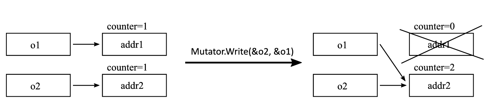
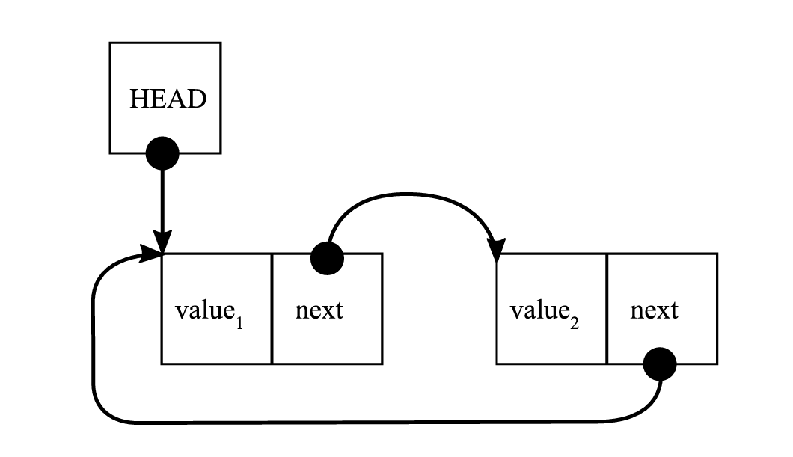

# Подсчет ссылок

Один из двух самых популярных методов автоматического управления памятью называется Подсчет ссылок (Reference Counting). Идея, лежащая в его основе, очень проста. Она основана на подсчете количества ссылок на объект. У каждого объекта есть свой счетчик ссылок. Когда объект присваивается переменной или полю, его счетчик ссылок увеличивается. В то же время уменьшается счетчик ссылок на тот объект, на который эта переменная ранее указывала.

Жизнеспособность объектов в подходе с подсчетом ссылок зависит от количества объектов, ссылающихся на ссылку (referent). Если счетчик падает до нуля, ничто не ссылается на объект, и таким образом он может быть освобожден. Но что произойдет, если счетчик не упадет до нуля? Это ничего не говорит о жизнеспособности объекта — это лишь означает, что кто-то сохраняет на него ссылку, а не то, что он будет ее использовать. Таким образом, подсчет ссылок — еще один способ угадать жизнеспособность объекта.

Возвращаясь к нашему тривиальному примеру Mutator из [листинга 1-6](<../automatic-memory-management/#l-1-6>), в случае подсчета ссылок его можно было бы описать так, как показано в [листинге 1-7](<#l-1-7>).

<a id="l-1-7"></a>
<figure class="custom-code-wrapper"
        markdown="1">

``` C title="listing-1-7.c" linenums="1"
Mutator.New(amount)
{
  obj = Allocator.Allocate(amount);
  obj.counter = 0;
  return obj;
}
Mutator.Write(address, value)
{
  if (address != NULL)
    ReferenceCountingCollector.DecreaseCounter(address);
  *address = value;
  if (value != NULL)
    value.counter++;
}
ReferenceCountingCollector.DecreaseCounter(address)
{
  *address.counter--;
  if (*address.counter == 0)
    Allocator.Deallocate(address)
}
```      

  <figcaption>Листинг 1-7. Псевдокод, описывающий простой алгоритм подсчета ссылок</figcaption>
</figure>

Поведение подсчета ссылок иллюстрируется простой программой на [рисунке 1-11](<#f-1-11>) и [листинге 1-8](<#l-1-8>). Три простые строки кода переписаны в терминах методов Mutators, чтобы показать, как изменяются ссылки.

<a id="l-1-8"></a>        
<figure class="custom-code-wrapper"
        markdown="1">

``` C title="listing-1-8.c" linenums="1"
o1 = new SomeObject();
o2 = new SomeObject();
o2 = o1;
// becomes:
addr1 = Mutator.New(SizeOf(SomeObject))    
Mutator.Write(&o1;, addr1)                  
addr2 = Mutator.New(SizeOf(SomeObject))    
Mutator.Write(&o2;, addr2)                  
Mutator.Write(&o2;, &o1;)                    
// addr1.counter = 0
// addr1.counter = 1
// addr2.counter = 0
// addr2.counter = 1
// addr1.counter = 0; addr2.counter = 2
```      

  <figcaption>Листинг 1-8. Пример псевдокода, иллюстрирующий подсчет ссылок</figcaption>
</figure>

<a id="f-1-11"></a>
<figure markdown="span" class="custom-figure">
  <figcaption>Рисунок 1-11. Иллюстрация подсчета ссылок [листинга 1-8](<#l-1-8>)</figcaption>
</figure>

Как вы можете видеть в [листинге 1-8](<#l-1-8>)), к операции `Mutator.Write` добавлен значительный накладной расход (overhead). Она должна проверять и изменять данные счетчика, а также выполнять действие по освобождению памяти, если счетчик падает до нуля. В многопоточной среде, где несколько Мутаторов работают параллельно, это становится гораздо сложнее. В таком случае эти операции должны быть потокобезопасными (thread-safe), а дополнительная синхронизация добавляет свой собственный накладной расход. `Mutator.Write` — очень распространенная операция (вводится при любом присваивании), поэтому любой накладной расход в ней суммируется и приводит к значительным издержкам для всего выполнения программы. Более того, с точки зрения реализации не очевидно, где хранить счетчики объектов. Это может быть выделенное пространство или своего рода заголовок, расположенный максимально близко к объекту. В обоих случаях это не меняет факта, что каждое присваивание генерирует дополнительные записи в память, что крайне нежелательно. Это также может привести к неэффективному использованию кэша ЦП, но это тема, о которой вы узнаете больше в следующей главе.

Если вернуться к свойству достижимости, упомянутому ранее, можно сказать, что подсчет ссылок приближает жизнеспособность посредством локальных ссылок и не отслеживает глобальное состояние графа ссылок объекта. В частности, без каких-либо дополнительных улучшений он может запутаться из-за циклических ссылок. Подобная проблема встречается в популярных структурах данных, таких как двусвязные списки (см. [Рисунок 1-12](#f-1-12)]. В таком случае счетчик ссылок никогда не падает до нуля, поскольку структура данных со значением 1 и структура данных со значением 2 указывают друг на друга.

<a id="f-1-12"></a>
<figure markdown="span" class="custom-figure">
  <figcaption>Рисунок 1-12. Проблема циклической ссылки при подсчете ссылок</figcaption>
</figure>

Однако создание циклических ссылок может быть затруднено на уровне языка, что является преимуществом (win situation). В этом случае алгоритм подсчета ссылок может использоваться без большой озабоченности по поводу утечек памяти, вызванных этой проблемой.

Одним из очень больших преимуществ подсчета ссылок является тот факт, что он не требует никакой поддержки среды выполнения. Он может быть реализован как дополнительный механизм для некоторых конкретных типов в форме внешней библиотеки. Это означает, что мы можем оставить оригинальные `Mutator.New` и `Mutator.Write` без изменений и реализовать логику подсчета ссылок, используя существующие конструкции среды выполнения, например, в виде классов с правильно перегруженными операторами и конструкторами. Например, это именно тот случай, который встречается в самых популярных реализациях C++.

Так называемые умные указатели (smart pointers), также известные как интеллектуальные указатели, были введены как более сложный способ управления временем жизни объектов, на которые они указывают. С точки зрения реализации, умные указатели в C++ фактически являются шаблонными классами, которые ведут себя как обычные указатели за счет соответствующей перегрузки операторов. В C++ два основных типа умных указателей:

*   `unique_ptr`, который реализует семантику уникального владения (например, указывает на то, что указатель является единственным владельцем объекта, который будет уничтожен, как только `unique_ptr` выйдет из области видимости или ему будет присвоен другой объект).
*   `shared_ptr`, который реализует семантику подсчета ссылок.

В [листинге 1-9](<#l-1-9>) вы можете увидеть код из [листинга 1-5](<../manual-memory-management/#l-1-5>), переписанный на C++ с использованием умных указателей.
    
<a id="l-1-9"></a>
<figure class="custom-code-wrapper"
        markdown="1">

``` cpp title="listing-1-9.cpp" linenums="1"
#include <iostream>
#include <memory>
void printReport(std::shared_ptr<int> data)
{
  std::cout << "Report: " << *data << "\n";
}
int main()
{
  try
  {
    std::shared_ptr<int> ptr(new int());
    *ptr = 25;
    printReport(ptr);
    return 0;
  }
  catch (std::bad_alloc& ba)
  {
    std::cout << "ERROR: Out of memory\n";
    return 1;
  }
}
```      

  <figcaption>Листинг 1-9. Пример программы на C++, демонстрирующей автоматизированное управление памятью с использованием интеллектуальных указателей</figcaption>
</figure>

Если мы вызовем метод `data.use_count()` (который возвращает количество ссылок) внутри функции `printReport`, он вернет значение 2. Это потому, что два разных умных указателя указывают на один и тот же объект: тот, который был изначально создан в `main()`, и копия, созданная при передаче аргумента `data` по значению. С другой стороны, после выхода из области видимости блока `try` счетчик использования будет равен нулю, потому что больше ни один умный указатель не указывает на наш объект.

??? note "Примечание"

    Обратите внимание, что код из листинга 1-9 не соответствует лучшим практикам C++. Передача умного указателя только для чтения базовых данных должна осуществляться посредством константной ссылки (`const&`), а не по значению. Мы решили не делать этого в нашем примере, чтобы продемонстрировать, как копирование увеличивает счетчик ссылок. Мы видим значительное улучшение в этой версии кода, потому что:

    *   Нам не нужно вручную уничтожать объект с помощью оператора `delete`.
    *   Обработка исключений упрощается, потому что если функция `printReport()` выбрасывает исключение, умный указатель будет автоматически уничтожен, когда выполнение покинет область видимости блока `try`. Это применение ранее упомянутого принципа RAII (Resource Acquisition Is Initialization — Приобретение ресурса есть инициализация), который заботится о времени жизни объекта в зависимости от области видимости ссылающихся на него указателей.

Умные и уникальные указатели также могут храниться в качестве полей классов, что делает их очень мощными и полезными инструментами.

Однако умные указатели в C++ были введены на уровне стандартной библиотеки, а не самого языка. Из-за этого другие библиотеки внедрили свои собственные реализации, и иногда бывает проблематично их всех заставить "хорошо" взаимодействовать друг с другом. Qt имеет свой `QtSharedPointer`, wxWidgets имеет `wxSharedPtr<T>` и так далее. Вот почему автоматическое управление памятью так важно в компонентно-ориентированном программировании(1), таком как C# в .NET. Когда появился .NET, передача ответственности за управление памятью от разработчика самой среде выполнения была одним из важнейших проектных решений. Общая платформа того, как создаются, управляются и освобождаются объекты, означает, что каждый компонент будет использовать ее одинаковым образом, и между компонентами нет связей (coupling), кроме самой среды выполнения.
{ .annotate}

1. Это состоит из многих более мелких взаимозаменяемых зависимостей.

Что касается C++, интересно отметить, что Бьорн позволил более сложную GC в стандарте C++ — это не запрещено, просто пока не реализовано. Более того, благодаря гибкости C++, хотя с системой пула памяти (`Memory Pool System`) или сборщиком Boehm–Demers–Weiser можно использовать сборку мусора как расширенную библиотеку — мы представим ее вскоре.

Другие языки внедрили умные указатели (включая подсчет ссылок) непосредственно в свою конструкцию. Это относится к Rust — современному низкоуровневому языку программирования, созданному Mozilla. Он обеспечивает безопасность данных на уровне компиляции, внедряя концепцию умных указателей (на самом деле несколько различных их видов) непосредственно в язык. Он активно использует семантику владения и принцип RAII, что позволяет проверять нарушения, такие как разыменование висячего указателя, во время компиляции. Другое примечательное использование подсчета ссылок — это Автоматический Подсчет Ссылок (Automatic Reference Counting), встроенный в язык Swift.

В заключение, вот недостатки и преимущества подсчета ссылок:

**Преимущества:**

*   **Детерминированное освобождение памяти:** Мы знаем, что освобождение произойдет, когда счетчик ссылок на объект упадет до нуля. Следовательно, как только он перестанет использоваться, память будет возвращена.
*   **Меньшее давление на память (Less memory pressure):** Поскольку память возвращается сразу же после прекращения использования объектов, нет потери памяти из-за объектов, ожидающих сбора.
*   Он может быть реализован без какой-либо поддержки среды выполнения.

**Недостатки:**

*   Начальная реализация, такая как в [листинге 1-7](#l-1-7), добавляет значительный накладной расход к Мутатору.
*   Многопоточные операции с счетчиками ссылок требуют хорошо продуманной синхронизации, что может добавить дополнительный накладной расход.
*   Без дополнительных улучшений циклические ссылки не могут быть освобождены.

Существуют улучшения для наивных алгоритмов подсчета ссылок, такие как Отложенный Подсчет Ссылок (`Deferred Reference Counting`) или Объединенный Подсчет Ссылок (`Coalesced Reference Counting`), которые устраняют некоторые из этих проблем ценой части преимуществ (в основном немедленного освобождения памяти). Однако описание их здесь выходит далеко за рамки этой книги.