# Термины, связанные с памятью

Прежде чем начать, полезно рассмотреть некоторые очень важные определения, без которых трудно представить обсуждение темы памяти:

  * Бит: Это наименьшая единица информации, используемая в компьютерных технологиях. Она представляет два возможных состояния, обычно означающих числовые значения 0 и 1 или логические значения true и false. Мы кратко упоминаем, как современные компьютеры хранят отдельные биты в Главе 2. Для представления больших числовых значений необходимо использовать комбинацию нескольких бит для кодирования их в виде двоичного числа, что объясняется следующим образом. При указании размера данных биты указываются строчной буквой b.

  * Двоичное число: это целое числовое значение, представленное в виде последовательности битов. Каждый последующий бит определяет вклад последовательной степени 2 в сумму данного значения. Например, для представления числа 5 используются три последовательных бита со значениями 1, 0 и 1, поскольку 1x1 + 0x2 + 1x4 равно 5. Двоичное число длиной n бит может представлять максимальное значение 2^n – 1. Также часто существует дополнительный бит, выделенный для представления знака значения для кодирования как положительных, так и отрицательных чисел. Существуют также другие, более сложные способы кодирования числовых значений в двоичной форме, особенно для чисел с плавающей точкой.

  * Двоичный код: Вместо числовых значений последовательность битов может представлять определенный набор различных данных, например, символов текста. Каждая последовательность битов назначается определенным данным. Самым базовым и самым популярным на протяжении многих лет был код ASCII, который использует 7-битный двоичный код для представления текста и других символов. Существуют и другие важные двоичные коды, такие как коды операций, кодирующие инструкции, сообщающие компьютеру, что он должен делать.

  * Байт: Исторически это была последовательность битов для кодирования одного символа текста с использованием указанного двоичного кода. Наиболее распространенный размер байта составляет 8 бит, хотя он зависит от архитектуры компьютера и может варьироваться в зависимости от модели. Из-за этой неоднозначности существует более точный термин октет, который означает именно 8-битную единицу данных. Тем не менее, фактическим стандартом является понимание байта как 8-битного значения длины, и как таковой он стал неоспоримым стандартом для определения размеров данных. В настоящее время вряд ли он встретит что-то иное, чем стандартная архитектура с 8-битными байтами. При указании размера данных байты указываются с заглавной буквой B.

Указывая размер данных, мы используем наиболее распространенные кратные (префиксы), определяющие их порядок величины. Это является причиной постоянной путаницы и недопонимания. Такие чрезвычайно популярные термины, как кило, мега и гига, означают умножение тысяч. Один кило равен 1000 (и мы обозначаем его строчной буквой k), один мега равен 1 миллиону (заглавной буквой M) и так далее. С другой стороны, иногда популярным подходом является выражение порядков величины в последовательных умножениях 1024. В таких случаях мы говорим об одном киби, что равно 1024 (обозначается как Ki), один меби равен 1024\*1024 (обозначается как Mi), один гиби (Gi) равен 1024\*1024\*1024 и так далее. Это вносит общую двусмысленность. Когда кто-то говорит об 1 «гигабайте», он может думать о 1 миллиарде байт (1 ГБ) или 1024^3 байт (1 ГиБ) в зависимости от контекста. На практике очень немногие заботятся о точном использовании этих префиксов. В настоящее время принято указывать размер модулей памяти в компьютерах как гигабайты (ГБ), когда они на самом деле являются гибибайтами (ГиБ) или наоборот в случае с жесткими дисками. Даже стандарт JEDEC 100B.01 «Термины, определения и буквенные обозначения для микрокомпьютеров, микропроцессоров и интегральных схем памяти» ссылается на общее использование K, M и G как умножений 1024, не осуждая его явно. В таких ситуациях нам остается только полагаться на здравый смысл в понимании этих префиксов из контекста.

В настоящее время мы очень привыкли к таким терминам, как ОЗУ или постоянное хранилище, установленное в наших компьютерах. Даже умные часы теперь оснащены 32 ГиБ ОЗУ! Вы можете легко забыть, что первые компьютеры не были оснащены такой роскошью. Можно сказать, что они не были оснащены ничем. На [рисунке 1-1](<#f-1-1>) показаны различные элементы компьютера:

  * Память: отвечает за хранение данных и самой программы. Способ реализации памяти со временем значительно изменился, начиная с вышеупомянутых перфокарт, через магнитные типы и электронно-лучевые трубки, до используемых в настоящее время транзисторов. Память можно разделить на две основные подкатегории:

    * Оперативная память (ОЗУ): позволяет считывать данные в одно и то же время доступа независимо от области памяти, к которой осуществляется доступ. На практике, как вы увидите в Главе 2, современная память удовлетворяет этому условию лишь приблизительно по технологическим причинам.

    * Неравномерная память доступа: в отличие от ОЗУ, время, необходимое для доступа к памяти, зависит от ее расположения на физическом носителе. Это, очевидно, включает в себя перфокарты, магнитные типы, классические жесткие диски, CD и DVD и т. д., где носители информации должны быть позиционированы (например, повернуты) в правильное положение перед доступом.

  * Адрес: представляет собой определенное местоположение во всей области памяти. Обычно выражается в байтах, поскольку один байт — это наименьшая возможная адресуемая гранулярность на многих платформах.

  * Арифметико-логическое устройство (АЛУ): отвечает за выполнение таких операций, как сложение и вычитание. Это ядро ​​компьютера, где выполняется большая часть работы. В настоящее время компьютеры включают в себя более одного АЛУ, что позволяет распараллеливать вычисления.

  * Блок управления: декодирует инструкции программы (коды операций), считанные из памяти. На основе описания внутренней инструкции он знает, какую арифметическую или логическую операцию следует выполнить и над какими данными.

  * Регистр: ячейка памяти, быстро доступная из АЛУ и/или блока управления (которые мы можем вместе называть исполнительными блоками), обычно содержащаяся в ней. Упомянутые выше аккумуляторы представляют собой специальный, упрощенный вид регистров. Регистры чрезвычайно быстры с точки зрения времени доступа, и фактически нет данных более близких к исполнительным блокам.

  * Слово: Базовая единица данных фиксированного размера, используемая в конкретном компьютерном проектировании. Она отражена во многих областях проектирования, таких как размер большинства регистров, максимальный адрес или самый большой блок данных, передаваемый за одну операцию. Чаще всего она выражается в количестве бит (называемых размером слова или длиной слова). Большинство современных компьютеров являются 32- или 64-разрядными, поэтому они имеют длину слова 32 и 64 бита соответственно, регистры длиной 32 или 64 бита и т. д.

Блок управления использует дополнительный регистр, называемый указателем инструкций (IP) или счетчиком программ (PC), для указания на текущую выполняемую инструкцию. Обычное выполнение программы так же просто, как увеличение адреса, хранящегося в PC, на следующие инструкции. Такие вещи, как циклы или переходы, так же просты, как изменение значения указателя инструкций на следующую инструкцию для выполнения, обозначая, какую инструкцию мы хотим, чтобы программа продолжила выполнять.

<figure markdown="span" class="custom-figure">
  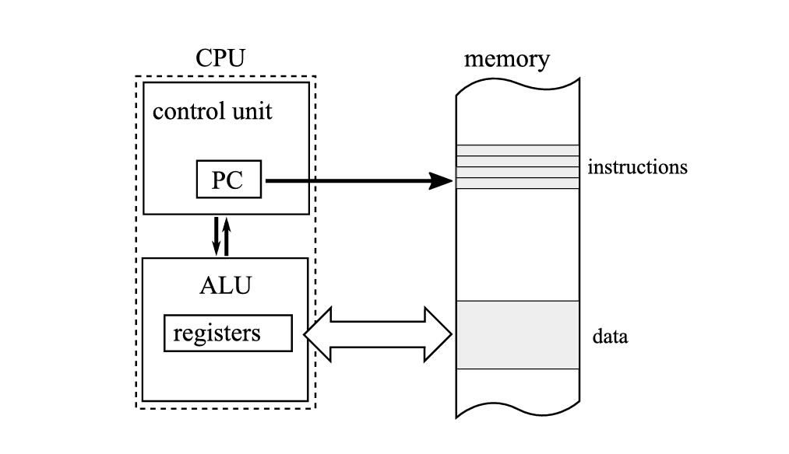<figcaption>Рисунок 1-1. Компьютерная диаграмма с хранимой программой – память + указатель инструкций</figcaption>
</figure>

Первые компьютеры программировались с использованием двоичного кода, который напрямую описывал инструкции для выполнения. Однако с ростом сложности программ это решение становилось все более обременительным. Был разработан новый язык программирования (обозначаемый как языки программирования второго поколения – 2GL) для описания кода более доступным способом с помощью так называемого ассемблерного кода. Это текстовое и очень краткое описание отдельных инструкций, выполняемых процессором. Это было намного удобнее, чем прямое двоичное кодирование. Затем были разработаны даже языки более высокого уровня (3GL), такие как известные C, C++ или Pascal.

Для нас интересно то, что все эти языки должны быть преобразованы из текстовой в двоичную форму, а затем помещены в память компьютера. Это преобразование называется компиляцией, а инструмент, который его запускает, называется компилятором. В случае ассемблерного кода мы скорее называем его сборкой с помощью инструмента ассемблера. В конечном итоге результатом является программа в формате двоичного кода, которая может быть позже выполнена – последовательность кодов операций и их аргументов (операндов).

Вооружившись этими базовыми знаниями, вы теперь можете начать свой путь в управлении памятью!

* * *

## Статическое выделение

Большинство самых первых языков программирования допускали только статическое выделение памяти — объем и точное местоположение необходимой памяти должны были быть известны во время компиляции, еще до выполнения программы. С фиксированными и предопределенными размерами управление памятью было тривиальным. Все основные языки программирования «древних времен», начиная с машинного или ассемблерного кода и заканчивая первыми версиями FORTRAN и ALGOL, имели такие ограниченные возможности. Но у них также есть много недостатков. Статическое выделение памяти может легко привести к неэффективному использованию памяти. Не зная заранее, какой объем данных будет обработан, как мы вычислим, сколько памяти нам следует выделить? Это делает программы ограниченными и негибкими. В общем, такую ​​программу нужно снова компилировать для обработки больших объемов данных.

В самых первых компьютерах все выделения были статическими, поскольку используемые ячейки памяти (аккумулятор, регистры или ячейки оперативной памяти) определялись во время кодирования программы. Поэтому определенные «переменные» существовали в течение всего жизненного цикла программы. В настоящее время мы все еще используем статическое распределение в том смысле, что при создании статических глобальных переменных и тому подобных, хранящихся в специальном сегменте данных программы. В последующих главах вы увидите, где они хранятся в случае программ .NET.

* * *

## Регистровая машина

Компьютеры используют регистры (или аккумуляторы как частный случай) для работы с арифметико-логическими устройствами (АЛУ). Машины, которые полагаются на эту конструкцию, называются регистровыми машинами. Это потому, что при выполнении программ на таком компьютере мы фактически производим вычисления в регистрах. Если мы хотим сложить, разделить или сделать что-то еще, мы должны загрузить соответствующие данные из памяти в соответствующие регистры. Затем мы вызываем определенную инструкцию, чтобы вызвать соответствующую операцию над ними, а затем еще одну, чтобы сохранить результат из одного из регистров обратно в память.

Предположим, мы хотим написать программу, которая вычисляет выражение `s=x+(2*y)+z` на компьютере с двумя регистрами — A и B. Предположим также, что

  * s, x, y и z — адреса памяти, в которых хранятся некоторые значения.

  * Некоторый низкоуровневый псевдоассемблерный код с такими инструкциями, как «Загрузить», «Сложить» и «Умножить».

Такую теоретическую машину можно запрограммировать с помощью простой программы, представленной в [листинге 1-1](<#l-1-1>).

  

    
    
        
          Load      A, y    // A = y
          Multiply  A, 2    // A = A * 2 = 2 * y
          Load      B, x    // B = x
          Add       A, B    // A = A + B = x + 2 * y
          Load      B, z    // B = z
          Add       A, B    // A = A + B = x + 2 * y + z
          Store     s, A    // s = A
        
      

Листинг 1-1. Псевдокод примера программы, реализующей вычисление `s=x+(2*y)+z` на простой двух-регистровой машине. Комментарии показывают состояние регистра после выполнения каждой инструкции

Если этот код напоминает вам x86 или любой другой ассемблерный код, который вы когда-либо изучали, это не совпадение! Это потому, что большинство современных компьютеров — это сложные регистровые машины. Все процессоры Intel и AMD, которые мы используем в наших компьютерах, работают таким образом. При написании ассемблерного кода на базе x86/x64 мы оперируем регистрами общего назначения, такими как eax, ebx, ecx и т. д. Конечно, есть еще много инструкций, других специализированных регистров и т. д. Но концепция та же самая.

  

__Примечание

Можете ли вы представить себе машину с набором инструкций, которая позволяет выполнять операцию непосредственно в памяти без необходимости загрузки данных в регистры? Следуя псевдоассемблеру, это может выглядеть гораздо более лаконично и высокоуровнево, поскольку больше нет необходимости в инструкциях загрузки/сохранения:
    
    
          
            Multiply  s, y, 2   // s = 2 * y
            Add       s, x      // s = s + x = 2 * y + x
            Add       s, z      // s = s + z = 2 * y + x + z
          
        

Да, были такие машины, как IBM system/360, но на сегодняшний день нам не известно ни об одном серийно используемом компьютере такого типа.

* * *

## Стек

Концептуально стек представляет собой структуру данных, которую можно просто описать как список «последним пришел, первым ушел» (LIFO). Он позволяет выполнять две основные операции: добавлять некоторые данные наверх («push») и удалять + возвращать некоторые данные сверху («pop»), как показано на [рисунке 1-2](<#f-1-2>).

<figure markdown="span" class="custom-figure">
  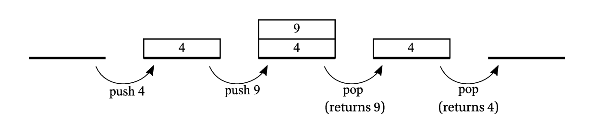<figcaption>Рисунок 1-2. Операции извлечения и добавления стека. Это только концептуальный рисунок, не связанный с какой-либо конкретной моделью памяти и реализацией</figcaption>
</figure>

Концепция стека стала неотъемлемо связана с программированием с самого начала, в основном из-за концепции подпрограммы. Сегодняшний .NET активно использует концепции «стек вызовов» и «стек», поэтому давайте посмотрим, как все начиналось. Первоначальное значение стека как структуры данных по-прежнему актуально (например, в .NET есть коллекция Stack&ltT;>).

Стек является очень важным аспектом управления памятью, поскольку при программировании в .NET туда может быть помещено много наших данных. Давайте подробнее рассмотрим стек и его использование в вызовах функций. Мы будем использовать пример программы из [листинга 1-2](<#l-1-2>), написанный на псевдокоде в стиле C, который вызывает две функции – main вызывает fun1 (передавая два аргумента a и b), которая имеет две локальные переменные x и y. Затем функция fun1 в какой-то момент вызывает функцию fun2 (передавая один аргумент n), которая имеет одну локальную переменную z.

    

    
    
        
          void main()
          {
            ...
            fun1(2, 3);
            ...
          }
          
          int fun1(int a, int b)
          {
            int x, y;
            ...
            fun2(a+b);
          }
          
          int fun2(int n)
          {
            int z;
            ...
          }
      
      

Листинг 1-2. Псевдокод программы, вызывающей функцию внутри другой функции

Сначала представьте себе непрерывную область памяти, предназначенную для обработки стека, нарисованную таким образом, что последующие ячейки памяти имеют растущие адреса (см. левую часть [рисунка 1-3a](<#f-1-3a>)), и вторую область памяти, где находится ваш программный код (см. правую часть [рисунка 1-3a](<#f-1-3a>)), организованную таким же образом. Поскольку код функций не обязательно должен лежать рядом друг с другом, блоки кода main, fun1 и fun2 нарисованы раздельно. Выполнение программы из [листинга 1-2](<#l-1-2>) можно описать следующими шагами:

  

  1) Прямо перед вызовом fun1 внутри main (см. [рисунок 1-3a](<#f-1-3a>)). Очевидно, что поскольку программа уже запущена, некоторая область стека уже создана (серая часть в верхней части области стека на [рисунке 1-3a](<#f-1-3a>)). Указатель стека (SP) хранит адрес, указывающий текущую границу стека. Счетчик программ (PC) указывает куда-то внутри функции main (мы обозначили это как адрес A1), прямо перед инструкцией вызвать fun1.

<figure markdown="span" class="custom-figure">
  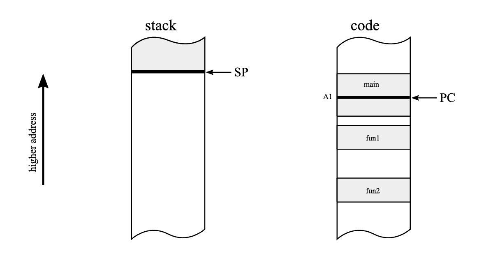<figcaption>Рисунок 1-3a. Стек и области памяти кода – в момент перед вызовом функции fun1 из [листинга 1-2](<#l-1-2>)</figcaption>
</figure>

  2) После вызова fun1 внутри main (см. [рис. 1-3b](<#f-1-3b>)). При вызове функции стек расширяется путем перемещения SP для хранения необходимой информации. Это дополнительное пространство включает:

     * Аргументы: Все аргументы функции могут быть сохранены в стеке. В нашем примере там были сохранены значения аргументов a (2) и b (3).

     * Адрес возврата: Чтобы иметь возможность продолжить выполнение функции main после выполнения fun1, адрес следующей инструкции сразу после вызова функции сохраняется в стеке. В нашем случае мы обозначили его как адрес A1+1 (указывающий на следующую инструкцию после инструкции под адресом A1).

     * Локальные переменные: Место для всех локальных переменных, которые также могут быть сохранены в стеке. В нашем примере там были сохранены переменные x и y.

  Структура, помещаемая в стек при вызове подпрограммы, называется кадром активации. В типичной реализации указатель стека уменьшается на соответствующее смещение, чтобы указать место, где может начаться новый кадр активации. Поэтому часто говорят, что стек растет вниз.

<figure markdown="span" class="custom-figure">
  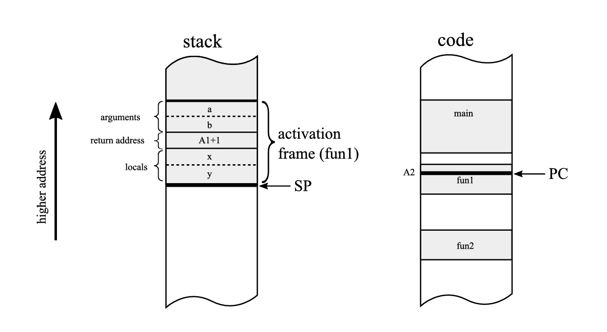<figcaption>Рисунок 1-3b. Стек и области памяти кода – после вызова функции fun1 из [листинга 1-2](<#l-1-2>)</figcaption>
</figure>

  3) После вызова fun2 из fun1 (см. [рис. 1-3c](<#f-1-3c>)). Повторяется та же схема создания нового кадра активации. На этот раз он содержит область памяти для значения аргумента n, адрес возврата A2+1 и локальную переменную z.

<figure markdown="span" class="custom-figure">
  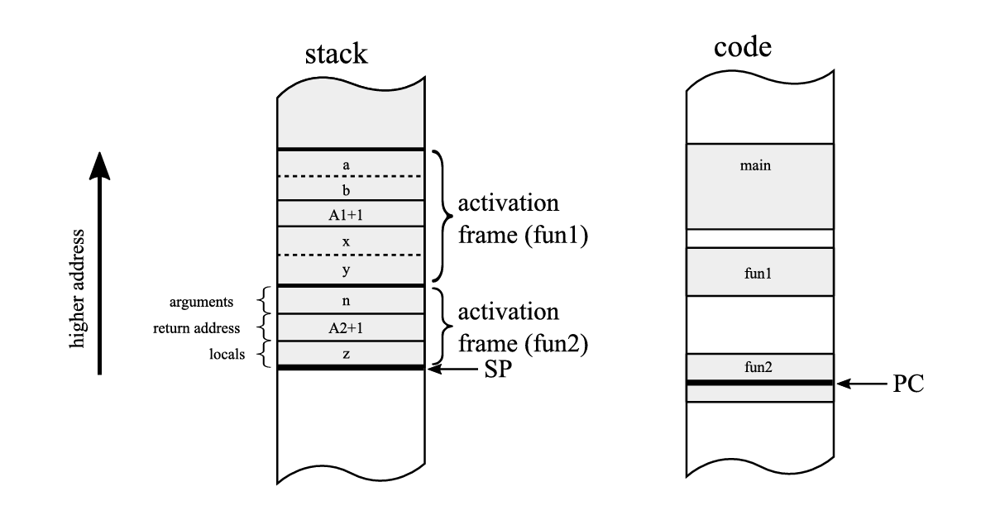<figcaption>Рисунок 1-3c. Стек и области памяти кода – в момент после вызова функции fun2 из fun1</figcaption>
</figure>

Кадр активации также называется более общим термином кадр стека, что означает любые структурированные данные, сохраненные в стеке для конкретных целей.

Как вы можете себе представить, последующие вызовы вложенных подпрограмм просто повторяют этот шаблон, добавляя один кадр активации для каждого вызова. Чем больше вложенных вызовов подпрограмм, тем больше кадров активации будет в стеке. Это, конечно, делает вызов бесконечных вложенных вызовов невозможным, так как это потребовало бы памяти для бесконечного числа кадров активации. В .NET такой бесконечный цикл заканчивается исключением StackOverflowException. Вы вызвали так много вложенных подпрограмм, что достигли предела памяти для стека.

Имейте в виду, что представленный здесь механизм является всего лишь примерным и очень общим. Фактические реализации могут различаться в зависимости от архитектуры и операционной системы. Мы подробно рассмотрим, как кадры активации и стек используются .NET в последующих главах.

Когда подпрограмма завершается, ее кадр активации просто отбрасывается путем увеличения указателя стека на размер текущего кадра активации, в то время как сохраненный адрес возврата используется для перехода выполнения обратно к вызывающей функции. Другими словами, то, что было внутри кадра стека (локальные переменные, параметры), больше не нужно, поэтому увеличения указателя стека достаточно, чтобы «освободить» память, использованную до сих пор. Эти данные будут просто перезаписаны при следующем использовании стека другими вызовами функций (см. [рисунок 1-4](<#f-1-4>)).

<figure markdown="span" class="custom-figure">
  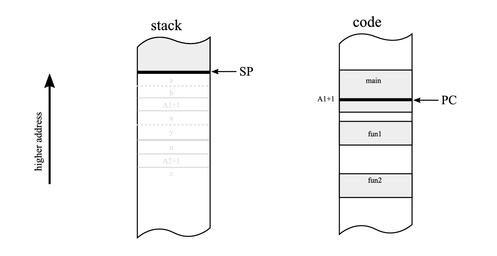<figcaption>Рисунок 1-4. Stack and code memory regions – after returning from function fun1, both activation frames are discarded</figcaption>
</figure>

Что касается реализации, то и SP, и PC обычно хранятся в выделенных регистрах. На этом этапе размер самого адреса, наблюдаемые области памяти и регистры не особенно важны.

Стек в современных компьютерах поддерживается как аппаратным обеспечением (путем предоставления специальных регистров для указателей стека), так и программным обеспечением (путем абстракции операционной системы от потока и его части памяти, обозначенной как стек).

* * *

## Стековая машина

Прежде чем перейти к другим концепциям памяти, давайте на некоторое время остановимся на контексте, связанном со стеком, — так называемых стековых машинах. В отличие от регистровой машины, все инструкции в стековой машине работают с выделенным стеком выражений (или стеком вычислений). Пожалуйста, имейте в виду, что этот стек не обязательно должен быть тем же стеком, о котором мы говорили ранее. Следовательно, такая машина может иметь как дополнительный «стек выражений», так и стек общего назначения. Регистров может вообще не быть. В такой машине по умолчанию инструкции берут аргументы с вершины стека выражений — столько, сколько им требуется. Результат также сохраняется на вершине стека. В таких случаях они называются чистыми стековыми машинами, в отличие от нечистых реализаций, когда операции могут получать доступ к значениям не только с вершины стека, но и глубже.

Как именно выглядит операция в стеке выражений? Например, гипотетическая инструкция Multiply (без аргументов) извлечет два значения из верхней части стека оценки для своих параметров, умножит их и поместит результат обратно в стек оценки (см. [рисунок 1-5](<#f-1-5>)).

<figure markdown="span" class="custom-figure">
  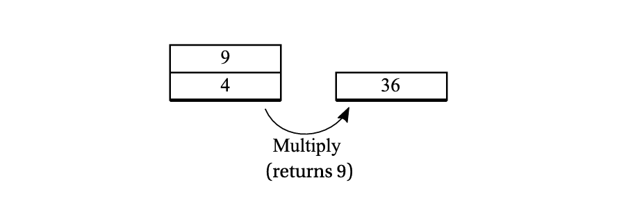<figcaption>Рисунок 1-5. Гипотетическая инструкция умножения в стековой машине — извлекает два элемента из стека и помещает результат их умножения в стек.</figcaption>
</figure>

Давайте вернемся к образцу выражения `s=x+(2*y)+z` из примера регистровой машины и перепишем его в стиле стековой машины (см. [листинг 1-3](<#l-1-3>)).

  

    
    
        
                      // empty stack
          Push 2      // [2] - single stack element of value 2       
          Push y      // [2][y] - two stack elements of value 2 and y        
          Multiply    // [2*y]        
          Push x      // [2*y][x]        
          Add         // [2*y+x]        
          Push z      // [2*y+x][z]        
          Add         // [2*y+x+z]        
          Pop l       // [] (with side effect of writing a value into l)        
        
      

Листинг 1-3. Пример программы, реализующей вычисление `s=x+(2*y)+z` на простой двух-регистровой машине, переписанный в стиле стековой машины

Эта концепция приводит к очень ясному и понятному коду. Основные преимущества можно описать следующим образом:

  * Нет никаких проблем относительно того, как и где хранить временные значения – должны ли они быть регистрами, стеком или основной памятью. Концептуально это проще, чем пытаться оптимально управлять всеми этими возможными целями. Таким образом, это упрощает реализацию.

  * Опкоды могут быть короче с точки зрения требуемой памяти, поскольку существует много инструкций без операндов или с одним операндом. Это позволяет эффективно кодировать инструкции в двоичном формате и, следовательно, производить плотный двоичный код. Несмотря на необходимость большего количества операций загрузки/сохранения, что может увеличить количество инструкций по сравнению с подходом на основе реестра, этот метод остается полезным.

Это было важным преимуществом в ранние времена компьютеров, когда память была очень дорогой и ограниченной. Это может быть выгодно и сегодня в случае загружаемого кода для смартфонов или веб-приложений. Плотное двоичное кодирование инструкций также подразумевает лучшее использование кэша ЦП.

Несмотря на свои преимущества, концепция стековой машины редко реализовывалась в самом оборудовании. Одним заметным исключением были машины Burroughs, такие как B5000, которые включали аппаратную реализацию стека. В настоящее время, вероятно, нет широко используемой машины, которую можно было бы описать как стековую машину. Одним заметным исключением является блок с плавающей точкой x87 (внутри x86-совместимых процессоров): он был разработан как стековая машина и до сих пор программируется как таковая из-за обратной совместимости.

Так зачем вообще упоминать эти типы машин? Потому что такая архитектура — отличный способ проектирования независимых от платформы виртуальных машин или механизмов выполнения. Виртуальная машина Java и среда выполнения .NET — прекрасные примеры стековых машин. Они реализованы поверх архитектуры x86 или ARM, которые являются хорошо известными регистровыми машинами, но это не меняет того факта, что они реализуют логику стековой машины. Мы наглядно покажем это при описании промежуточного языка (IL) .NET в Главе 4. Почему среда выполнения .NET и JVM (виртуальная машина Java) были спроектированы таким образом? Как всегда, это смесь инженерных и исторических причин. Код стековой машины лучше подходит для абстрагирования от базового оборудования, поскольку он не зависит от количества доступных регистров. Затем задача перевода кода стековой машины в фактический код на основе регистров остается за конкретной реализацией для целевого оборудования. Виртуальные стековые машины проще реализовать и обеспечивают хорошую независимость от платформы, при этом по-прежнему производя высокопроизводительный код. В сочетании с упомянутой лучшей плотностью кода это хороший выбор для платформы, которая должна работать на широком спектре устройств. Вероятно, именно поэтому Sun решила выбрать этот путь, когда Java была изобретена для небольших устройств, таких как телевизионные приставки. Microsoft, разрабатывая .NET, также следовала этому пути. Концепция стековой машины элегантна и проста, и она просто работает. Это делает реализацию виртуальной машины более приятной инженерной задачей!

С другой стороны, проекты виртуальных машин на основе реестра гораздо ближе к проекту реального оборудования, на котором они работают. Это очень полезно с точки зрения возможных оптимизаций. Сторонники этого подхода говорят, что можно достичь гораздо лучшей производительности, особенно в интерпретируемых средах выполнения. У интерпретатора ограниченное время для применения расширенных оптимизаций, поэтому чем ближе интерпретируемый код к машинному коду, тем он лучше. Кроме того, работа с наиболее часто используемым набором регистров обеспечивает большую локальность кэша.

Как всегда, принимая решение, вам нужно идти на некоторые компромиссы. Спор между сторонниками обоих подходов длится долго и неразрешен. Тем не менее, факт в том, что в настоящее время механизм выполнения .NET реализован как стековая машина, хотя она и не полностью чистая — как показано в Главе 4. Вы также увидите, как стек оценки сопоставляется с базовым оборудованием, состоящим из регистров и памяти.

  

__Примечание

Все ли виртуальные машины и движки выполнения являются стековыми машинами? Абсолютно нет! Одним из заметных исключений является Dalvik, который был виртуальной машиной в Android от Google до версии 4.4, которая была реализацией JVM на основе реестра. Это был интерпретатор промежуточного «байт-кода Dalvik». Но затем в преемнике Dalvik — Android Runtime (ART) была введена технология JiT (Just-in-Time-компиляция, описанная в главе 4). Другие примеры включают BEAM (виртуальная машина для Erlang/Elixir), Chakra (движок выполнения Javascript в iE9), Parrot (виртуальная машина Perl 6) и Lua VM (виртуальная машина Lua). Поэтому никто не может сказать, что этот тип машин не популярен.

* * *

## Указатель

До сих пор мы представили только две концепции памяти: статическое распределение и распределение стека (как часть стекового фрейма). Концепция указателя является очень общей и может быть обнаружена с самого начала вычислительной эры – как ранее показанная концепция указателя инструкций (счетчика программ) или указателя стека. Конкретные регистры, предназначенные для адресации памяти, такие как индексные регистры, также могут рассматриваться как указатели.

Указатели — это переменные, в которых вы храните адрес позиции в памяти. Проще говоря, это позволяет вам ссылаться на другие места в памяти по его адресу. Размер указателя связан с длиной слова, упомянутой ранее, и зависит от архитектуры компьютера. В настоящее время мы обычно имеем дело с указателями шириной 32 или 64 бита, размещенными в стеке (например, как локальная переменная или аргумент функции) или в регистрах ЦП. На [рисунке 1-6](<#f-1-6>) показана типичная ситуация, когда одна из локальных переменных (хранящихся в кадре активации функции) является указателем на другую область памяти с адресом Addr.

<figure markdown="span" class="custom-figure">
  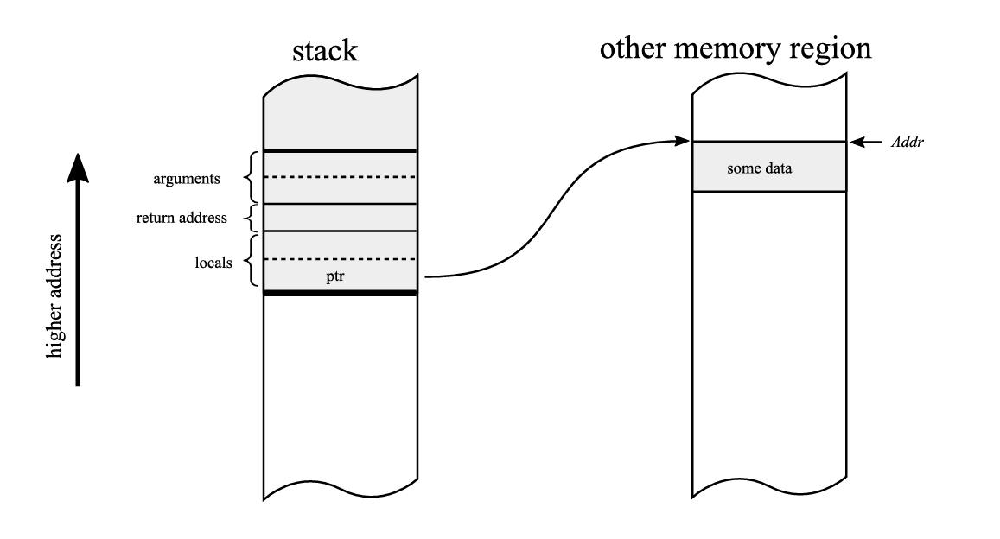<figcaption>Рисунок 1-6. Локальная переменная ptr функции, являющаяся указателем на память по адресу Addr</figcaption>
</figure>

Простая идея указателей позволяет нам создавать сложные структуры данных, такие как связанные списки или деревья, поскольку структуры данных в памяти могут ссылаться друг на друга, создавая более сложные структуры (см. [рисунок 1-7](<#f-1-7>)).

<figure markdown="span" class="custom-figure">
  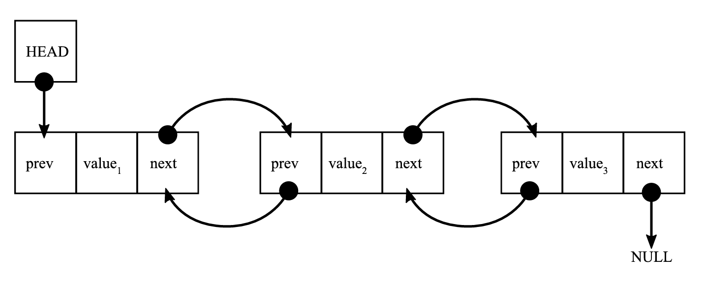<figcaption>Рисунок 1-7. Указатели, используемые для построения двусвязной структуры списка, когда каждый элемент указывает на свой предыдущий и следующий элементы.</figcaption>
</figure>

* * *

## Куча

Наконец, мы дошли до самой важной концепции в контексте управления памятью .NET. Куча (реже известная как свободное хранилище) — это область памяти, используемая для динамически выделяемых объектов. Свободное хранилище — лучшее название, поскольку оно не предполагает никакой внутренней структуры, а скорее цели. На самом деле, вы можете справедливо спросить, какова связь между структурой данных кучи и самой кучей. Правда в том, что ее нет. Хотя стек хорошо организован (он основан на концепции структуры данных LIFO), куча больше похожа на «черный ящик», который можно попросить предоставить память, независимо от того, откуда она будет поступать. Поэтому «пул» или упомянутое «свободное хранилище», вероятно, было бы лучшим названием. Название кучи, вероятно, использовалось с самого начала в традиционном английском смысле, означающем «беспорядочное место» — в отличие от хорошо упорядоченного пространства стека. Исторически выделение кучи было введено в ALGOL 68, но этот стандарт не получил широкого распространения. Но именно отсюда, вероятно, и произошло название. Факт в том, что истинное историческое происхождение этого названия сейчас довольно неясно.

Куча — это механизм, способный предоставить непрерывный блок памяти с указанным размером. Эта операция называется динамическим выделением памяти, поскольку и размер, и фактическое местоположение блока памяти не обязательно должны быть известны во время компиляции. Поскольку местоположение памяти неизвестно во время компиляции, на динамически выделенную память должен ссылаться указатель. Следовательно, концепции указателя и кучи по своей сути связаны.

Адрес, возвращаемый некоторой функцией «выделите мне X байт памяти», очевидно, следует запомнить в некотором указателе для будущей ссылки на созданный блок памяти. Он может храниться в стеке (см. [рисунок 1-8](<#f-1-8>)), в самой куче или где-нибудь еще, например, в регистре.

<figure markdown="span" class="custom-figure">
  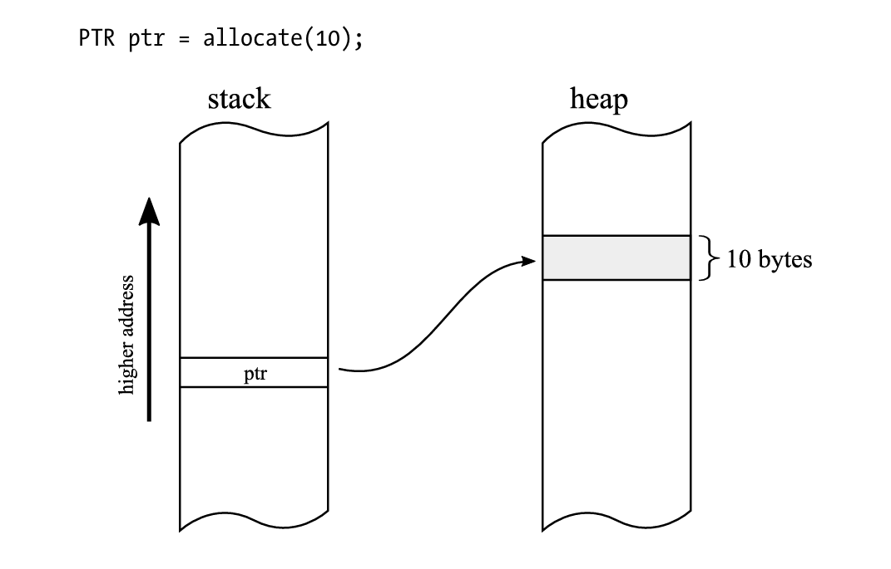<figcaption>Рисунок 1-8. Стек с указателем ptr и блоком шириной 10 байт в куче</figcaption>
</figure>

Обратная операция выделения называется освобождением, когда заданный блок памяти возвращается в пул памяти для будущего использования. Как именно куча выделяет блок заданного размера — это деталь реализации. Существует много возможных «распределителей», и вы скоро увидите некоторые из них.

Выделяя и освобождая много блоков, мы можем прийти к ситуации, когда для данного объекта не будет достаточно непрерывного свободного пространства, хотя в целом в куче достаточно свободного места. Такая ситуация называется фрагментацией кучи и может привести к значительной неэффективности использования памяти. [Рисунок 1-9](<#f-1-9>) иллюстрирует такую ​​проблему, когда для объекта X недостаточно свободного непрерывного пространства. Существует много различных стратегий, используемых распределителями для максимально оптимального управления пространством, чтобы избежать фрагментации (или эффективно ее использовать).

<figure markdown="span" class="custom-figure">
  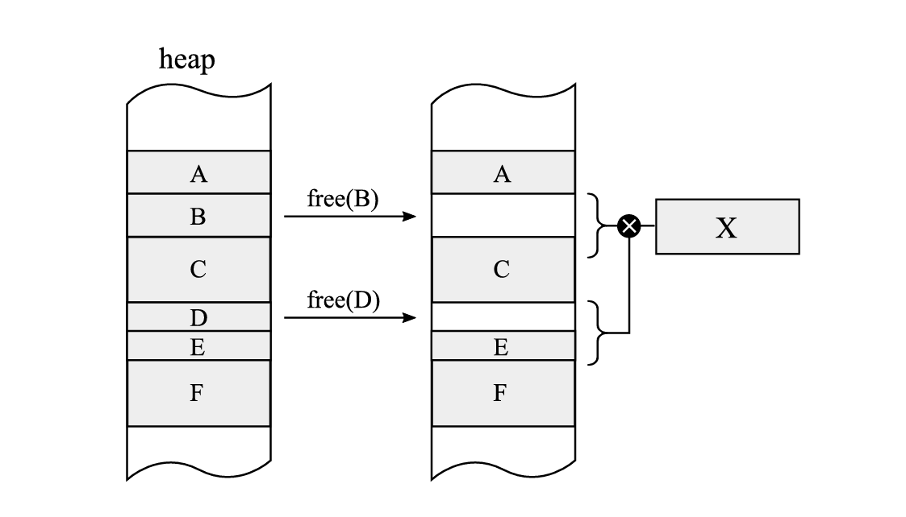<figcaption>Рисунок 1-9. Фрагментация – после удаления объектов B и D не остается достаточного смежного пространства для нового объекта X, хотя в целом для него достаточно свободного места.</figcaption>
</figure>

Стоит также отметить, что наличие одной кучи или нескольких экземпляров кучи в одном процессе — это еще одна деталь реализации (мы обсудим это более подробно для .NET).

Давайте сделаем краткий обзор различий между стеком и кучей в [Таблице 1-1](<#t-1-1>).

\# | Свойство | Стек | Куча  
---|---|---|---  
1 | Продолжительность жизни | Область действия функции для локальных переменных (вставлено при входе, извлечено при выходе) | Явное (по выделению и необязательному освобождению)  
2 | Объем | Локальный (поток) | Глобальный (любой, у кого есть указатель)  
3 | Доступ | Локальная переменная, аргументы функции | Указатель  
4 | Время доступа | Быстро (часто используемая область памяти, поэтому, вероятно, кэшируется в ЦП) | Медленнее (может даже временно сохраняться на жестком диске)  
5 | Распределение | Перемещаемый указатель стека | Различные возможные стратегии  
6 | Время распределения | Очень быстро (увеличение указателя стека) | Медленнее (зависит от стратегии распределения)  
7 | Освобождение | Перемещаемый указатель стека | Различные возможные стратегии  
8 | Использование | Параметры подпрограммы, локальные переменные, кадры активации, небольшие массивы фиксированного размера | Все  
9 | Емкость | Ограничено (обычно несколько МБ на поток) | Практически неограниченно (в пределах ГБ + доступное место на жестком диске и в зависимости от настроек операционной системы). Максимум 4 ГБ для 32 бит  
10 | Размер переменной | Нет | Да  
11 | Фрагментация | Нет | Скорее всего  
12 | Основные риски | Переполнение стека | Утечка памяти (забывание освободить выделенную память), фрагментация  
Таблица 1-1. Сравнение характеристик стека и кучи

Теперь давайте перейдем к обсуждению ручного и автоматического управления памятью.

  

__Как писали Эллис и Страуструп в Аннотированном справочном руководстве по C++:

Программисты на C считают, что управление памятью слишком важно, чтобы доверять его компьютеру.

Программисты на Lisp считают, что управление памятью слишком важно, чтобы доверять его пользователю.

  