# Отслеживающий сборщик

Найти достижимость объектов сложно, потому что это глобальное состояние (оно зависит от всего графа объектов всей программы), тогда как простой явный вызов освобождения объекта является локальным. В этом локальном контексте мы не знаем о глобальном контексте — используют ли другие объекты этот объект сейчас? Подсчет ссылок пытается преодолеть это, рассматривая только этот локальный контекст с некоторой дополнительной информацией — количеством ссылок на объект. Но это, очевидно, может привести к проблемам с циклическими ссылками и, как вы видели ранее, имеет другие недостатки.

Отслеживающий сборщик мусора основан на знании глобального контекста жизненного цикла объекта и может принимать более обоснованное решение о том, настало ли время удалить объект (освободить его память). Фактически, это настолько популярный подход, что всякий раз, когда кто-то упоминает сборщик мусора, он почти наверняка имеет в виду отслеживающий сборщик мусора. Мы можем столкнуться с ним в средах выполнения, таких как .NET, различных реализациях JVM и т. д.

Основная концепция заключается в том, что отслеживающий сборщик мусора находит истинную достижимость объекта, начиная с корней мутатора и рекурсивно отслеживая весь граф объекта программы. Очевидно, что это нетривиальная задача, поскольку память процесса может занимать несколько ГБ, а отслеживание всех межобъектных ссылок в таких больших объемах данных может быть затруднено, особенно когда мутаторы работают и постоянно меняют все эти ссылки. Самый типичный подход трассировки сборщика мусора состоит из двух основных этапов:

  * Маркировка: На этом этапе сборщик определяет, какие объекты в памяти можно собрать, путем определения их достижимости.

  * Сбор: На этом этапе сборщик освобождает память от объектов, которые оказались недоступными.

Реализация этой простой двухфазной логики может быть расширена, как в .NET, и описана как Mark-Plan-Sweep-Compact (Маркировка–План–Развертка–Компактирование). Вы подробно увидите эти внутренние работы в следующих главах. А пока давайте просто посмотрим на этапы маркировка и сбор в более общем плане, поскольку они также вызывают интересные проблемы.

* * *

## Фаза маркировки

На этапе маркировки сборщик определяет, какие объекты в памяти следует собрать, определяя их достижимость. Начиная с корней Мутатора, сборщик обходит весь граф объектов и отмечает те, которые были посещены. Объекты, которые не были отмечены в конце фазы отметки, недоступны. Отметка объектов также помогает с циклическими ссылками. Если во время обхода графа мы сталкиваемся с одним и тем же объектом несколько раз, мы проверяем его только один раз благодаря отметке.

Несколько начальных шагов такого алгоритма представлены на [рисунке 1-13](<#f-1-13>). Начиная с корней, мы перемещаемся внутри графа объектов через межобъектные ссылки. Посещение графа либо в глубину, либо в ширину является деталью реализации. [Рисунок 1-13](<#f-1-13>) показывает подход в глубину, показывающий три возможных состояния каждого объекта:

  * Объект еще не посещен, отмечен как белый прямоугольник

  * Объект поставлен в очередь на посещение, отмечен как светло-серый прямоугольник

  * Объект уже посещен (отмечен как достижимый), отмечен как темно-серый прямоугольник

Первые шаги, показанные на [рисунке 1-13](<#f-1-13>), можно описать следующим образом (каждый шаг описывает соответствующую под фигуру):

  1. Изначально все объекты еще не посещены.

  2. Объект A добавлен для посещения в качестве первого корня.

  3. Так как объект A имеет указатели (как поля) на объекты B и D, они ставятся в очередь для посещения. Сам объект A на этом этапе помечается как достижимый.

  4. Следующий объект из очереди «для посещения» посещается — объект B. Поскольку у него нет исходящих ссылок, он просто помечается как достижимый.

  5. Следующий объект из очереди «для посещения» посещается — объект D. Он содержит одну ссылку на объект E, поэтому он ставится в очередь. Сам объект D помечается как достижимый.

  6. Исходящая ссылка объекта E на объект G ставится в очередь. Сам объект E помечается как достижимый.

  7. Последний объект из очереди «для посещения» посещается — объект G. Он не содержит ссылок и просто помечается как достижимый. На этом этапе в очереди больше нет объектов, поэтому мы определили, что объекты C и F недостижимы (мертвы).

<figure markdown="span" class="custom-figure">
  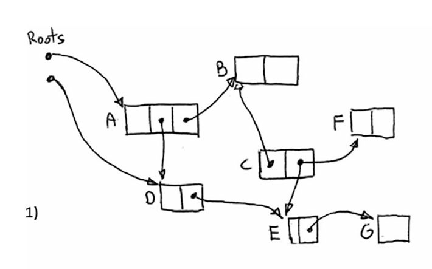{: data-glightbox="group:my-gallery" }
  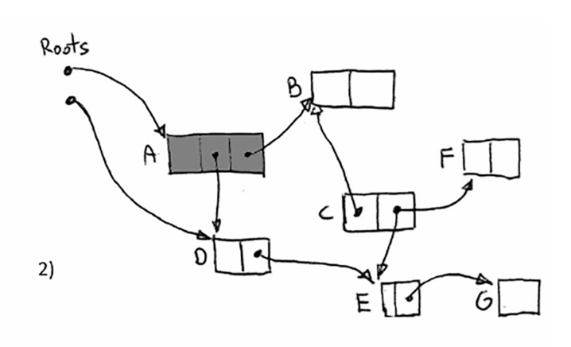{: data-glightbox="group:my-gallery" }
  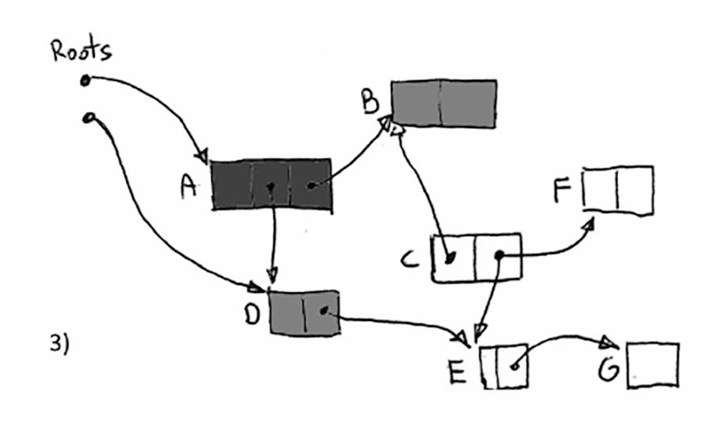{: data-glightbox="group:my-gallery" }
  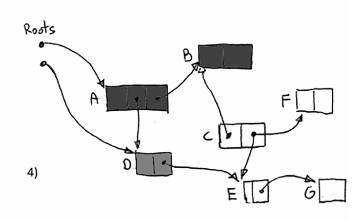{: data-glightbox="group:my-gallery" }
  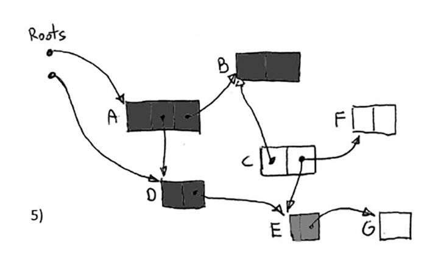{: data-glightbox="group:my-gallery" }
  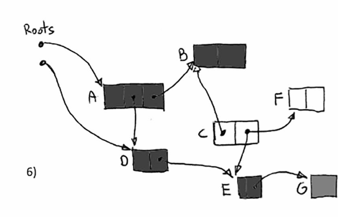{: data-glightbox="group:my-gallery" }
  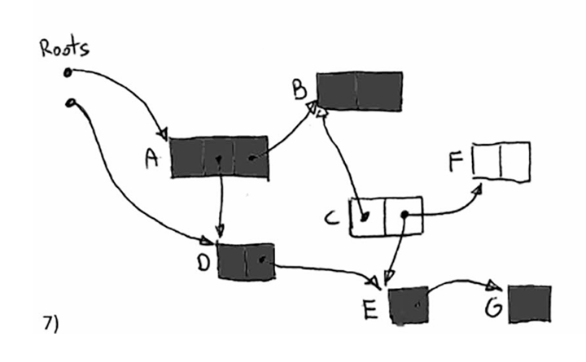{: data-glightbox="group:my-gallery" }<figcaption>Рисунок 1-13. Пример фазы маркировки отслеживающего сборщика мусора</figcaption>
</figure>

Очевидно, что обход такого графа затруднен во время нормальной работы Мутатора, так как граф постоянно изменяется из-за нормального выполнения программы – создания новых объектов, переменных, присваивания полей объектов и так далее. Поэтому в некоторых реализациях сборщика мусора все Мутаторы просто останавливаются на время фазы маркировки. Это позволяет безопасно и последовательно обходить граф. Конечно, как только потоки возобновляют работу, знания, которые Сборщик получил на основе графа объектов, становятся устаревшими. Но это не проблема для недостижимых объектов – если они не были достижимы раньше, они никогда не станут достижимыми снова. Однако существует множество реализаций сборщика мусора, где фаза маркировки выполняется в конкурентном режиме, так что процесс маркировки может выполняться параллельно с кодом Мутатора. Это относится к популярным алгоритмам, таким как CMS в JVM (Concurrent Mark Sweep), G1 в JVM и в самом .NET. Как именно такая конкурентная маркировка реализована в .NET, будет подробно описано в Главе 11.

Существует одна неочевидная проблема с фазой маркировки. Чтобы отслеживать достижимость, Сборщик должен знать корни и где в куче размещены ссылки на другие объекты. Это тривиальная проблема, если среда выполнения поддерживает такую информацию. Но ее можно преодолеть и другим способом.

### Консервативный сборщик мусора

Этот тип сборщика можно рассматривать как решение для бедных. Он может использоваться, когда среда выполнения или компилятор не поддерживают сборку напрямую, предоставляя точную информацию о типе (расположение объекта в памяти), и сборщик не получает поддержки от мутатора при работе с указателями. Если так называемый консервативный сборщик хочет выяснить, какие объекты достижимы, он сканирует весь стек, области статических данных и регистры. Без какой-либо помощи от среды выполнения он просто пытается угадать, что является указателем, а что нет. Он делает это, проверяя несколько вещей (все зависит от конкретной реализации сборщика), но самая важная проверка заключается в том, указывает ли интерпретация данного слова как адреса на допустимую область в памяти (управляемую областью кучи распределителя). Если это так, сборщик консервативно (отсюда и его название) предполагает, что это указатель, и рассматривает его как ссылку для следования во время обхода графа на этапе маркировки, описанном ранее.

Очевидно, что сборщик может ошибаться, когда угадывает, что является указателем, что приведет к некоторым неточностям. Случайные биты в памяти могут выглядеть как допустимые указатели с правильными адресами, что приведет к удержанию памяти, которая на самом деле не используется. Это не очень распространенная проблема, потому что большинство числовых значений в памяти довольно малы (счетчики, финансовые данные, индексы), а адреса памяти обычно велики, поэтому единственной проблемой могут быть плотные двоичные данные, такие как битмапы, числа с плавающей запятой или определенные блоки IP-адресов. Существуют тонкие улучшения алгоритма, которые помогают преодолеть эту проблему, но мы не будем касаться их здесь. Более того, консервативная отчетность означает, что вы не можете перемещать объекты в памяти. Это потому, что вы должны обновлять указатели на перемещенные объекты, что, очевидно, невозможно, если вы не уверены, является ли что-то, похожее на указатель, действительно указателем.

Итак, кому может понадобиться такой сборщик в первую очередь? Его основное преимущество заключается в том, что он может работать без поддержки среды выполнения – он просто сканирует память, и поэтому поддержка среды выполнения (отслеживание ссылок) не требуется. Это удобно, например, при разработке новой среды выполнения, когда полная информация о типах для GC еще не разработана. Ранние версии могут использовать консервативный GC, чтобы избежать блокировки разработки остальной системы. Когда поддержка среды выполнения наконец будет реализована, вы можете просто отключить консервативное отслеживание. Microsoft использовала такой подход при разработке некоторых версий своей среды выполнения.

??? note "Примечание"

      Интересный факт заключается в том, что .NET уже содержит реализацию консервативного сборщика, которая по умолчанию отключена.

      Однако, поскольку консервативный сборщик не знает расположение объектов, он требует поддержки от распределителя. Например, он может организовать выделение объектов таким образом, чтобы они были сгруппированы в сегменты объектов одинакового размера. Тогда можно сканировать такие области без знания расположения объектов, потому что их размер известен, и границы объектов определяются как простое умножение размера сегмента объекта.

Во многих языках Аллокатор может быть заменен на уровне языка (библиотеки), что приводит к популярности консервативной сборки мусора как библиотеки. Одной из наиболее часто используемых API-независимых реализаций для C и C++ является сборщик мусора Boehm–Demers–Weiser (сокращенно Boehm GC).

Он использовался, например, в Mono (реализация CLR с открытым исходным кодом) до версии 2.8 (2010 год), которая ввела так называемый SGen Garbage Collector — несколько смешанный подход, который все еще сканирует стек и регистры консервативно, но сканирование кучи поддерживается информацией о типе времени выполнения.

Давайте кратко резюмируем основные моменты, касающиеся консервативной сборки мусора:

Преимущества:

  * Проще для сред без поддержки сборки мусора с самого начала – например, ранние стадии выполнения или неуправляемые языки.

Недостатки:

  * Неточность: Все, что случайно выглядит как допустимый указатель, блокирует память от восстановления – хотя это не является распространенной ситуацией и может быть преодолено улучшением алгоритма и дополнительными флагами.

  * В простом подходе объекты не могут быть перемещены (скомпактифицированы) – потому что Сборщик не может гарантировать, что является указателем, а что нет (и не может просто обновить значение, которое он только предполагает, что оно может быть указателем).

### Точный сборщик мусора

В так называемом точном сборщике мусора это намного проще, потому что компилятор и/или среда выполнения предоставляют сборщику полную информацию о расположении объекта в памяти. Он также может поддерживать обход стека (перечисление всех корней объектов в стеке). В таком случае нет необходимости угадывать. Начиная с четко определенных корней, он просто сканирует память объект за объектом. Имея адрес памяти, указывающий на начало объекта (или так называемый внутренний указатель, указывающий внутрь объекта и знание, как правильно интерпретировать такую ссылку), сборщик просто знает, где находятся исходящие ссылки (указатели), поэтому он может рекурсивно следовать за ними во время обхода графа.

### Фаза сбора

После того, как отслеживающий сборщик мусора нашел достижимые объекты, он может восстановить память от всех других мертвых объектов. Фаза сбора сборщика может быть спроектирована по-разному из-за множества различных аспектов. Невозможно описать все возможные комбинации и варианты в этом коротком абзаце. Но два основных подхода можно и нужно различать, вокруг которых сосредоточены различные реализации.

### Чистка

В этом подходе мертвые объекты просто помечаются как свободное пространство, которое можно будет использовать позже. Это может быть очень быстрая операция, потому что (в примерной реализации) нужно изменить только один бит метки блока памяти. Такая ситуация показана на [рисунке 1-14](<#f-1-14>), где больше не используемые объекты C и F (следуя примеру с [рисунка 1-13](<#f-1-13>)) становятся доступным пространством, просто помечаясь как свободное пространство.

<figure markdown="span" class="custom-figure">
  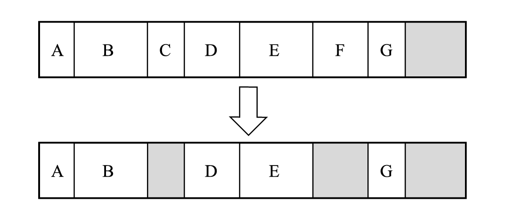<figcaption>Рисунок 1-14. Простая очистка – базовый способ</figcaption>
</figure>

В наивной реализации память сканируется во время каждого выделения, чтобы найти достаточно большой промежуток для размещения создаваемого объекта.

Но нетривиальные реализации могут строить структуры данных для хранения информации о свободных блоках памяти для более быстрого поиска, обычно в форме так называемого списка свободных блоков (показано на [рисунке 1-15](<#f-1-15>)). Более того, эти списки свободных блоков должны быть достаточно умными, чтобы объединять смежные свободные блоки памяти. Дальнейшая оптимизация может привести к хранению набора списков свободных блоков для разрывов памяти различного размера. С точки зрения деталей реализации, существуют также различные способы сканирования такого списка. Два из самых популярных подходов — это методы наилучшего соответствия и первого соответствия. В методе первого соответствия сканирование списка свободных блоков останавливается, как только найден любой подходящий свободный блок памяти. В подходе наилучшего соответствия всегда сканируются все записи списка свободных блоков, пытаясь найти наилучшее соответствие для требуемого размера. Первый метод быстрее, но может привести к большей фрагментации.

<figure markdown="span" class="custom-figure">
  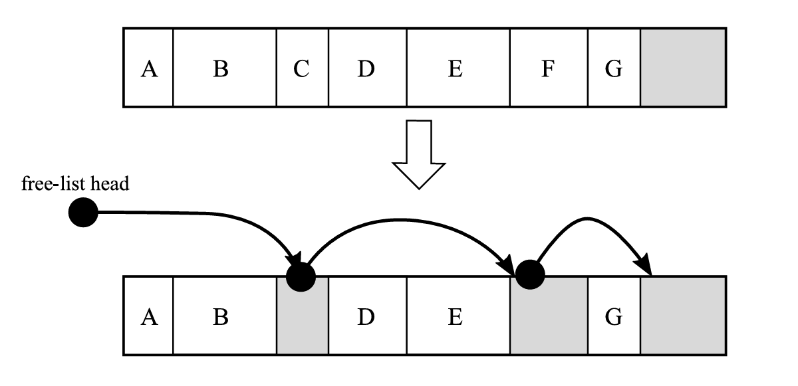<figcaption>Рисунок 1-15. Умная очистка – способ со списком свободных участков памяти</figcaption>
</figure>

Хотя этот метод довольно быстрый, у него есть один большой недостаток – он в конечном итоге приводит к фрагментации памяти. По мере создания и уничтожения объектов на куче образуются небольшие свободные промежутки. Это может привести к ситуации, когда, хотя в целом достаточно свободной памяти для нового объекта, нет ни одного непрерывного свободного пространства, достаточно большого для него. Вы видели такую ситуацию на [рисунке 1-9](<#f-1-9>) при описании выделения памяти в куче в общем.

### Компактизация

В этом подходе фрагментация устраняется за счет производительности, так как требуется перемещение объектов в памяти. Объекты перемещаются для уменьшения разрывов, созданных после удаления объектов. Можно выделить два основных различных подхода.

В более простом подходе, копирующей компактизации, все живые (достижимые) объекты перемещаются (копируются) в другую область памяти каждый раз, когда происходит сборка (см. [рисунок 1-16](<#f-1-16>)). Компактизация является простым следствием копирования каждого живого объекта один за другим, пропуская те, которые больше не нужны. Очевидно, что это вызывает высокий трафик памяти, так как все живые объекты должны быть скопированы туда и обратно. Это также увеличивает накладные расходы на память, так как нам нужно поддерживать в два раза больше памяти, чем обычно требуется.

<figure markdown="span" class="custom-figure">
  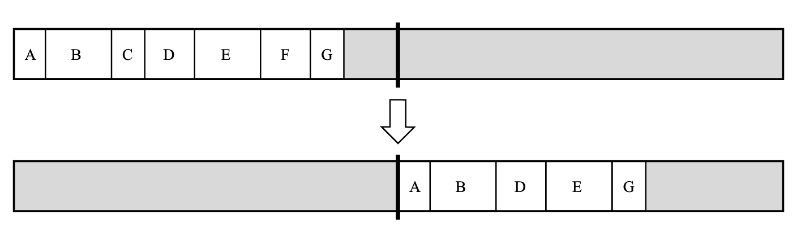<figcaption>Рисунок 1-16. Сборка компактизацией – реализация копирования</figcaption>
</figure>

Несмотря на эти слабые стороны, алгоритм может быть использован эффективно: просто помните, что его следует использовать только для определенных, небольших областей памяти, а не для всей памяти процесса. Это именно тот случай в некоторых реализациях JVM, когда копирующая компактизация используется для меньших областей памяти.

В более сложном сценарии можно реализовать компактизацию на месте. Объекты перемещаются друг к другу, чтобы устранить промежутки между ними (см. [рисунок 1-17](<#f-1-17>)). Это самое интуитивное решение и именно так вы бы перемещали блоки Lego. С точки зрения реализации это не тривиально, но все же выполнимо. Сложность заключается в том, чтобы понять, как перемещать объекты относительно друг друга, не перезаписывая их. И это становится еще сложнее, если вы попытаетесь реализовать это без использования временного буфера для повышения производительности.

<figure markdown="span" class="custom-figure">
  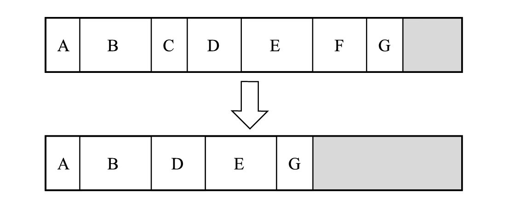<figcaption>Рисунок 1-17. Сборка компактизацией – реализация сжатия на месте</figcaption>
</figure>

Как вы увидите в Главе 9, .NET использует именно этот подход с очень умной структурой данных, используемой для оптимизации, так что вы найдете ответ на этот вопрос там.

  

__Сравнение сборщиков мусора

Можно задаться вопросом, какой сборщик мусора лучше. Это Hotspot Java 1.8 или .NET 8? Или, может быть, у Python или Ruby лучше GC? И что вообще означает "лучший GC"? Первое и самое важное правило при сравнении алгоритмов сборки мусора заключается в том, что каждое сравнение с самого начала очень неоднозначно. Это потому, что GC тесно связаны со своей средой выполнения, и практически невозможно тестировать их отдельно. Таким образом, трудно провести действительно объективное сравнение. Если вы хотите сравнить производительность различных GC, вы можете использовать такие меры, как пропускная способность, задержка и время паузы (вы увидите разницу между этими понятиями в главе 3). Но все эти меры будут приниматься в контексте всей среды выполнения, а не только GC. Некоторые механизмы фреймворка или среды выполнения (например, шаблоны выделения, внутренние пулы объектов, дополнительные компиляции или любой другой скрытый внутренний механизм) могут быть введены для уменьшения накладных расходов, вызванных GC. Более того, в каждом GC есть множество тонких настроек, которые делают его более эффективным в определенных типах рабочих нагрузок. Некоторые могут быть оптимизированы для быстрого отклика в интерактивной среде, другие - для обработки больших наборов данных. Третьи могут пытаться динамически изменять свои характеристики в соответствии с текущей рабочей нагрузкой. Кроме того, разные GC могут вести себя по-разному в зависимости от используемой конфигурации оборудования (оптимизированы для конкретных архитектур процессоров, количества ядер ЦП или архитектуры памяти).

Конечно, мы можем сравнить GC по используемым алгоритмам и предоставляемой функциональности. Существует множество других способов, как можно классифицировать сборщики мусора. Как вы уже видели, мы определяем GC как консервативный (Mono до 2.8) или точный (.NET) или даже их смесь (Mono 2.8+). Один реализует сборку методом очистки, другой - методом компактизации, а третий - оба этих метода. Еще одно важное различие заключается в том, как GC разделяет память. Вы увидите подробно, как куча может быть разделена на более мелкие части в главе 5. Она может использовать подсчет ссылок в некоторых частях или вообще не использовать его. Как реализован распределитель? Это параллельный или конкурентный GC? (Глава 11). С таким количеством возможных функциональных различий действительно трудно сказать, какая комбинация "лучше" - просто нет идеального решения.

Краткое резюме недостатков и преимуществ отслеживающего сборщика мусора выглядит следующим образом:

Преимущества:

  * Полностью прозрачен для разработчика – память просто абстрагируется, как если бы она была бесконечной, без необходимости беспокоиться об освобождении объектов, которые больше не нужны.

  * Нет проблем с циклическими ссылками.

  * Нет больших накладных расходов на мутаторы.

Недостатки:

  * Более сложная реализация.

  * Объекты освобождаются недетерминированным образом – после того, как они становятся недостижимыми, пройдет непредсказуемое количество времени, прежде чем они будут восстановлены.

  * Для фазы маркировки необходимо приостановить все потоки приложения (так называемое "остановить мир") – но только в неконкурентной версии.

  * Большие ограничения по памяти – поскольку мертвые объекты не освобождаются сразу, это увеличивает использование памяти.

В основном из-за первого преимущества отслеживающие сборщики мусора очень популярны в различных средах выполнения и окружениях.