# Аппаратное обеспечение

Как работает современный компьютер? Вы, вероятно, уже имеете базовое представление о предмете: компьютер состоит из процессора, который является основной вычислительной единицей – он выполняет программы. У него есть доступ к оперативной памяти (которая быстрая) и жестким дискам (которые медленные). Также есть видеокарта, которая очень важна для геймеров (и различных видов графических дизайнеров), которая отвечает за создание изображения, отображаемого на мониторе. Такой обзор с высоты птичьего полета недостаточен для наших целей. Давайте углубимся в тему. Для целей ваших размышлений давайте введем архитектуру современного компьютера, как на диаграмме на [Рисунке 2-1](<#f-2-1>).

  

__Примечание

Современный рынок персональных компьютеров доминируют ПК и Маки. Смоделированная схема архитектуры общего компьютера основана на них. При необходимости будут введены некоторые возможные нюансы, такие как те, которые касаются процессоров ARM или более сложных серверных машин.

Основные компоненты типичной архитектуры компьютера можно перечислить как

  * Процессор (CPU, центральный процессор): Основной блок, отвечающий за выполнение инструкций, как описано в Главе 1. Здесь находятся такие компоненты, как арифметико-логические устройства (ALU), устройства с плавающей запятой (FPU), регистры и конвейеры выполнения инструкций, которые делят инструкции на набор более мелких операций и выполняют их, если возможно, параллельно.

  * Шина передней панели (FSB): Шина данных, соединяющая процессор с северным мостом.

  * Северный мост: Блок, содержащий в основном контроллер памяти, отвечающий за управление связью между памятью и процессором.

  * ОЗУ (оперативная память): Основная память компьютера. Она хранит данные и код программ до тех пор, пока питание включено – поэтому ее также называют динамической оперативной памятью (DRAM) или энергозависимой памятью.

  * Шина памяти: Шина данных, соединяющая ОЗУ с северным мостом.

  * Южный мост: Чип, который обрабатывает все функции ввода-вывода, такие как USB, аудио, последовательный порт, системный BIOS, шина ISA, контроллер прерываний и каналы IDE – контроллеры массового хранения, такие как PATA и/или SATA.

  * Ввод-вывод хранения: Энергонезависимая память, которая хранит данные, включая популярные HDD или SSD диски.

<figure markdown="span" class="custom-figure">
  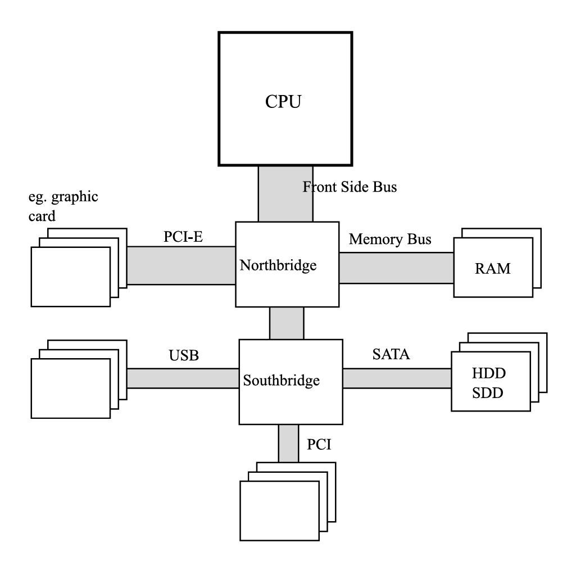<figcaption>Рисунок 2-1. Архитектура компьютера – ЦПУ, ОЗУ, северный мост, южный мост и другие. Ширина шины иллюстрирует пропорцию объема передаваемых данных (очень приблизительно)</figcaption>
</figure>

Стоит упомянуть, что ранее процессор, северный мост и южный мост были отдельными чипами, но теперь они тесно интегрированы. Начиная с микроархитектур Intel Nehalem и AMD Zen, северный мост включен в кристалл процессора (который в таком случае часто называют uncore или System Agent). Эта эволюция архитектуры показана на [Рисунке 2-2](<#f-2-2>).

<figure markdown="span" class="custom-figure">
  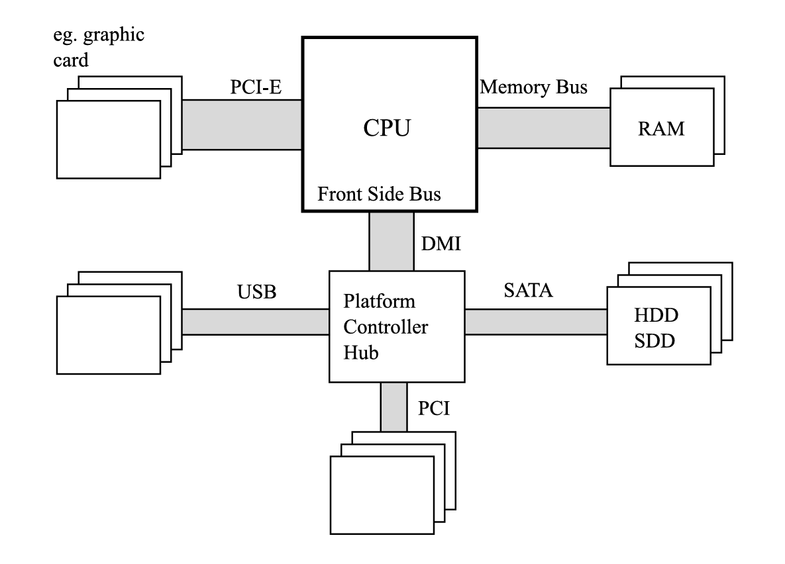<figcaption>Рисунок 2-2. Современное оборудование – процессор с северным мостом внутри, ОЗУ, южный мост (переименованный в Platform Controller Hub в случае терминологии Intel) и другие. Ширина шины иллюстрирует пропорцию объема передаваемых данных (очень приблизительно)</figcaption>
</figure>

Такая интеграция помогает, потому что контроллер памяти (внутри северного моста) расположен ближе к исполнительным блокам процессора, уменьшая задержки за счет меньших физических расстояний и улучшенного взаимодействия. Но на рынке все еще есть процессоры (наиболее популярные из которых – семейство AMD FX), у которых процессор, северный мост и южный мост разделены.

Основная проблема любого управления памятью заключается в несоответствии производительности современных процессоров по отношению к подсистемам памяти и массового хранения данных. Процессор намного быстрее, чем память, поэтому каждый доступ к памяти вызывает нежелательные задержки. Когда ЦП необходимо дождаться доступа к данным в памяти (чтения или записи), это называется простоем (stall). Простои отрицательно сказываются на использовании ресурсов процессора, так как приводят к потере тактов процессора на ожидание вместо выполнения задач.

Типичный современный процессор работает на частоте 3 ГГц или выше. Между тем, память работает с внутренними тактовыми частотами другого порядка величины, всего 200–400 МГц. Было бы слишком дорого создавать микросхемы ОЗУ, работающие на частоте процессоров. Это связано с тем, как устроены современные ОЗУ – зарядка и разрядка внутренних конденсаторов занимает время и его очень трудно уменьшить.

Вас может удивить, что память работает с такими низкими частотами. На самом деле, в компьютерных магазинах модули памяти рекламируются с частотами, такими как 3200 или 4800 МГц, которые гораздо ближе к скорости процессора. Откуда берутся такие цифры? Как вы увидите, такие спецификации – это только часть более сложной истины.

Модули памяти состоят из внутренних ячеек памяти (хранящих данные) и дополнительных буферов, которые помогают преодолеть их низкие внутренние тактовые частоты. Используются некоторые дополнительные приемы (см. [Рисунок 2-3](<#f-2-3>)). Большинство из них основаны на умножении чтения данных:

  * Отправка данных из внутренней ячейки памяти дважды в течение одного тактового цикла. Для точности, это как на спаде, так и на подъеме сигнала. Отсюда и название самой популярной памяти различных поколений – Double Data Rate (DDR). Этот метод также называют двойной накачкой.

  * Использование внутренней буферизации для выполнения нескольких чтений одновременно («режим burst») в одном тактовом цикле памяти. Это умножает количество прочитанных данных при той же внутренней частоте. Интерфейс памяти DDR2 удваивает внешнюю тактовую частоту, в то время как DDR3 и DDR4 увеличивают ее в четыре раза. DDR5 удваивает ее еще раз.

Эти методы в настоящее время используются в модулях DDR в отличие от гораздо более простых модулей SDRAM (синхронный DRAM), использовавшихся в прошлом. В конечном итоге, в случае современных типичных DDR5, кратность «burst» модуля памяти составляет 16, поскольку он сочетает технику двойной накачки с восемью чтениями одновременно.

<figure markdown="span" class="custom-figure">
  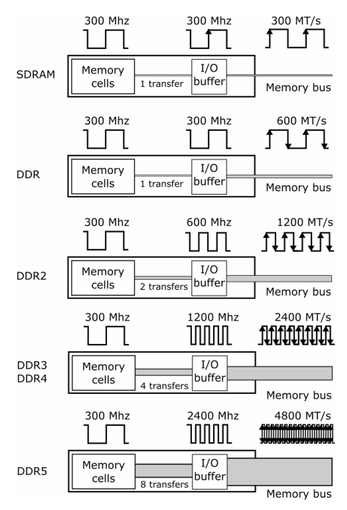<figcaption>Рисунок 2-3. Внутреннее устройство SDRAM, DDR, DDR2, DDR3, DDR4 и DDR5. Пример модулей памяти с внутренней частотой 300 МГц. MT/s означает «Мега передача в секунду». Обратите внимание, что это не строгая, а скорее иллюстративная диаграмма, показывающая соотношения между внутренними частотами и результирующими MT/s</figcaption>
</figure>

Для иллюстрации давайте рассмотрим типичный чип памяти DDR4, например, 16 ГБ 2400 МГц (описанный в спецификациях как DDR4-2400, PC4-19200). В этих случаях внутренняя тактовая частота массива DRAM составляет 300 МГц. Тактовая частота шины памяти увеличивается в четыре раза до 1200 МГц благодаря внутреннему буферу ввода-вывода. Кроме того, происходит две передачи за каждый тактовый цикл (оба склона сигнала), что приводит к скорости передачи данных 2400 MT/s (мега передача в секунду). Отсюда и берется спецификация 2400 МГц. Проще говоря, из-за природы двойной накачки в памяти DDR, скорость обычно указывается как двойная частота тактовой шины ввода-вывода, которая сама по себе является умножением внутренней тактовой частоты памяти. Указание этого значения в МГц – это просто маркетинговое упрощение. Вторая подпись – PC4-19200 – обладает максимальной теоретической производительностью такой памяти – это 2400 МТ/с, умноженные на 8 байт (передается одно слово длиной 64 бита), что дает результат 19200 МБ/с.

Давайте рассмотрим настольный ПК Конрада в контексте всей архитектуры. Он оснащен процессором Intel Core i7-4770K (поколение Haswell), работающим на частоте 3,5 ГГц. Частота шины передней панели составляет всего 100 МГц. Используемая память DDR3-1600 (PC3-12800) имеет внутреннюю тактовую частоту памяти 200 МГц, и благодаря механизму DDR3 тактовая частота шины ввода-вывода составляет 800 МГц. Это показано на [Рисунке 2-4](<#f-2-4>). Это подтверждается использованием инструментов аппаратной диагностики, таких как CPU-Z (см. [Рисунок 2-5](<#f-2-5>)).

Модули памяти постоянно улучшаются. Например, для DDR5 основным драйвером изменений было улучшение пропускной способности памяти. Вот почему была введена удвоенная длина burst, наряду с другими аналогичными изменениями, такими как удвоение количества «банков» и «групп банков» или введение двух независимых каналов вместо одного. Однако объяснение этих техник потребовало бы объяснения низкоуровневой работы модулей памяти, что выходит за рамки этой книги.

Если вам это интересно, вы можете начать с постера RAM Anatomy, доступного на сайте <https://prodotnetmemory.com/>.

<figure markdown="span" class="custom-figure">
  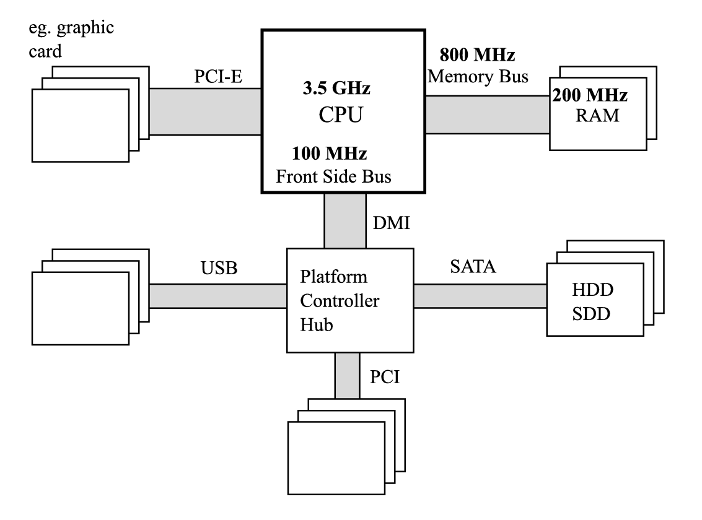<figcaption>Рисунок 2-4. Современная аппаратная архитектура с дискретной тактовой частотой (Intel Core i7-4770K и DDR3-1600)</figcaption>
</figure>

<figure markdown="span" class="custom-figure">
  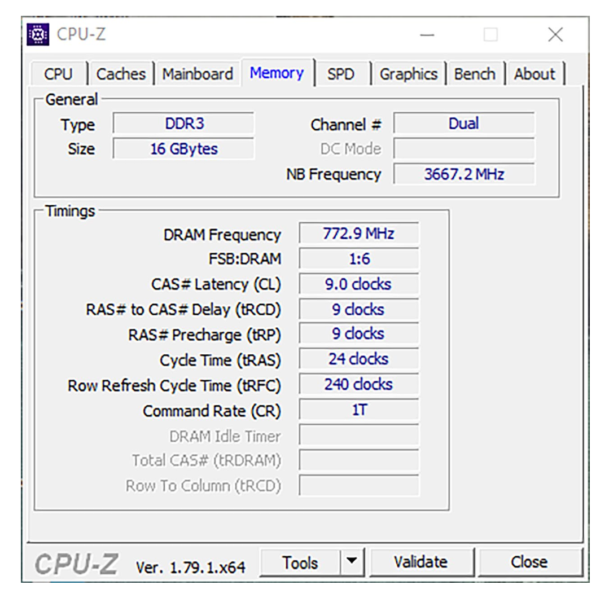<figcaption>Рисунок 2-5. Скриншот CPU-Z – вкладка «Память», на которой показаны частоты северного моста (NB) и DRAM, а также соотношение частот FSB:DRAM (которое, к сожалению, неверно в данной версии инструмента и должно быть 1:8)</figcaption>
</figure>

Несмотря на все описанные здесь улучшения памяти DDR, процессоры все еще намного быстрее памяти, которую они используют. Чтобы преодолеть эту проблему, применяется аналогичный подход на разных уровнях – приближение части данных к компоненту с более производительными (и более дорогими) блоками памяти. Такой подход называется кэшированием.

Для массовой памяти, такой как HDD, данные обычно кэшируются в ОЗУ – или в более быстрой, но меньшей по размеру выделенной памяти, такой как небольшой SSD внутри гибридных HDD-дисков, предназначенных для наиболее часто используемых данных. Для ОЗУ данные кэшируются внутри кэша процессора, как вы скоро увидите.

Конечно, существуют более общие оптимизации ОЗУ, включая лучшее аппаратное проектирование, лучшие контроллеры памяти и оптимизацию DMA (Direct Memory Access - прямой доступ к памяти) для устройств. Однако DMA не рассматривается в этой книге, так как он не связан напрямую с данными программы, и эти области памяти не управляются сборщиком мусора.

* * *

## Память

В настоящее время существует два основных типа памяти, используемых в персональных компьютерах, которые значительно различаются как по стоимости производства и использования, так и по производительности:

  * Статическая оперативная память (SRAM): Обеспечивает очень быстрый доступ, но является довольно сложной, состоящей из 4–6 транзисторов на ячейку (хранящую один бит). Она сохраняет данные, пока питание включено, и не требует обновления. Из-за высокой скорости используется в основном в кэшах процессора.

  * Динамическая оперативная память (DRAM): Очень простая конструкция ячейки (гораздо меньше, чем у SRAM) состоит из одного транзистора и конденсатора. Из-за утечки заряда конденсатора ячейка требует постоянного обновления (что занимает драгоценные миллисекунды и замедляет чтение памяти). Сигнал, считанный с конденсатора, должен быть усилен, что усложняет процесс. Чтение и запись также занимают время и не являются линейными из-за задержек конденсатора (требуется некоторое время для получения правильного чтения или успешной записи).

Давайте уделим еще несколько слов технологии DRAM, так как она является основой широко используемой памяти, установленной в слотах DIMM наших компьютеров. Как уже упоминалось, одна ячейка DRAM состоит из транзистора и конденсатора и хранит один бит данных. Такие ячейки сгруппированы в массивы DRAM. Адрес для доступа к конкретной ячейке предоставляется через так называемые адресные линии.

Было бы очень сложно и дорого, если бы каждая ячейка в массиве DRAM имела свой собственный адрес. Например, в случае 32-битной адресации потребовался бы 32-битный декодер адресных линий (компонент, отвечающий за выбор конкретной ячейки). Количество адресных линий в значительной степени влияет на общую стоимость системы – чем больше линий, тем больше выводов и соединений между контроллером памяти и чипами памяти (модулями). Из-за этого адресные линии используются повторно как строки и столбцы (см. [Рисунок 2-6](<#f-2-6>)), и для предоставления полного адреса требуется дважды записывать на одни и те же линии.

<figure markdown="span" class="custom-figure">
  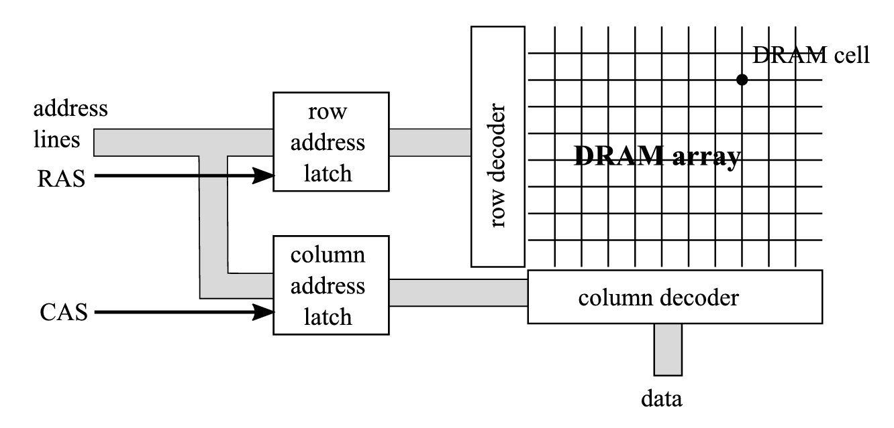<figcaption>Рисунок 2-6. Пример чипа DRAM с массивом DRAM и наиболее важными каналами: адресные линии, RAS и CAS</figcaption>
</figure>

Чтение одного бита из конкретной ячейки занимает несколько шагов:

  1. Номер строки помещается на адресные линии.

  2. Интерпретация запускается сигналом стробирования адреса строки (RAS) на выделенной линии.

  3. Номер столбца помещается на адресные линии.

  4. Интерпретация запускается сигналом стробирования адреса столбца (CAS).

  5. Строка и столбец указывают на конкретную ячейку DRAM в массиве. Один бит считывается из ячейки и записывается на линию данных.

Модули DRAM, установленные в наших компьютерах, состоят из множества таких массивов DRAM, организованных таким образом, чтобы мы могли получить доступ к нескольким битам (одному слову) за один тактовый цикл.

Временные интервалы перехода между отдельными шагами получения этого одного бита сильно влияют на производительность памяти. Эти временные интервалы могут быть вам знакомы, так как они являются важным фактором в спецификации модулей памяти, что сильно влияет на их цену. Вы, вероятно, знаете о таймингах модулей DIMM, таких как DDR3 9-9-9-24. Все эти тайминги указывают количество тактовых циклов, необходимых для выполнения определенных действий. Соответственно, они имеют следующие значения:

  * tCL (CAS латентность): Время между стробом адреса столбца (CAS) и началом ответа (получением данных).

  * tRCD (задержка RAS до CAS): Минимальное время между стробом адреса строки (RAS) и стробом адреса столбца (CAS).

  * tRP (предзарядка строки): Время, необходимое для предзарядки строки перед доступом к ней. Строка не может быть использована без предварительной подготовки, называемой предзарядкой.

  * tRAS (задержка активной строки): Минимальное время, в течение которого строка должна быть активной для доступа к информации в ней.

Обратите внимание на важность этих временных интервалов. Если строка и столбец, которые вас интересуют, уже установлены, считывание происходит почти мгновенно. Если вы хотите изменить столбец, это займет tCL тактовых циклов. Если вы хотите изменить строку, ситуация намного хуже: сначала она должна быть перезаряжена (tRP циклы), затем следуют задержки RAS и CAS (tCL и tRCD).

Все эти временные интервалы важны для пользователей компьютеров, ожидающих максимальной производительности. Игроки особенно обращают внимание на эти параметры. При покупке модулей памяти вы должны стремиться к минимально возможным таймингам, которые вы можете себе позволить, если производительность является вашим приоритетом.

Однако нас интересует влияние архитектуры памяти DRAM и ее таймингов на управление памятью. Стоимость изменения строки – временные интервалы сигнала RAS и перезарядка – значительна. Это одна из многих причин, почему последовательные шаблоны доступа к памяти намного быстрее, чем непоследовательные. Чтение данных в режиме burst из одной строки (изменяя столбец время от времени) намного быстрее, чем частое изменение строки. Если шаблон доступа полностью случайный, вы, скорее всего, столкнетесь с этими временными интервалами изменения строки при каждом доступе к памяти.

Вся представленная здесь информация имеет одну цель – убедиться, что у вас есть глубокая причина запомнить, почему непоследовательный доступ к памяти так нежелателен. И, как вы увидите, это не единственная причина, почему полностью случайный доступ является наихудшим сценарием.

* * *

## CPU

Теперь перейдем к теме центрального процессора. Процессор совместим с так называемой архитектурой набора инструкций (ISA) – она определяет, среди прочего, набор операций, которые могут выполняться (инструкции), регистры и их значение, как адресуется память и так далее. В этом смысле ISA является контрактом (интерфейсом), установленным между производителем процессора и его пользователями – программами, написанными в соответствии с данным контрактом. Это уровень, который вы видите при программировании, например, на языке ассемблера данной архитектуры. ISA IA-32 (32-битные процессоры i386, Pentium 32-битные процессоры), совместимые с AMD64 (большинство современных процессоров, включая Intel Core, AMD FX и Zen и т.д.), и A64 для ARM64 являются наиболее широко используемыми в мире экосистемы .NET. Под ISA находится так называемая микроархитектура процессора, которая ее реализует. Это позволяет улучшать микроархитектуру без влияния на систему и программное обеспечение, сохраняя обратную совместимость.

  

__Примечание

Существует много путаницы с названиями стандартов 64-битной архитектуры, и вы часто можете встретить x86-64, EMT64T, Intel 64 или AMD64, используемые взаимозаменяемо. Несмотря на наличие имен производителей и иногда незначительные различия, для целей этой книги вы можете смело считать, что эти названия однозначны и могут быть безопасно заменены друг на друга.

Как было сказано в предыдущей главе, регистры являются ключевыми компонентами ЦПУ, потому что в настоящее время все компьютеры реализованы как регистровые машины. В контексте манипуляции данными доступ к регистрам является мгновенным в том смысле, что он происходит в течение одного процессорного цикла и не вызывает дополнительных задержек. Нет места для ваших данных ближе к ЦПУ, чем регистры процессора. Конечно, регистры хранят только данные, необходимые для текущих инструкций, поэтому их нельзя считать универсальной памятью. На самом деле, в общем, процессоры имеют больше регистров, чем это видно из их ISA. Это позволяет выполнять различные типы оптимизаций (например, так называемое переименование регистров). Однако это детали реализации микроархитектуры и не влияют на механизмы управления памятью.

Кэш ЦПУ

Как мы уже упоминали ранее, чтобы уменьшить разрыв в производительности между ЦПУ и ОЗУ, используется промежуточный компонент для хранения копий наиболее часто используемых и необходимых данных – кэш ЦПУ. В общем виде это показано на [Рисунке 2-7](<#2-7>).

<figure markdown="span" class="custom-figure">
  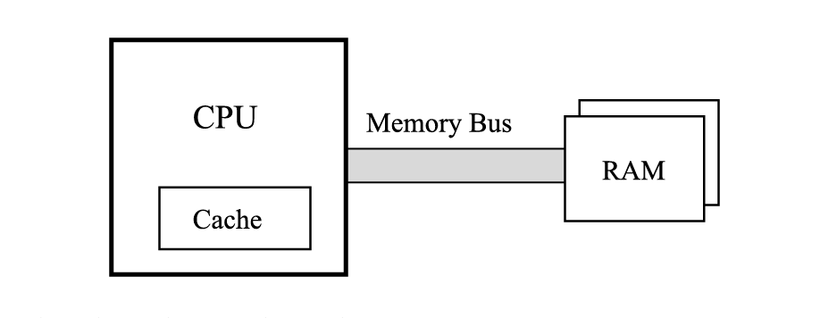<figcaption>Рисунок 2-7. Взаимосвязь ЦПУ с кэшем и ОЗУ</figcaption>
</figure>

Этот кэш прозрачен с точки зрения ISA. Ни программисту, ни операционной системе не нужно знать о ее существовании. Они не обязаны им управлять. В идеальном мире правильное использование и управление кэшем должно быть исключительной ответственностью центрального процессора.

Поскольку кэш должен быть максимально быстрым, используются ранее упомянутые чипы SRAM. Из-за своей стоимости и размера (занимающего драгоценное место в процессоре) они не могут иметь такую ​​же большую емкость, как основная оперативная память. Но в зависимости от предполагаемых затрат они могут быть такими же быстрыми, как ЦП, или может быть, только на один-два порядка медленнее.

Попадание и промах кэша

Идея кэша тривиальна. Когда выполняемая процессором инструкция нуждается в доступе к памяти (будь то запись или чтение), она сначала проверяет кэш, чтобы узнать, находятся ли нужные данные уже там. Если да, то отлично! Вы только что получили очень быстрый доступ к памяти, и такая ситуация называется попаданием в кэш. Если данных нет в кэше (так называемый промах кэша), то сначала их нужно прочитать из ОЗУ перед тем, как сохранить в кэш, что, очевидно, является гораздо более медленной операцией. Соотношение попаданий и промахов кэша являются очень важными показателями, показывающими, насколько эффективно наш код использует кэш.

Локальность данных

Но почему такой кэш вообще полезен? Кэширование основано на очень важной концепции – локальности данных. Вы можете различить два вида локальности:

  * Временная локальность: Если вы обращаетесь к какому-то региону памяти, вы, скорее всего, обратитесь к нему снова в ближайшем будущем. Это делает использование кэша вполне оправданным – вы читаете некоторые данные из памяти и, вероятно, будете использовать их позже еще несколько раз. В общем, вы загружаете некоторые структуры данных в переменные и используете эти переменные многократно (счетчики, временные данные, считанные из файлов и так далее).

  * Пространственная локальность: Если вы обращаетесь к какому-то региону памяти, вы, скорее всего, обратитесь к данным из близкого окружения. Этот тип локальности может стать вашим союзником, если вы кэшируете немного больше окружающих данных, чем вам нужно в данный момент. Например, если вам нужно несколько байт из памяти, давайте прочитаем и за кэшируем еще десяток байт. Вы редко используете очень изолированные области памяти. Вы скоро обнаружите, что стек и куча организованы таким образом, что потоки, выполняющие свою работу, обычно обращаются к похожим областям памяти. Локальные переменные или поля в структурах данных также обычно размещаются близко друг к другу.

Обратите внимание, что кэш полезен, если вышеупомянутые условия действительно выполняются. Однако это палка о двух концах. Если вы напишете программу таким образом, что она нарушает локальность данных, кэш станет ненужной обузой. Вы увидите это позже в главе.

Реализация кэша

До тех пор, пока сохраняется совместимость с моделью памяти ISA, детали реализации кэша теоретически не имеют значения. Он должен быть просто для ускорения доступа к памяти и все. Тем не менее, это прекрасный пример Закона дырявых абстракций, придуманного Джоэлом Спольски:

  

__Цитата

Все нетривиальные абстракции, в той или иной степени, дырявые

Это означает, что абстракция, которая теоретически должна скрывать детали реализации, к сожалению, при определенных обстоятельствах раскрывает их наружу. И обычно это происходит непредсказуемым и/или нежелательным образом. Как это работает в случае с кэшем, должно стать ясно в ближайшее время, а пока давайте просто немного углубимся в детали реализации.

Самым важным и влиятельным фактом является то, что данные между оперативной памятью и кэшем передаются блоками, называемыми строкой кэша. Строка кэша имеет фиксированный размер, и в подавляющем большинстве современных компьютеров он составляет 64 байта. Очень важно помнить – вы не можете прочитать или записать меньше данных из памяти, чем размер строки кэша, то есть 64 байта. Даже если вы захотите прочитать один бит из памяти, будет заполнена целая 64-байтовая строка кэша. В этой конструкции используется более быстрый последовательный доступ к DRAM (помните задержки предварительной зарядки и RAS, описанные ранее в этой главе?).

Как уже упоминалось ранее, доступ к DRAM осуществляется с шириной 64 бита (8 байт), поэтому для заполнения такой строки кэша требуется восемь передач из ОЗУ. Это требует многих циклов ЦПУ, поэтому существуют различные техники для оптимизации этого процесса. Одна из них называется "Critical Word First" и "Early Restart". Она позволяет не читать строку кэша слово за словом, а начинать с самого нужного слова. Представьте, что в худшем случае такое 8-байтовое слово может находиться в конце строки кэша, и вам пришлось бы ждать все предыдущие семь передач, чтобы получить доступ к нему. Эта техника сначала читает самое важное слово. Инструкции, ожидающие эти данные, могут продолжить выполнение, а остальная часть строки кэша будет заполнена асинхронно.

  

__Примечание

Как выглядит типичный шаблон доступа к памяти? Когда кто-то хочет прочитать данные из памяти, соответствующая строка кэша создается в кэше, и в нее считываются 64 байта данных. Когда кто-то хочет записать данные в память, первый шаг точно такой же – строка кэша заполняется в кэше, если ее там еще нет. Эти кэшированные данные изменяются при записи данных. Затем могут произойти две стратегии:

  * Запись через: После записи в строку кэша измененные данные немедленно сохраняются в основной памяти. Это простой подход для реализации, но создает большую нагрузку на шину памяти.

  * Запись обратно: После записи в строку кэша она помечается как грязная. Затем, когда в кэше нет места для других данных, этот грязный блок записывается в память (и измененная грязная запись кэша удаляется). Процессор может записывать эти блоки время от времени, когда сочтет это уместным (например, во время простоя).

Существует еще одна техника оптимизации, называемая объединением записей. Она гарантирует, что данная строка кэша из данной области памяти записывается полностью (а не записываются отдельные слова), снова используя преимущество более быстрого последовательного доступа к памяти.

Из-за строк кэша, данные хранящиеся в памяти, выравниваются по границе в 64 байта. Таким образом, чтобы прочитать два последовательных байта, в худшем случае необходимо использовать две строки кэша общим размером 128 байт. Это показано на [Рисунке 2-8](<#f-2-8>), когда вы хотите прочитать 2 байта по адресу A, но он находится всего в одном байте до конца границы строки кэша, в таком случае вам в итоге придётся читать две строки кэша.

<figure markdown="span" class="custom-figure">
  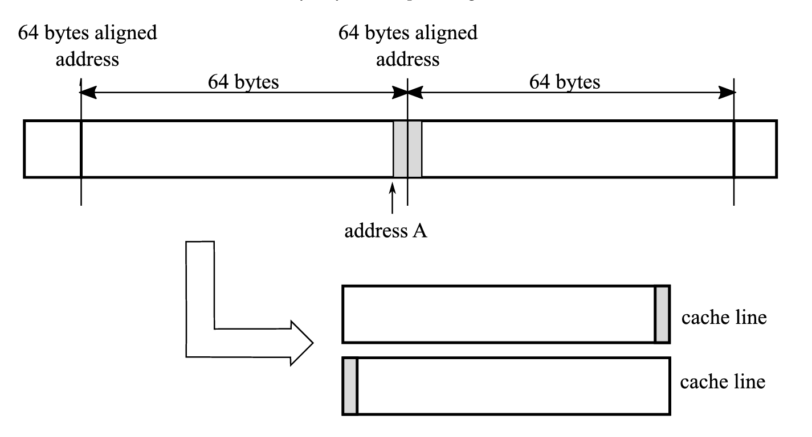<figcaption>Рисунок 2-8. Доступ к двум последовательным байтам требует заполнения двух строк кэша, поскольку они, к сожалению, были расположены на границе двух строк кэша.</figcaption>
</figure>

Вы можете задаться вопросом, в чем смысл тратить время на такие детали реализации оборудования? Имеет ли это значение в комфортном мире управляемого кода? Давайте выясним.

Стоимость непоследовательных шаблонов доступа к памяти была проиллюстрирована примером кода из [Листинга 2-1](<#l-2-1>) и результатами в [Таблице 2-1](<#t-2-1>). Примерная программа обращается к одному и тому же двумерному массиву двумя способами – построчно и по столбцам. Результаты представлены для трех различных сред: ПК (Intel Core i7-4770K 3.5GHz), ноутбук (Intel Core i7-4712MQ 2.3GHz) и плата Raspberry Pi 2 (ARM Cortex-A7 0.9GHz).

  

        
    
    
        
          // По строкам
          int[,] tab = new int[n, m];
          for (int i = 0; i < n; ++i)
          {
            for (int j = 0; j < m; ++j)
            {
              tab[i, j] = 1;
            }
          }
    
          // По столбцам
          int[,] tab = new int[n, m];
          for (int i = 0; i < n; ++i)
          {
            for (int j = 0; j < m; ++j)
            {
              tab[j, i] = 1;
            }
          }
      

Листинг 2-1. Индексация по столбцам и строкам при доступе к массиву (массив 5000x5000 целых чисел)

\# | шаблон | ПК | Ноутбук | Raspberry Pi 2  
---|---|---|---|---  
1 | По строкам | 52 ms | 127 ms | 918 ms  
2 | По столбцам | 401 ms | 413 ms | 2001 ms  
Таблица 2-1. Результаты индексации по столбцам и строкам (n,m = 5000)

Этот пример показывает, насколько пагубным для производительности может быть непоследовательное извлечение данных. Пример программы во второй версии считывает данные по столбцам. В результате активная строка ячеек DRAM должна изменяться время от времени. Но что более важно, кэш используется очень неэффективно, потому что только один байт данных считывается при загрузке всей строки кэша. А затем считывается другой удаленный адрес, поэтому необходимо заполнить другую строку кэша. Разница в производительности может быть более чем в семь раз, как видно из [Таблицы 2-1](<#t-2-1>). ЦПУ часто простаивает, ожидая доступа к памяти.

[Рисунок 2-9](<#f-2-9>) иллюстрирует разницу между доступом к элементам по строкам и по столбцам небольшого массива, содержащего значения от 1 до 40 (и на иллюстрации предполагается, что четыре значения помещаются в одну строку кэша). Предположим также для иллюстративных целей, что у ЦПУ достаточно кэша, чтобы вместить только четыре строки кэша. Когда память считывается построчно (левая сторона [Рисунка 2-9](<#f-2-9>)), последовательные целые числа считываются в пределах последовательных округленных до строки кэша областей памяти:

  * Чтобы прочитать первые четыре элемента (1,2,3,4), считывается первая строка кэша, и все эти элементы используются.

  * Чтобы прочитать следующие четыре элемента (5,6,7,8), считывается вторая строка кэша, и снова все эти элементы используются.

  * Чтобы прочитать следующие четыре элемента (9,10,11,12), считывается третья строка кэша. Этот доступ повторяется по всему массиву, и использование строк кэша является оптимальным.

  

__Примечание

В реальном ЦП «буфер» для строк кэша представляет собой весь кэш ЦП, поэтому он обычно вмещает сотни или тысячи записей размером со строку кэша шириной 64 байта.

Правая сторона [Рисунка 2-9](<#f-2-9>) показывает второй шаблон, когда одно целое число считывается для каждой строки кэша, а затем переходит к другой:

  * Чтобы прочитать первые четыре элемента, считываются четыре строки кэша, но используется только один элемент из каждой из них (1 из первой строки кэша, 9 из второй и так далее).

  * Чтобы прочитать следующий элемент (33), одна из уже загруженных строк кэша должна быть очищена, потому что буфер уже заполнен. Скорее всего, это будет наименее используемая строка (содержащая элементы 1,2,3,4) и заменена на новую (содержащую 33,34,35,36).

  * Чтобы прочитать следующий элемент (2), снова будет очищена наименее используемая строка, и процессору потребуется перезагрузить первую строку (содержащую 1,2,3,4), выгруженную только что.

  * Этот шаблон доступа повторяется много раз, требуя считывания строки кэша четыре раза.

<figure markdown="span" class="custom-figure">
  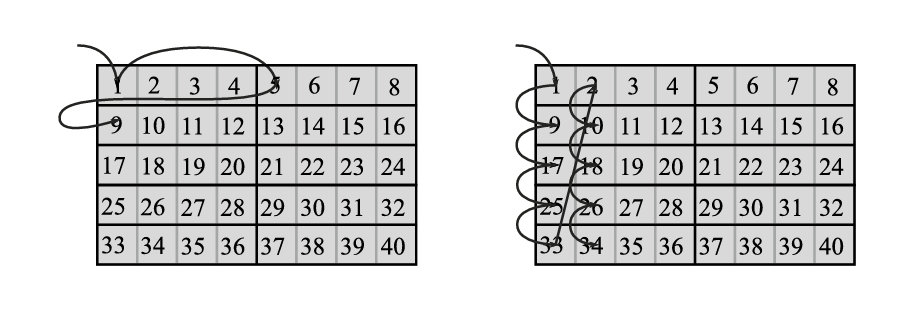<figcaption>Рисунок 2-9. Шаблон доступа по строкам и столбцам – стрелки показывают доступ, вызывающий недействительность строки кэша (при доступе к первым десяти элементам)</figcaption>
</figure>

Очевидно, что реальные ЦПУ имеют больше четырех буферов строк кэша, и строка кэша вмещает больше данных, чем четыре целых значения, поэтому [Рисунок 2-9](<#f-2-9>) является упрощением для иллюстративных целей. Но точно такая же проблема возникает в реальных сценариях, и ее результаты четко видны в [Таблице 2-1](<#t-2-1>).

Как видите, вся среда выполнения .NET и ее продвинутые методы управления памятью не могут скрыть те детали реализации ЦПУ, которые нас подводят. Неблагоприятный шаблон доступа к памяти вызывает многократное ухудшение производительности вашего кода. Подобный тест для Java и C/C++ даст аналогично неблагоприятные результаты.

Выравнивание данных

Существует еще один очень важный аспект доступа к памяти, который необходимо описать. Большинство архитектур ЦПУ спроектированы для доступа к правильно выровненным данным – это означает, что начальный адрес таких данных является кратным заданному выравниванию, указанному в байтах. Каждый тип данных имеет свое собственное выравнивание, и выравнивание структуры данных зависит от выравнивания ее полей. Необходимо уделять много внимания, чтобы не обращаться к невыровненным данным, так как это может быть в несколько раз медленнее. Это ответственность компилятора и разработчика, проектирующего структуры данных. В случае структур данных CLR, компоновка в основном управляется самой средой выполнения. Именно поэтому вы можете заметить много кода в сборщике мусора, связанного с правильной обработкой выравнивания. В Главе 13 вы увидите, как выглядит компоновка памяти объектов и как она может быть контролируема с учетом выравнивания данных.

Однако, начиная с .NET Core 3.0, были введены так называемые аппаратные встроенные функции. Они предоставляют доступ ко многим аппаратно-специфичным инструкциям ЦП, которые не могут быть легко раскрыты с помощью более универсального механизма. Использование выровненной памяти для загрузки и сохранения доступно с тех пор благодаря таким методам, как LoadAlignedVector256 или StoreAligned. Они будут полезны только если вы работаете на очень низком уровне, в основном используя неуправляемую, собственную память через указатели. Они могут быть особенно полезны в так называемых методах векторизации — преобразовании алгоритмов из работы с одним значением на итерацию в работу с набором значений (векторов) на итерацию, с помощью специальных инструкций ЦП SIMD (Single Instruction, Multiple Data).

Не временной доступ

До сих пор упоминалось, что в большинстве распространенных типов архитектуры ЦПУ нет доступа к памяти, кроме как через кэш. Вся память, читаемая или записываемая из DRAM процессором, хранится в кэше. Предположим, вы хотите инициализировать очень большой массив, но знаете, что будете использовать его в отдаленном будущем. Из того, что вы узнали до сих пор, вы знаете, что такая инициализация массива вызовет большой трафик памяти. Массив будет записан блоками, одна строка кэша за другой. Более того, каждая из этих операций записи включает три шага – чтение данных в кэш, изменение содержимого кэша и, наконец, запись строки кэша обратно в основную память. В этом сценарии строки кэша заполняются только для записи данных обратно в основную память. Это не только не оптимально само по себе, но и тратит пространство кэша, которое могло бы быть использовано для других программ.

Вы можете избежать такого трафика кэша, используя так называемый набор ассемблерных инструкций не временного доступа – MOVNTI, MOVNTQ, MOVNTDQ и т.д. Они позволяют программисту предотвратить кэширование данных во время записи в память. Они доступны через набор функций C/C++ `_mm_stream_*`, поэтому для их использования не требуется ассемблер. Например, `_mm_stream_si128` выполняет инструкцию MOVNTDQ, которая записывает один квадро-слово (4 слова по 4 байта) непосредственно в память. Пример быстрой инициализации массива с использованием этой техники показан в [Листинге 2-2](<#l-2-2>).

  

        
    
    
        
          #include <emmintrin.h>
          void setbytes(char *p, int c)
          {
            __m128i i = _mm_set_epi8(c, c, c, c, c, c, c, c, c, c, c, c, c, c, c, c); // sets 16 
            signed 8-bit integer values
            _mm_stream_si128((__m128i *)&p;[0], i);
            _mm_stream_si128((__m128i *)&p;[16], i);
            _mm_stream_si128((__m128i *)&p;[32], i);
            _mm_stream_si128((__m128i *)&p;[48], i);
          }
      

Листинг 2-2. Пример использования низкоуровневого API в C++ для не временных записей

Упомянутые выше аппаратные встроенные функции доступны с .NET Core 3.0 и также включают возможность использования не временного доступа.

Вы можете использовать набор функций StoreAlignedNonTemporal, которые будут переведены JIT-компилятором в одну из инструкций MOVNTxx, в зависимости от типа данных памяти, к которой вы обращаетесь (байты, целые числа, числа с плавающей запятой и т.д.).

В [Листинге 2-3](<#l-2-3>) вы можете увидеть пример простой программы, которая умножает значения из входного массива на 2 партиями, сохраняя их с помощью вышеупомянутого метода.
    
    
        
        
          int simdLength = Vector<float>.Count;
          var vec2 = new Vector<float>(2.0f);
    
          unsafe
          {
            fixed (float* p = outputArray)
            {
              for (; i <= arrayLength - simdLength; i += simdLength)
              {
                var vector = new Vector<float>(inputArray, i);
                vector = vector * vec2;
                vector.StoreAlignedNonTemporal(p + i);
              }
            }
          }
      

Листинг 2-3. Пример использования аппаратных встроенных функций для использования не временного доступа

Одна сложная вещь, которую нужно помнить, заключается в том, что такие записи должны быть "выровнены". То есть, адреса памяти, к которым вы записываете с помощью StoreAlignedNonTemporal, должны быть кратны размеру строки кэша (32 байта). Это не гарантируется по умолчанию для обычных управляемых массивов float, поэтому вам нужно решить эту проблему двумя возможными способами:

  * Вместо использования обычного управляемого массива вы можете использовать выровненную нативную память, выделенную с помощью метода NativeMemory.AlignedAlloc (введенного в .NET 6).

  * Вы можете найти первый выровненный адрес в массиве и начать обработку с него. Остальное следует обрабатывать без использования не временного, не выровненного API.

В общем, вы должны понимать, что использование не временного доступа - это сложная и хитрая вещь. Это определенно не должно использоваться в качестве стандартной "быстрой техники доступа к памяти".

  

__Примечание

Существуют также инструкции загрузки с не временным доступом (nTA) MOVNTDQA, доступные через функции `_mm_stream_load_si128`. Соответственно, существует набор методов LoadAlignedNonTemporal, доступных через API аппаратных встроенных функций в .NET.

Предварительная выборка

Существует еще один механизм, который стремится улучшить использование кэша. Он заключается в заполнении кэша данными, которые, вероятно, понадобятся в ближайшем будущем. Этот механизм называется предварительной выборкой (prefetching), и он может работать в двух разных режимах:

  * Аппаратно управляемая: Когда ЦПУ замечает несколько промахов кэша с определенными шаблонами. Большинство ЦПУ отслеживают от 8 до 16 шаблонов доступа к памяти (чтобы компенсировать типичную многопоточную/многопроцессный способ работы).

  * Программно управляемая: Через явный вызов инструкции PREFETCHT0, доступной через функцию _mm_prefetch в C/C++.

Предварительная выборка, как и все другие механизмы кэширования, является обоюдоострым оружием. Если вы хорошо понимаете шаблоны доступа к памяти в вашем коде, то использование предварительной выборки может заметно ускорить производительность вашей программы. С другой стороны, очень сложно быть уверенным, что вы правильно понимаете эти шаблоны доступа к памяти, учитывая очень широкий контекст, в котором работает ваш код – под влиянием других потоков в вашей программе, потоков других программ и потоков самой операционной системы. Время имеет решающее значение: если вы выполните предварительную выборку слишком поздно, данные не будут доступны, когда они вам понадобятся. С другой стороны, если вы выполните предварительную выборку слишком рано, данные могут быть вытеснены из кэша к тому времени, когда вы начнете их использовать. Предварительная выборка используется сборщиком мусора на x86, x64 и ARM64 (см. [Листинг 2-4](<#l-2-4>)).
    
    
        
          // enable on processors known to have a useful prefetch instruction
          #if defined(TARGET_AMD64) || defined(TARGET_X86) || defined(TARGET_ARM64)
          #define PREFETCH
          #endif
          #ifdef PREFETCH
          inline void Prefetch(void* addr)
          {
          #ifdef TARGET_WINDOWS
          #if defined(TARGET_AMD64) || defined(TARGET_X86)
          #ifndef _MM_HINT_T0
          #define _MM_HINT_T0 1
          #endif
            _mm_prefetch((const char*)addr, _MM_HINT_T0);
          #elif defined(TARGET_ARM64)
            __prefetch((const char*)addr);
          #endif //defined(TARGET_AMD64) || defined(TARGET_X86)
          #elif defined(TARGET_UNIX)
            __builtin_prefetch(addr);
          #else //!(TARGET_WINDOWS || TARGET_UNIX)
          UNREFERENCED_PARAMETER(addr);
          #endif //TARGET_WINDOWS
          }
          #else //PREFETCH
          inline void Prefetch (void* addr)
          {
            UNREFERENCED_PARAMETER(addr);
          }
          #endif //PREFETCH
        
      

Листинг 2-4. Части кода .NET, связанные с предварительной выборкой, в зависимости от архитектуры   

__Примечание

Примером плохого использования кэша может быть ситуация, когда алгоритм сборки мусора спроектирован таким образом, что некоторые очень маленькие, 1-байтовые диагностические данные разбросаны по всей памяти в случайных местах. Операция по сбору этой информации будет очень затратной с точки зрения кэширования. Нам придется заполнять кэш через строки кэша, чтобы прочитать всего один байт.

Алгоритмы, которые интенсивно работают с памятью (а сборка мусора по своей сути работает с памятью), должны учитывать эти внутренние особенности ЦПУ. Память - это не просто плоское пространство, где можно случайным образом выбирать байты здесь и там без каких-либо последствий!

Иерархический кэш

Возвращаясь к архитектуре оборудования, из-за требований к производительности, с одной стороны, и оптимизации затрат, с другой, дизайн ЦПУ сегодня эволюционировал в более сложную иерархическую кэш-память. Идея проста. Вместо одного кэша давайте создадим несколько, с разными размерами и скоростями. Это позволяет создать очень маленький и очень быстрый кэш первого уровня (называемый L1), затем немного больший и немного медленнее кэш второго уровня (L2), и, наконец, кэш третьего уровня (L3). В современной архитектуре эта нумерация заканчивается на трех уровнях. Такая иерархическая кэш-память современных компьютеров показана на [Рисунке 2-10](<#f-2-10>). Правда, иногда можно встретить процессоры, оснащенные кэшем L4, но это немного другой вид памяти, предназначенный в основном для интегрированных графических карт внутри этих ЦПУ.

<figure markdown="span" class="custom-figure">
  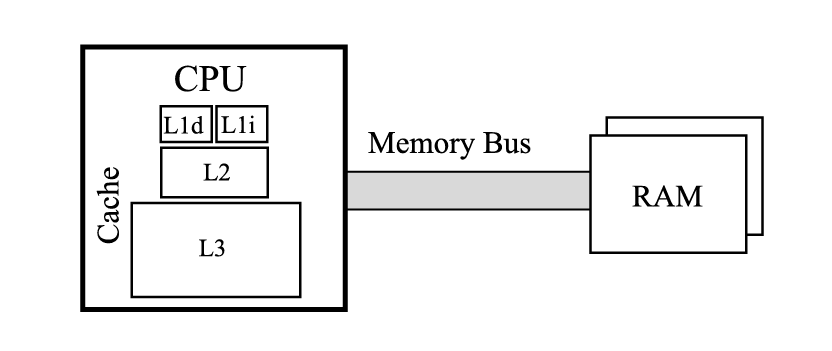<figcaption>Рисунок 2-10. ЦПУ с иерархическим кэшем – кэш первого уровня разделен на кэш инструкций (L1i) и кэш данных (L1d), а также кэш второго (L2) и третьего (L3) уровней. ЦПУ подключен к ОЗУ через шину памяти</figcaption>
</figure>

Кэш первого уровня разделен на два отдельных блока. Один предназначен для данных (обозначен как L1d), а другой для инструкций (обозначен как L1i). Инструкции, считываемые из памяти и выполняемые процессором, также фактически являются данными, но интерпретируются соответствующим образом. Данные и инструкции кода на уровнях выше L1 фактически обрабатываются одинаково. Однако практика показала, что предпочтительнее обрабатывать данные и инструкции отдельно для самого нижнего уровня кэша. Это подход архитектуры Гарварда. По этой причине архитектура современных компьютеров называется модифицированной Гарвардской архитектурой. Это решение хорошо работает из-за сильной независимости использования областей памяти для хранения данных и программного кода, но только на самом нижнем уровне.

Зная, что существует три основных уровня кэша, возникает очевидный вопрос: каковы типичные различия в скорости и размере между ними и основной памятью? Память на нижних уровнях кэша может быть очень быстрой, настолько, что доступ к L1 и даже L2 может быть быстрее времени выполнения конвейера (если только вам не нужно ждать точного вычисления адреса, что также является дорогостоящей операцией). Итак, каковы эти временные интервалы?

На момент написания этой главы использовался ноутбук с процессором Intel Core i7-4712MQ (поколение Haswell), работающим на частоте 2,30 ГГц. Предполагая, что один цикл процессора на моем ноутбуке занимает примерно 0,4 нс (~1/2,30 ГГц) и используя спецификацию Haswell i7, задержка доступа к различным уровням памяти может быть представлена, как показано в [Таблице 2-2](<#t-2-2>).

\# | Операция | Задержка  
---|---|---  
1 | Кэш L1 |  < 2.0 нс  
2 | Кэш L2 | 4.8 нс  
3 | Кэш L3 | 14.4 нс  
4 | Основная память | 71.4 нс  
5 | HDD | 150 000 нс  
Таблица 2-2. Задержка доступа к различным частям памяти

Вы можете ясно видеть, что стоит бороться за оптимальное использование кэша. Задержка может быть в пять раз быстрее, когда необходимые данные доступны в кэше L3, а не в оперативной памяти. С кэшем L1 это более чем в 30 раз лучше. Вот почему чрезвычайно важно для общей производительности знать, как используется кэш. Сколько данных помещается в кэш? Все зависит от конкретной модели процессора, но спецификация i7-4770K довольно хорошо отражает рыночные стандарты. Кэш L1 имеет 64 КБ данных (разделенных на 32 КБ для кода и 32 КБ для данных), в то время как кэш L2 имеет 256 КБ. Кэш L3, всегда намного больше, составляет 8 МБ.

Каково влияние этих временных интервалов в управляемом мире .NET? Давайте рассмотрим простой пример, показывающий задержку при доступе к данным в зависимости от объема обрабатываемой памяти. Мы используем код из [Листинга 2-5](<#l-2-5>), который выполняет серию последовательных чтений (оптимальный случай). Поскольку используемая структура имеет размер 64 байта, чтение выполняется с шагом 64 байта, и каждый раз необходимо загружать новую строку кэша. На [Рисунке 2-11](<#f-2-11>) показаны средние времена доступа к одному элементу массива tab в зависимости от того, сколько памяти этот массив занимал в целом.

Очевидно ухудшение времени доступа, когда размер данных превышает размер кэша каждого уровня. Поскольку тесты проводились на процессоре Intel i7-4770K, четко видны точки деградации производительности около 256 КБ и 8192 КБ, что соответствует размерам кэша L2 и L3. Вы можете видеть, что работа с небольшими размерами данных может быть в несколько раз быстрее, чем работа с данными, которые не помещаются в кэш L3.

  

        
    
    
        
          public struct OneLineStruct
          {
            public long data1;
            public long data2;
            public long data3;
            public long data4;
            public long data5;
            public long data6;
            public long data7;
            public long data8;
          }
    
          public static long OneLineStructSequentialReadPattern(OneLineStruct[] tab)
          {
            long sum = 0;
            int n = tab.Length;
            for (int i = 0; i < n; ++i)
            {
              unchecked { sum += tab[i].data1; }
            }
            return sum;
          }
      

Листинг 2-5. Последовательное чтение следующих строк кэша

<figure markdown="span" class="custom-figure">
  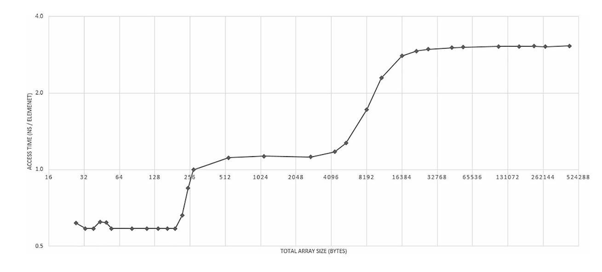<figcaption>Рисунок 2-11. Время доступа в зависимости от размера данных – архитектура Intel x86/последовательное чтение. Обратите внимание: обе оси логарифмические   </figcaption>
</figure>

__Примечание

Существует одна интересная, но не столь важная тема в контексте кэша – стратегии вытеснения. Речь идет о том, как освободить место для новых данных, если их нет на данном уровне. Существуют два возможных подхода, иногда смешиваемых на разных уровнях:

  * Эксклюзивный кэш: Данные находятся только на одном уровне кэша. Этот метод чаще всего используется в процессорах AMD.

  * Инклюзивный кэш: Когда каждая строка кэша на нижнем уровне (например, L1d) также присутствует на более высоком уровне (например, L2).

Хотя это интересно, но это не влияет на ваше понимание управления памятью. Следует предположить, что производители процессоров делают все возможное, чтобы обеспечить наиболее эффективную реализацию этих механизмов.

Многоядерный иерархический кэш

Однако это не конец вашего путешествия по дизайну компьютеров. Большинство современных процессоров имеют более одного ядра. В упрощенных терминах, ядро – это то, что представляет собой отдельный, упрощенный процессор – оно может выполнять код независимо от других ядер. В прошлом каждое ядро выполняло ровно один поток одновременно. Таким образом, четырехъядерный процессор мог выполнять четыре потока одновременно. В настоящее время практически все процессоры имеют механизм одновременной многопоточности (SMT), позволяющий одновременно выполнять два потока в одном ядре. Для процессоров Intel это называется гиперпоточностью, а полная поддержка SMT была добавлена в микроархитектуру AMD Zen. Распределение кэшей между отдельными ядрами в примере четырехъядерного процессора показано на [Рисунке 2-12](<#f-2-12>).

<figure markdown="span" class="custom-figure">
  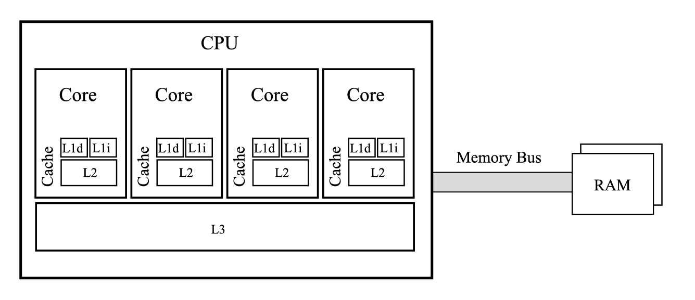<figcaption>Рисунок 2-12. Многоядерный процессор – каждое ядро имеет свой кэш первого уровня, разделенный на кэш инструкций (L1i) и кэш данных (L1d), и кэш второго уровня (L2). Кэш третьего уровня (L3) общий для всех ядер. Процессор подключен к ОЗУ через шину памяти</figcaption>
</figure>

Как видите, каждое ядро имеет свой собственный кэш первого и второго уровня. Кэш третьего уровня общий для всех ядер. Как ядра и кэш L3 взаимосвязаны, на самом деле является деталью реализации. Например, в большинстве современных процессоров Intel существует двунаправленная, чрезвычайно быстрая шина шириной 32 байта, которая дополнительно соединяет их с интегрированным графическим процессором и системным агентом. Обратите внимание, что для процессоров с SMT два потока, работающие на одном ядре, делят кэш L1 и L2, поэтому их фактическое использование делится пополам, если только оба потока не нуждаются в доступе к одним и тем же данным. Это, очевидно, требует поддержки операционной системы для целенаправленного назначения потоков ядрам на основе их шаблонов доступа к памяти.

Поскольку каждый поток может выполняться на отдельном процессоре и/или ядре, возникает проблема согласованности кэшированных данных. Каждое ядро имеет свою собственную версию кэшей первого и второго уровней, и только третий уровень является общим. Это требует введения сложной концепции, известной как согласованность кэша. Этот механизм описывает, как поддерживается согласованность хранимых данных, и применяется с помощью протокола согласованности кэша – способа информирования о изменениях данных между ядрами. Всякий раз, когда данные в локальном кэше были изменены (поддерживаются с помощью флага загрязнения или модификации), эта информация должна быть передана другим ядрам.

Существует множество расширений и продвинутых протоколов согласованности кэша, которые предназначены для обеспечения эффективной работы – в частности, очень популярный протокол MESI. Его название происходит от названий четырех состояний, в которых может находиться строка кэша – модифицированное, эксклюзивное, общее и недействительное. Тем не менее, протоколы согласованности кэша могут накладывать большую нагрузку на трафик памяти и, следовательно, на общую производительность программы. Интуитивно понятно, что постоянная необходимость взаимного обновления кэша между ядрами может привести к заметной нагрузке. Код, который вы пишете, должен стараться минимизировать любой доступ с разных ядер к адресам памяти в пределах одних и тех же строк кэша. Это означает попытку избежать коммуникации между потоками или, по крайней мере, уделять много внимания тому, какие данные и как эти данные разделяются между потоками.

  

__Примечание

Поскольку упомянутые ранее не временные инструкции пропускают обычные правила согласованности кэша, их использование должно сопровождаться специальной ассемблерной инструкцией `sfence`, чтобы сделать их результаты видимыми для других ядер.

Но опять же, полезны ли эти знания в высокоуровневых средах, таких как .NET? Может ли сборщик мусора, обладающий знаниями о внутренних механизмах, скрыть эти детали реализации оборудования? Ответы на эти вопросы можно найти в следующем примере.

[Листинг 2-6](<#l-2-6>) показывает многопоточный код, который может одновременно запускать количество потоков, равное threadsCount, обращающихся к одному и тому же массиву sharedData. Каждый поток просто увеличивает один элемент массива, теоретически не влияя на другие потоки. В этом примере есть два важных параметра, указывающих, как эти элементы расположены в общем массиве – есть ли начальный зазор и насколько они удалены друг от друга (смещение). Поскольку этот код выполняется при threadsCount=4 на четырех-ядерной машине, вероятно, что каждый поток будет выполняться на своем физическом ядре.
    
    
        
          const int offset = 1;
          const int gap = 0;
          public static int[] sharedData = new int[4 * offset + gap * offset];
          public static long DoFalseSharingTest(int threadsCount, int size = 100_000_000)
          {
            Thread[] workers = new Thread[threadsCount];
            for (int i = 0; i < threadsCount; ++i)
            {
              workers[i] = new Thread(new ParameterizedThreadStart(idx =>
              {
                int index = (int)idx + gap;
                for (int j = 0; j < size; ++j)
                {
                  sharedData[index * offset] = sharedData[index * offset] + 1;
                }
              }));
            }
            for (int i = 0; i < threadsCount; ++i)
              workers[i].Start(i);
            for (int i = 0; i < threadsCount; ++i)
              workers[i].Join();
            return 0;
          }
        
      

Листинг 2-6. Возможность ложного совместного использования между потоками # | Version | ПК | Ноутбук | Raspberry Pi 2  
---|---|---|---|---  
1 | (offset=1, gap=0) | 5.0s | 6.7s | 29.0s  
2 | (offset=16, gap=0) | 2.4s | 2.6s | 13.8s  
3 | (offset=16, gap=16) | 0.7s | 0.8s | 12.1s  
Таблица 2-3. Результаты тестов кода из [Листинга 2-6](<#l-2-6>), показывающие влияние ложного совместного использования на время обработки

В [Таблице 2-3](<#t-2-3>) вы можете увидеть значительные различия в производительности между различными комбинациями зазора и смещения. В наиболее распространенном случае зазор равен 0, а смещение равно 1. Макет и доступы потоков показаны на [Рисунке 2-13a](<#f-2-13a>). К сожалению, это вводит очень большую нагрузку на согласованность кэша. Каждый поток (ядро) имеет свою локальную копию одного и того же региона памяти (в своей строке кэша), поэтому после каждого увеличения он должен аннулировать локальные копии других. Это заставляет ядра постоянно аннулировать свои кэши.

<figure markdown="span" class="custom-figure">
  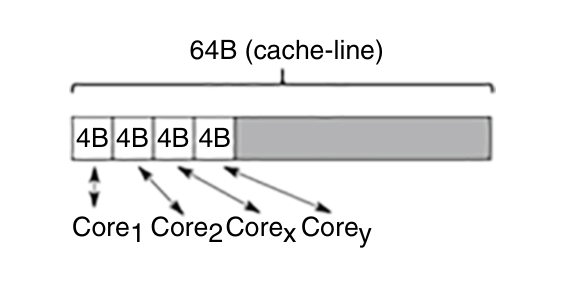<figcaption>Рисунок 2-13a. Версия №1 с смещением 1 байт и без зазора – каждый поток изменяет одну и ту же строку кэша</figcaption>
</figure>

Очевидное решение этой проблемы заключается в том, чтобы распределить элементы, к которым обращается каждый поток, по разным строкам кэша. Самый простой способ - создать гораздо больший массив и использовать только каждый 16-й элемент (16 раз по 4 байта одного Int32 составляют 64 байта). Это показано в примере со смещением 16 и зазором 0 (см. [Рисунок 2-13b](<#f-2-13b>)). Как видно из [Таблицы 2-3](<#t-2-3>), производительность значительно лучше, но все еще может быть улучшена.

<figure markdown="span" class="custom-figure">
  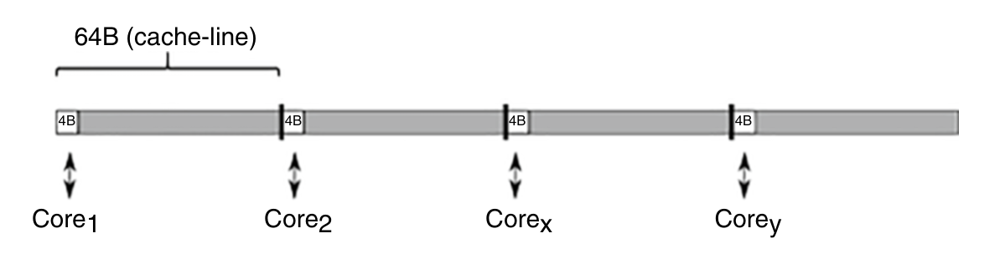<figcaption>Рисунок 2-13b. Версия №2 с смещением 16 байт и без зазора – каждый поток обращается и изменяет свою собственную строку кэша</figcaption>
</figure>

На первый взгляд это не очевидно, но все еще существует одна строка кэша, которая постоянно аннулируется, что приводит к проблеме, известной как ложное совместное использование – неудачный шаблон доступа к данным, при котором общие данные, которые теоретически не изменяются, находятся в пределах строки кэша, изменяемой другим потоком, вызывая ее постоянное аннулирование. Как вы узнаете в следующей главе, каждый тип в .NET имеет некоторый дополнительный заголовок, прикрепленный к его началу. В случае массивов длина хранится в начале объекта. Более того, при доступе к элементам массива с помощью оператора индекса сгенерированный код проверяет, не выходит ли он за пределы массива. Это означает чтение начала объекта массива для проверки длины массива каждый раз при доступе к любому элементу массива. Поэтому первое ядро делит начало объекта с другими ядрами, постоянно аннулируя соответствующие строки кэша. Чтобы исправить это, необходимо сместить элементы на одну строку кэша. Это версия, когда смещение все еще равно 16, но зазор также равен 16 (см. [Рисунок 2-13c](<#f-2-12c>)).

<figure markdown="span" class="custom-figure">
  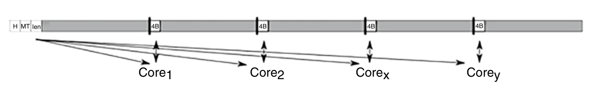<figcaption>Рисунок 2-13c. Версия №3 с смещением 16 байт и зазором 16 байт – каждый поток изменяет свою собственную строку кэша и читает общую строку кэша с заголовком массива</figcaption>
</figure>

В этом случае каждое ядро имеет свою собственную локальную копию первой строки кэша только для чтения. И оно изменяет свои собственные строки кэша с данными. Никакой дополнительной нагрузки на протокол согласованности кэша не добавляется. Из [Таблицы 2-3](<#t-2-3>) видно, что такой код работает даже в семь раз быстрее, чем с ложным совместным использованием!

  

__Примечание

Другие архитектуры иногда отказываются от последовательной согласованности, присутствующей в x86, что упрощает их дизайн, но усложняет программирование (требуются явные барьеры памяти). Примером такой архитектуры является PowerPC 2006 года на компьютерах Apple.

До сих пор вы потратили много времени на понимание кэширования данных. Однако несколько страниц назад упоминалось, что существует также кэш для программных инструкций (L1i). Мы не рассматривали его по нескольким причинам. Во-первых, компиляторы хорошо справляются с правильной подготовкой кода, а процессоры также хорошо угадывают шаблоны доступа к коду. В результате этот кэш работает хорошо – компилятор и природа выполнения программы обеспечивают хорошую временную и пространственную локальность, которую может использовать процессор. Более того, управление кэшем инструкций не относится к области управления памятью в .NET, которая сосредоточена на управлении данными. Единственное очевидное улучшение – это генерировать как можно меньший код. Однако сегодня трудно применить этот совет на практике – все делается за счет оптимизаций компилятора, а размер кода скорее определяется бизнес-потребностями.

  

__Примечание

Тем не менее, даже в .NET мы можем проектировать вызовы методов с учетом промахов кэша L1i. Это в основном включает избегание большого количества виртуальных вызовов и предпочтение повторяющихся вызовов одного и того же метода для большого набора данных. Мы увидим такой пример в Главе 10.