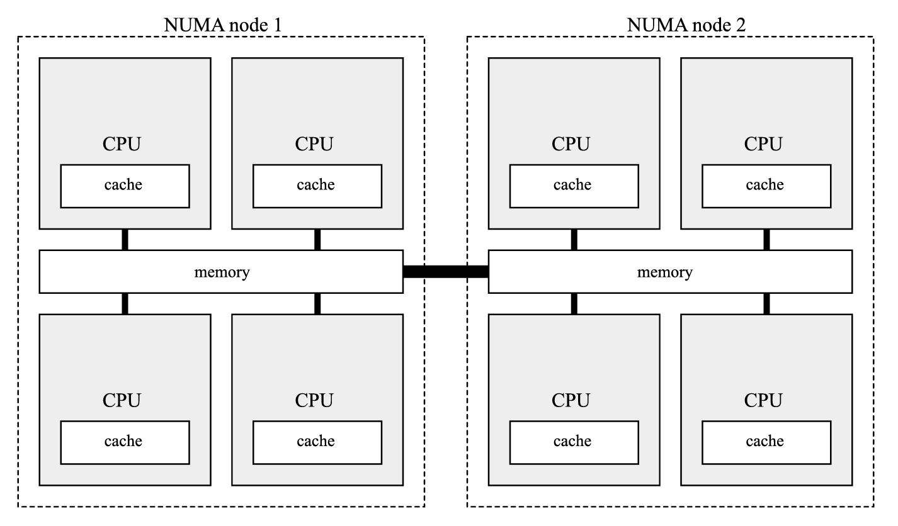

# NUMA и группы ЦПУ

Есть еще один важный элемент головоломки, который нужно добавить к большой головоломке управления памятью. Симметричная многопроцессорность (SMP) означает, что компьютер имеет несколько идентичных ЦП, которые подключены к общей основной памяти. Они управляются одной операционной системой, которая может или не может обрабатывать все процессоры одинаково. Как вы знаете, у каждого ЦП есть свой собственный набор кэшей L1 и L2. Другими словами, у каждого ЦП есть некоторая выделенная локальная память, которая доступна намного быстрее, чем другие области памяти. Потоки и программы, работающие на разных ЦП, вероятно, будут совместно использовать некоторые данные, что не идеально, поскольку совместное использование данных через соединения ЦП вызывает значительные задержки. Вот где в игру вступает неоднородная архитектура памяти (NUMA). Это означает, что области памяти имеют разные характеристики производительности в зависимости от ЦП, который к ним обращается. И программное обеспечение (в основном операционная система, но опционально и сама программа) должно поддерживать NUMA, чтобы предпочесть использование этих локальных областей памяти более удаленным. Такая конфигурация проиллюстрирована на [рисунке 2-21](<#f-2-21>).

<a id="f-2-21"></a>
<figure markdown="span" class="custom-figure">
  <figcaption>Рисунок 2-21. Пример конфигурации NUMA с восемью процессорами, сгруппированными в два узла NUMA</figcaption>
</figure>

Такие дополнительные накладные расходы на доступ к нелокальной памяти называются фактором NUMA. Поскольку прямое соединение всех ЦП было бы очень дорогим, каждый ЦП обычно имеет соединения только с двумя или тремя другими ЦП. Для доступа к удаленной памяти необходимо сделать несколько переходов между процессорами, что увеличивает задержку. Чем больше ЦП, тем более важен фактор NUMA, если используется нелокальная память. Существуют также системы со смешанным подходом, где группы процессоров имеют некоторую общую память, и память неравномерна между этими группами с большим фактором NUMA между ними. Это фактически наиболее распространенный подход в системе с поддержкой NUMA. ЦП группируются в более мелкие системы, называемые узлами NUMA. Каждый узел NUMA имеет свои собственные процессоры и память с небольшим фактором NUMA из-за аппаратной организации. Узлы NUMA, конечно, взаимосвязаны, но передача данных между ними подразумевает большие накладные расходы.

Основное требование для осведомленности системы и программного кода о NUMA — это использование локальной DRAM того узла NUMA, на котором выполняется процесс. Однако это может привести к несбалансированному состоянию, если некоторые процессы потребляют намного больше памяти, чем другие. Это заставляет задаться вопросом: осведомлена ли .NET о NUMA? Простой ответ: да, она осведомлена! Память выделяется диспетчером памяти .NET (GC) на соответствующем узле NUMA, поэтому память будет находиться "близко" к потокам, выполняющим управляемый код. При балансировке кучи GC приоритет отдается распределению памяти в кучах, расположенных на том же узле NUMA. Теоретически осведомленность о NUMA можно отключить с помощью параметра GCNumaAware в секции конфигурации среды выполнения, хотя трудно представить причину, по которой кто-то захотел бы это сделать.

Однако существуют два других важных параметра приложения, показанных в [Листинге 2-7](<#l-2-7>), которые связаны с так называемыми группами процессоров. На системах Windows с более чем 64 логическими процессорами они объединяются в упомянутые группы CPU. По умолчанию процессы ограничены одной группой CPU, что означает, что они не будут использовать все процессоры, доступные в системе.

Вы можете включить осведомленность о группах CPU в средах выполнения .NET на базе Windows (см. [Листинг 2-7](<#l-2-7>)), что является важным в средах с более чем 64 логическими процессорами, если вы хотите, чтобы ваш процесс использовал все ресурсы машины.

<a id="l-2-7"></a>  
<figure class="custom-code-wrapper"
        markdown="1">

``` xml title="listing-2-7.csproj" linenums="1"
<configuration>
  <runtime>
    <GCCpuGroup enabled="true"/>
    <gcServer enabled="true"/>
  </runtime>
</configuration>
```      

  <figcaption>Листинг 2-7. Настройка осведомленности о группе процессоров в среде выполнения .NET</figcaption>
</figure>

Параметр `GCCpuGroup` определяет, должен ли сборщик мусора (Garbage Collector) поддерживать группы CPU путем создания внутренних потоков сборки мусора во всех доступных группах и учитывать все доступные ядра при создании и управлении кучами. Этот параметр следует включать одновременно с параметром `gcServer`.