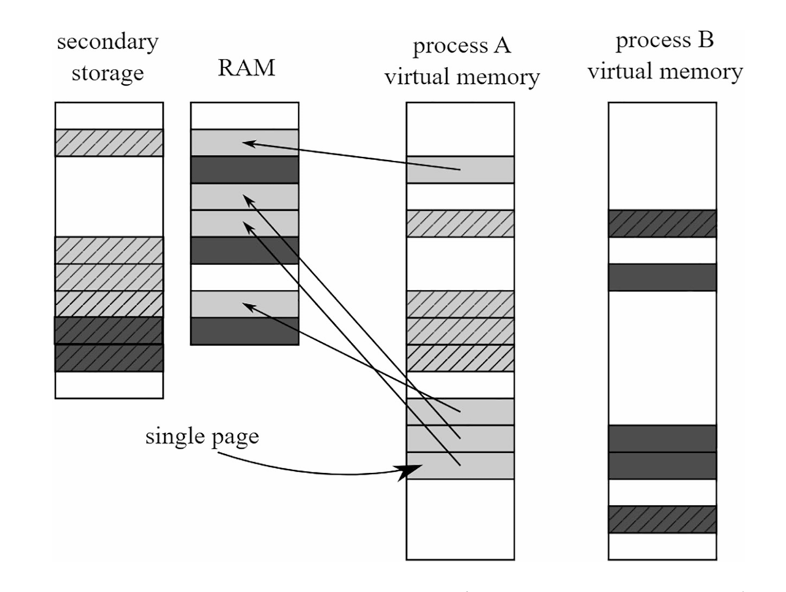
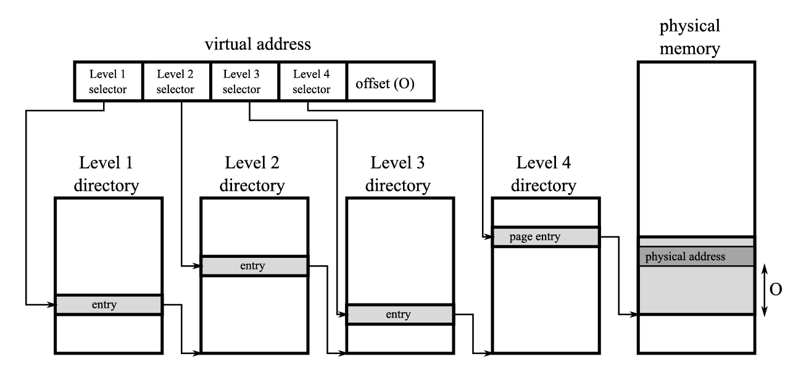
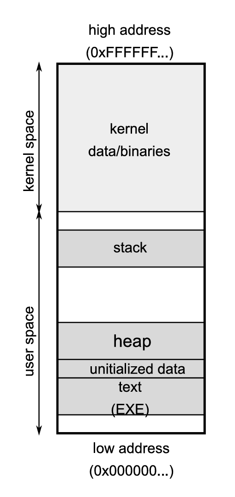
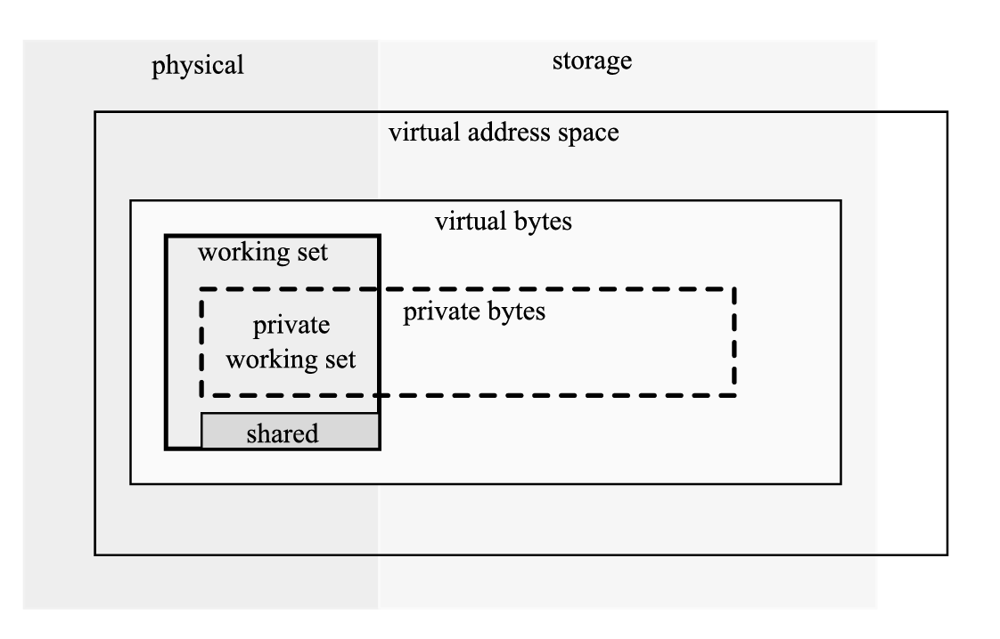
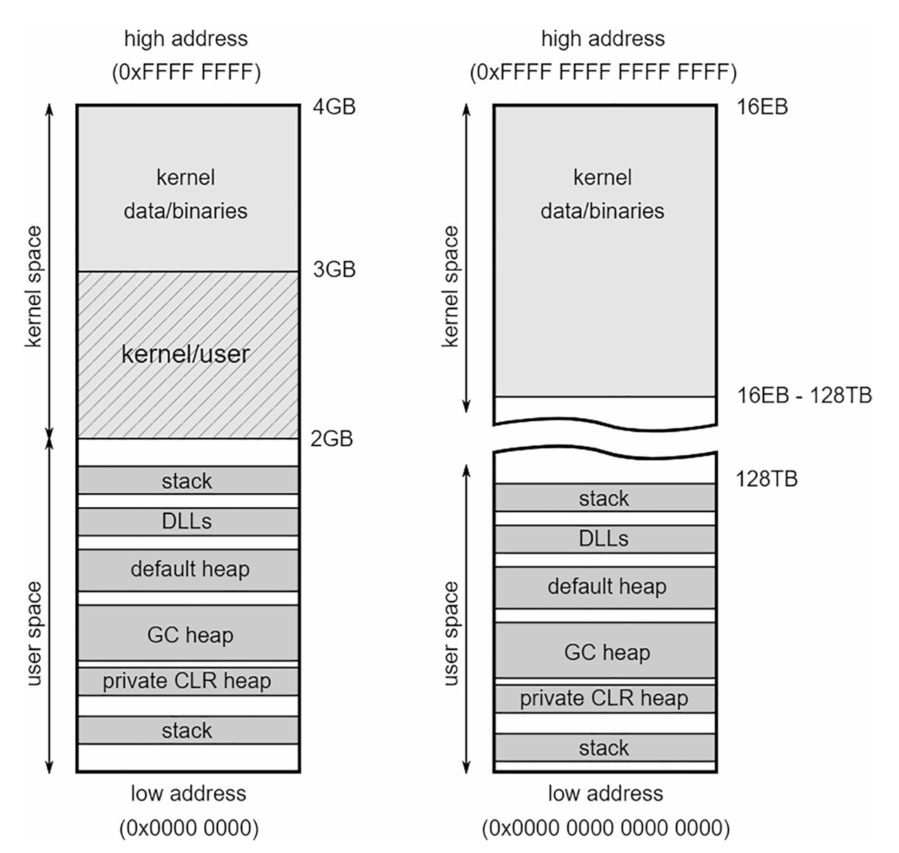
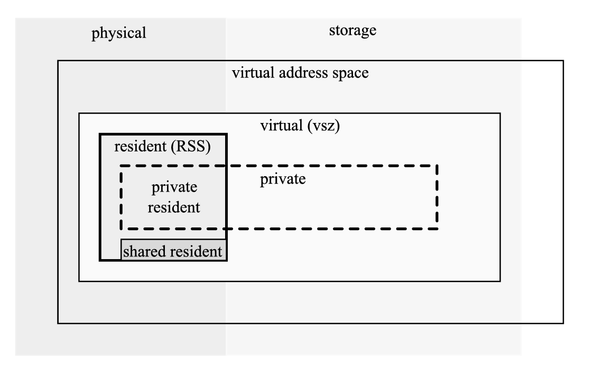
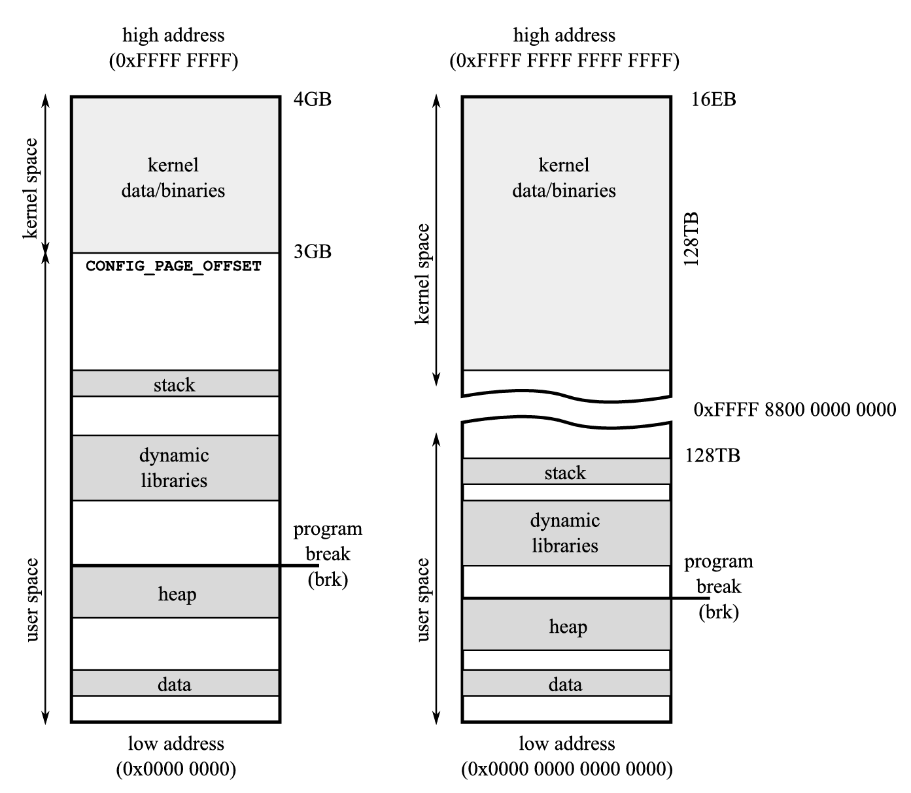

# Операционная система

Вы уже довольно много времени провели, изучая аппаратное обеспечение. Изначально мы обещали рассмотреть операционную систему. Сейчас пришло время обсудить, как разработчики операционной системы серьезно учли все эти аппаратные ограничения.

Из-за архитектуры операционной системы и аппаратного обеспечения, физические ограничения памяти варьируются от 2 ГБ до 24 ТБ. И типичное потребительское оборудование в настоящее время оснащено десятками гигабайт памяти. Если бы данная программа должна была использовать физическую память напрямую, ей пришлось бы управлять всеми создаваемыми и удаляемыми областями памяти. Такая логика управления памятью была бы не только сложной, но и повторялась бы в каждой программе. Более того, с точки зрения низкоуровневого программирования, использование памяти таким образом было бы неудобным. Каждая программа должна была бы помнить, какие области памяти она использует, чтобы программы не мешали друг другу. Аллокаторы должны были бы сотрудничать для правильного управления созданными и удаленными объектами. Это также довольно опасно с точки зрения безопасности – без какого-либо промежуточного слоя программа могла бы получить доступ не только к своим собственным областям памяти, но и ко всем данным других процессов.

* * *

## Виртуальная память

Таким образом, была введена очень удобная абстракция – виртуальная память. Она перемещает логику управления памятью в операционную систему, которая предоставляет так называемое виртуальное адресное пространство любой программе. В частности, это означает, что каждый процесс думает, что он единственный, работающий в системе, и что вся память доступна для его собственных нужд. Еще лучше, поскольку адресное пространство виртуально, оно может быть больше, чем физическая память. Кроме того, физическая оперативная память DRAM может быть расширена с помощью вторичного хранилища, такого как жесткие диски, используемые для файла подкачки – об этом позже.

  

__Примечание

Существуют ли операционные системы без виртуальной памяти? Для любого массового использования – нет. Но да, существуют очень маленькие операционные системы и фреймворки, предназначенные для встроенных систем, такие как ядро μClinux.

Менеджер памяти операционной системы выполняет две основные задачи:

  * Отображение виртуального адресного пространства в физическую память: Виртуальные адреса имеют длину 32 бита на 32-битных машинах и 64 бита на 64-битных машинах (хотя в настоящее время используется только нижние 48 бит, что все еще позволяет адресное пространство размером 128 ТБ).

  * Перемещение некоторых областей памяти из оперативной памяти на жесткие диски: Поскольку общий объем используемой памяти может быть больше физической памяти, должен существовать механизм для перемещения данных из оперативной памяти для временного хранения на более медленных носителях, таких как HDD или SSD. Эти данные хранятся в файле подкачки или swap-файле.

Перемещение данных из оперативной памяти для временного хранения на более медленные носители, очевидно связано с значительным снижением производительности. Этот процесс в разных системах называется свопингом или пейджингом, в основном по историческим причинам. В Windows есть специальный файл, называемый файлом подкачки, который хранит данные, поступающие из памяти, отсюда и термин пейджинг. В Linux такие данные хранятся на выделенном разделе, называемом разделом подкачки, отсюда и термин свопинг в Unix-подобных системах.

Виртуальная память реализуется в ЦПУ (с помощью блока управления памятью – MMU) при сотрудничестве с ОС. Было бы слишком дорого отображать виртуальное пространство в физическое побайтно, поэтому это делается непрерывными блоками памяти, называемыми страницами. Схематическая иллюстрация виртуальной памяти и физической памяти показана на [Рисунке 2-14](<#f-2-14>).

<figure markdown="span" class="custom-figure">
  <figcaption>Рисунок 2-14. Отображение виртуальных страниц в физические. Каждый процесс (A - светло-серый и B - темно-серый) видит свое собственное виртуальное адресное пространство, но физически их страницы хранятся как в ОЗУ (сплошные страницы), так и на диске (штрихованные страницы)</figcaption>
</figure>

Существует также понятие каталога страниц, поддерживаемого ОС для каждого процесса, который позволяет отображать виртуальный адрес в физический. Проще говоря, записи каталога страниц указывают на физические начальные адреса страниц и другие метаданные, такие как привилегии.

В современных операционных системах часто используется подход с многоуровневыми каталогами. Это позволяет компактно хранить разреженные данные каталога страниц, сохраняя при этом небольшой размер страницы. В настоящее время на большинстве архитектур типичный размер страницы составляет 4 КБ (включая x86, x64 и ARM) и используется четырехуровневый каталог страниц (см. [Рисунок 2-15](<#f-2-15>)).

<figure markdown="span" class="custom-figure">
  <figcaption>Рисунок 2-15. Четырехуровневый каталог страниц с размером страницы 4 кБ – три уровня селектора страниц позволяют представлять гораздо более разреженные данные</figcaption>
</figure>

Когда виртуальный адрес переводится в физический адрес, требуется обход каталога страниц:

  * Селектор уровня 1 выбирает запись в каталоге уровня 1, которая указывает на одну из записей каталога уровня 2.

  * Селектор уровня 2 выбирает запись в конкретной записи каталога уровня 2, которая указывает на одну из записей каталога уровня 3.

  * Селектор уровня 3 выбирает запись в конкретной записи каталога уровня 3, которая указывает на одну из записей каталога уровня 4.

  * В конечном итоге селектор уровня 4 выбирает запись в конкретной записи каталога уровня 4, которая указывает непосредственно на страницу в физической памяти.

  * Смещение указывает на конкретный адрес в выбранной странице.

Такой перевод требует обхода дерева каталога страниц, который хранится в физической памяти. Это означает, что он также может быть кэширован в кэшах L1/L2/L3. Но все равно это приведет к огромным накладным расходам, если каждое преобразование адреса (операция, выполняемая очень часто) потребует доступа к этим данным. Таким образом, были введены буферы трансляции Look-Aside (TLB), которые кэшируют сам перевод. Идея проста — TLB работает как карта, где селектор является ключом, а начало физического адреса страницы — значением. TLB созданы так, чтобы быть чрезвычайно быстрыми, поэтому они малы с точки зрения хранения. Они также являются многоуровневыми, чтобы имитировать структуру каталога страниц. Результатом промаха TLB (не кэшированного виртуального в физическое преобразование) является выполнение полного обхода каталога страницы, что является дорогостоящим.

  

__Примечание

Как и в случае со всеми кэшами, предварительная выборка TLB сложна — если сам процессор должен быть тем, кто запускает предварительную выборку (например, из-за предсказания ветвления), он может вызвать ненужное обход каталога страниц (поскольку предсказание ветвления может быть неверным). Чтобы предотвратить это, предварительное получение TLB контролируется программным обеспечением. Кроме того, имейте в виду, что предварительная загрузка ограничена оборудованием по количеству страниц. В противном случае это приведет к промаху страницы, что будет большим ненужным накладным расходом, если догадка окажется неверной. Существуют ли какие-либо релевантные оптимизации TLB, о которых следует помнить в вашем коде? Цель в основном состоит в том, чтобы уменьшить количество страниц, чтобы каталог страниц оставался маленьким, что, в свою очередь, уменьшило бы количество промахов TLB. С точки зрения .NET приложения, большие страницы, описанные в следующем разделе, являются единственным способом влияния на управление страницами.

Как правило, L1 работает с виртуальными адресами, потому что стоимость их трансляции в физические адреса будет намного выше, чем сам доступ к кэшу. Это означает, что при изменении страницы все или некоторые строки кэша должны быть аннулированы. Поэтому большое количество изменений страниц негативно влияет на производительность кэша.

* * *

## Большие страницы

Как было показано ранее, перевод виртуальных адресов может быть дорогостоящим, и было бы здорово избегать его как можно чаще. Одним из подходов может быть использование большего размера страницы. Это потребовало бы меньшего количества переводов адресов, потому что многие адреса поместились бы на одной странице, а перевод уже был бы кэширован в TLB. Но большие страницы могут привести к пустой трате оперативной памяти или дискового пространства, используемого файлом подкачки. Решение одно – так называемые большие (или огромные) страницы. Благодаря аппаратной поддержке они позволяют создавать большой, непрерывный блок физической памяти, состоящий из множества последовательно уложенных обычных страниц. Эти страницы обычно на два-три порядка больше, чем обычная страница. Они могут быть полезны в сценариях, когда программе требуется произвольный доступ к гигабайтам данных. Ядра баз данных являются примерами потребителей больших страниц. Операционная система Windows также сопоставляет образы и данные ядра с большими страницами. Большая страница не является выгружаемой (не может быть перемещена в файл подкачки) и поддерживается как в Windows, так и в Linux. К сожалению, заполнить большую страницу довольно сложно: это приводит к фрагментации. Кроме того, может отсутствовать доступный непрерывный диапазон физической памяти.

Начиная с .NET Core 3.0, большие страницы можно включить в .NET с помощью параметра COMPlus_GCLargePages/DOTNET_ GCLargePages. Более подробно об этом будет рассказано в главе 11.

* * *

## Фрагментация виртуальной памяти

Как всегда, когда дело доходит до выделения и освобождения памяти, фрагментация может проявиться, как было упомянуто в главе 1 при обсуждении концепции кучи. В случае виртуальной памяти это означает, что операционная система не сможет зарезервировать непрерывный блок памяти заданного размера в адресном пространстве процесса. Между уже зарезервированной памятью нет достаточно большого промежутка, хотя суммарный размер всех свободных промежутков может значительно превышать требуемый размер.

Эта проблема может быть серьезной для 32-разрядных приложений, где виртуальное пространство может быть слишком маленьким для современных потребностей. Фрагментация может быть особенно острой, когда процесс выделяет большие сегменты памяти и работает довольно долго: именно с такой ситуацией приходится иметь дело в веб-приложениях .NET в 32-разрядной версии (размещенной в IIS). Чтобы предотвратить фрагментацию, процесс должен правильно управлять памятью (а для процесса .NET это означает саму среду CLR). Мы углубимся в эти детали при описании алгоритмов сборки мусора в главах 7–10, так как это требует более глубокого понимания самой .NET.

* * *

## Общая компоновка памяти

Зная базовый блок сборщика памяти, теперь можно перейти к обсуждению памяти на более высоком уровне. Что такое структура памяти программы? При описании типичной структуры памяти программы часто используется рисунок, как показано на [рисунке 2-16](<#f-2-16>). Он показывает типичное адресное пространство программы.

<figure markdown="span" class="custom-figure">
  <figcaption>Рисунок 2-16. Виртуальное адресное пространство типичного процесса</figcaption>
</figure>

Как видно, виртуальное адресное пространство разделено на две области:

  * Пространство ядра: Верхний диапазон адресов занимает сама операционная система. Оно известно как пространство ядра, потому что именно здесь сопоставляются драйвер устройства и структуры данных ядра. Обратите внимание, что только код ядра может получить доступ к этой части адресного пространства.

  * Пространство пользователя: Для кода приложения доступна нижняя часть адресного пространства (за исключением самой нижней, используемой для определения нулевых указателей).

С вашей точки зрения, конечно, интересно только пространство пользователя: именно здесь CLR хранит ваши данные. Благодаря механизму виртуальной памяти каждый процесс имеет доступ ко всему адресному пространству – как если бы он был единственным процессом в системе.

Вот области памяти, видимые на [рисунке 2-17](<#f-2-17>):

  * Для каждого потока создается стек.

  * Операционная система предоставляет различные API для среды выполнения для создания куч (подробнее об этом позже).

  * При запуске приложения операционная система сопоставляет соответствующий двоичный файл с диска в адресное пространство. Некоторые данные, доступные только для чтения, могут совместно использоваться процессами, например, исполняемый ассемблерный код.

  * Такой рисунок полезен для высокоуровневого представления общей схемы адресного пространства. Но реальность сложнее. Давайте углубимся в контекст двух основных операционных систем, поддерживаемых средой выполнения .NET: Windows и Linux.

* * *

## Управление памятью в Windows

Виртуальное адресное пространство зависит от версии системы. Краткое изложение этих ограничений приведено в [таблице 2-4](<#t-2-4>).

<figure class="custom-table-wrapper"
        markdown="1" 
        style=" --col-min-width: 100px;
                --col1-width: 80px; --col1-min-width: 80px; --col1-text-align: center;
                --col2-width: auto; --col2-min-width: 130px;
                --col3-width: auto; --col3-min-width: 157px;
                --col4-width: auto; --col4-min-width: 183px;">
  <figcaption>Таблица 2-4. Ограничения на размер виртуального адресного пространства в Windows (пользователь/ядро)</figcaption>

Тип процесса | Windows (32-Bit) | Windows 8/Server 2012 | Windows 8.1+/Server 2012+  
---|---|---|---  
32-bit | 2/2 GB | 2/2 GB | 2/2 GB  
32-bit (*) | 3/1 GB | 4 GB/8 TB | 4 GB/128 TB  
64-bit | - | 8/8 TB | 128/128 TB  

</figure>

* Большой флаг учета адресов (также известный как переключатель /3GB)

__Примечание

Существует механизм, называемый Address Windowing Extensions (AWE), который позволяет получить доступ к большему количеству физической памяти, чем указано здесь, а затем отобразить только ее части в виртуальное адресное пространство через «окно AWE». Это может быть особенно полезно в 32-разрядной среде для преодоления ограничения в 2 или 3 ГБ на процесс. Однако в данном случае это не имеет значения, поскольку среда CLR не использует эту функцию.

Ограничения размера виртуальной памяти одного процесса стали болезненными в конце господства 32-разрядных систем. Ограничение до 2 ГБ (или до 3 ГБ в расширенном режиме) может быть проблематичным в крупных корпоративных приложениях. Классическим примером является веб-приложение ASP.NET, размещенное в IIS на 32-разрядных компьютерах Windows Server. Если этот предел должен был быть достигнут, не оставалось другого выбора, кроме как перезапустить все веб-приложение. Это вынудило горизонтальное масштабирование в больших веб-системах, создав несколько экземпляров серверов, которые обрабатывают меньше трафика и, следовательно, потребляют меньше памяти. В настоящее время в мире доминируют 64-битные системы, и ограниченное виртуальное адресное пространство больше не является проблемой. Но однако, обратите внимание, что 32-разрядная скомпилированная программа имеет ограничение виртуального адресного пространства в 4 ГБ даже на 64-разрядных серверах Windows.

Менеджер памяти Windows предоставляет два основных API:

  * Виртуальная память: Это низкоуровневый API, который работает с самим адресным пространством для резервирования и фиксации страниц. Функции VirtualAlloc и VirtualFree — это функции, используемые средой CLR.

  * Куча: Высокоуровневый API, предоставляющий Allocator (вспомните его из главы 1), используемый средой выполнения C и C++ для реализации функций malloc/free и new/delete. Этот слой включает, среди прочего, функции HeapAlloc и HeapFree.

Поскольку CLR имеет собственную реализацию Allocator для создания объектов .NET (которую вы подробно увидите в главе 6), используются только виртуальные API. В двух словах, среда CLR запрашивает у операционной системы дополнительные страницы, и соответствующее размещение объектов на этих страницах обрабатывается самостоятельно. CLR создает свои собственные внутренние структуры данных в машинном коде с помощью оператора C++ new (который сам построен на основе API Heap).

В Windows API виртуальной памяти работает в два этапа. Во-первых, вы резервируете непрерывный диапазон памяти в адресном пространстве, вызывая VirtualAlloc с MEM_RESERVE и PAGE_READWRITE (поскольку вы хотите иметь возможность хранить и считывать данные оттуда) в качестве параметров. Диспетчер памяти Windows возвращает адрес, с которого начинается зарезервированный диапазон памяти в адресном пространстве. Будьте внимательны: вы пока не можете получить доступ к этой памяти! Во-вторых, когда вам нужно прочитать или записать в эту память, вы должны зафиксировать нужные страницы из этого зарезервированного диапазона. Вам не нужно фиксировать весь диапазон, только нужные страницы. Именно этим и занимается среда CLR: резервирует большие диапазоны в адресном пространстве один раз, а затем фиксирует страницы, когда требуется место для выделения дополнительных объектов. При первом обращении к зафиксированной странице диспетчер памяти гарантирует, что она инициализирована нулевыми строками.

Когда объекты собраны и обнаружено достаточное количество свободного места, соответствующие страницы удаляются путем вызова VirtualFree с MEM_DECOMMIT в качестве параметра, чтобы вернуть память менеджеру памяти Windows. Точные детали объясняются в главе 10.

Следующий вопрос, который вы, возможно, захотите задать, — как измерить потребление «памяти» вашими приложениями. Исходя из того, что уже было объяснено, память, в которой хранятся ваши объекты, называется частной выделенной памятью вашего процесса. Общая выделенная память подсчитывает данные только для чтения, такие как ассемблерный код, хранящийся в исполняемых файлах, и не представляет интереса в данном контексте.

Более того, приватные страницы также могут быть заблокированы, что заставляет их оставаться в физической памяти (не будут перемещены в файл подкачки) до явной разблокировки или завершения работы приложения. Блокировка может быть полезна для критически важного для производительности пути в программе. Мы рассмотрим пример использования блокировки страниц в пользовательском узле CLR, показанный в главе 15.

Резервированные и выделенные страницы управляются процессом с помощью вышеупомянутых вызовов методов >VirtualAlloc/VirtualFree и >VirtualLock/VirtualUnlock . Также стоит отметить, что попытка получить доступ к свободной или зарезервированной памяти приведет к исключению "нарушение доступа" (Access Violation Exception), поскольку эта память еще не может быть отображена в физическую память.

  

__Примечание

Почему кто-то изобрел такой двусторонний процесс получения памяти? Как упоминалось ранее, шаблон последовательного доступа к памяти хорош по многим причинам. Пространство, состоящее из непрерывной последовательности страниц, предотвращает фрагментацию и, таким образом, оптимизирует использование TLB и позволяет избежать обхода каталогов страниц. Непрерывная память, конечно, также выгодна для использования кэша. Поэтому хорошо заранее зарезервировать немного большего пространства, даже если оно нам сейчас не нужно. Обычно именно так стеки потоков реализуются операционной системой: весь стек резервируется в адресном пространстве, и страницы фиксируются одна за другой при выполнении более глубоких вызовов методов, требуя больше места для параметров и локальных переменных.

На [рисунке 2-17](<#f-2-17>) графически изображены отношения между различными «наборами памяти» в виде перекрывающихся наборов:

  * Working set \- Рабочий набор: Это часть виртуального адресного пространства, которая в настоящее время находится в физической памяти. В свою очередь его можно разделить на

  * Private working set \- Приватный рабочий набор: Состоит из зафиксированных (приватных) страниц в физической памяти

  * Shared working set \- Общий рабочий набор: Состоит из страниц, которые являются общими для других процессов

  * Private bytes \- Приватные байты: Все зафиксированные (приватные) страницы – как в физической, так и в выгружаемой памяти

  * Virtual bytes \- Виртуальные байты: зарезервированная память в адресном пространстве (как зафиксированная, так и незафиксированная)

  * Paged bytes \- Выгружаемые байты: Часть виртуальных байтов, хранящихся в файле подкачки

<
<figure markdown="span" class="custom-figure">
  <figcaption>Рисунок 2-17. Связь между различными наборами памяти в рамках процесса в Windows</figcaption>
</figure>

Довольно сложно, не правда ли? Возможно, теперь вы должны осознать, что ответ на вопрос «сколько памяти на самом деле занимает наш процесс .NET» не так уж и очевиден. На какой из этих показателей стоит обратить внимание? Ошибочно считается, что самым важным показателем является приватный рабочий набор, потому что он показывает, каково реальное влияние процесса на потребление важнейшей физической оперативной памяти. Однако, в случае утечки памяти, приватные байты будут расти, а может и не приватный рабочий набор. О том, как следить за этими показателями, вы узнаете в следующей главе. Вы также поймете, что де-факто отображается диспетчером задач в виде столбца памяти процесса.

Из-за своей внутренней структуры, когда Windows резервирует область памяти для адресного пространства процесса, она учитывает следующее ограничение: как начало области, так и ее размер должны быть кратны размеру системной страницы (обычно 4 КБ) и так называемой гранулярности выделения (обычно 64 КБ). На практике это означает, что начальный адрес и размер каждого зарезервированного региона кратны 64 КБ. Если вы хотите выделить меньше, остаток будет недоступен (непригоден для использования). Таким образом, правильное выравнивание и размер блоков имеют решающее значение для того, чтобы избежать пустой траты памяти.

Несмотря на то, что вы не управляете памятью на уровне виртуального API на ежедневной основе, эти знания могут помочь вам понять проблему выравнивания в коде CLR. Внимательный читатель может спросить, почему гранулярность выделения составляет 64 КБ, а размер страницы — 4 КБ. Рэймонд Чен (Raymond Chen), сотрудник Microsoft, ответил на этот вопрос в 2003 году. Почему гранулярность распределения адресного пространства составляет 64 КБ? - [devblogs.microsoft.com](https://devblogs.microsoft.com/oldnewthing/20031008-00/?p=42223). И как обычно в таких случаях, ответ очень интересный. Гранулярность распределения в основном обусловлена историческими причинами. Ядро всего семейства современных операционных систем восходит к корням раннего ядра Windows NT. Она поддерживала ряд платформ, включая архитектуру DEC Alpha. И именно из-за разнообразия поддерживаемых платформ и было введено такое ограничение. И поскольку было обнаружено, что он не представляет неудобств для других платформ, предпочтительнее было иметь общий базовый код ядра. Более подробные объяснения вы найдете в упомянутой статье.

* * *

## Структура памяти в Windows

Теперь давайте углубимся в процесс .NET, работающий в Windows. Процесс содержит одну кучу процесса по умолчанию (в основном используемую внутренними функциями Windows) и любое количество необязательных куч (созданных с помощью API кучи). Одним из примеров такой ситуации является куча, созданная средой выполнения Microsoft C и используемая операторами C/C++, как упоминалось ранее. Существует три основных типа кучи:

  * Normal (NT) heap \- Нормальная куча (NT): используется обычными приложениями (не универсальной платформой Windows — UWP). Это провайдер предоставляющий базовый функционал управления блоками памяти.

  * Low-fragmentation heap \- Куча с низкой фрагментацией: дополнительный уровень над обычной функциональностью кучи, который управляет выделениями в предопределенных блоках различных размеров. Это предотвращает фрагментацию небольших данных и дополнительно делает доступ к ним немного быстрее благодаря внутренней оптимизации ОС.

  * Segment heap \- Сегментная куча: используется приложениями универсальной платформы Windows, которые предоставляют более сложные распределители (включая распределитель с низким уровнем фрагментации, аналогичный упомянутому ранее).

Как упоминалось ранее, структура адресного пространства процесса разделена на две части, где верхние адреса заняты ядром, а нижние адреса — пользователем (программой). Это показано на [рисунке 2-18](<#f-2-18>) (32-битный слева, 64-битный справа). На 32-битных машинах, в зависимости от значения флага большого адреса, пользовательское пространство находится в нижних 2 или 3 ГБ. На современных 64-разрядных процессорах, поддерживающих 48-разрядную адресацию, как пользовательскому, так и ядерному пространству доступно 128 ТБ виртуальной памяти (8 ТБ в предыдущих версиях — Windows 8 и Server 2012).

В некотором приближении типичная структура пользовательского пространства программы .NET в Windows выглядит следующим образом:

  * Куча по умолчанию, упомянутая ранее.

  * Большинство образов (exe, dlls) находятся по высоким адресам.

  * Стеки потоков (о которых говорилось в предыдущей главе) располагаются где угодно. Каждый поток в процессе имеет собственную область стека потоков. Это относится к потокам CLR, которые просто оборачивают собственные системные потоки.

  * Кучи GC, управляемые средой CLR для хранения создаваемых вами объектов .NET (это обычные страницы в номенклатуре Windows, зарезервированные и зафиксированные Virtual API).

  * Различные частные кучи CLR для внутренних целей. Более подробно мы рассмотрим их в следующих главах.

  * Также, конечно, довольно много свободного виртуального адресного пространства, включая огромные блоки порядка гигабайт и терабайт (в зависимости от архитектуры) где-то посередине виртуального адресного пространства.

<
<figure markdown="span" class="custom-figure">
  <figcaption>Рисунок 2-18. Макет виртуального адресного пространства x86/ARM (32-разрядная версия) и x64 (64-разрядная версия) процесса в Windows, выполняющего управляемый код .NET</figcaption>
</figure>

Начальный размер стека потока в Windows (как зарезервированный, так и изначально зафиксированный) берется из заголовка исполняемого файла (обычно называемого EXE-файлом). Для потоков, созданных вручную, размер стека также можно указать, вручную вызвав Windows CreateThread API.

То, как среда выполнения .NET вычисляет размер стека по умолчанию, довольно сложно. Значение по умолчанию составляет 1 МБ для типичной 32-битной компиляции и 4 МБ для типичной 64-битной компиляции. Данные стека довольно малы, а стек вызовов обычно довольно поверхностен (сотни вложенных вызовов встречаются довольно редко). Это делает 1 или 4 МБ хорошим значением по умолчанию.

Однако, если вы когда-либо сталкивались с StackOverflowException, вы просто столкнулись с этим барьером. Даже в этом случае это, скорее всего, связано с ошибкой программирования, например, бесконечной рекурсией. Если по какой-то причине вы пишете программу, которой необходимо хранить много данных в стеке, вы можете изменить заголовок двоичного файла. Исполняемые файлы .NET интерпретируются как обычные исполняемые файлы, поэтому это изменение будет отражено операционной системой. Мы увеличим этот предельный размер стека для этой цели в Главе 4.

  

__Примечание

По соображениям безопасности был введен механизм рандомизации адресного пространства (ASLR), который делает все макеты, показанные на [рисунке 2-18](<#f-2-18>), только иллюстративными. Это приводит к тому, что все компоненты (двоичные изображения) размещаются случайным образом по всему адресному пространству, чтобы не повторять какой-либо общий шаблон, который может быть использован злоумышленником.

Мы надеемся, что такой взгляд с высоты птичьего полета позволит вам лучше понять управление памятью CLR в контексте всей экосистемы Windows. Мы еще раз обратимся к этим знаниям при подробном описании структуры памяти CLR.

* * *

## Управление памятью в Linux

До недавнего времени любое упоминание Linux в книге о .NET ограничивалось проектом Mono. Но времена изменились. С появлением среды .NET Core (включая .NET 5+) больше невозможно пропустить системы, отличные от Windows. Более того, популярность запуска .NET на компьютерах, отличных от Windows, продолжает расти вместе с распространением Linux в мире контейнеров. Мы уделим много внимания реализации .NET Core и .NET 5+ во время выполнения. Поскольку Linux использует одну и ту же аппаратную технологию, включая pages, MMU и TLB, большая часть знаний уже рассмотрена в описаниях в предыдущих подразделах. Здесь мы остановимся только на интересных отличиях. Поскольку все больше и больше людей будут вынуждены развертывать приложения в этой среде, отличной от Windows .NET, очень полезно также понимать некоторые основы Linux.

Популярные и наиболее часто используемые дистрибутивы операционных систем Linux также используют концепцию виртуальной памяти. Их лимиты на процесс также очень похожи и обобщены в [таблице 2-5](<#t-2-5>).

  
<figure class="custom-table-wrapper"
        markdown="1" 
        style=" --col-min-width: 100px;
                --col1-width: 30px; --col1-min-width: 30px; --col1-text-align: center;
                --col2-width: auto;
                --col3-width: auto;
                --col4-width: auto;">
  <figcaption>Таблица 2-5. Ограничения на размер виртуального адресного пространства в Linux (пользователь/ядро)</figcaption>
  
№ | Process Type | Linux 32-Bit | Linux 64-Bit  
---|---|---|---  
1 | 32-bit process | 3/1, 2/2, 1/3 GB | -  
2 | 64-bit process | - | 128/128 TB*  

</figure>

*Каноническая 48-битная адресация

Как и в Windows, основным строительным блоком в Linux является страница, размер которой также обычно составляет 4 КБ. Страница может находиться в любом из трех различных состояний, перечисленных ниже:

  * Free \- Свободно: не назначено ни одному процессу или системе.

  * Allocated \- Выделено: Назначено процессу.

  * Shared \- Общий: зарезервирован для процесса, но может быть использован совместно с другими процессами. Обычно это относится к двоичным образам и сопоставленным в память файлам общесистемных библиотек и ресурсов.

Это делает более простым и понятным представление о потреблении памяти процессом, чем в случае операционной системы Windows. Как вы можете видеть, по сравнению с Windows, неявный этап резервирования страниц отсутствует, хотя он все еще существует явно. Linux имеет встроенный механизм ленивого выделения, который заботится об этом. Когда кто-то выделяет память в Linux, она рассматривается как выделенная, но никакие физические ресурсы не назначаются (следовательно, это похоже на резервирование в Windows). Фактическое назначение ресурсов (потребление физической памяти) не произойдет, пока оно фактически не понадобится путем доступа к этой конкретной области памяти. Если вы хотите заранее подготовить такие страницы в критических для производительности сценариях, вы можете «трогать» их, обращаясь к их памяти, например, считывая по крайней мере один байт.

Зная возможные статусы страниц, вы можете посмотреть, на какие категории делится память процесса в Linux. Вокруг этого довольно много путаницы. Многие инструменты на базе Linux говорят немного разные вещи по этому поводу. Использование памяти процесса можно измерить относительно следующих терминов:

  * Virtual (отмечен некоторыми инструментами как vsz): Общий размер виртуального адресного пространства, зарезервированного на данный момент процессом. В популярном инструменте «top» он отображается в столбце VIRT.

  * Resident (Resident Set Size, RSS): Пространство страниц, которые в данный момент находятся в физической памяти. Некоторые резидентные страницы могут совместно использоваться процессами (например, страницы с файловой поддержкой). Таким образом, это эквивалент «рабочего набора» на платформе Windows. В «top» это называется столбцом RES. Его можно дополнительно разделить на

    * Private resident pages: Это все анонимные резидентные страницы, зарезервированные для этого процесса (указанные счетчиком ядра MM_ANONPAGES). Это в некоторой степени соответствует «частному рабочему набору» в Windows.

    * Shared resident pages: Это как поддерживаемые файлами (указанные счетчиком ядра MM_FILEPAGES), так и анонимные резидентные страницы процесса, соответствующие «общему рабочему набору». В «top» это называется памятью SHR.

  * Private: Все частные страницы процесса. В инструменте «top» это столбец DATA. Обратите внимание, что это индикатор зарезервированной памяти и не говорит, какая ее часть уже была использована («тронута») и, таким образом, стала резидентной. Это соответствует «частным байтам» в Windows.

  * Swapped: Часть виртуальной памяти, которая была сохранена в файле подкачки.

На [рисунке 2-19](<#f-2-19>) графически отображена взаимосвязь между этими показателями в виде перекрывающихся наборов.

<figure markdown="span" class="custom-figure">
  <figcaption>Рисунок 2-19. Взаимосвязь между различными наборами памяти в процессе на Linux</figcaption>
</figure>

Довольно сложно. Как и в случае с Windows, ответ на вопрос, что потребляет память нашего процесса .NET, нетривиален. Самое разумное — посмотреть на измерение «частных резидентных страниц», поскольку оно показывает фактическое использование ценного ресурса ОЗУ процессом.

  

__Примечание

В то время как в Windows гранулярность выделения составляет 64 КБ, в Linux она ограничивается только размером страницы, который в большинстве случаев составляет 4 КБ.

* * *

## Структура памяти в Linux

Структура памяти процесса Linux очень похожа на ту, что была представлена ​​для Windows. Для 32-разрядной версии пространство пользователя составляет 3 ГБ, а пространство ядра — 1 ГБ. Эту точку разделения можно изменить с помощью параметра CONFIG_PAGE_OFFSET, настраиваемого во время сборки ядра. Для 64-разрядной версии разделение выполняется по аналогичному адресу, как в Windows (см. [рисунок 2-20](<#f-2-20>)).

<figure markdown="span" class="custom-figure">
  <figcaption>Рисунок 2-20. Структура виртуальной памяти x86/ARM (32-бит) и x64 (64-бит) процесса в Linux</figcaption>
</figure>

Подобно Windows, система предоставляет API для работы со страницами памяти. Она содержит:

  * mmap: Для непосредственного управления страницами (включая файловые карты, общие и обычные, а также анонимные отображения, которые не связаны ни с одним файлом, но используются для хранения данных программы).

  * brk/sbrk: Это ближайший эквивалент метода VirtualAlloc. Он позволяет вам устанавливать/увеличивать так называемый «программный перерыв», что на самом деле означает увеличение размера кучи.

Известные распределители C/C++ используют mmap или brk в зависимости от размера выделения. Этот порог можно настроить с помощью mallopt и параметра M_MMAP_THRESHOLD. Как вы увидите позже, CLR использует mmap с анонимными приватными страницами.

Есть одно существенное различие в обработке стека потоков между Linux и Windows. Поскольку нет двухэтапного резервирования памяти, стек просто расширяется по мере необходимости. Нет предварительного резервирования соответствующих страниц памяти. И поскольку следующие страницы создаются по мере необходимости, стек потоков не является непрерывной областью памяти.

* * *

## Влияние операционной системы

Есть ли какие-либо различия в управлении памятью, которые были учтены в кроссплатформенной версии Garbage Collector, включенной в CLR? В целом, код GC очень платформенно-независим, но по понятным причинам в какой-то момент должны быть сделаны системные вызовы. Менеджер памяти в обеих операционных системах работает схожим образом — он основан на виртуальной памяти, подкачке и схожем способе выделения памяти. Хотя, конечно, вызываемые системные API различны, концептуально никаких особых различий в коде нет, за исключением двух ситуаций, которые мы хотели бы сейчас описать.

Первое отличие уже упоминалось. В Linux нет двухэтапного способа резервирования и последующего выделения памяти. В Windows вы можете использовать системный вызов, чтобы сначала зарезервировать большой блок памяти. Это будет создание соответствующих системных структур без фактического использования физической памяти. Только при необходимости выполняется второй этап выделения диапазона памяти. Поскольку в Linux нет этого механизма, память может быть выделена только без «резервирования». Однако для имитации двухэтапного способа резервирования/выделения потребовался системный API. Для этой цели использовался популярный трюк. В Linux «резервирование» осуществляется путем выделения памяти с режимом доступа PROT_NONE, что фактически означает, что доступ к этой памяти запрещен. Однако в такой зарезервированной области вы можете затем снова выделить определенные под регионы с обычными правами, таким образом имитируя «выделение» памяти.

Второе отличие — так называемый механизм наблюдения за записью в память. Как вы увидите в последующих главах, сборщику мусора необходимо отслеживать, какие области памяти (страницы) были изменены. Для этой цели Windows предоставляет удобный API. При выделении страницы можно установить флаг MEM_WRITE_WATCH. Затем, используя API GetWriteWatch, можно получить список измененных страниц. При реализации .NET Core стало очевидно, что в Linux нет системного вызова для построения такого механизма наблюдения. По этой причине эту логику пришлось перенести на барьер записи (механизм, подробно описанный в главе 5), который поддерживается средой выполнения без какой-либо поддержки операционной системы.
