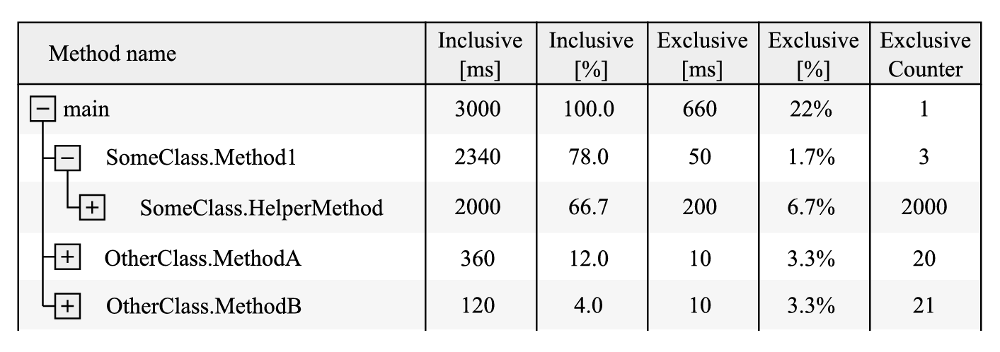
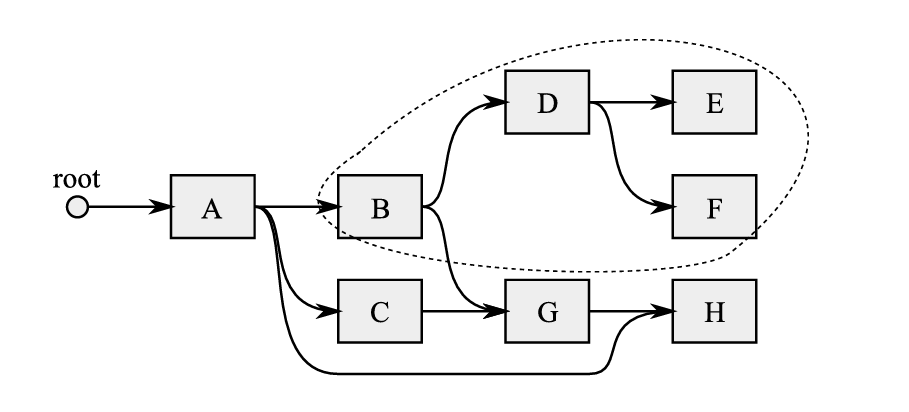
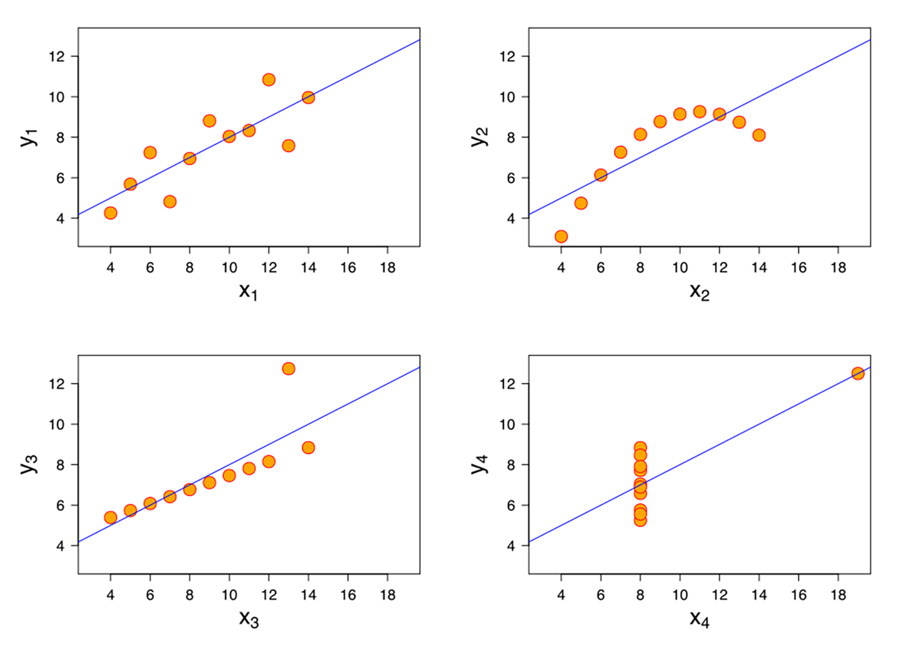
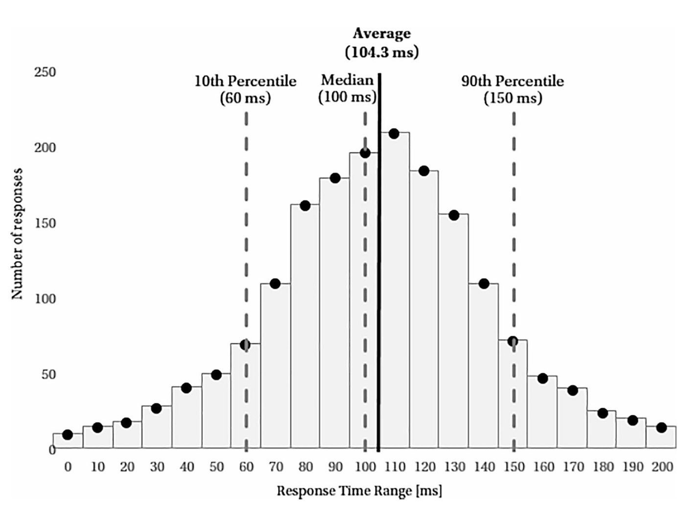
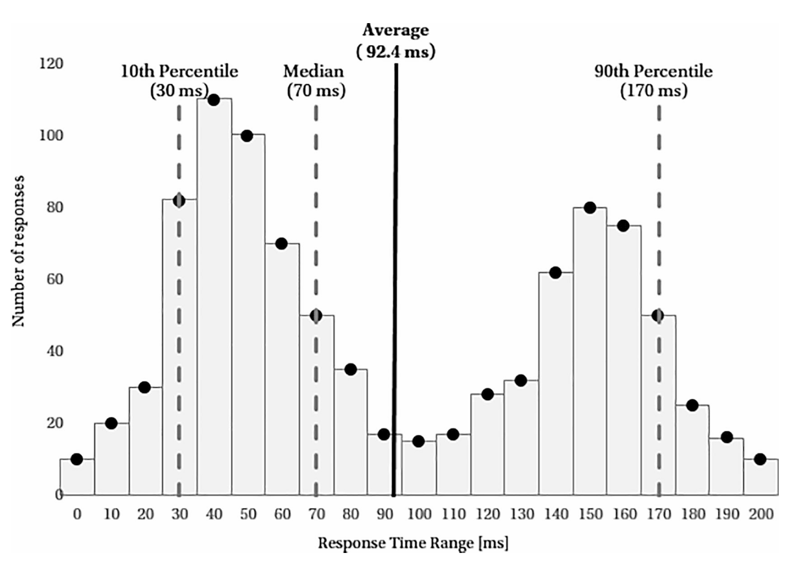
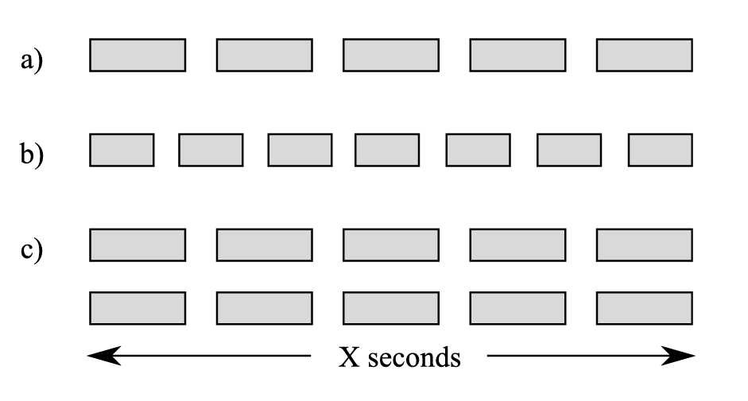

# Начинайте измерять на ранней стадии

Какое самое важное правило в вопросах оптимизации производительности? Будь то эксперты или просто разработчики с некоторым опытом решения подобных проблем, все отвечают одинаково: начинайте измерять как можно раньше. Вероятно, каждый слышал фразу о том, что преждевременная оптимизация является корнем всех зол. Во-первых, не имеет смысла тратить часы или дни на оптимизацию кода, который имеет незначительное влияние на приложение. А еще хуже то, что это обязательно сделает код неоправданно сложным, увеличивая стоимость его поддержки. Хорошим правилом будет противоположный подход — вместо того чтобы заранее сосредотачиваться на оптимизации, начните с измерений, чтобы выяснить, есть ли вообще конкретные потребности в производительности. И поскольку эта книга посвящена управлению памятью в .NET, это приводит нас к следующему общему правилу — Начинайте измерять работу сборщика мусора (GC) как можно раньше — которое мы представим в конце этой главы.

Каждое измерение может сопровождаться большей или меньшей погрешностью. Кроме того, измерение может мешать наблюдаемому процессу. Мы знаем этот принцип из физики, и в информатике всё обстоит точно так же. Поэтому ответ на вопрос «как измерять» может быть либо очень простым (если не углубляться в детали), либо очень сложным (если учитывать точность). Разные инструменты предоставляют разную степень точности, и мы немного об этом поговорим. Однако статистические рассуждения о погрешностях измерений выходят за рамки этой книги. Просто имейте в виду, что определённые неточности могут возникнуть каждый раз, когда вы что-то измеряете.

Тем не менее, учитывая его важность в контексте измерений, мы хотим выделить здесь несколько ключевых концепций и распространённых заблуждений.

* * *

## Накладные расходы и инвазивность

Когда дело доходит до инструментов профилирования, всегда важно помнить о двух наиболее важных концепциях:

  * Накладные расходы: Очень сложно найти инструмент, который не замедляет приложение или не потребляет больше ресурсов каким-либо образом. В этом случае мы говорим о накладных расходах инструмента, которые обычно выражаются в процентах. Это означает, например, что время отклика веб-приложения может увеличиться на несколько процентов. Или эти проценты могут ухудшить плавность анимаций в desktop-приложении. Некоторые инструменты вызывают практически незаметные накладные расходы всего в несколько процентов или даже менее одного процента. Такие инструменты с минимальными накладными расходами можно использовать даже в производственной среде. С другой стороны, существуют инструменты, которые замедляют ваше приложение на порядки. Обычно они предоставляют большое количество детальной информации. Однако из-за значительных накладных расходов их использование ограничивается средами разработки или рабочими станциями отдельных разработчиков.

  * Инвазивность: Эта концепция схожа и касается того, насколько инструмент влияет на поведение приложения. Требуется ли перезапуск приложения для использования инструмента? Нужны ли дополнительные разрешения или установленные расширения? В идеале ненавязчивое решение можно включать и выключать во время работы приложения, не оказывая на него никакого влияния. С другой стороны, полностью навязчивое решение потребует перекомпиляции вашего приложения и повторной его деплоизации в заданную среду.

* * *

## Выборка против трассировки

Еще одной характеристикой профилирующих инструментов является способ сбора диагностической информации. Существует два основных подхода:

  * Трассировка или инструментирование: В этом подходе диагностические данные собираются во время конкретных, выделенных событий (отсюда и другое название — событийный). Примером может служить сохранение трассируемых данных при открытии или закрытии файла, при щелчке мышью или при начале сборки мусора. Неоспоримым преимуществом этого решения является точность данных, поскольку они поступают в момент возникновения события. Однако, если такие события происходят очень часто или вычисление их содержимого требует больших затрат, это может вызвать значительные накладные расходы. Поэтому этот вид механизма не используется для частых событий, таких как вход в функцию или возврат из нее, если только вы можете позволить себе такие накладные расходы, например, на локальной рабочей станции разработчика.

  * Выборка: В этом подходе точность жертвуется ради снижения накладных расходов. Идея состоит в том, чтобы собирать диагностические данные периодически (отсюда и другое название — временной). Чем реже вы это делаете, тем меньше будут накладные расходы, но одновременно с этим уменьшится точность измерений. Типичным примером такого подхода является регулярная проверка стеков вызовов функций на всех процессорах, например, каждые 1 мс. Это позволяет статистически определить, какие функции занимают больше всего времени на выполнение. Хотя, конечно, существует вероятность, что вы можете не зафиксировать информацию о функциях, которые всегда выполняются быстрее, чем за 1 мс.

* * *

## Дерево вызовов

Одной из часто используемых визуализаций поведения потоков приложения является построение дерева вызовов. В таком дереве каждая вершина представляет одну функцию. Подчиненные вершины представляют другие функции, которые были вызваны данной функцией. Каждая функция также сопровождается некоторыми измерениями, чаще всего общим временем выполнения. На практике для каждой функции очень часто используются две связанные метрики:

  * Эксклюзивная (Exclusive): Измеряет значение только для этой функции. В случае времени выполнения это будет время, проведенное непосредственно в этой функции (без учета подчиненных функций).

  * Инклюзивная (Inclusive): Измеряет значение для данной функции и сумму значений всех ее потомков. В случае времени выполнения это будет время, проведенное в самой функции, во всех других функциях, вызванных ею, во всех функциях, вызванных ими, и так далее, рекурсивно.

Кроме того, иногда определяется процент данного показателя относительно всего исследуемого диапазона. Это известно как инклюзивный % и эксклюзивный % измерений. Рассмотрим пример на [рисунке 3-1](<#f-3-1>), показывающем результаты гипотетического профилировщика.

Вы видите здесь, что 100% времени работы программы было потрачено в функции main — это составило 3 секунды. Функция main просто вызывает все остальные функции, поэтому такое поведение ожидаемо. Однако только 22% этого времени было потрачено непосредственно в самой функции main; остальное время ушло на выполнение других функций, вызванных ею. Например, 78% времени было потрачено на выполнение функции SomeClass.Method1. Затем 66,7% времени работы программы было затрачено на вызов функции SomeClass.HelperMethod. Обходя это дерево вызовов, вы быстро сможете определить, какие компоненты приложения работают медленнее всего.

Обратите также внимание, что такие деревья обычно представляют агрегированные данные. В примере с [рисунка 3-1](<#f-3-1>) агрегируются все упомянутые вызовы методов. Таким образом, метод main был вызван всего один раз, в то время как метод HelperMethod был вызван 2000 раз (что объясняет, почему его агрегированное инклюзивное время так велико). Следовательно, анализ такого дерева включает поиск методов, которые выполняются долго, или методов, которые сами по себе не являются медленными, но вызываются множество раз.

 Рисунок 3-1. Пример дерева вызовов, показывающего данные о производительности

Ту же идею можно использовать для визуализации использования памяти, где каждая вершина представляет собой определенный тип объекта. Типы объектов, на которые ссылается данная вершина, отображаются как ее дочерние элементы. При анализе производительности или потребления памяти вашего приложения вы часто будете использовать такие типы визуализации.

* * *

## Графы объектов

В контексте памяти часто используется граф, представляющий отношения между объектами в памяти, называемый графом объектов или графом ссылок. Пример такого графа можно было видеть на [рисунке 1-12](../01-basic-concepts/index.md#f-1-12) в первой главе и он также иллюстрируется на [рисунке 3-2](<#f-3-2>) он показывает набор объектов, ссылающихся друг на друга, с единственным корневым элементом. Визуализация всего графа затруднительна, поскольку он может быть очень большим, поэтому обычно анализируют только его небольшую часть. С их помощью можно отображать как агрегированную информацию (сколько экземпляров данного типа содержат ссылки на другие объекты), так и информацию о конкретном экземпляре.

 Рисунок 3-2. Пример графа объектов. Дополнительно помечен сохраненный подграф объекта B

При работе с графами объектов возникают три важные концепции, которые появляются в различных инструментах, которыми вам представится возможность пользоваться:

  * Кратчайший путь к корню: Для данного объекта это самый короткий путь ссылок к какому-либо корневому элементу. На [рисунке 3-2](<#f-3-2>) кратчайший путь к корню для объекта H — это путь root-A-H. Также существуют более длинные пути: root-A-C-G-H и root-A-B-G-H. Кратчайший путь к корню может быть важен, так как он чаще всего указывает на главные и наиболее значимые связи между объектами, давая хорошее представление о главной причине, из-за которой объект считается недостижимым (и, следовательно, неподлежащим удалению). Другие пути обычно создаются как побочный эффект других сложных зависимостей. Однако иногда кратчайший путь к корню может быть обманчивым, если он создается вспомогательными ссылками, такими как кэши. Это может быть случай на [рисунке 3-2](<#f-3-2>), где объект A, вероятно, содержит ссылку на объект H для удобства (например, для кэширования), в то время как фактический "владелец" объекта H находится среди объектов B, C или G.

  * Подграф зависимостей: Для данного объекта это подграф, который включает сам объект и все объекты, прямо или косвенно на него ссылающиеся. На [рисунке 3-2](<#f-3-2>) подграф зависимостей объекта B включает объект B и объекты D, E, F, G и H.

  * Подграф удерживаемых объектов: Для данного объекта это подграф, который был бы удален, если бы сам этот объект был удален. Поскольку граф зависимостей может быть сложным, удаление объекта не обязательно означает, что все объекты, на которые он ссылается, также будут удалены. Ссылки на них могут сохраняться другими объектами. Подграф удерживаемых объектов для объекта B на рисунке 3-2 включает объект B и объекты D, E и F.

Вместе с этими концепциями существуют также различные интерпретации того, как указывается размер объекта в инструментах:

  * Поверхностный размер (Shallow size): Сумма поверхностного размера объекта и всех поверхностных размеров объектов, на которые он прямо или косвенно ссылается. Иными словами, это общий размер всех объектов в подграфе зависимостей. Это тоже несложно вычислить, так как нужно просто найти подграф зависимостей объекта и просуммировать все поверхностные размеры включенных объектов.

  * Удерживаемый размер (Retained size): Общая сумма всех объектов в графе удержания. Иными словами, удерживаемый размер — это объем памяти, который может быть освобожден после удаления данного объекта. Чем больше объектов разделяется различными ссылками в графе объектов, тем дольше требуется время для его вычисления. Удерживаемый размер меньше общего размера. Это сложно вычислить, так как это требует сложного анализа всего графа объектов.

Каждый раз, когда используемый вами инструмент говорит о размере объекта, стоит задаться вопросом, какой из упомянутых "размеров" принимается во внимание.

* * *

## Статистика

Каждый раз, когда вы агрегируете измерения различными способами, вы в той или иной степени используете статистические инструменты. Если вы делаете это бессознательно, это может привести к риску ошибочных выводов. Например, самый распространенный метод агрегации данных — это расчет среднего значения, которое должно давать представление о "типичном значении". Однако у среднего значения есть два существенных недостатка: его результаты не указывают на какой-либо конкретный пример (подумайте о том, как в среднестатистической семье 2,43 ребенка), и оно легко скрывает истинную природу распределения данных (что скоро будет продемонстрировано). Такие проблемы, как и другие простые меры, например дисперсия, отлично иллюстрируются так называемым "квартетом Анскомба" (см. [рисунок 3-3](<#f-3-3>), взятый из Википедии). Иногда совершенно различные наборы данных могут привести к одинаковым статистическим выводам.

 Рисунок 3-3. Квартет Энскомба – четыре набора данных с одинаковым средним значением и дисперсией данных x и y. Источник: Википедия

Причины такой популярности среднего значения заключаются в его интуитивности и возможности легко вычислять его без хранения отдельных выборок. Другие методы агрегации требуют сохранения всех выборок, что может создать значительные накладные расходы для инструмента.

Какие другие методы агрегации стоит использовать? Наиболее распространенные из них включают:

  * Перцентиль: Значение, ниже которого находится заданный процент выборок. Например, 95-й перцентиль — это значение, ниже которого находятся 95% выборок. Это отличный показатель данных, которые вас интересуют, не учитывая при этом очень аномальные измерения. Мы настоятельно рекомендуем вам измерять перцентили с помощью используемых инструментов. Перцентили часто определяются бизнес-требованиями. Например, вы можете захотеть убедиться, что 90% времени ответа вашего приложения не превышают 1 секунду, а 99% не превышают 4 секунды. Измерение 90-го и 99-го перцентилей времени ответа позволяет вам легко контролировать эти ожидания.

  * Медиана: Это значение, которое встречается чаще всего в наборе данных. Она может быть полезна для категориальных данных, но не так хорошо подходит для непрерывных данных.

  * Квартили: Значение, которое делит выборки на верхнюю и нижнюю половины. Обратите внимание, что медиана фактически является 50-м перцентилем. Она лучше отражает типичное значение, так как более устойчива к сильно различающимся выборкам. Кроме того, она указывает на одно из реальных значений, а не на искусственное, рассчитанное.

  * Гистограмма: Графическое представление распределения выборок. Она показывает, сколько выборок попадает в конкретные диапазоны значений. Это лучший возможный способ измерения, так как он демонстрирует все распределение данных.

Все эти метрики представлены на [рисунке 3-4](<#f-3-4>), который показывает гистограмму распределения времени ответа — сколько ответов попадает в каждый временной диапазон (выраженный в миллисекундах). Из гистограммы очевидно, что наиболее распространённое время ответа находится в пределах 110 ± 5 мс, и чем больше время ответа отличается от этого значения, тем реже оно встречается. Более того, можно сказать, что:

  * Среднее время ответа составляет 104,3 мс.

  * 10% всех ответов короче 60 мс (10-й перцентиль).

  * Медиана равна 100 мс (50-й перцентиль).

  * 90% всех ответов короче 150 мс (90-й перцентиль).

 Рисунок 3-4. Пример гистограммы со значениями медианы, 10-го и 90-го процентилей – нормальное распределение данных

Распределение, показанное на [рисунке 3-4](<#f-3-4>), очень похоже на так называемое нормальное распределение, которое часто также называют кривой в форме колокола из-за его характерной формы. Многие измерения будут относиться к этой категории, что делает интерпретацию перцентилей (и даже среднего значения) достаточно логичной.

Однако будьте особенно внимательны к появлению так называемых бимодальных (и многомодальных в общем случае) распределений данных. Интерпретация таких данных только через среднее значение, медиану или перцентили может привести к ошибочным выводам (см. [рисунок 3-5](<#f-3-5>)). В этом примере измеряются два типа ответов (фактически, две различные нормальные кривые), поэтому любая агрегация этих данных будет вводить в заблуждение. Лучше сказать, что существуют две категории ответов с медианами около 40 и 150 мс (и, вероятно, стоит исследовать, почему возникает такое бимодальное время ответа в первую очередь).

 Рисунок 3-5. Пример гистограммы с отображением значений медианы, 10-го и 90-го процентилей – бимодальное распределение данных

К счастью, многомодальное распределение легко обнаружить визуально на гистограмме; именно поэтому так критически важно иметь графическое представление данных при измерении чего-либо (или хотя бы автоматическое указание на обнаружение многомодального распределения).

Чем больше инструмент предлагает различных измерений, помимо среднего значения, тем лучше. К сожалению, подавляющее большинство инструментов всё ещё используют только среднее значение (при этом очень немногие показывают какие-либо гистограммы). Нужно быть крайне осторожным при формулировании выводов. Идеальным решением будет попытаться использовать инструмент, который покажет вам распределение результатов с помощью перцентилей или в виде гистограммы.

* * *

## Латентность против пропускной способности

Два понятия очень важны в контексте любого анализа и оптимизации производительности. К сожалению, их также иногда неправильно понимают и неправильно интерпретируют. Чаще всего вы думаете, что одно вытекает из другого и что они полностью зависят друг от друга. Поэтому стоит дать им несколько слов пояснения. Начнем с их простых определений:

  * Латентность (latency): Время, необходимое для выполнения заданного действия. Оно измеряется в некоторых единицах времени – днях, часах, миллисекундах и так далее.

  * Пропускная способность (throughput): Количество действий, выполненных за определенный промежуток времени. Он измеряется в действиях (или в том, что представляет собой отдельный конкретный элемент) в единицу времени — например, в байтах в секунду, итерациях в миллисекунду или книгах в год.

Простое уравнение, называемое законом Литтла, обозначает взаимосвязь между этими показателями:

occupancy = latency * throughput

Где occupancy (занятость) - означает количество действий в течение периода времени, обозначенного задержкой. Важно понимать, что уравнение применимо к стабильной системе, в которой нет неестественной очереди или динамической адаптации к изменению нагрузки (например, во время запуска или выключения системы).

Эти два понятия чаще всего встречаются в контексте компьютерных сетей, но для наших целей мы используем более полезный контекст веб-приложений. Время обработки одного запроса пользователя является латентностью. Количество пользовательских запросов за единицу времени — это пропускная способность. Занятость будет равна количеству запросов, обработанных в системе за рассматриваемый период времени.

Конечно, снижение латентности (например, путем использования более мощного процессора) позволяет приложению обрабатывать больше пользовательских запросов за единицу времени, что также увеличивает пропускную способность. С другой стороны, вы можете повысить пропускную способность просто за счет увеличения количества параллельно обрабатываемых запросов (например, путем использования большего числа ядер процессора) без изменения латентности (см. [рисунок 3-6](<#f-3-6>)). Общее правило информатики заключается в том, что легче увеличить пропускную способность (путем какой-либо параллелизации), чем снизить латентность (например, с помощью более современного оборудования или улучшения алгоритмов).

 Рисунок 3-6. Соотношение пропускной способности и задержки: (a) при некоторой базовой задержке обрабатывается 5 запросов в X секунд; (b) при уменьшенной задержке было обработано 7 запросов в X секунд; (c) за счет удвоения распараллеливания пропускная способность удваивается до 10 запросов в X секунд без изменения задержки

Конечно, бесконечно увеличивать пропускную способность нельзя. И часто, после некоторого порогового значения, дальнейшее увеличение пропускной способности также может увеличить задержку. Дополнительные затраты на синхронизацию могут отрицательно повлиять на задержку и свести на нет выигрыш от увеличения пропускной способности.

Существует также популярный закон Амдала, вытекающий из того факта, что потенциальное ускорение задержки ограничено последовательными (невозможными для распараллеливания) частями программы. Так, например, если 90% части программы может быть распараллелено, то все равно останется 10%, которые будут выполняться последовательно. Следовательно, максимальное потенциальное ускорение в таких случаях ограничивается максимум десятикратным увеличением.

  

__Примечание

Обратите внимание, что он распространяется на все приложение и базовые библиотеки, среду выполнения и другие компоненты, а не только на ваш код. Таким образом, в случае ASP.Net веб-приложения, даже если вся обработка запросов может быть распаралленена, все равно могут присутствовать некоторые последовательные части, такие как управление сессиями, части фреймворка/хостинга и части выполнения сборщика мусора.

* * *

## Дампы памяти, трассировка, отладка в реальном времени

Для того чтобы проанализировать состояние вашего приложения, у вас есть несколько стандартных подходов, которые отличаются по инвазивности:

  * Мониторинг: Обычно означает неинвазивный мониторинг приложения и использование диагностической информации, которую оно генерирует (с помощью отслеживания или выборки). Иногда он принимает более инвазивную форму (например, перезапуск приложения), но его можно использовать в производстве, если накладные расходы достаточно низки.

  * Дамп ядра (дамп памяти): Означает сохранение состояния памяти процесса в определенный момент. В большинстве случаев состояние всей памяти сохраняется в файле. Затем этот файл можно проанализировать с помощью различных инструментов, даже на другой машине. Поскольку это копия памяти, дамп памяти может занимать десятки гигабайт, но при наличии соответствующих навыков он может предоставить очень подробную информацию о состоянии вашего приложения. С другой стороны, это всего лишь снимок процесса в определенный момент, и без контекста изменения во времени иногда бывает трудно прийти к конкретным выводам, например, при поиске утечек памяти. Поэтому можно захватить два или более дампа памяти и сравнить их друг с другом, чтобы точно определить изменения. Захват дампа памяти может быть очень инвазивным. Чаще всего он заставляет процесс приостанавливаться на некоторое время, от пары секунд до нескольких минут, если целевое приложение использует много памяти. Важное применение дампов памяти — их автоматическое создание после сбоя приложения, что позволяет позднее исследовать его причину (так называемый посмертный анализ) — следовательно, вы можете также обнаружить имя аварийного дампа как особый случай дампа памяти. На практике понятия аварийного дампа и дампа памяти используются взаимозаменяемо в инструментах, с которыми вы столкнетесь.

  * Отладка в реальном времени: Наиболее инвазивный подход — подключить отладчик к процессу и пошагово проанализировать выполнение приложения. Это наиболее распространенный подход на машине разработчика. К сожалению, для защищенных или чувствительных производственных сред вам придется полагаться на предыдущие два подхода, что довольно необычно в случае расследования проблем с памятью.
