# Окружения Windows и Linux

CLR был представлен общественности в 2000 году вместе с .NET Framework, работающим только на Windows. Одной из главных целей .NET Core было выполнение на большем количестве операционных систем (Linux и OSX). Соответствующий инструментарий для мониторинга и анализа производительности, включая распределение памяти на Linux, должен был ждать версии 3.0, чтобы стать доступным. В этом разделе описывается бесплатный инструментарий, используемый в остальной части книги.

  


__Примечание

Обратитесь к бесплатной электронной книге по адресу <https://prodotnetmemory.com/assets/files/Chapter03_Pre30LinuxTooling.pdf> в которой описан инструментарий Linux для версий .NET Core до 3.0.

* * *

## Обзор

Инфраструктура мониторинга и трассировки Windows очень зрелая, в том числе в контексте среды выполнения .NET. Доступны два основных компонента: система на основе метрик для предоставления временных рядов измерений и механизм на основе событий, называемый Event Tracing for Windows (ETW). Этих двух достаточно, чтобы покрыть почти все потребности в мониторинге и диагностике. Также есть механизм Windows Management Instrumentation, но он вообще не используется для наших целей (поскольку он больше предназначен, как следует из его названия, для управления и администрирования).

При разработке .NET выбор в области диагностического механизма был очевидным. Как зрелый .NET Framework, так и его многоплатформенный аналог .NET Core поддерживают ETW (Event Tracing for Windows) как диагностическую платформу на Windows. .NET Core также поддерживает EventPipes — кроссплатформенный канал передачи диагностических событий, который использует именованные каналы (Named Pipes) на Windows и сокеты Unix Domain Sockets для Linux и macOS. Ситуация сложнее с мониторингом на основе метрик. .NET Framework работает только на Windows, поэтому метрики публикуются как счетчики производительности Windows. Для .NET Core, начиная с версии 3.0, счетчики публикуются через EventPipes. Прежде чем рассмотреть инструменты, основанные на счетчиках и событиях, будет интересно взглянуть на инструмент, работающий только на Windows, который обеспечивает уникальное представление адресного пространства процесса.

* * *

## VMMap

Этот отличный инструмент, являющийся частью набора утилит Microsoft Sysinternals, позволяет анализировать адресное пространство процесса с точки зрения операционной системы. В последующих главах мы будем использовать его для того, чтобы увидеть, как приложение .NET использует память, исходя из описанной во второй главе структуры (страницы, которые могут быть выделены или зарезервированы для различных целей).

Это автономный инструмент, который не требует установки и может быть скачан с сайта [(https://learn.microsoft.com/en-us/sysinternals/downloads/vmmap)](<https://learn.microsoft.com/en-us/sysinternals/downloads/vmmap>). После распаковки и запуска вы можете выбрать процесс, чтобы сразу увидеть анализ его использования памяти (см. [рисунок 3-7](<#f-3-7>)). VMMap обнаруживает страницы, выделенные для стека или загруженных бинарных файлов. Для приложений .NET вы также можете увидеть страницы, выделенные для Управляемой Кучи (Managed Heap).

<a id="f-3-7"></a>
<figure markdown="span" class="custom-figure">
  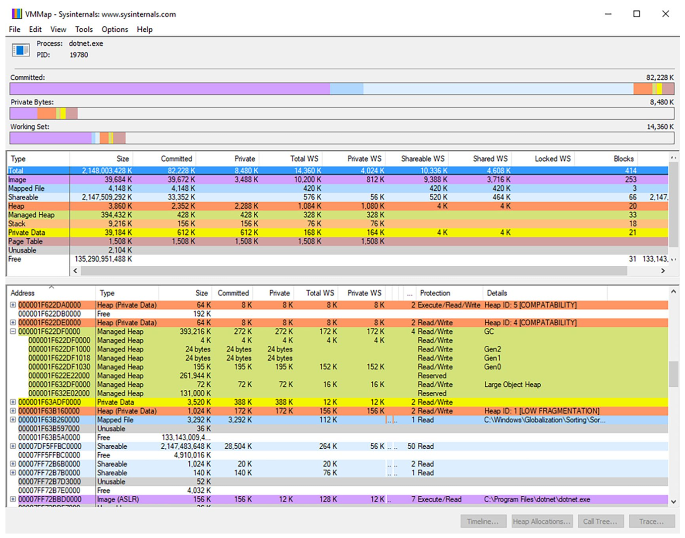<figcaption>Рисунок 3-7. Образец просмотра простого приложения .NET Framework (например, управляемые кучи были правильно обнаружены)</figcaption>
</figure>

* * *

## Счетчики производительности .NET Framework

Механизм так называемых счетчиков производительности (Performance Counters) является наиболее распространенным инструментом для мониторинга практически всех аспектов Windows. Это очень легковесный механизм, который можно описать одной фразой: процессы могут использовать его для обмена диагностическими данными в форме временных рядов метрик. Его огромное преимущество заключается в том, что это полностью ненавязчивый механизм, который не создает заметных накладных расходов. Недостатком является точность — диспетчер производительности получает значения каждую секунду, что может быть недостаточно для ваших конкретных целей. Кроме того, некоторые поставщики не обновляют значения регулярно; например, среда выполнения .NET изменяет счетчики производительности, связанные с сборкой мусора (GC), только после каждой сборки мусора.

Метрики группируются в различные категории. Общая архитектура счетчиков производительности показана на [рисунке 3-8](<#f-3-8>).

<a id="f-3-8"></a>
<figure markdown="span" class="custom-figure">
  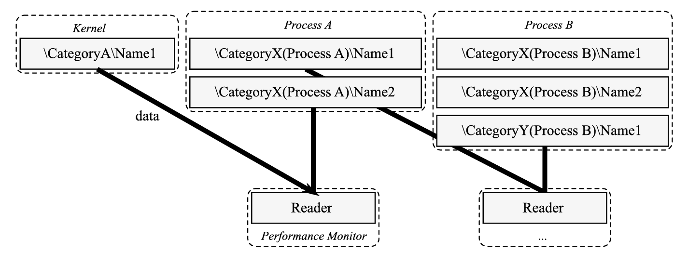<figcaption>Рисунок 3-8. Архитектура счетчика производительности</figcaption>
</figure>

В общем случае несколько процессов могут решить публиковать данные под определенными счетчиками производительности. У каждого счетчика производительности есть несколько важных атрибутов:

  * Категория: Определяет общий Scope (область действия) счетчика.

  * Имя: Однозначно идентифицирует счетчик в рамках данной категории.

  * Имя экземпляра: В системе может быть несколько экземпляров одного и того же счетчика. В большинстве случаев имя экземпляра — это имя процесса.


Сочетание, которое однозначно идентифицирует счетчик производительности, записывается как "\<Категория>(<Экземпляр>)\<Имя>". Например, счетчик, указывающий на использование CPU процессом notepad (notepad.exe), будет обозначен как "\Process(notepad)\% Processor Time". В случае нескольких экземпляров одного и того же процесса появляется знак #, за которым следует номер экземпляра. Например, если MyApp.exe запущен дважды, будут указаны "MyApp" и "MyApp#1" (подробнее об этом позже).

Какие образцы данных можно получить таким образом? Мы упомянем лишь некоторые из них, чтобы показать богатство предоставленной информации:

  * Как использование CPU распределяется между ядром системы и программами (Processor/% Privileged Time, Processor/% User Time)

  * В какой степени отдельные процессы потребляют ресурсы CPU (Process/% Processor Time)

  * В какой степени и как отдельные процессы используют память (Process/Working Set, Process/Working Set - Private, Process/Private Bytes)

  * Как используется жесткий диск (Process/IO Read Bytes/sec, Process/IO Write Bytes/sec, Process/Page Faults/sec)

  * Сколько операций записи/чтения на диск находится в очереди (PhysicalDisk/Current Disk Queue Length)

  * Сколько исключений генерирует приложение .NET (.NET CLR Exceptions/# of Exceps Thrown/sec)


  


__Примечание

Счетчики производительности в категориях «.NET» доступны только для .NET Framework. Их эквивалент для .NET Core описан в следующем разделе.

Конечно, вас в первую очередь интересует категория .NET CLR Memory, где можно найти следующие счетчики (орфография и регистры символов сохранены без изменений):

  * \# Bytes in all Heaps

  * \# GC Handles

  * \# Gen 0 Collections, # Gen 1 Collections, # Gen 2 Collections

  * \# Induced GC

  * \# of Pinned Objects

  * \# of Sink Blocks in use

  * \# Total committed Bytes, # Total reserved Bytes

  * % Time in GC

  * Allocated Bytes/sec

  * Finalization Survivors

  * Gen 0 heap size, Gen 1 heap size, Gen 2 heap size, Large Object Heap Size

  * Gen 0 Promoted Bytes/Sec, Gen 1 Promoted Bytes/Sec

  * Process ID

  * Promoted Finalization-Memory from Gen 0

  * Promoted Memory from Gen 0, Promoted Memory from Gen 1


  


__Примечание

Названия этих счетчиков производительности (как и других в категориях .NET CLR) переводятся на активный язык операционной системы, поэтому на вашем компьютере или сервере могут быть указаны другие названия и категории. Это может быть довольно раздражающим, поскольку во многих переводах эти названия звучат немного странно. Это одна из многих причин, по которым мы рекомендовали бы вам использовать английский язык как основной язык Windows.

Если тема сборки мусора (Garbage Collection) вам хотя бы немного знакома, вы, вероятно, уже догадались о значении большинства из упомянутых выше счетчиков. Вы будете встречать их на протяжении всей остальной части книги. Уже сейчас можно сказать, что это полный набор данных, позволяющий глубоко понять состояние вашего приложения.

Расчет счетчиков синхронизирован с жизненным циклом сборки мусора. В частности, большинство измерений производится в начале или в конце процесса GC. В этом смысле счетчики производительности могут предоставлять очень ценную и точную информацию. Однако есть несколько важных замечаний, которые стоит упомянуть в этом контексте:

  * Чтение значений счетчиков производительности полностью зависит от частоты, с которой используемый вами инструмент выполняет их выборку. Если выборка происходит достаточно часто (например, каждую секунду), данные будут полностью точными. Однако если выборка редкая, результаты могут быть ошибочными и вводить в заблуждение. Например, если не повезет и полная сборка мусора (тот, который потребляет больше всего ресурсов) будет происходить непосредственно перед каждым вашим измерением, вы получите ложное представление о том, сколько времени тратится на GC (% Time in GC). Другими словами, при анализе счетчиков производительности следует внимательно следить за способом выборки данных.

  * Данные счетчиков производительности обновляются только при возникновении определенных событий (в основном начала и окончания сборки мусора), после чего их значения остаются неизменными. Это может привести к неверным показаниям. Предположим, например, что в вашем процессе недавно произошла полная сборка мусора, во время которой % Time in GC составил 50%. С этого момента счетчик % Time in GC будет показывать высокое значение 50%, даже если наблюдаемый процесс больше не выполняет никакой работы. Пока не начнется новая сборка мусора, эти значения не будут обновлены. Другими словами, при наблюдении за счетчиками следует уделять больше внимания изменениям, а не текущим значениям. Наблюдаемое значение — это просто последнее измеренное значение.


Microsoft с версии .NET Framework 4.0 предпочитает использование событий ETW (описано в следующем разделе) для передачи значимой полезной нагрузки вместо счетчиков производительности. Однако использование инструментов счетчиков производительности намного проще, чем любых инструментов, связанных с ETW. Мы подробно рассмотрим различия между измерениями счетчиков производительности и ETW в пятой главе.

Множество инструментов мониторинга используют счетчики производительности, поскольку это очень легковесный и эффективный способ получения большого объема информации. Однако одним из самых простых и часто используемых инструментов является встроенный Windows Performance Monitor. Запустить его можно с помощью команды perfmon.exe или через поиск в меню "Пуск".

Затем выберите пункт Performance ➤ Monitoring Tools ➤ Performance Monitor в левом меню. В появившемся графике, в контекстном меню выберите опцию Add Counters... (см. [рисунок 3-9](<#f-3-9>)).

<a id="f-3-9"></a>
<figure markdown="span" class="custom-figure">
  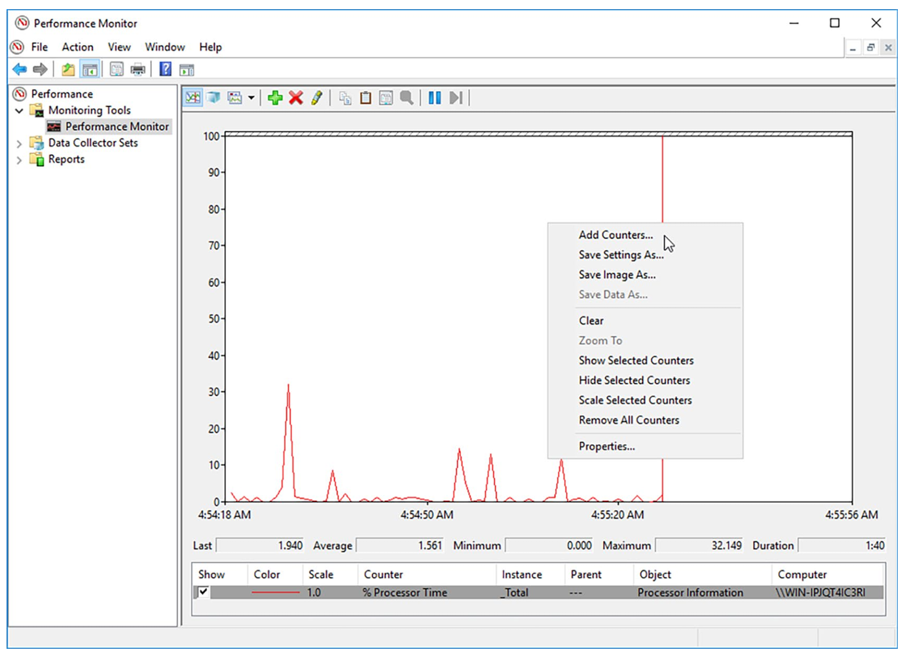<figcaption>Рисунок 3-9. Монитор производительности – общий вид с опцией контекста «Добавить счетчики»</figcaption>
</figure>

Используйте диалоговое окно для выбора интересующей категории (в нашем случае это память .NET CLR), а также конкретных счетчиков и экземпляров (см. [рисунок 3-10](<#f-3-10>)).

<a id="f-3-10"></a>
<figure markdown="span" class="custom-figure">
  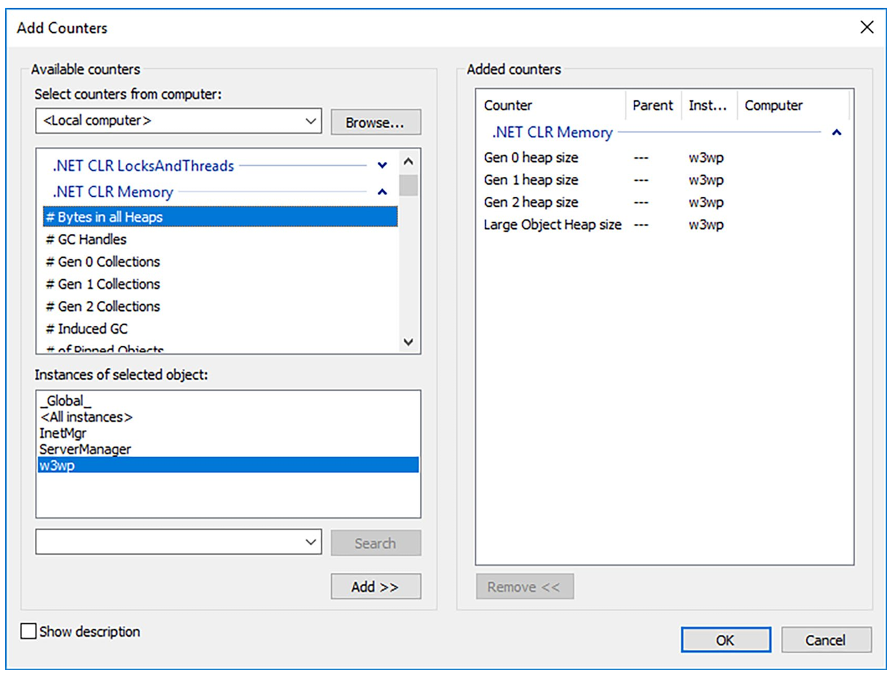<figcaption>Рисунок 3-10. Монитор производительности – диалоговое окно «Добавить счетчики»</figcaption>
</figure>

После добавления счетчиков часто требуется время, чтобы адаптировать диаграммы к своим потребностям. Речь идет в первую очередь о

  * Масштабирование каждого графика (щелчок правой кнопкой мыши, Масштаб выбранных счетчиков)

  * Частота и количество выборок (Ctrl+L, вкладка Общие, Выборка каждый и Параметры длительности)

  * Вертикальный масштаб графика (Ctrl+L, вкладка График, Минимальный и Максимальный параметры вертикального масштаба)

  * Способ прокрутки графика (Ctrl+L, вкладка График, параметр Стиль прокрутки)


Правильно выбрав указанные выше параметры (и, возможно, выбрав толщину и цвет каждого ряда данных), вы можете настроить график под краткосрочный анализ или наблюдать за ежедневными тенденциями. Примеры на [рисунке 3-11](<#f-3-11>) и [рисунке 3-12](<#f-3-12>) иллюстрируют это.

<a id="f-3-11"></a>
<figure markdown="span" class="custom-figure">
  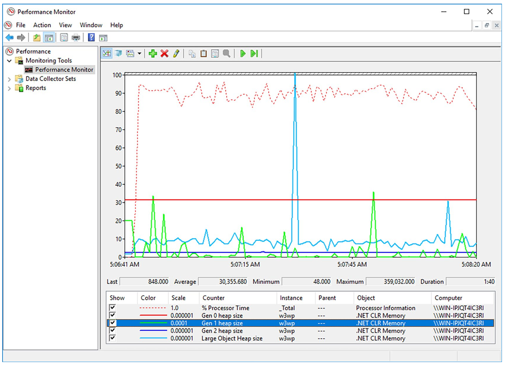<figcaption>Рисунок 3-11. Performance Monitor — анализ короткого периода (100 секунд) с видимыми размерами генерации GC</figcaption>
</figure>
<a id="f-3-12"></a>
<figure markdown="span" class="custom-figure">
  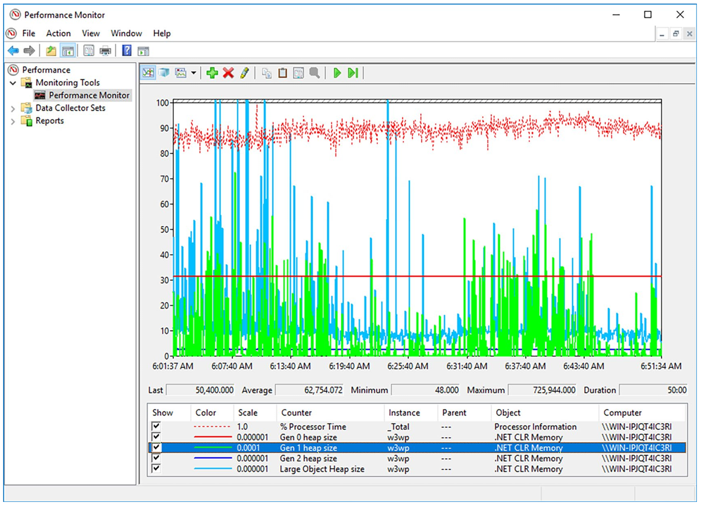<figcaption>Рисунок 3-12. Performance Monitor — долгосрочный анализ (50 минут) с видимыми размерами генерации GC</figcaption>
</figure>

Механизм счетчиков производительности имеет одно раздражающее свойство, с которым вам придется научиться мириться. Как уже упоминалось, каждый процесс, публикующий счетчики под одним и тем же именем, имеет уникальное имя экземпляра, которое соответствует имени процесса. Например, веб-приложение, размещенное на IIS, будет иметь счетчик \\.NET CLR Memory(w3wp)\\# Bytes in all Heaps (так как приложения пула приложений запускаются в процессе w3wp.exe). Однако если несколько приложений размещены в разных пулах приложений, появится несколько экземпляров, пронумерованных последовательно, например, w3wp, w3wp#1, w3wp#2 и т.д. Как узнать, какой экземпляр соответствует какому пулу приложений? Счетчик .NET CLR Memory/Process ID придет на помощь: он покажет PID каждого процесса экземпляра. Но будьте внимательны! Именно здесь начинается раздражающая часть — соответствие между процессом и экземпляром счетчика производительности может меняться со временем! Если, например, один из пулов приложений останавливается (из-за не активности или по другой причине), оставшиеся процессы изменят свое соответствие экземплярам (см. [Таблицу 3-1](<#t-3-1>)).

<a id="t-3-1"></a>
<figure class="custom-table-wrapper"
        markdown="1"
        style=" --col-min-width: 280px;
                --col1-width: 30px; --col1-min-width: 30px; --col1-text-align: center;
                --col2-width: auto;
                --col3-width: auto;">
  <figcaption>Таблица 3-1. Проблема с динамическим переименованием экземпляров пула приложений</figcaption>

№ | До остановки процесса с PID 11200 | После остановки процесса с PID 11200  
---|---|---  
1 | экземпляр w3wp представляет PID11200 | экземпляр w3wp имеет PID 8710  
2 | экземпляр w3wp#1 представляет PID 8710 | экземпляр w3wp#1 представляет PID 10410  
3 | экземпляр w3wp#2 имеет PID 10410 |   

</figure>

Это очень раздражает, особенно если вы хотите создать, например, автоматический механизм для наблюдения за определенными пулами приложений. В таком случае важно убедиться, что такие события, как автоматическая остановка пула приложений, вообще не происходят. С аналогичным механизмом вы также можете столкнуться, если в IIS включена опция перезапуска пула приложений с наложением (overlapping). В этом случае некоторое время будут существовать два экземпляра одного и того же счетчика, поэтому переопределение экземпляров неизбежно.

Из-за вышеупомянутого неочевидного соответствия, в случае ручного наблюдения за приложениями, размещенными на IIS, наиболее распространенный сценарий выглядит следующим образом: проверьте текущий PID пула приложений, который вас интересует, и найдите экземпляр w3wp, у которого есть соответствующий счетчик .NET CLR Memory/Process ID. Затем добавьте счетчики именно этого экземпляра.

Альтернативно, вы можете обновить значение ключа реестра ProcessNameFormat в разделе HKLM\System\CurrentControlSet\Services\\.NETFramework\Performance. Если установить его в 2, формат имен экземпляров изменится на `<processName>_<pid>`, что значительно упрощает управление. Однако это изменение будет применяться ко всей системе, поэтому оно может вызвать проблемы с совместимостью некоторых инструментов.

Многие другие программы используют счетчики производительности, но остановимся здесь. Мы будем использовать Performance Monitor для демонстрации работы сборщика мусора в действии на Windows.

* * *

## Счетчики .NET Core

С момента своего создания .NET Core должен был поддерживать несколько платформ, а не только Windows. Вот почему выдача метрик в виде счетчиков производительности Windows невозможна. Microsoft предоставляет новый набор инструментов интерфейса командной строки (CLI), включая dotnet-counters для прослушивания счетчиков CLR. Другие полезные инструменты CLI будут описаны позже, но все они могут быть установлены двумя разными способами:

  * Загрузите двоичный файл непосредственно с их веб-страницы по адресу <https://learn.microsoft.com/en-us/dotnet/core/diagnostics/>. Выбираете правильную ссылку, соответствующую вашей ОС и платформе. Это позволяет вам создавать скрипты для установки инструмента в ваших контейнерах, например, благодаря curl.

  * На вашей машине разработчика или любой машине с установленным .NET SDK вы можете установить любой инструмент CLI с помощью команды `dotnet tool install -g <tool name>`. Например, `dotnet tool install -g dotnet-counters` устанавливает последнюю версию dotnet-counters. Если вы хотите обновиться до последней версии, используйте `dotnet tool update -g dotnet-counters`.


  


__Примечание

После установки dotnet-counters с помощью dotnet install вы можете начать его использовать, но вместо ввода dotnet-counters в командной строке используйте dotnet counters без "-". Эта функция псевдонимов работает для всех инструментов CLI.

Вернемся к dotnet-counters. Прежде всего, вам нужно определиться, в каких счетчиках вы заинтересованы. Команда list помогает вам, перечисляя доступные счетчики для каждого поставщика счетчиков. Понятие поставщика счетчиков близко к категории счетчиков производительности Windows.

Базовые счетчики CLR предоставляются поставщиком счетчиков System.Runtime:
    
    
            
    
    
                
    C:\> dotnet counters list
    Showing well-known counters for .NET (Core) version 6.0 only. Specific processes may support 
    additional counters.
    System.Runtime
        cpu-usage                           The percent of process' CPU usage relative to all of 
                                            the system CPU resources [0-100]
        working-set                         Amount of working set used by the process (MB)
        gc-heap-size                        Total heap size reported by the GC (MB)
        gen-0-gc-count                      Number of Gen 0 GCs between update intervals
        gen-1-gc-count                      Number of Gen 1 GCs between update intervals
        gen-2-gc-count                      Number of Gen 2 GCs between update intervals
        time-in-gc                          % time in GC since the last GC
        gen-o-size                          Gen O Heap Size
        gen-l-size                          Gen 1 Heap Size
        gen-2-size                          Gen 2 Heap Size
        Ioh-size                            LOH Size
        poh-size                            POH (Pinned Object Heap) Size
        alloc-rate                          Number of bytes allocated in the managed heap between
                                            update intervals
        gc-fragmentation                    GC Heap Fragmentation
        assembly-count                      Number of Assemblies Loaded
        exception-count                     Number of Exceptions / sec
        threadpool-thread-count             Number of ThreadP001 Threads
        monitor-lock-contention-count       Number of times there were contention when trying to
                                            take the monitor lock between update intervals
        threadpool-queue-length             ThreadP001 Work Items Queue Length
        threadpool-completed-items-count    ThreadP001 Completed Work Items Count
        active-timer-count                  Number of timers that are currently active
        il-bytes-jitted                     Total IL bytes jitted
        methods-jitted-count                Number of methods jitted
        gc-committed                        Size of committed memory by the GC (MB)
                
            
    
    
        

Пример консольного вывода команды list. Вывод списка доступных счётчиков.

Вы можете узнать большинство счетчиков производительности Windows, которые были перечислены ранее, а также несколько новых, которые будут рассмотрены в последующих главах. Кроме того, другие компоненты .NET предоставляют свои собственные счетчики, такие как Microsoft.AspNetCore.Hosting для статистики запросов; Microsoft-AspNetCore-Server-Kestrel для низкоуровневых метрик соединений; System.Net.Http для соединений и метрик запросов; System.Net.NameResolution для подробностей поиска DNS; System.Net.Sockets для низкоуровневой информации о соединениях, байтах и ​​датаграммах; или System.Net.Security для метрик TLS и сеансов.

  


__Примечание

Эти поставщики жестко запрограммированы в dotnet-counters и могут отличаться в зависимости от версии CLR, в которой работает ваше приложение.

Как только вы узнаете, какие счетчики вам интересны, вы можете использовать параметр --counters, чтобы передать их в dotnet-counters. Если вам нужны все счетчики поставщика счетчиков, просто укажите имя поставщика. Если вас интересует только подмножество счетчиков, перечислите их между []:

`--counters System.Runtime[gc-heap-size,loh-size, gen-2-size]`

Затем вам нужно узнать идентификатор процесса, который вы хотите отслеживать. Команда `ps` может вам помочь: она выводит список всех приложений, работающих с .NET Core, включая себя (т. е. dotnet) с соответствующим pid, именем процесса, исполняемым путем и командной строкой:
    
    
            
    
    
                
    C:\> dotnet counters ps
        84716  dotnet  C:\Program Files\dotnet\dotnet.exe    counters ps
                
            
    
    
        

Пример консольного вывода команды ps. Вывод списка всех приложений, работающих с .NET Core.

Как только у вас есть идентификатор процесса, передайте его через параметр -p.

Доступны два различных режима использования. Как показано на [рисунке 3-13](<#f-3-13>), при использовании monitor счетчики отображаются в консоли и их значение обновляется каждую секунду (если вы хотите менее частые обновления, используйте параметр --refresh-interval с частотой в секундах).

<a id="f-3-13"></a>
<figure markdown="span" class="custom-figure">
  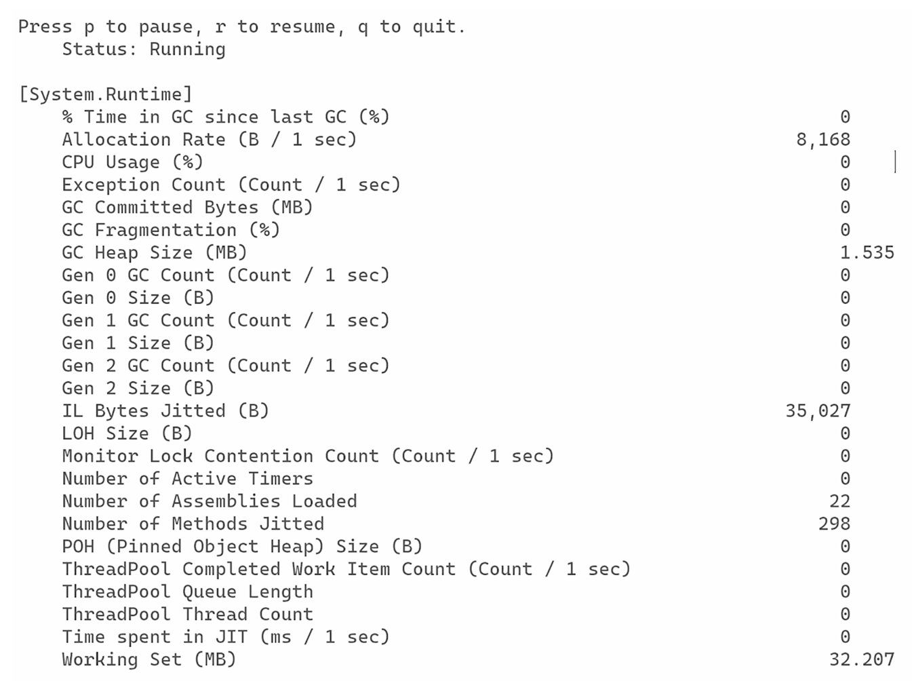<figcaption>Рисунок 3-13. dotnet counters monitor — обновление значений различных счетчиков</figcaption>
</figure>

Этот режим не особо полезен, за исключением разве что демонстраций во время конференций.

На самом деле вам нужен способ записи значений счетчиков с течением времени и анализа эволюции или пиков, как это делается с помощью Performance Monitor. Это то, что предоставляет второй режим сбора: выбранные счетчики (по умолчанию System.Runtime) будут периодически собираться и сохраняться в файле, указанном через параметр -o (или counter по умолчанию). По умолчанию файл сохраняется в формате CSV, но вы можете переключиться на json с помощью --format json.

Наконец, вы можете использовать параметр --duration, чтобы задать продолжительность сбора данных в секундах.

Visual Studio обеспечивает графическую визуализацию счетчиков .NET с течением времени при запуске сеанса профилирования производительности, как показано на [рисунке 3-14](<#f-3-14>).

<a id="f-3-14"></a>
<figure markdown="span" class="custom-figure">
  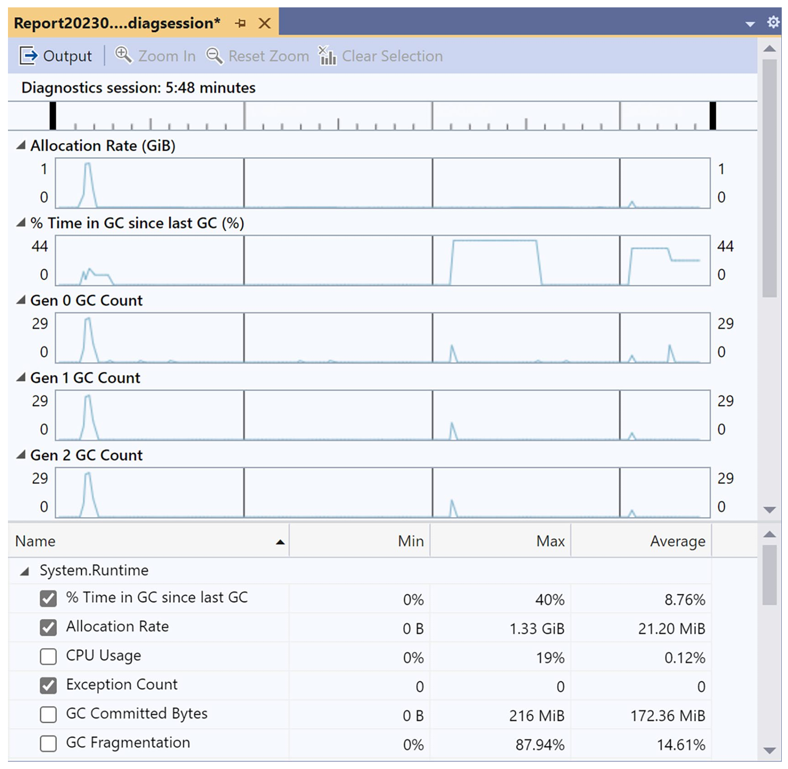<figcaption>Рисунок 3-14. Отображение счетчиков .NET в сеансе профилирования Visual Studio</figcaption>
</figure>

Если вам нужен визуальный кроссплатформенный инструмент, Конрад Кокоса реализовал его для вас! Более подробную информацию можно найти на сайте <https://github.com/kkokosa/dotnet-counters-ui>.

* * *

## Трассировка событий для Windows

Среди различных доступных диагностических инструментов некоторые из самых мощных основаны на механизме, называемом Event Tracing for Windows (ETW). К сожалению, этот механизм, кажется, немного недооценен. Возможно, это связано с тем, что он развивался постепенно на протяжении многих лет и еще не получил заслуженного внимания. ETW существует с момента выпуска Windows 2000, но с каждой новой версией системы становится доступно все больше данных. Он был значительно развит в Windows Vista и Windows Server 2003. В Windows 7 была добавлена ключевая возможность сохранять стек вызовов вместе с каждым событием (см. <https://learn.microsoft.com/en-gb/windows/win32/etw/what-s-new-in-event-tracing> ).

Сила ETW заключается в предоставлении огромных объемов информации с очень низкими накладными расходами — обычно менее нескольких процентов дополнительного потребления ресурсов ЦП. Благодаря этому его можно использовать в производственных системах без каких-либо проблем. Его можно включать и выключать во время работы приложений, без необходимости их перезапуска. Многие инструменты извлекают пользу из ETW. Вы можете даже не знать, сколько из них. Например, известный Event Log, его браузер (eventvwr.exe) и Resource Monitor (resmon.exe) построены поверх ETW. Однако механизм счетчика производительности, описанный в предыдущем разделе, не основан на Event Tracing для Windows.

Прежде чем перейти к описанию конкретных инструментов, неплохо было бы ознакомиться с общей архитектурой этого механизма. Важно понимать различные понятия, связанные с ETW:

  * Событие ETW: отдельное событие, которое может быть зарегистрировано любым компонентом системы.

  * Сеанс ETW: Центральная часть всего механизма, сеанс создается инструментом для получения доступа к зарегистрированным событиям. Технически это набор системных ресурсов, таких как буферы в памяти и потоки для записи на диск (см. [Рисунок 3-15](<#f-3-15>)).

  * Поставщик ETW: Каждый пользовательский компонент или компонент режима ядра, который доставляет события. Существует множество встроенных системных провайдеров, сгруппированных по категориям, таким как сетевые провайдеры, процессы и т.д. Это также включает среду выполнения .NET и ваш код (если вы хотите опубликовать свои пользовательские события ETW). Поставщики идентифицируются по глобальному уникальному идентификатору (GUID).

  * Контроллер ETW: Процесс, отвечающий за создание сеанса и его подключение к выбранным поставщикам.

  * Потребитель ETW: Любое средство, которое потребляет события, иногда сохраняя их в так называемых файлах журнала трассировки событий (ETL).


Сеанс трассировки событий Windows рассчитан на минимально возможные накладные расходы (см. [рис. 3-15](<#f-3-15>) ). С точки зрения процесса, отправка события — это просто быстрое действие, включающее неблокирующую запись в очередь (в буфере памяти), поддерживаемую на уровне ядра. Затем выделенный поток ядра обрабатывает эти очереди и записывает события в определенные цели — обычно в файл или какой-либо другой буфер в памяти (для проведения анализа в реальном времени)

<a id="f-3-15"></a>
<figure markdown="span" class="custom-figure">
  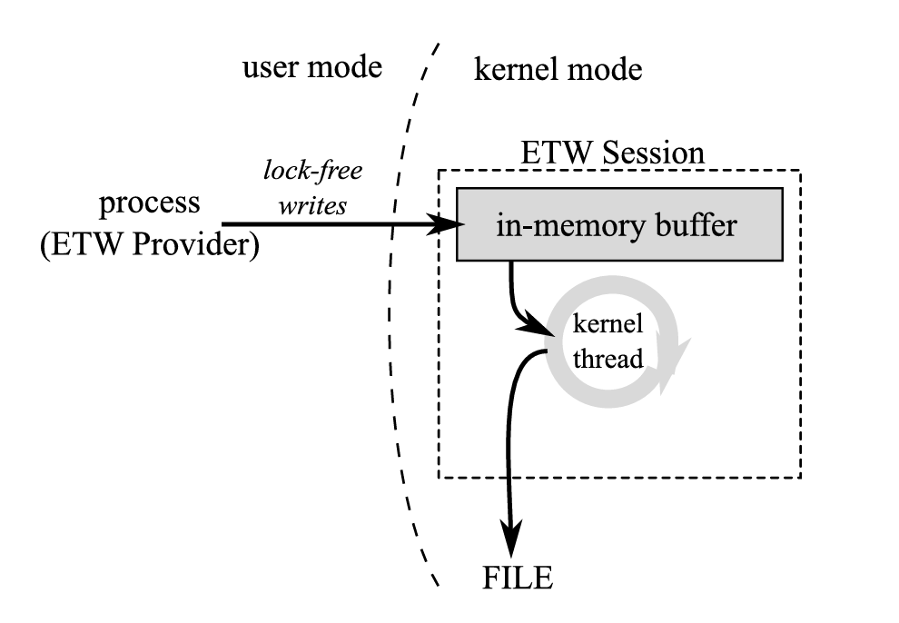<figcaption>Рисунок 3-15. Трассировка событий для внутренних компонентов Windows</figcaption>
</figure>

Концептуально один и тот же поставщик может предоставлять информацию нескольким сеансам (см. [рисунок 3-16](<#f-3-16>)). И наоборот, сеанс может получать информацию от нескольких поставщиков. Характерной чертой ETW является работа на уровне поставщиков, а не процессов. Чтобы получить информацию от одного или нескольких поставщиков, с помощью контроллера вы создаете новый сеанс, к которому вы их подключаете. Как только сеанс начнется, все процессы в системе, реализующие этого провайдера, будут регистрировать события в вашем сеансе: вы будете собирать события для всей машины, а не из конкретного процесса. Потребители должны фильтровать данные по интересующим их процессам.

<a id="f-3-16"></a>
<figure markdown="span" class="custom-figure">
  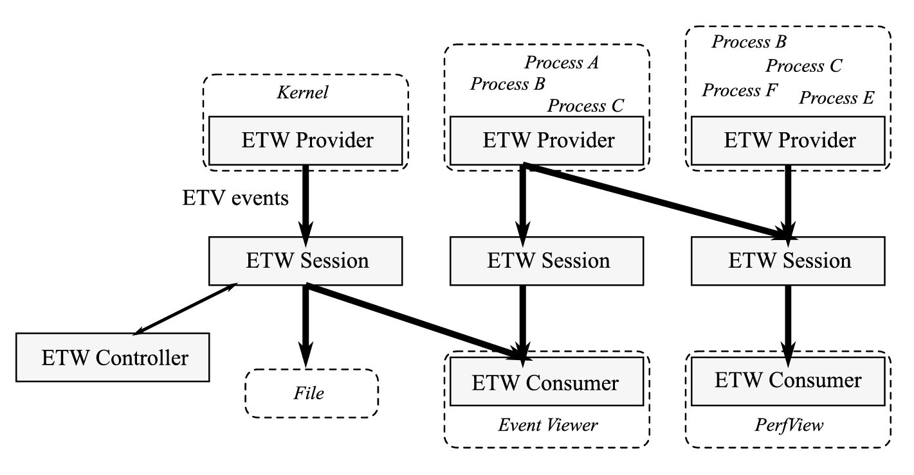<figcaption>Рисунок 3-16. Стандартные блоки трассировки событий Windows (ETW), иллюстрирующие различные возможности конфигурации. Обратите внимание, что процесс может содержать несколько поставщиков трассировки событий Windows; Таким образом, некоторые процессы перечисляются несколько раз</figcaption>
</figure>

Удержание событий в буферах вне процесса приложения имеет еще одно преимущество — сбой приложения не приведет к потере каких-либо диагностических данных. Конечно, при регистрации большого количества событий доступ к диску может стать узким местом и создать накладные расходы для всей машины. Однако вы столкнетесь с этой ситуацией только тогда, когда включите слишком много интенсивно используемых поставщиков для своего сеанса. Когда вы просите ETW отправить данные в файл, другим риском может быть исчерпание дискового пространства, но решение существует. Вы можете записывать данные в файл в режиме кольцевого буфера, поэтому вам не придется беспокоиться о переполнении диска. Данные будут циклически перезаписываться в буфере фиксированного размера. Наиболее типичный сценарий — запустить сеанс, сохраняющий данные в кольцевом буфере, и дождаться определенного сценария. Только после этого вы закрываете сеанс и сохраняете данные из буфера в файл.

Начиная с Windows 7, можно собирать трассировку стека, связанную с событиями ядра и пользователя. Полезная нагрузка этих событий (в паре с исходными событиями) — это указатель инструкций каждого кадра стека. Потребитель должен разрешить эти указатели инструкций в имена методов, обычно на этапе анализа. Однако это применимо к машинному коду (т. е. также к коду CLR), но не к управляемому коду до Windows 8.

Встроенное событие выборки CPU ETW позволяет нам, например, отслеживать проблемы с высокой загрузкой CPU. Для каждого события выборки (генерируемого каждую миллисекунду) стек вызовов всех потоков, запланированных на ядре, собирается из всех процессов. Благодаря этому статистически можно увидеть причину проблемы с привязкой к CPU — на какие функции было потрачено больше всего времени. При поддержке поставщиков ОС можно также отслеживать проблемы синхронизации (например, взаимоблокировки). Например, он используется плагином Concurrency Visualizer для Visual Studio.

  


__Примечание

Для большинства диагностических инструментов в среде Windows вам необходим доступ к файлам символов (PDB – Program Database), которые позволяют декодировать информацию о методах из стеков вызовов. Наиболее удобная настройка – переменная среды _NT_SYMBOL_PATH, в которой вы указываете расположение символов. Обычно это комбинация локальной папки (для кэширования) и адреса публичного сервера символов Microsoft:

srv*C:\Symbols*https://msdl.microsoft.com/download/symbols

Это позволяет нам получать PDB-файлы операционной системы Windows и библиотеки CLR. Visual studio и WinDbg – два примера инструментов, которые используют эту переменную среды.

Существует специальный сеанс NT Kernel Logger, который может использоваться только с поставщиками уровня ядра, из которых, например, можно получить начало и конец любого процесса. Поставщик пользователя Microsoft-Windows-TCPIP — еще один пример, который регистрирует события из драйвера режима ядра tcpip.sys.

Операционная система предоставляет много интересной информации, такой как управление процессами и потоками, сетевые функции, операции ввода-вывода и т. д. Но больше всего нас интересует то, что CLR имеет собственных поставщиков ETW, предоставляющих большой объем информации о среде выполнения в контексте вашего приложения.

Вы можете использовать встроенную утилиту logman.exe для поиска всех поставщиков, связанных с .NET, в системе (см. [листинг 3-1)](<#l-3-1>).
    
    
            
    
    
                
    **C:\> logman query providers | findstr DotNET**
    Microsoft-Windows-DotNETRuntime          {E13C0D23-CCBC-4E12-931B-D9CC2EEE27E4}
    Microsoft-Windows-DotNETRuntimeRundown   {A669021C-C450-4609-A035-5AF59AF4DF18}
<a id="l-3-1"></a>                
            
    
    
        

Листинг 3-1. Использование утилиты logman для составления списка всех поставщиков ETW, связанных с .NET

Вы также можете использовать logman, чтобы узнать, какие поставщики доступны в контексте определенного процесса. Например, если вы спросите об ASP.NET WebAPI, размещенном на IIS, вы получите список, как в [Листинге 3-2](<#l-3-2>) (результат представляет только некоторых из многих перечисленных поставщиков).
    
    
            
    
    
                
    **C:\> logman query providers -pid 6228**
    Provider                                 GUID
    --------------------------------------------------------------------------
    **.NET Common Language Runtime             {E13C0D23-CCBC-4E12-931B-D9CC2EEE27E4}**
    ASP.NET Events                           {AFF081FE-0247-4275-9C4E-021F3DC1DA35}
    IIS: WWW Global                          {D55D3BC9-CBA9-44DF-827E-132D3A4596C2}
    IIS: WWW Isapi Extension                 {A1C2040E-8840-4C31-BA11-9871031A19EA}
    IIS: WWW Server                          {3A2A4E84-4C21-4981-AE10-3FDA0D9B0F83}
    Microsoft-Windows-Application            {C651F5F6-1C0D-492E-8AE1-B4EFD7C9D503}
    Server-Applications                      
    Microsoft-Windows-Application-Experience {EEF54E71-0661-422D-9A98-82FD4940B820}
    **Microsoft-Windows-DotNETRuntimeRundown   {A669021C-C450-4609-A035-5AF59AF4DF18}**
    Microsoft-Windows-IIS                    {DE4649C9-15E8-4FEA-9D85-1CDDA520C334}
    Microsoft-Windows-IIS-Configuration      {DC0B8E51-4863-407A-BC3C-1B479B2978AC}
    ...
<a id="l-3-2"></a>                
            
    
    
        

Листинг 3-2. Использование утилиты logman для составления списка всех поставщиков ETW данного процесса ASP.NET

Если вы спросите о консольном приложении, работающем на .NET Core, то вы получите немного другой набор поставщиков (см. [Листинг 3-3](<#l-3-3>)).
    
    
            
    
    
                
    **C:\> logman query providers -pid 8528**
    Provider                                 GUID
    --------------------------------------------------------------------------
    **.NET Common Language Runtime             {E13C0D23-CCBC-4E12-931B-D9CC2EEE27E4}**
    Microsoft-Windows-AsynchronousCausality  {19A4C69A-28EB-4D4B-8D94-5F19055A1B5C}
    Microsoft-Windows-COM-Perf               {B8D6861B-D20F-4EEC-BBAE-87E0DD80602B}
    Microsoft-Windows-Crypto-BCrypt          {C7E089AC-BA2A-11E0-9AF7-68384824019B}
    Microsoft-Windows-Crypto-RSAEnh          {152FDB2B-6E9D-4B60-B317-815D5F174C4A}
    **Microsoft-Windows-DotNETRuntimeRundown   {A669021C-C450-4609-A035-5AF59AF4DF18}**
    Microsoft-Windows-Networking-Correlation {83ED54F0-4D48-4E45-B16E-726FFD1FA4AF}
    Microsoft-Windows-Shell-Core             {30336ED4-E327-447C-9DE0-51B652C86108}
    Microsoft-Windows-User-Diagnostic        {305FC87B-002A-5E26-D297-60223012CA9C}
    Microsoft-Windows-WinRT-Error            {A86F8471-C31D-4FBC-A035-665D06047B03}
    {012616AB-FF6D-4503-A6F0-EFFD0523ACE6}   {012616AB-FF6D-4503-A6F0-EFFD0523ACE6}
    {05F95EFE-7F75-49C7-A994-60A55CC09571}   {05F95EFE-7F75-49C7-A994-60A55CC09571}
    ...
<a id="l-3-3"></a>                
            
    
    
        

Листинг 3-3. Использование утилиты logman для составления списка всех поставщиков ETW данного процесса .NET Core

Как вы можете видеть, поставщики, связанные с .NET, имеют одинаковый GUID в .NET Framework и приложении .NET Core. Если вам не повезло и вы все еще используете .NET Core 2.1 или более раннюю версию, вы также заметите, что есть два имени для одного и того же поставщика, которые используются взаимозаменяемо: Microsoft-Windows-DotNETRuntime также называется .NET Common Language Runtime.

Каждое событие ETW, создаваемое в рамках данного поставщика, имеет несколько важных атрибутов:

  * Id: Уникальный идентификатор события.

  * Version: Используется для управления версиями событий.

  * Keyword: Битовая маска, используемая для присвоения одного или нескольких значений (ключевых слов) событию.

  * Level: Уровень ведения журнала.

  * Opcode: Под ним подразумевается конкретное действие (этап) в рамках данного события. Наиболее часто используемыми встроенными значениями являются коды операций Start и End.

  * Task: Он используется для группировки событий от поставщика по определенным функциям.


С помощью инструмента logman вы также можете узнать подробности о конкретном провайдере. Для основного провайдера .NET ETW вы получите информацию, как в [листинге 3-4](<#l-3-4>).
    
    
            
    
    
                
    C:\> logman query providers "Microsoft-Windows-DotNETRuntime"
    Provider                                GUID
    --------------------------------------------------------------------------
    Microsoft-Windows-DotNETRuntime         {E13C0D23-CCBC-4E12-931B-D9CC2EEE27E4}
    Value               Keyword             Description
    --------------------------------------------------------------------------
    0x0000000000000001  GCKeyword           GC
    0x0000000000000002  GCHandleKeyword     GCHandle
    0x0000000000000004  FusionKeyword       Binder
    0x0000000000000008  LoaderKeyword       Loader
    0x0000000000000010  JitKeyword          Jit
    0x0000000000000020  NGenKeyword         NGen
    0x0000000000000040  StartEnumerationKeyword StartEnumeration
    0x0000000000000080  EndEnumerationKeyword StopEnumeration
    0x0000000000000400  SecurityKeyword     Security
    0x0000000000000800  AppDomainResourceManagementKeyword AppDomainResourceManagement
    0x0000000000001000  JitTracingKeyword   JitTracing
    0x0000000000002000  InteropKeyword      Interop
    0x0000000000004000  ContentionKeyword   Contention
    0x0000000000008000  ExceptionKeyword    Exception
    0x0000000000010000  ThreadingKeyword    Threading
    0x0000000000020000  JittedMethodILToNativeMapKeyword JittedMethodILToNativeMap
    0x0000000000040000  OverrideAndSuppressNGenEventsKeyword OverrideAndSuppressNGenEvents
    0x0000000000080000  TypeKeyword         Type
    0x0000000000100000  GCHeapDumpKeyword   GCHeapDump
    0x0000000000200000  GCSampledObjectAllocationHighKeyword GCSampledObjectAllocationHigh
    0x0000000000400000  GCHeapSurvivalAndMovementKeyword GCHeapSurvivalAndMovement
    0x0000000000800000  GCHeapCollectKeyword GCHeapCollect
    0x0000000001000000  GCHeapAndTypeNamesKeyword GCHeapAndTypeNames
    0x0000000002000000  GCSampledObjectAllocationLowKeyword GCSampledObjectAllocationLow
    0x0000000020000000  PerfTrackKeyword    PerfTrack
    0x0000000040000000  StackKeyword        Stack
    0x0000000080000000  ThreadTransferKeyword ThreadTransfer
    0x0000000100000000  DebuggerKeyword     Debugger
    0x0000000200000000  MonitoringKeyword   Value
    Level               Monitoring         Description
    --------------------------------------------------------------------------
    0x00                win:LogAlways      Log Always
    0x02                win:Error          Error
    0x04                win:Informational  Information
    0x05                win:Verbose        Verbose
    ...
    followed by the list of processes containing this provider.
<a id="l-3-4"></a>                
            
    
    
        

Листинг 3-4. Получение сведений о поставщике .NET ETW

Например, для списка событий, сгенерированных поставщиками .NET, вы можете использовать документацию Microsoft по адресу <https://learn.microsoft.com/en-us/dotnet/framework/performance/clr-etw-events>. Однако не все события документированы. Поэтому лучше посмотреть на источник, а точнее на файл манифеста данного поставщика. Файл манифеста ETW определяет строго типизированную информацию о событиях, сгенерированную для данного поставщика. Это позволяет потребителю правильно интерпретировать записанные данные сеанса. Файлы манифеста различны для каждой версии среды выполнения .NET. Вы можете найти их в разных местах:

  * Для .NET Core, в .\runtime\src\coreclr\vm\ClrEtwAll.man в github

  * Для .NET Framework 4.0 и более поздних версий, в c:\Windows\Microsoft.NET\Framework64\v4.0.30319\CLR-ETW.man

  * Для .NET Framework 2.0 и более ранних версий он недоступен, так как они не поддерживают ETW.


Когда вы посмотрите на этот файл, вы найдете полное описание поставщиков Microsoft-WindowsDotNETRuntime и Microsoft-Windows-DotNETRuntimeRundown. Этот файл — настоящий кладезь знаний, если вы хотите использовать поставщиков .NET ETW. Давайте кратко рассмотрим события, которые выдают оба поставщика. Мы вернемся ко всем этим событиям в следующих главах этой книги, чтобы вы имели полное представление о каждом из них. Однако сначала мы сосредоточимся здесь на самых интересных. Это позволит вам увидеть, насколько богата информация, предоставляемая поставщиками .NET ETW. Не беспокойтесь о Linux, те же события (и даже больше) выдаются .NET Core через кроссплатформенный канал связи EventPipe.

  


__Примечание

Рассмотрение только испускаемых событий может привести к некоторым интересным вопросам. Например, что такое сегмент ReadOnlyHeapMapMessage типа GCSegmentTypeMap? Мы ответим на этот вопрос в Главе 5.

Нас в основном интересуют события, генерируемые поставщиком Microsoft-Windows-DotNETRuntime, сгруппированные в 29 различных задач (как в номенклатуре ETW, атрибут события задачи соответствует ее функциональной категории). Чтобы получить представление о полноте предоставленной информации, эти задачи включают в себя (в скобках показано количество событий данной задачи): AppDomainResourceManagement (5), CLRAuthenticodeVerification CLRILStub (2), CLRLoader (18), CLRMethod (25), CLRPerfTrack (1), CLRRuntimeInformation (1), CLRStack (1), CLRStrongNameVerification (4), Contention (3), Exception (3), ExceptionCatch (2), ExceptionFilter (2), ExceptionFinally (2), GarbageCollection (58), IOThreadCreation (4), IOThreadRetirement (4), Thread (2), ThreadPool (5), ThreadPoolWorkerThread (3) и Type (1).

Как вы можете видеть, самая большая группа — это задача Garbage Collector — она содержит 58 различных событий! На самом деле, их всего 44, поскольку определены разные версии одного и того же события. Вы найдете несколько выбранных событий вместе с описанием и их полезной нагрузкой в [таблице 3-2](<#t-3-2>).

<a id="t-3-2"></a>
<figure class="custom-table-wrapper"
        markdown="1" 
        style=" --col-min-width: 145px;
                --col1-width: 30px; --col1-min-width: 30px; --col1-text-align: center;
                --col2-width: auto;
                --col3-width: auto;">
  <figcaption>Таблица 3-2. Пример событий ETW, связанных с GC</figcaption>
  
№ | Событие | Данные  
---|---|---  
1 | GCStart_V2 |  ClientSequenceNumber(win:UInt64), ClrInstanceID(win:UInt16),Count(win:UInt32), Depth(win:UInt32), Reason(GCReasonMap), Type(GCTypeMap) Сообщает о начале сборки мусора, указывая причину и поколение, вызвавшее ее (в поле Depth)  
2 | GCEnd_V1 |  ClrInstanceID(win:UInt16), Count(win:UInt32), Depth(win:UInt32) Информирует об окончании сборки мусора  
3 | GCCreateSegment_V1 |  Address(win:UInt64), ClrInstanceID(win:UInt16), Size(win:UInt64), Type(GCSegmentTypeMap) Информирует о создании новых сегментов памяти, предоставляя информацию об их размере и типе  
4 | GCSuspendEEBegin_V1 |  ClrInstanceID(win:UInt16), Count(win:UInt32), Reason(GCSuspendEEReasonMap) Информирует о том, когда среда выполнения начинает приостанавливать все потоки приложения в соответствии с требованиями некоторых частей сборки мусора  
5 | GCSuspendEEEnd_V1 |  ClrInstanceID(win:UInt16) Информирует, когда среда выполнения приостановила все потоки приложения  
6 | GCAllocationTick_V4 |  Address(win:Pointer), ObjectSize(win:UInt64), AllocationAmount(win:UInt32), AllocationAmount64(win:UInt64), AllocationKind(GCAllocationKindMap), ClrInstanceID(win:UInt16), HeapIndex(win:UInt32), TypeID(win:Pointer), TypeName(win:UnicodeString) Периодическое событие выборки (генерируемое после выделения 100 КБ) для информирования о последнем выделенном типе  
7 | GCHeapStats_V2 |  ClrInstanceID(win:UInt16), FinalizationPromotedCount(win:UInt64), FinalizationPromotedSize(win:UInt64), GCHandleCount(win:UInt32), GenerationSize0(win:UInt64), GenerationSize1(win:UInt64), GenerationSize2(win:UInt64), GenerationSize3(win:UInt64), GenerationSize4(win:UInt64), PinnedObjectCount(win:UInt32), SinkBlockCount(win:UInt32), TotalPromotedSize0(win:UInt64), TotalPromotedSize1(win:UInt64), TotalPromotedSize2(win:UInt64), TotalPromotedSize3(win:UInt64), TotalPromotedSize4(win:UInt64) Предоставляет обширную информацию о статистике кучи в целом, включая размеры поколений в конце сборки мусора  

</figure>


Если учесть, что каждое событие имеет точную временную метку и может содержать стек вызовов, вы должны начать понимать, какую мощную диагностику можно создать из этих событий. И именно поэтому она используется многими различными инструментами. Некоторые из них будут раскрыты в следующих подразделах.

Не бойтесь, если вы не понимаете описания всех событий ETW, приведенных в [Таблице 3-2](<#t-3-2>). Очевидно, что необходимы некоторые знания о GC. Мы вернемся ко многим событиям ETW (включая те, что из [Таблицы 3-2](<#t-3-2>)) в следующих главах.

Сеанс NT Kernel Logger также предоставляет много ценной информации, включая такие события, как Windows Kernel\ProcessStart, Windows Kernel\ProcessEnd при запуске и завершении процесса, Windows Kernel\ImageLoad при загрузке динамической библиотеки, Windows Kernel\TcpIpRecv при получении пакетов TCP/IP, Windows Kernel\CSwitch при переключении ЦП с выполнения одного потока на другой, также известном как переключение контекста. Очевидно, что есть и много других, но перечисление здесь лишь небольшой их части не имеет смысла.

* * *

## PerfView

Windows Performance Toolkit был в первую очередь разработан для разработчиков Windows и драйверов. Благодаря его высокой настраиваемости вы можете адаптировать его для разработчиков .NET, как вы сделали в предыдущем разделе. Однако есть еще один инструмент на основе ETW, который изначально был разработан для анализа проблем производительности .NET — PerfView. Его создатель — Вэнс Моррисон, архитектор производительности среды выполнения .NET, и этот инструмент используется командой .NET для заботы о производительности самой платформы и управляемого кода в целом. Более того, этот инструмент имеет полностью открытый исходный код и доступен на GitHub в репозитории microsoft/perfview.

С точки зрения номенклатуры ETW, PerfView является одновременно контроллером и потребителем (предоставляя обширные возможности анализа). Он разработан так, чтобы быть максимально незаметным. Он не требует установки: просто загрузите последнюю версию perfview.exe с <https://github.com/microsoft/perfview/releases>. Это упрощает его использование на любом компьютере, включая производственные серверы.

Этот инструмент GUI также может управляться из командной строки и PowerShell для включения сценариев автоматизации. Это особенно полезно при производственном анализе (подготовленная командная строка может быть предоставлена ​​системному администратору для выполнения в ограниченной среде). Например, следующая команда запустит легкую запись сеанса для событий, связанных со сборкой мусора: perfview /GCCollectOnly /nogui /accepteula /NoV2Rundown /NoNGENRundown /NoRundown /merge:true /zip:true collect. С помощью командной строки вы также можете предоставить триггеры остановки сеанса, например, остановить сеанс, когда сборка мусора происходила дольше определенного числа миллисекунд. Пожалуйста, запустите perfview -? для получения дополнительной справки в командной строке.

Хотя настройка проста, первый контакт с этим инструментом может вас напугать. Этот инструмент заслуживает звания самого мощного, но на первый взгляд самого подавляющего инструмента. Интерфейс не является ни интуитивно понятным, ни красивым, поэтому не ясно, с чего начать. К счастью, он предоставляет очень обширную справку. Каждая опция и элемент графического интерфейса сопровождаются ссылкой на соответствующую документацию. Позже вы можете найти некоторые базовые сценарии использования, но мы рекомендуем вам часто посещать разделы справки. Они дают обширные и широкие объяснения тем, затронутых здесь. И чтобы пойти дальше, найдите время, чтобы посмотреть серию обучающих видеороликов, записанных самим Вэнсом и доступных по адресу <https://learn.microsoft.com/en-us/shows/perfview-tutorial/>. Поверьте, этот инструмент стоит каждой минуты, потраченной на его изучение.

  


__Примечание

Большая часть функциональности анализа PerfView на основе ETW основана на библиотеке TraceEvent. Мы вернемся к ней в Главе 15, чтобы кратко рассмотреть ее возможности. Хотя PerfView в основном основан на ETW, он также имеет встроенный ETWClrProfiler (основанный на API профилирования CLR), который позволяет PerfView перехватывать вызовы методов .NET (включите .NET Call в диалоговом окне Collect, чтобы начать его использовать).

В то время как пользовательский интерфейс Windows Performance Analyzer основан на диаграммах, PerfView фокусируется на табличном представлении. Почти все, что вы видите в этом инструменте, отображается в табличной форме. Иногда это может вводить в заблуждение, поскольку потребление памяти, стеки вызовов и все остальное анализируются одинаково в том же табличном пользовательском интерфейсе.

После запуска PerfView вы увидите окно с обширными ссылками помощи на панели Welcome to PerfView справа. В это время вы можете выполнить три основных действия:

  * Начните сбор данных ETW с помощью меню «Собрать» ➤ «Собрать» или «Запустить».

  * Начните анализ данных, введя путь к каталогу в текстовое поле под меню и выбрав интересующий вас ETL-файл.

  * Выполните анализ снимка памяти с помощью параметра Память ➤ Сделать снимок кучи.


Как и в случае с другими инструментами, необходимо настроить пути символов, что можно сделать из меню Файл ➤ Установить путь символов. Лучше всего иметь три установленных источника:

  * Публичный сервер символов Microsoft, тот же, что и в переменной среды _NT_SYMBOL_PATH

  * Путь к подкаталогу с символами изображения NGEN рядом с открытым ETL-файлом, хотя это не является строго необходимым, так как PerfView может автоматически создавать их заново.

  * Путь к файлам символов вашего приложения


Сбор данных

Поскольку PerfView является контроллером ETW, он позволяет управлять сеансом трассировки ETW. После выбора опции Collect вы увидите новое диалоговое окно с большим количеством параметров, и больше можно найти, если развернуть раздел Advanced Options (см. [Рисунок 3-17](<#f-3-17>)).

<a id="f-3-17"></a>
<figure markdown="span" class="custom-figure">
  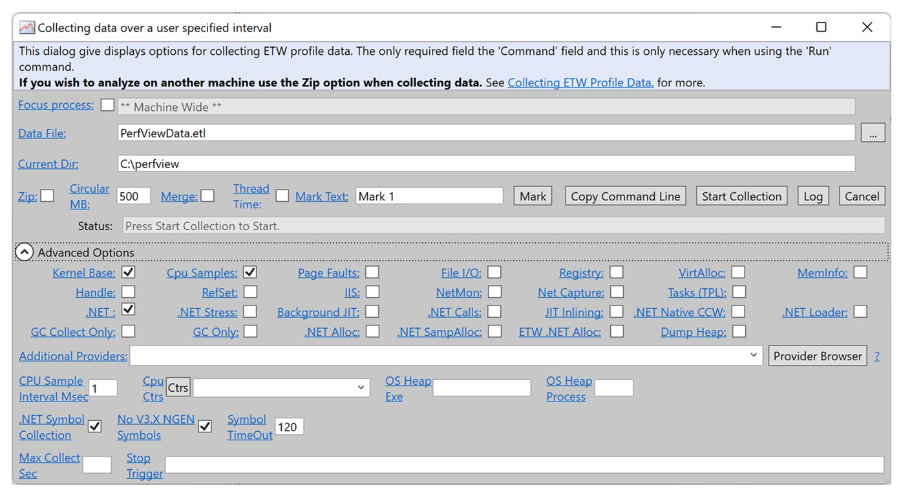<figcaption>Рисунок 3-17. Диалоговое окно коллекции PerfView с развернутым разделом «Расширенные настройки»</figcaption>
</figure>

Рассматривая доступные опции, вы заметите, что многие из них связаны с .NET. Стоит уделить немного времени, чтобы объяснить их, хотя они также описаны в справке инструмента, когда вы нажимаете на метку каждого флажка. Наиболее интересные опции с нашей точки зрения находятся в разделе Advanced Options:

  * .NET: Включает события по умолчанию от поставщиков .NET.

  * .NET Stress: Включает события от поставщиков .NET, связанные с нагрузочным тестированием самой CLR. Это редкие события, используемые внутри команды CLR.

  * GC Collect Only: Отключает всех других поставщиков и включает только поставщика .NET с событиями, связанными с GC. Это очень легкий вариант, который позволяет собирать базовую диагностическую информацию, связанную с GC, в течение длительного времени, не создавая слишком большие файлы ETL (т. е. ~200 МБ за целый день).

  * GC Only: Аналогично предыдущему варианту, в дополнение к включению стеков вызовов для выборочных выделений в куче GC (каждый раз, когда выделяется 100 КБ объектов).

  * .NET Alloc: Собирает стек каждый раз, когда объект выделяется в куче GC. Это очень дорогой вариант, который может замедлить вашу программу на несколько порядков. Этот вариант еще дороже, поскольку он загружает dll-файл профилировщика, который сообщает среде выполнения использовать медленный путь для выделения памяти, чтобы иметь возможность получать уведомления обо всех выделениях.

  * .NET SampAlloc: Включает события, генерируемые каждый раз, когда 10 КБ объектов выделяются в куче GC. Как и предыдущий вариант, он не основан на встроенных событиях ETW, а использует API CLR Profiler из внедренной библиотеки ETWClrProfiler в процессы, которые будут выдавать пользовательские события ETW, анализируемые PerfView.

  * ETW .NET Alloc: Это позволяет использовать события для выборки распределения, но вместо внедрения библиотеки на основе API Profiler оно основано на событии CSampledObjectAllocation, доступном в .NET Framework 4.5.3. Также обратите внимание, что GC будет использовать медленный путь для распределения для вычисления статистики распределения по типу, поэтому ожидайте возможного влияния на производительность приложения.

  * Finalizers: Включает события, связанные с процессом финализации внутри GC.

  * Additional providers: В этом поле вы можете перечислить любых дополнительных поставщиков, от которых вам нужны события. Его также можно использовать для тонкой настройки поставщиков, которые в любом случае были бы включены. Например, чтобы включить захват стека для исключений CLR, вы можете ввести

Microsoft-Windows-DotNETRuntime:ExceptionKeyword:Always:@ StacksEnabled=true

Также предоставляется обширная справка по использованию этого поля.

  * CPU Ctrs: Этот счетчик позволяет вам включать низкоуровневые счетчики, связанные с ЦП, такие как неверные предсказания ветвлений или промахи кэша. Имейте в виду, что вам придется отключить виртуализацию Hyper-V, чтобы иметь доступ к этим событиям.


  


__Примечание

Помимо рассмотренных опций для .NET, есть некоторые общие настройки, о которых следует помнить:

  * Zip: Упаковываем файлы в архив, чтобы можно было легко перенести все это для последующего анализа на другом компьютере.

  * Merge: Объединение файлов в один, но без создания отдельного ZIP-файла.


Вы можете пропустить эти две опции, если планируете проводить анализ на той же машине. Однако крайне важно отметить опцию Merge, если вы планируете проводить анализ на другой машине. Опция merge включает подготовку разрешения символов, поэтому если вы ее пропустите, большая часть собранных данных будет бесполезна на другом компьютере.

Анализ данных

С помощью PerfView вы можете открывать файлы .ETL, записанные как PerfView, так и любым другим инструментом контроллера ETW. После открытия образца файла ETL вы увидите тот же вид, что и на [рисунке 3-18](<#f-3-18>). С левой стороны доступны все подготовленные анализы — в зависимости от того, какие поставщики и какие события были выбраны во время записи сеанса.

<a id="f-3-18"></a>
<figure markdown="span" class="custom-figure">
  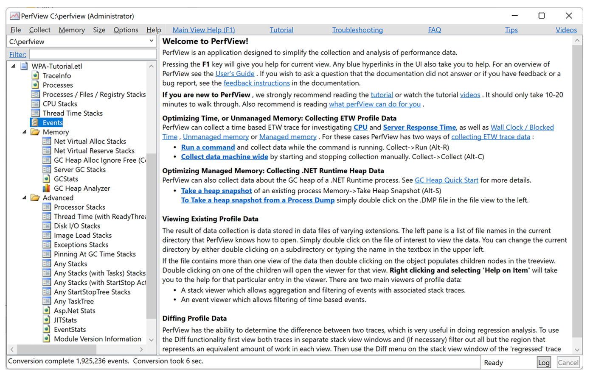<figcaption>Рисунок 3-18. Пример ETL-файла, открытого в PerfView</figcaption>
</figure>

Одним из самых базовых представлений является общая панель Events, позволяющая просматривать экземпляры всех записанных событий. Когда вы открываете ее и вводите «GC» в поле Filter, вы увидите все события DotNetRuntime, связанные с GC (см. [рисунок 3-19](<#f-3-19>)).

<a id="f-3-19"></a>
<figure markdown="span" class="custom-figure">
  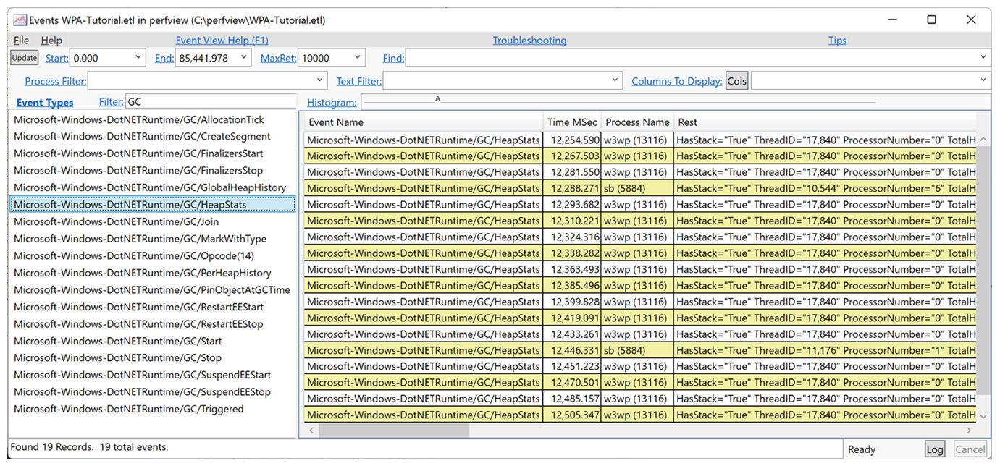<figcaption>Рисунок 3-19. PerfView – события, связанные с GC, отображаемые на панели События</figcaption>
</figure>

Как вы видите, были записаны события многих процессов .NET (sb и w3wp в файле-образце). Вам следует ввести «w3wp» в текстовом поле Process Filter и нажать Enter, чтобы вывести только события для этого процесса. Помните, что PerfView записывает события, испускаемые поставщиками всех запущенных процессов.

В дополнение к стандартным столбцам, связанным с каждым событием, есть также столбец Rest, содержащий поля полезной нагрузки события. Вы также можете выбрать определенное поле, нажав кнопку Cols. Например, отфильтруйте все события, кроме события Microsoft-Windows-DotNETRuntime/GC/HeapStats, введя часть его имени в поле Filter (например, HeapSt). Затем используйте кнопку Cols, чтобы выбрать все поля GenerationSize. Теперь вы должны увидеть таблицу статистики GC (см. [рисунок 3-20](<#f-3-20>)), которую можно вставить в Excel для более простого анализа.

<a id="f-3-20"></a>
<figure markdown="span" class="custom-figure">
  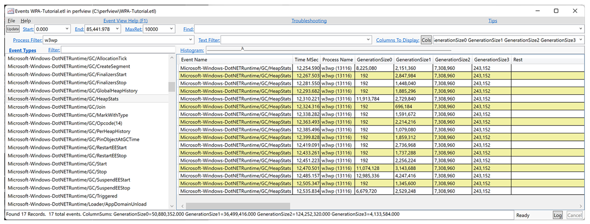<figcaption>Рисунок 3-20. PerfView – настраиваемый вид событий, связанных с GC</figcaption>
</figure>

Однако просмотр и анализ отдельных событий ETW утомителен. Когда дело доходит до анализа памяти .NET, самым важным представлением, несомненно, является представление GCStats, доступное из Memory Group в главном окне. Это представление включает в себя полную агрегированную информацию о поведении GC, включая статистику выполненных GC (см. [рисунок 3-21](<#f-3-21>)). Мы будем довольно часто рассматривать это представление в этой книге.

<a id="f-3-21"></a>
<figure markdown="span" class="custom-figure">
  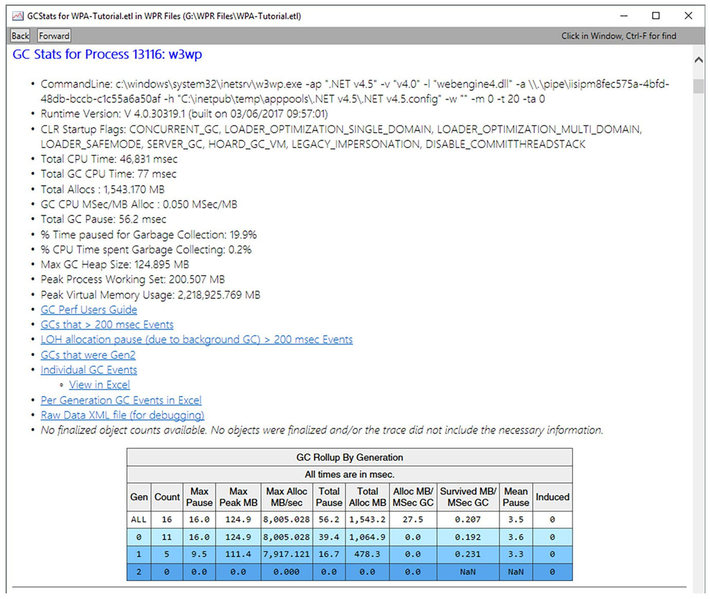<figcaption>Рисунок 3-21. PerfView – вид GCStats</figcaption>
</figure>

Кроме того, как вы могли видеть в столбце Rest на рисунке 3-19, выбранные события имеют атрибут HasStack = "True". Если вы хотите увидеть трассировку стека события, выберите одно из них и выберите Open Any Stacks в его контекстном меню (но будьте осторожны, вы должны щелкнуть правой кнопкой мыши в столбце Time MSec). Это откроет еще одно очень популярное представление PerfView: дерево вызовов (см. [рисунок 3-22](<#f-3-22>)).

<a id="f-3-22"></a>
<figure markdown="span" class="custom-figure">
  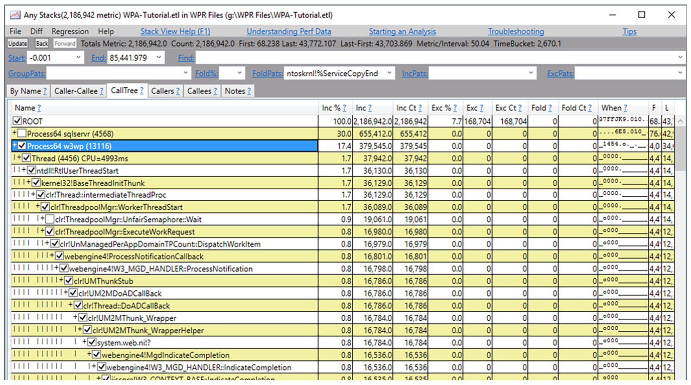<figcaption>Рисунок 3-22. PerfView – дерево вызовов</figcaption>
</figure>

Помните, если имя функции не распознано, выберите в контекстном меню пункт «Поиск символов», чтобы получить соответствующие символы.

Есть также много других, крайне полезных видов. Мы будем использовать их много раз в книге.

Снимки памяти

При выборе Take Heap Snapshot в меню Memory появляется окно Collecting Memory Data. Используйте поле Filter, чтобы найти интересующий вас процесс. После того, как вы выбрали его и нажали кнопку Dump GC Heap, вам нужно будет подождать несколько секунд, чтобы получить результаты. В главном окне PerfView должен появиться новый узел с именем процесса с суффиксом .gcdump. Разверните его и дважды щелкните узел Heap Stacks, чтобы получить более подробную информацию о выделенных объектах (см. [рисунок 3-23](<#f-3-23>)).

<a id="f-3-23"></a>
<figure markdown="span" class="custom-figure">
  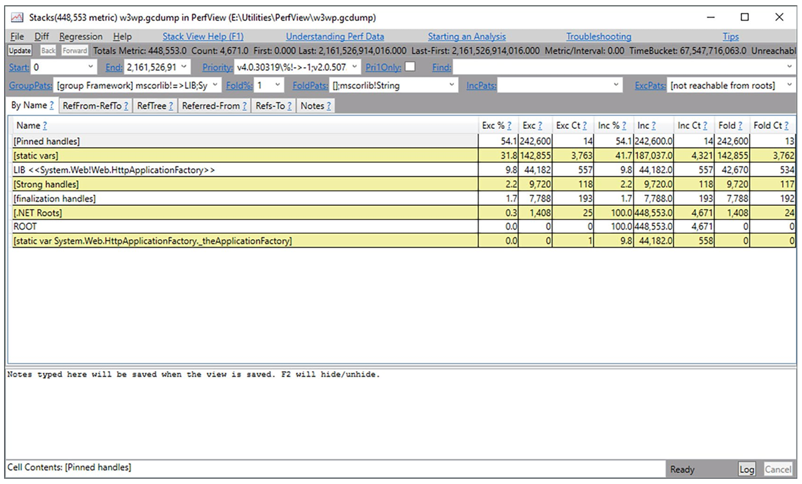<figcaption>Рисунок 3-23. PerfView – просмотр снимков памяти</figcaption>
</figure>


__Примечание

Снимок памяти — это не типичный дамп памяти — он не содержит всю память процесса. Это вид графика выделенных объектов (без содержимого их полей) и игнорирование всех неуправляемых областей памяти.

Обычное табличное окно отобразит справочное дерево, в котором узлы являются типами объектов или категориями типов. Например, изначально выбранная вкладка «По имени» показывает сводку всех экземпляров, найденных в памяти, сгруппированных по типу. Вы можете дополнительно исследовать данную запись, выбрав Память ➤ Просмотр объектов (или Alt+O) в контекстном меню. Давайте сделаем это для записи «[static vars]», чтобы увидеть список всех статических переменных в дампе памяти (см. [рисунок 3-24](<#f-3-24>)).

<a id="f-3-24"></a>
<figure markdown="span" class="custom-figure">
  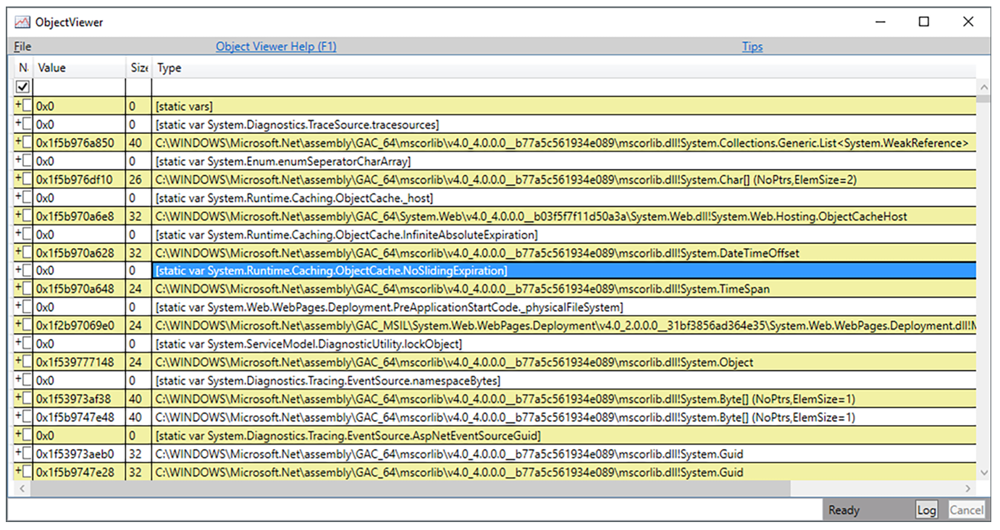<figcaption>Рисунок 3-24. PerfView – список всех статических переменных в памяти</figcaption>
</figure>

Здесь вы видите пары строк, указывающие, где была объявлена ​​данная статическая переменная и объект, назначенный ей, если таковой имеется. Если мы развернем этот объект, мы сможем исследовать его дальше, перемещаясь по всем его потомкам (полям).

Самая важная функция, связанная со снимками памяти, — это возможность их сравнения. Это позволяет быстро определить причину утечек памяти. Чтобы сравнить два снимка (созданных точно так же, как и раньше), откройте их оба и в меню Diff выберите опцию сравнения со вторым файлом. Вы увидите Diff Stacks, которые будут отображать данные аналогично одному снимку, но с важным отличием: значения столбцов будут указывать разницу между двумя файлами (см. [рисунок 3-25](<#f-3-25>)).

<a id="f-3-25"></a>
<figure markdown="span" class="custom-figure">
  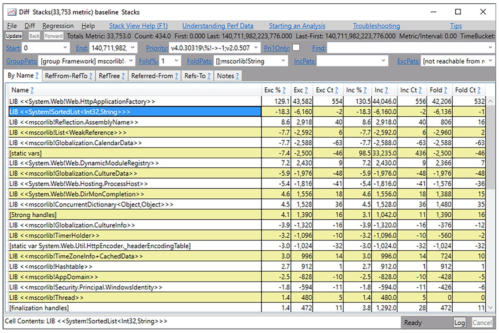<figcaption>Рисунок 3-25. PerfView – разница в снимке памяти</figcaption>
</figure>


__Примечание

Обратите внимание, что опция Freeze отключена по умолчанию в диалоговом окне Collecting Memory Data. Она контролирует, хотите ли вы остановить весь процесс во время создания снимка кучи. Это, очевидно, очень навязчиво, но даст более точные результаты. В производственной среде вам иногда может потребоваться отключить опцию Freeze, это к сожалению, может привести к несогласованным данным (поскольку снимок создается, пока приложение продолжает выделять объекты).

Настоящая сила PerfView — это низкие накладные расходы и способность анализировать производственные среды. Вы можете использовать его для мониторинга производительности в течение ограниченного периода времени или устранения неполадок в производстве. Он может собирать огромное количество данных, и с помощью этого инструмента можно диагностировать большинство проблем, связанных с производительностью или памятью. Единственным недостатком является крутая кривая обучения с очень общим пользовательским интерфейсом и всеми функциями, скрытыми здесь или там.

Конечно, вам следует быть осторожными с объемом информации, которую вы хотите собрать. Хотя накладные расходы инструмента невелики, сбор слишком большого количества событий не подойдет для использования в производстве. Сбор информации от нескольких поставщиков и нескольких выбранных ключевых слов не должен быть проблемой. Однако, как вы можете себе представить, сбор информации о стеке вызовов каждого выделения объектов приводит к неприемлемым накладным расходам. Самый простой принцип всегда является лучшим — прежде чем запускать желаемый набор данных, собранных в производственной среде, протестируйте его в своей предпроизводственной среде, чтобы увидеть, как он влияет на приложения и всю систему.

* * *

## Инструмент dotnet-trace CLI

Кроссплатформенным эквивалентом PerfView для сбора событий является инструмент CLI dotnet-trace. Команда collect записывает события из приложения, идентифицированного по идентификатору процесса с помощью -p. События сохраняются в файле с именем процесса в качестве префикса, за которым следуют дата и время, разделенные _. Используйте параметр -o, чтобы задать другое имя файла. Формат файла .nettrace понимается PerfView, где вы сможете анализировать события, как описано в предыдущем разделе. Однако также возможно сохранять события в формате Chromium или Speedcope с помощью параметра --format <Chromium | Speedscope>. Используйте параметр --duration, чтобы попросить dotnet-trace остановить запись после заданной продолжительности (в формате дд:чч:мм:сс).

Инструкции по установке см. в предыдущем разделе CLI.

Как и в случае с PerfView, вам нужно выбрать события, которые вы хотите записать. Здесь существуют те же понятия поставщика событий, ключевого слова и детализации. По умолчанию, в дополнение к некоторым событиям от поставщика Microsoft-Windows-DotNETRuntime, также включен пользовательский поставщик записи обхода стека с именем Microsoft-DotNETCore-SampleProfiler. Это позволяет вам анализировать выполнение потоков вашего приложения, однако влияние на производительность заметно. Кроме того, с этим профилем по умолчанию некоторые события GC, такие как AllocationTick, не записываются. Чтобы облегчить вам жизнь, был определен набор профилей, которые можно перечислить с помощью команды dotnet trace list-profiles:
    
    
            
    
    
                
    cpu-sampling  - Полезно для отслеживания использования ЦП и общей информации о времени выполнения .NET.
                    Это вариант по умолчанию, если профиль или поставщики не указаны.
    gc-verbose    - Отслеживает коллекции сборки мусора и выборку выделения объектов.
    gc-collect    - Отслеживает коллекции GC только с очень низкими накладными расходами.
    database      - Захватывает команды базы данных ADO.NET и Entity Framework Core.
                
            
    
    
        

Вы также можете выбрать ключевые слова и уровень детализации для определенных поставщиков с помощью параметра --providers со следующим синтаксисом:
    
    
            
    
    
                
    --providers Microsoft-Windows-DotNETRuntime:40000001:5
                
            
    
    
        

Первое числовое значение — это ключевые слова в шестнадцатеричном формате, за которыми следует уровень детализации. Если вам нужно сосредоточиться только на поставщике Microsoft-Windows-DotNETRuntime и вы не знаете числовые значения ключевых слов наизусть, смело используйте --clrleventlevel <от 0 до 5 для уровня детализации> с --clrevent, за которым следует имя ключевого слова, разделенное знаком +:
    
    
            
    
    
                
    --clrevents gc+stack --clreventlevel 5
                
            
    
    
        

Начиная с .NET 5.0, вы можете использовать -- для запуска приложения и записи его событий. Это полезно, если вам нужно диагностировать проблемы при запуске:
    
    
            
    
    
                
    dotnet trace collect --providers Microsoft-Windows-DotNETRuntime:40000001:5 --show-child-io
    -- C:\Apps\Simulator.exe
                
            
    
    
        

Параметр --show-child-io позволяет вам взаимодействовать с процессом, если он запущен как консольное приложение, и гарантирует, что вы получите все события с начала приложения. Обратите внимание, что если вы используете --duration, порожденный процесс будет завершен, когда dotnet-trace закончит запись.

* * *

## Инструмент dotnet-gcmon CLI

Если вам нужно подробно отслеживать запущенные сборки мусора, вы можете использовать инструмент dotnet-gcmon, написанный Маони Стивенсом (ведущим разработчиком .NET GC). Это эквивалент представления GCStats в PerfView, но настраиваемый, со статистикой кучи и в реальном времени!

После установки с помощью команды dotnet tool install dotnet-gcmon -g вам следует запустить ее с параметром -c, чтобы выбрать интересующие вас столбцы, как показано на [рисунке 3-26](<#f-3-26>).

<a id="f-3-26"></a>
<figure markdown="span" class="custom-figure">
  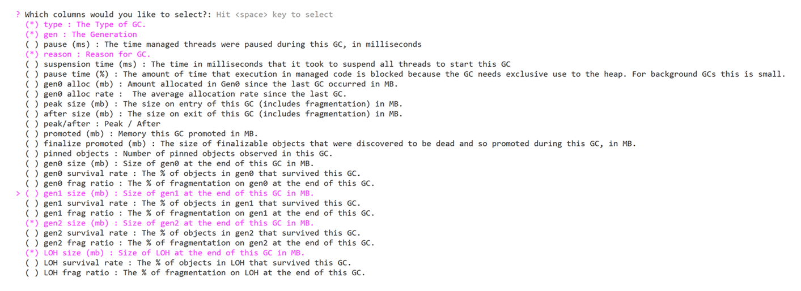<figcaption>Рисунок 3-26. dotnet-gcmon – выбор столбцов</figcaption>
</figure>

Далее вы можете выбрать таймер для регулярного отображения статистики кучи и минимальную продолжительность паузы сборки мусора, чтобы при необходимости отфильтровывать короткие сборки.

Затем вы можете использовать аргумент -p, за которым следует идентификатор процесса вашего приложения, чтобы просмотреть сведения о каждом сборщике мусора, как показано на [рисунке 3-27](<#f-3-27>).

<a id="f-3-27"></a>
<figure markdown="span" class="custom-figure">
  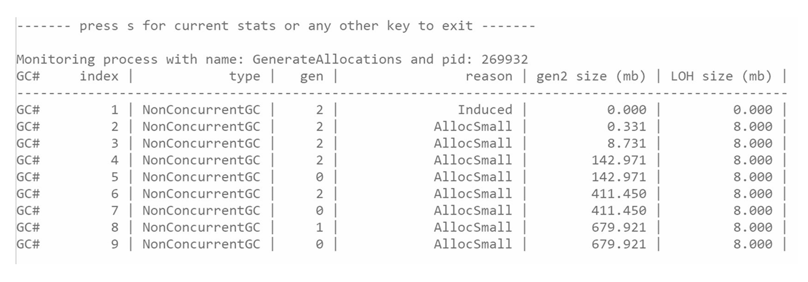<figcaption>Рисунок 3-27. dotnet-gcmon — список сведений о каждом сборщике мусора</figcaption>
</figure>

В дополнение к инструменту командной строки dotnet-gcmon, в репозитории <https://github.com/Maoni0/realmon> содержится отдельное приложение GCRealTimeMon, работающее только на Windows. Помимо функций, предоставляемых dotnet-gcmon, поколения имеют различные оттенки синего цвета (как в PerfView), а что более важно, оно показывает стек вызовов для инициированных сборок мусора, как это демонстрируется на [рисунке 3-28](<#f-3-28>), включая событие AllocationTick, соответствующее выделению памяти в LOH (Large Object Heap).

<a id="f-3-28"></a>
<figure markdown="span" class="custom-figure">
  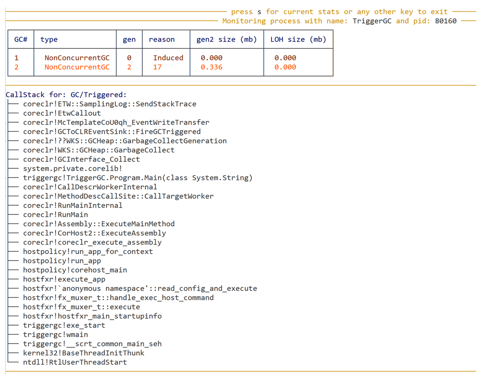<figcaption>Рисунок 3-28. GCRealTimeMon – получение стека вызовов индуцированных GC</figcaption>
</figure>

Обратите внимание, что этот инструмент необходимо запустить в оболочке с повышенными правами.

* * *

## ProcDump, dotnet-dump

Часто проблемы с памятью возникают после того, как приложение было развернуто в производстве. Тогда один из вариантов исследования — сделать дамп памяти проблемного приложения и проанализировать его в автономном режиме. Доступны различные инструменты для снятия дампа памяти. Мы хотели бы упомянуть два из них, поскольку они покрывают большинство стандартных потребностей. Эти инструменты устанавливаются как автономные инструменты и могут быть загружены с:

  * ProcDump: <https://learn.microsoft.com/en-us/sysinternals/downloads/procdump>

  * dotnet-dump: <https://learn.microsoft.com/en-us/dotnet/core/diagnostics/dotnet-dump>


ProcDump — это инструмент командной строки, который позволяет легко сделать дамп памяти приложения, зная идентификатор его процесса:
    
    
            
    
    
                
    procdump -ma <process_id>
                
            
    
    
        

Вы также можете определить многочисленные триггеры, например, когда использование памяти или потребление ЦП превышает заданный порог, а также любое другое заданное значение счетчика производительности. Существует множество других опций, например, периодическое получение дампов памяти и т. д. Посмотрите на подробную справку по командной строке ProcDump для списка всех доступных опций. Обратите внимание, что ProcDump также доступен для Linux.

dotnet-dump — это еще один кроссплатформенный инструмент CLI, предоставляемый Microsoft для захвата (и анализа, как мы увидим позже) дампов памяти. Фактически, он просит приложение .NET Core выполнить самосброс, отправляя команду через EventPipe в CLR, где запущено приложение. В результате создается двоичный файл createdump, установленный со средой выполнения .NET Core, для сброса памяти процесса в файл. Имейте в виду, что если он не работает, вам следует проверить разрешения, примененные к файлу createdump.

Самая короткая команда для захвата дампа:
    
    
            
    
    
                
    dotnet-dump collect -p <process_id>
                
            
    
    
        

Кроме того, вы можете указать имя файла дампа с помощью -o и то, что нужно сохранить в дампе, с помощью --type <Full, Heap или Mini>. В отличие от ProcDump, вы не можете задать условия для запуска генерации дампа.

Как и dotnet-counters, вы можете установить его с помощью .NET SDK, запустив dotnet tool install -g dotnet-dump. Или вы также можете загрузить его напрямую с <https://learn.microsoft.com/en-us/dotnet/core/diagnostics/dotnet-dump#install>.

* * *

## dotnet-gcdump CLI инструмент

Как объяснялось в предыдущем разделе, вы можете создавать снимки памяти с помощью PerfView в Windows. Если вам нужно сделать то же самое в Linux, PerfView не подходит. Вместо этого вы можете использовать инструмент CLI dotnet-gcdump. Как упоминалось в разделе о счетчиках .NET, его можно установить с помощью команды dotnet tool install -g dotnet-gcdump.

Команда collect создает файл с расширением .gcdump, который соответствует состоянию приложения, идентифицируемого по его идентификатору процесса, передаваемому через параметр -p. В отличие от procdump или dotnet-dump, этот файл не содержит дампа адресного пространства приложения. Он не хранит содержимое каждого объекта на куче, стека потока или загруженных модулей. Вместо этого он включает количество и размер экземпляров по классам, ссылки между типами и корни (roots). Именно это объясняет, почему размер файлов .gcdump намного меньше, чем у других файлов дампа памяти — на несколько порядков. Команда report позволяет получить список классов из файла .gcdump, отсортированный по их накопленному размеру экземпляров.

Создание файла .gcdump во многом зависит от сборщика мусора (Garbage Collector). Механизм взаимодействия с CLR работающего приложения .NET основан на ETW для .NET Framework и EventPipe для .NET. Сессия событий создается, когда провайдер Microsoft-Windows-DotNETRuntime активируется с подробным уровнем детализации для списка ключевых слов, соответствующих значению 0x1980001. Это действие указывает CLR выполнить полную сборку мусора, во время которой GC будет обходить оставшиеся живые объекты и генерировать огромное количество в основном недокументированных событий. Хотя влияние на приложение меньше, чем при создании реального дампа памяти, оно все же может быть заметным, если живут миллионы объектов, как из-за обычного воздействия сборщика мусора, так и из-за генерации миллионов событий.

Не вдаваясь в кровавые подробности, вот описание наиболее интересных событий:

  * GCBulkNode: Предоставляет массивы экземпляров с их адресом в памяти, их типом и их "количеством краев" (т.е. количеством ненулевых полей ссылочного типа)

  * GCBulkEdge: Предоставляет массивы экземпляров, на которые ссылаются, с их адресами


Эти события получаются парами: если количество ребер в первом узле события GCBulkNode равно двум, это означает, что первые два элемента в соответствующем событии GCBulkEdge будут двумя экземплярами, на которые ссылается первый объект в GCBulkNode, и так далее. Обработка этих двух типов событий позволяет восстановить граф живых объектов.

Некоторые события предоставляют список корней, которые поддерживают объекты в графе активными:

  * GCBulkRootEdge: Содержат массивы корневых экземпляров с их адресом и типом (например, стековая переменная)

  * GCBulkRootStaticVar: Содержат массивы статических объектов


Этот график живых объектов затем используется такими инструментами, как PerfView и Visual Studio, чтобы вы могли искать утечки памяти, как вы увидите в разделе «Сценарий 12-2 — Утечка памяти из-за событий» главы 12.

* * *

## WinDbg

Среди различных инструментов, представленных в этой главе, WinDbg безусловно является самым низкоуровневым. Вы можете использовать его для отладки ваших приложений .NET, самой среды CLR, а почему бы и нет — даже ядра операционной системы. Когда возникает необходимость анализировать, что происходит в приложении на основе его дампа памяти, WinDbg позволяет подробно изучать стеки потоков, содержимое кучи до уровня полей каждого объекта. Именно по этой причине мы иногда предпочитаем использовать WinDbg вместо более пользовательских инструментов, которые не предоставляют такого уровня детализации.

Кроме того, сейчас доступна полностью обновленная версия WinDbg с пользовательским интерфейсом на базе WPF, который немного приятнее и настраиваемым, чем оригинальная версия из набора инструментов Debugging Tools в Windows SDK/DDK. WinDbg можно скачать в Windows Store или напрямую по ссылке <https://aka.ms/windbg/download>.

WinDbg также может быть отличным инструментом для экспериментов, помогающим понять среду выполнения .NET. Вы можете подключиться к своему управляемому приложению и отлаживать его (и саму CLR), как вы привыкли делать в Visual Studio, но, кроме того, вы сможете использовать команды SOS (подробнее об этом позже). Но в контексте повседневной работы, если вам и нужно использовать WinDbg, то, вероятно, для анализа ранее сгенерированного дампа памяти.

  


__Примечание

WinDbg на самом деле является оберткой uI вокруг библиотеки DbgEng, которая отвечает за платформу отладки в Windows. Его истинная мощь в контексте анализа .NET заключается в расширениях, созданных специально для .NET, перечисленных ниже.

При запуске WinDbg щелкните меню Файл, чтобы решить, что именно следует отладить (см. [рисунок 3-29](<#f-3-29>)):

  * Повторное использование любого из последних действий — это особенно полезно при повторном присоединении к одному и тому же процессу или его запуске.

  * Запустить или присоединить к процессу — при выборе опции «Присоединить к процессу» будет отображен список всех запущенных процессов.

  * Открыть файлы дампа.


<a id="f-3-29"></a>
<figure markdown="span" class="custom-figure">
  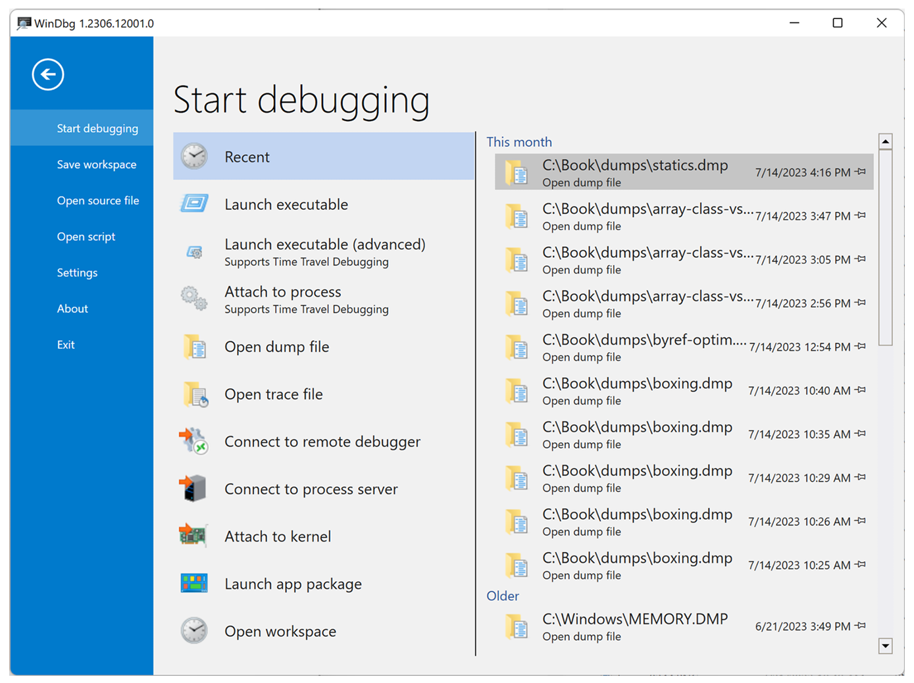<figcaption>Рисунок 3-29. WinDbg Окно запуска отладки</figcaption>
</figure>

WinDbg работает как собственный отладчик, поэтому он не понимает структуры и концепции, связанные с .NET. Вам нужно использовать расширения WinDbg, которые закроют этот пробел. Команда CLR создает самый важный из них, называемый SOS, с каждой версией CLR. Его название — это аббревиатура от Son of the Strike. Это связано с тем, что он является преемником отладочного инструмента Strike, который использовался во время разработки .NET Framework. Со старой версией SDK/DDK WinDbg вам приходилось вручную загружать его для дампов .NET Framework с помощью загадочной команды:

.loadby sos clr

Для ранних версий CoreCLR требовался еще один:

.loadby sos coreclr

По сути, эта команда сказала WinDbg искать sos.dll в той же папке, что и clr.dll или coreclr.dll. Для этих версий CLR файл был установлен вместе со средой выполнения. С текущей версией WinDbg правильная версия SOS будет автоматически загружена для вас: больше никаких загадочных команд для ввода!

Однако вам нужно знать крошечную деталь реализации. В какой-то момент было решено, что sos.dll будет поставляться как отдельный двоичный файл, а не с каждой установкой CLR. WinDbg поддерживает эту модель, загружая правильную версию SOS для .NET Framework и поставляется с версией SOS в папке C:\Program Files\WindowsApps\Microsoft.WinDbg_1.2303.30001.0_ x64__8wekyb3d8bbwe\amd64\winext\sos.

Если вы хотите загрузить более новую версию SOS, вам нужно выполнить несколько ручных шагов. Сначала установите инструмент CLI dotnet-sos на свой компьютер с помощью следующей команды:

dotnet tool install dotnet-sos -g

Затем установите соответствующий sos.dll:

dotnet sos install

Эта команда сообщает вам, где будет храниться sos.dll и какую команду следует ввести в WinDbg!

Execute '.load C:\Users\<your user>\\.dotnet\sos\sos.dll' to load SOS in your Windows debugger.

Вернитесь в WinDbg и посмотрите, какая версия SOS была автоматически загружена с помощью команды .chain.
    
    
            
    
    
                
    0:000> .chain
    Extension DLL search Path: ...
    Extension DLL chain:
        sos: image 6.0.351802+ca25fd472e7dd6501d4a85973e0d0326c856880d,  
        API 2.0.0, built Wed Oct 19 08:49:45 2022
            [path: C:\Program Files\WindowsApps\Microsoft.WinDbg_1.2303.30001.0_
            x64__8wekyb3d8bbwe\amd64\winext\sos\sos.dll]
                
            
    
    
        

При желании вы можете выгрузить эту версию с помощью команды .unload для очистки цепочки.

Теперь пришло время загрузить последнюю версию, введя команду dotnet sos install:

.load C:\Users\⁢your user>\\.dotnet\sos\sos.dll

Проверьте, установлена ​​ли правильная версия, введя .chain еще раз.

Стив Джонсон написал свое расширение для SOS под названием SOSEX. Его можно загрузить с <https://www.stevestechspot.com/default.aspx>. Оно добавляет более мощные функции, когда дело доходит до отладки управляемого кода и дампов памяти, но оно поддерживает только .NET Framework и может случайно зависнуть с дампами .NET Core.

NetExt (от Родни Вианы, доступно по адресу <https://github.com/rodneyviana/netext>) и MEX (Managed-code Debugging Extension, доступно по адресу [www.microsoft.com/en-us/download/details.aspx?id=53304](<https://www.microsoft.com/en-us/download/details.aspx?id=53304>)) — еще два расширения, которые позволяют нам делать более сложные вещи, чем два предыдущих.

Чтобы загрузить расширение, введите ту же команду .load, которую мы представили для SOS, но на этот раз с путем к файлу расширения .dll в качестве параметра, например следующим образом:

.load c:\Tools\Dumps\Extensions\Sosex\64bit\sosex.dll

Вам нужно позаботиться о том, какую DLL загружать, независимо от того, из какого приложения — из 32- или 64-разрядного приложения: всегда выбирайте одну и ту же разрядность. В случае несоответствия, вы должны получить следующую ошибку для команды .load:
    
    
            
    
    
                
    The call to LoadLibrary(C:\Tools\dumps\extensions\NetExt-2.1.65.5000\x86\netext.dll) failed, 
    Win32 error 0n193
        "%1 is not a valid Win32 application."
                
            
    
    
        

Проверьте конфигурацию отладчика и/или доступ к сети.

В этом примере дамп был создан из 64-разрядного приложения, а библиотека DLL — это версия расширения x86.

После загрузки расширения его экспортированные команды можно вызывать по имени с префиксом !. Например, SOS экспортирует команду threads для перечисления управляемых потоков; поэтому вам нужно ввести !threads. Но что, если несколько расширений экспортируют команду с одинаковым именем? Правило простое: будет вызвана команда расширения, находящегося наверху цепочки. Существует очевидный случай, когда вы действительно хотите ограничить область действия команды расширением: команда help обычно экспортируется всеми расширениями для документирования всех их команд. В этом случае просто добавьте к имени команды префикс имени расширения, например

!sos.help

Это позволит вам получить доступ к справке любого расширения, не нарушая цепочку расширений.

Есть еще один полезный трюк, который можно использовать с WinDbg – окна дерева команд. Поскольку вводить команды снова и снова довольно обременительно, вы можете создать файл со структурированным списком доступных команд. Затем, используя команду .cmdtree <file>, вы можете создавать специальные окна со всеми этими командами, доступными просто щелчком.

* * *

## dotnet-dump для анализа

Ранее мы описали, как можно использовать dotnet-dump для дампа памяти приложения .NET Core с помощью его команды collect. С командой analyze, за которой следует путь к файлу дампа, dotnet-dump запускает интерактивный сеанс, в котором можно вводить те же команды, что и SOS. В отличие от WinDbg, вам не нужно добавлять к командам префикс в виде символа "!".

Даже если WinDbg может загрузить дамп памяти, сгенерированный в Linux, если вам нужно проанализировать такой дамп непосредственно на компьютере с Linux, dotnet-dump analyze спасет вас, поскольку это кроссплатформенный инструмент CLI!

* * *

## Дизассемблеры и декомпиляторы

Хотя это и не связано напрямую с темой управления памятью, иногда может быть полезно понять, как работает приложение — без его исходного кода. Как вы скоро увидите, скомпилированный код промежуточного языка .NET довольно прозрачен. Существуют инструменты, которые показывают этот скомпилированный код, как если бы это был код C#. Одним из лучших, который мы будем использовать, является бесплатный и открытый исходный код dnSpy, созданный на GitHub пользователем 0xd4d и доступный по адресу <https://github.com/0xd4d/dnSpy>. Этот инструмент позволяет не только видеть декомпилированный код, но и отлаживать и изменять его. Мы будем использовать его для декомпиляции как библиотеки базовых классов .NET, так и приложений, созданных с помощью .NET.

Существуют и другие популярные инструменты, такие как ILSpy или JetBrains dotPeek, но dnSpy будет особенно полезен из-за возможностей редактирования и его будет достаточно для наших целей.

Когда придет время посмотреть на сгенерированный ассемблерный код, вы можете зайти на [sharplab.io](<https://sharplab.io/>). Просто введите свой код C# и посмотрите на панель справа, чтобы увидеть результат JIT-компиляции, как показано на [рисунке 3-30](<#f-3-30>).

<a id="f-3-30"></a>
<figure markdown="span" class="custom-figure">
  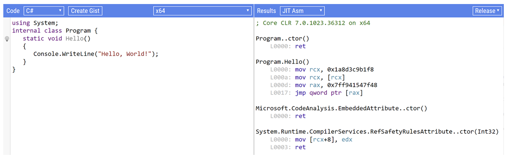<figcaption>Рисунок 3-30. От C# до JIT-ассемблерного кода с sharplab.io</figcaption>
</figure>

* * *

## BenchmarkDotNet

Если вас волнует производительность, вам часто нужно измерять время выполнения или распределение определенных фрагментов кода. Это будет особенно полезно в этой книге, потому что мы сравним эффекты различных методов оптимизации. Библиотека BenchmarkDotNet делает именно это и даже больше. Вы можете использовать ее для тестирования производительности каждого метода и удобно сравнивать их. Вы можете тестировать с различными версиями .NET, конфигурациями JIT и GC и т. д. и т. п.

Написание микро-бенчмарков — сложная задача, и эта библиотека заботится о том, чтобы избежать любых ошибок, которые вы можете допустить. Она делит выполнение на несколько этапов, чтобы позаботиться о разминке и измерить базовые накладные расходы. Тесты проводятся во многих итерациях, а количество итераций автоматически корректируется в соответствии с характеристиками вашего кода. Все измерения обрабатываются статистически. Рассчитываются процентили, а также обнаруживается мультимодальное распределение данных (включая визуальное представление упрощенной гистограммы). В результате вы получаете мощный, но очень простой в использовании инструмент.

Подготовка простого теста проиллюстрирована в [листинге 3-5](<#l-3-5>). Как вы видите, большая часть конфигурации выполняется через атрибуты. Вы также можете добавлять параметры для создания различных вариаций бенчмарка (например, N в нашем примере).
    
<a id="l-3-5"></a>
<figure class="custom-code-wrapper"
        markdown="1">

``` csharp title="listing-3-5.cs" linenums="1"
[BenchmarkDotNet.Attributes.Jobs.ShortRunJob]
[MemoryDiagnoser]
public class TailCallTest
{
  [Params(5, 10, 20)]
  public int N { get; set; }
  [Benchmark]
  public long FibonacciRecursive()
  {
      return FibonacciRecursiveHelper(N);
  }
  private long FibonacciRecursiveHelper(long n)
  {
      if (n < 3)
          return 1;
      return FibonacciRecursiveHelper(n - 2) + FibonacciRecursiveHelper(n - 1);
  }
}
```

  <figcaption>Листинг 3-5. Пример теста BenchmarkDotnet</figcaption>
</figure>

Чтобы выполнить тест, представленный в [листинге 3-5](<#l-3-5>), достаточно просто вызвать `BenchmarkRunner. Run<TailCallTest>()` в вашей программе. Результат этого теста (см. [рисунок 3-31](<#f-3-31>)) показывает среднее время выполнения каждого метода для каждого параметра и для двух разных JIT (Just In Time) компиляторов, что приводит к богатым статистическим данным о результатах.

<a id="f-3-31"></a>
<figure markdown="span" class="custom-figure">
  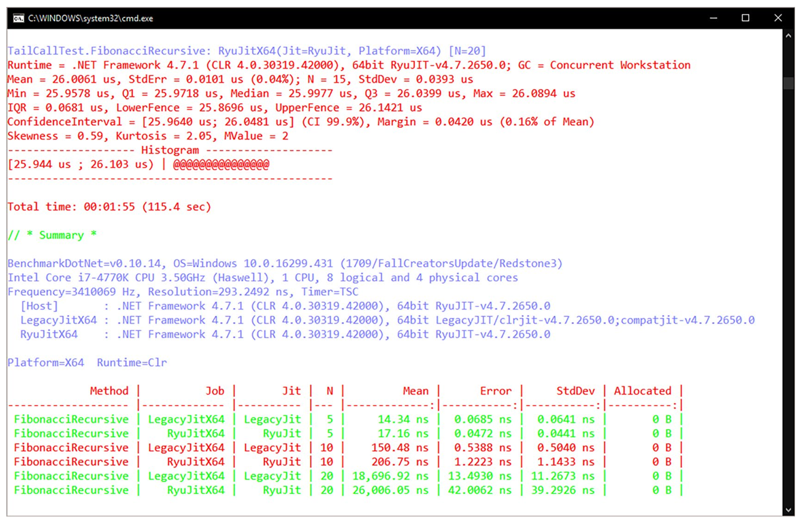<figcaption>Рисунок 3-31. Результаты теста BenchmarkDotnet</figcaption>
</figure>

Вы также можете расширить библиотеку дополнительными регистраторами, анализаторами, диагностами и т. д. Два из них особенно интересны для этой книги. GC и Memory Allocation Diagnoser (MemoryDiagnoser) анализируют, сколько сборок мусора произошло и сколько выделений было сделано во время теста. Также есть Hardware Counters Diagnoser (HardwareCounters), который доступен только в Windows и может предоставить глубокое понимание статистики, связанной с оборудованием, такой как промахи кэша ЦП.

* * *

## Инструменты от авторов

Мы не могли закончить этот раздел, не упомянув наши собственные инструменты, созданные на основе опыта, полученного при написании этой книги.

**GummyCat**

GummyCat, созданный Кевином Госсом, представляет собой инструмент, который обеспечивает визуализацию активности сборщика мусора с эстетикой «программы дефрагментации» (см. [рисунок 3-32](<#f-3-32>)).

<a id="f-3-32"></a>
<figure markdown="span" class="custom-figure">
  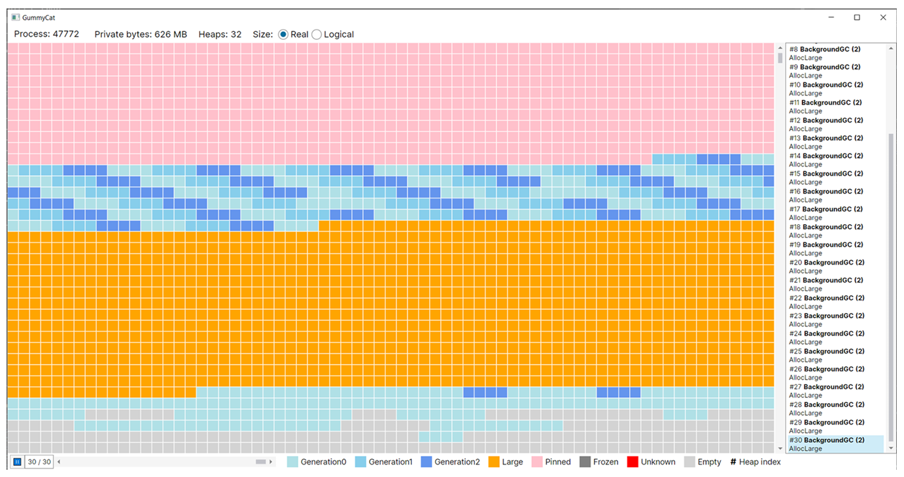<figcaption>Рисунок 3-32. Визуализация областей GC в GummyCat</figcaption>
</figure>

Хотя он работает с сегментами, на самом деле он был разработан для использования с регионами. Каждый квадрат представляет 1 МБ памяти, а цвет указывает на логическое назначение этой памяти GC (gen 0, gen 1, gen 2, LOH, POH, …). Это отличный способ увидеть эволюцию куч с течением времени и лучше понять, как GC реорганизует свою память с каждой сборкой.

Инструмент можно установить из командной строки с помощью dotnet tool install --global gummycat.

Более подробное описание инструмента можно найти на сайте <https://minidump.net/gummycat/>.

**dotnet-counters-ui**

Этот кроссплатформенный пользовательский интерфейс от Конрада Кокосы позволяет вам наблюдать за счетчиками .NET на Windows, Linux и macOS. Более подробную информацию можно найти на <https://github.com/kkokosa/dotnet-counters-ui>.

**dotnet-gcstats**

Этот инструмент .NET CLI от Кристофа Насара показывает в реальном времени детали запущенной сборки мусора в любом приложении .NET. Используйте dotnet tool install --global dotnet-gcstats для его установки. Исходный код доступен на <https://github.com/chrisnas/GCStats>.

**dotnet-fullgc**

С помощью этого инструмента .NET CLI от Кристофа Насара вы сможете запустить полную сборку мусора в любом приложении .NET. Используйте dotnet tool install --global dotnet-fullgc для его установки. Исходный код доступен на <https://github.com/chrisnas/GCStats>.

* * *

## Коммерческие инструменты

Инструменты, обсуждавшиеся до сих пор, бесплатны. Хотя они предлагают мощные возможности, иногда их использование довольно обременительно. С другой стороны, коммерческие программы с самого начала пишутся для приятного пользовательского интерфейса. Позже вы найдете краткий список существующих инструментов (на момент написания), которые вы могли бы использовать во время своих расследований.

**Visual Studio**

Трудно представить себе разработчика .NET, который никогда не пользовался Visual Studio. Это действительно мощный и надежный инструмент программирования. Помимо общеизвестных функций, он также предоставляет возможности для мониторинга и анализа памяти:

  * Бесплатное расширение «Clr Heap Allocation Analyzer» обнаруживает не столь очевидные выделения памяти в вашем коде.

  * Открытие файлов дампа памяти и их анализ на предмет использования объектов, включая статистику, отдельные экземпляры объектов и ссылки между ними (доступно только в редакции Enterprise). Файлы .gcdump также можно просматривать и сравнивать, например, во время поиска утечек памяти.

  * Также возможно профилирование в реальном времени. Конечно, вас заинтересует инструмент Memory Usage, но есть также инструменты CPU Usage и GPU Usage. При его использовании вы получаете предварительный просмотр текущего потребления памяти и случаев GC. В любое время вы также можете сделать снимок, который предоставит вам статистику о выделенных управляемых объектах.

**Scitech .NET Memory Profiler**

Инструмент Scitech — один из доступных специализированных инструментов для анализа .NET. Он предоставляет очень мощные возможности для просмотра статуса объектов, включая разбивку по разным поколениям, достижимость объектов и т. д. Вы можете использовать его для отображения очень сложных справочных графиков.

Бесплатная программа командной строки NmpCore позволяет проводить диагностические сеансы, в том числе в производственных средах. Вы можете проанализировать их позже в .NET Memory Profiler.

**JetBrains DotMemory**

JetBrains известен многим людям в мире .NET благодаря своему инструменту ReSharper. Однако у компании также есть превосходные продукты для профилирования ЦП (dotTrace) и памяти (dotMemory). Несмотря на то, что dotTrace обеспечивает высокоуровневое представление распределений, нас больше интересует второй вариант. dotMemory предназначен для профилирования приложений в реальном времени, а также предлагает возможность анализа дампа памяти. Можно удаленно профилировать приложения на другой машине, что может быть полезно в средах выше уровня разработки.

DotMemory предоставляет несколько интересных визуализаций, включая фрагментацию кучи. Вы также быстро узнаете, какие объекты имеют наибольший сохраненный размер.

Стоит также упомянуть два соседних инструмента. dotMemory Unit позволяет выполнять модульные тесты, учитывающие потребление памяти. Его можно включить в Visual Studio как часть фреймворка модульного тестирования или в ваш процесс непрерывной интеграции. Второй инструмент — это расширение Heap Allocations Viewer для вышеупомянутого расширения ReSharper Visual Studio. Он поддерживает статический анализ нашего кода в отношении нежелательных скрытых выделений (о них мы поговорим в Главе 5).

**RedGate ANTS Memory Profiler**

Инструмент RedGate является одним из первых инструментов, которые мы использовали в своей карьере. С точки зрения пользовательского опыта он очень похож на инструмент JetBrains. Он прост в использовании, не перегружает пользователя множеством настроек и старается предоставить как можно больше ответов до того, как потребует ввода от пользователя.

**Intel VTune Amplifier and AMD CodeAnalyst Performance Analyzer**

Помимо типичных профайлеров кода и памяти, существуют инструменты, предназначенные для низкоуровневого аппаратного профилирования вашего кода, обычно предоставляемые производителями процессоров. Два продукта, упомянутые в заголовке, от AMD и Intel — это коммерческие платные инструменты. Они предлагают гораздо более глубокий анализ, выходящий за рамки классического профилирования кода, которое показывает, какие методы выполняются дольше всего. Вы можете получить информацию от аппаратных счетчиков, встроенных в аппаратное обеспечение (процессор, видеокарта), о его внутреннем поведении — использовании кэша и памяти, простоях в конвейере и многом другом.

Большинству разработчиков .NET не придется интересоваться такими деталями. Однако они могут оказаться очень полезными, когда придет время тонкой настройки вашего приложения, особенно если вы планируете оптимизировать горячие пути и циклы, выполняемые миллионы раз.

На самом деле, только такие низкоуровневые инструменты могут четко указать нам на проблемы, подобные ложному совместному использованию (false sharing), которое было описано во второй главе. Следовательно, использование таких инструментов очевидно требует низкоуровневых знаний об аппаратном обеспечении, среде выполнения .NET и даже языке ассемблера. Также стоит отметить, что оба инструмента доступны для Windows и Linux.

**Datadog, Dynatrace, and AppDynamics**

Помимо множества инструментов, предназначенных исключительно для управления памятью .NET, существует множество инструментов более высокого уровня для мониторинга производительности приложений в целом. Они обеспечивают отличное понимание приложения и особенно хорошо подходят для производственных или предпроизводственных сред. Поскольку управление памятью является важным аспектом приложений .NET, инструменты, которые поддерживают эту платформу, также обеспечивают удобное понимание использования памяти приложением.

Такие так называемые инструменты Application Performance Management (APM) от поставщиков, перечисленных в заголовке, являются прекрасными примерами такого подхода. Постоянный мониторинг приложений на предмет проблем и их влияния на конечного пользователя даже более ценен, чем даже самые сложные инструменты, которые работают только на локальном компьютере разработчика.

Двое из авторов работают в Datadog на продуктах .NET APM.