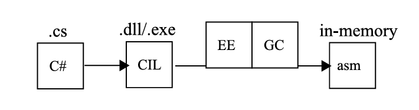
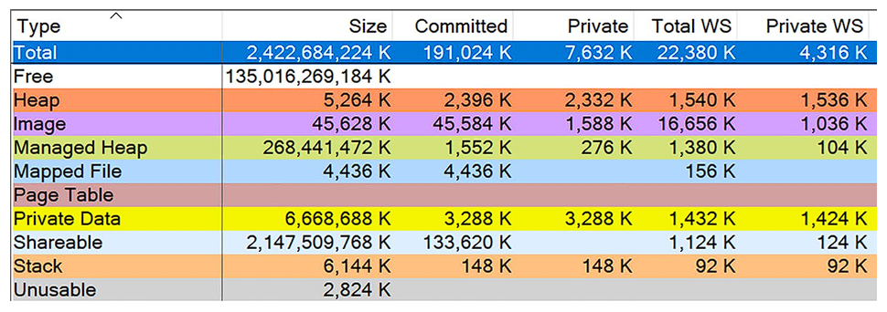
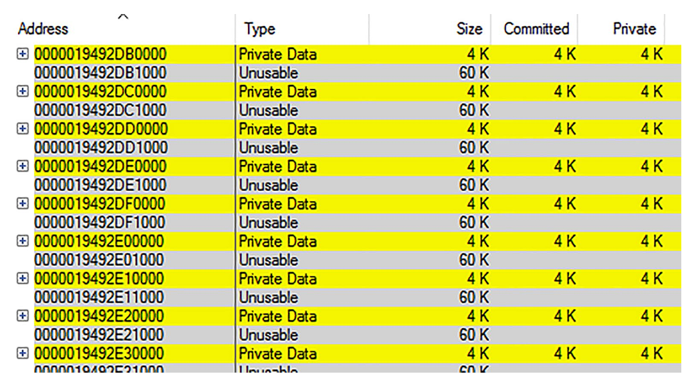
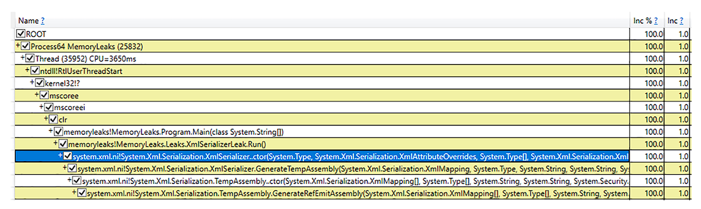

---
title: Chapter4
description: Перевод главы из книги Pro .NET Memory Management
---

Глава 4: Основы .NET

* * *

Хотя мы находимся только в четвертой главе, мы уже прошли довольно длинный путь, изучая различные аспекты управления памятью. Они обсуждались в общем виде, чтобы сделать более теоретическое введение в эту тему. Упоминания .NET были редкими, несмотря на то, что это основная тема книги. Пришло время изменить этот баланс. С этой главы и до конца книги .NET будет сопровождать нас постоянно. В этой главе мы рассмотрим его с несколько более широкой перспективы, вы узнаете о некоторых механизмах, лежащих в его основе, и начнем углубляться в темы, связанные с тем, как он управляет памятью. Мы настоятельно рекомендуем вам уделить время и прочитать предыдущие три главы, прежде чем продолжать чтение этой. Отныне мы также будем предполагать наличие базовых знаний о языке ассемблера для платформ x86/x64, так как мы будем углубляться все дальше и дальше в .NET. Если вам нужно освежить знания, прочитайте, например, отличную книгу «Modern X86 Assembly Language Programming 3rd edition» Дэниела Куссвура (Apress, 2023).

Платформа .NET Framework была представлена публике в июле 2000 года на конференции Professional Developers Conference во Флориде. Это продукт, который разрабатывается и используется уже более двух десятилетий. За этот период как богатая коллекция сопровождающих библиотек, так и сама среда выполнения значительно эволюционировали. Разработчикам .NET необходимо хорошо знать базовые темы — знание стандартной библиотеки и синтаксиса C#. Это наш «повседневный хлеб». Кроме того, .NET Core привнес новые функции и инструменты, которые поддерживают не только Windows как платформу. Цель этой главы — немного углубиться в .NET и его основы.

  

__Примечание

Имейте в виду, что эта книга сосредоточена на управлении памятью, лишь кратко упоминая другие темы, связанные с .NET. Таким образом, не ожидайте, например, подробного описания возможностей языка C# или рассмотрения вопросов многопоточности. Существует множество других замечательных книг и онлайн-материалов, посвященных исключительно этим темам.

* * *

Версии .NET

Среда .NET не так однородна, как может показаться на первый взгляд. .NET Framework, предназначенный только для Windows, развивался от версии 1.0 через версии 2.0, 3.5 или 4.0 до текущей версии 4.8. Кроссплатформенный .NET Core начался с версии 1.0, за которой последовали версии 2.x, 3.0 и 3.1, после чего он сменил название на просто «.NET» с версиями 5, 6, 7 и теперь 8. С самого начала вся концепция .NET основывалась на спецификации, называемой Common Language Infrastructure (CLI). Этот фундаментальный технический стандарт (стандартизированный как ECMA-335 и ISO/IEC 23271 в 2003 году) описывает концепцию кода и среды выполнения, которая позволяет использовать его на разных машинах без перекомпиляции. Мы будем ссылаться на него много раз в этой главе, так как нет более надежного источника информации, чем этот.

Описание всех компонентов CLI, включая все варианты реализации и различия между ними, очень заманчиво. Однако мы в основном сосредоточимся на том, как они влияют на тему, которая нас интересует. Сейчас давайте просто взглянем на различные вариации .NET в контексте управления памятью и сборки мусора (Garbage Collection):

  * .NET Framework 1.0–4.8.1: Выпущенный в 2002 году, это коммерческий и наиболее зрелый продукт, известный всем нам. Он доступен уже много лет, и ядро сборщика мусора (Garbage Collector) разрабатывалось и улучшалось от версии к версии. На протяжении многих лет эта тема рассматривалась как «черный ящик», описываемый более или менее поверхностно по случаю выпуска новых версий .NET. Поскольку коммерческий код среды выполнения .NET Framework закрыт, документация, предоставляемая Microsoft, была единственным способом узнать, как работают эти механизмы. Информация была достаточно подробной, что позволяло понимать и диагностировать проблемы с памятью в приложениях. Однако разработчики все же оставались немного неудовлетворенными, особенно если сравнивать это с открытостью исходных кодов, например, в Java.

  * Shared Source CLI (также известный как Rotor): Выпущенный в 2002 году (версия 1.0) и 2006 году (версия 2.0), это реализация среды выполнения для образовательных и академических целей. Он никогда не предназначался для запуска производственного кода. Он позволяет заглянуть в многочисленные детали реализации CLR. Даже существует отличная книга «Shared Source CLI Essentials» Дэвида Штуца, Теда Ньюарда и Джеффа Шиллинга (O’Reilly Media, 2003), которая подробно описывает эту реализацию. Однако она не полностью реализовывала «зрелую» версию .NET Framework 2.0. Более того, ее реализация иногда сильно отличалась от полноценной CLR, к сожалению, особенно в области управления памятью. Там был реализован только очень упрощенный сборщик мусора (Garbage Collector).

  * .NET Compact Framework: «Мобильная» версия .NET, начиная с времен Windows CE/Mobile и Xbox 360. Ее сборщик мусора (Garbage Collector) значительно отличался от основной версии и был намного упрощен, например, он не включал концепцию поколений (о которой вы узнаете в следующей главе). Однако это уже историческая система, и вероятно вам больше не нужно о ней беспокоиться. Но множество уроков было извлечено в процессе разработки этой платформы, особенно из-за портирования на различные платформы с разными процессорами. Именно здесь концептуально начался .NET Core.

  * Silverlight: Плагин для веб-браузера, который позволял запускать веб-приложения как обычные оконные приложения. Поскольку Microsoft начала разработку примерно в то же время, что и .NET Framework 3.0, он был основан на копии среды выполнения того периода.

  * .NET Core или просто .NET, начиная с версии 5.0: Многое изменилось с появлением открытой версии .NET. Теперь у нас есть готовый к использованию в производстве код среды выполнения, который мы можем изучать самостоятельно и в деталях. Что еще важнее, код сборщика мусора (Garbage Collector) был практически скопирован сюда из коммерческого кода среды выполнения, поэтому изучение .NET Core дает понимание того, как GC реализован в .NET Framework, особенно учитывая, что новые функции теперь сначала реализуются в .NET Core, а затем переносятся в .NET Framework. .NET Core также является официально поддерживаемым кроссплатформенным решением. Он работает на Windows, Linux и MacOS, а также поддерживает процессоры ARM64.

  * Windows Phone 7.x, Windows Phone 8.x, и Windows 10 Mobile: Более ранние версии системы были основаны на простом управлении памятью, известном из .NET Compact Framework 3.7. Windows Phone 8.x представил значительные улучшения внутренней среды выполнения .NET, которая была основана на зрелой версии .NET Framework 4.5, унаследовав ее сборщик мусора (Garbage Collector).

  * Native AOT (эволюция .NET Native и CoreRT): Технология, которая позволяет компилировать CIL-код напрямую в машинный код. Она основана на облегченной среде выполнения под названием CoreRT (ранее MRT). Они используют общий код сборщика мусора (Garbage Collector) с .NET Core.

  * .NET Micro Framework: Отдельная реализация для небольших устройств с открытым исходным кодом. Наиболее популярным приложением является .NET Gadgeteer, который содержит собственную упрощенную версию сборщика мусора (Garbage Collector). Из-за нишевого и любительского характера этого решения мы не будем рассматривать его в этой книге.

  * WinRT: Новый способ предоставления функциональности ОС разработчикам, который представляет собой набор API, используемых для создания приложений в стиле Metro, доступных на языках JavaScript, C++, C# и VB.NET, и призван заменить Win32. Он написан на C++ и, по сути, не является реализацией .NET. Однако он объектно-ориентирован и основан на формате метаданных .NET, поэтому может выглядеть как обычная библиотека .NET (особенно при использовании из .NET).

  * Mono: Совершенно отдельная кроссплатформенная реализация CLI с собственным управлением памятью. Знакомство с ней мало что дает для понимания основной темы .NET. Однако существует как минимум два очень популярных решения, основанных на этой технологии — Xamarin, фреймворк для написания мобильных приложений, и Unity, популярный игровой движок. Кроме того, фреймворк Blazor WebAssembly также использует Mono в качестве базовой среды выполнения (перекомпилированной в WASM) для выполнения управляемого кода внутри браузера. Из приведенного списка складывается довольно положительная картина — механизм управления памятью очень похож (если не сказать практически идентичен) для всех основных реализаций CLI, используемых в настоящее время — .NET Framework, .NET Core и той, что используется в .NET Native.

  

__Примечание

Эта книга полна объяснений о внутренних механизмах сборщика мусора (Garbage Collector) в .NET, основанных на исходном коде .NET 8. Как мы уже упоминали, существует значительное сходство этой реализации с основной версией .NET Framework и мобильной вариацией. В результате, опора на исходный код .NET Core является очень ценным и всеобъемлющим способом получения информации. В дальнейшем, когда мы будем показывать примеры исходного кода .NET, по умолчанию будем иметь в виду исходный код .NET 8.0, если не указано иное. Мы также ссылаемся на так называемую открытую документацию «Book of the runtime», разработанную параллельно с самой средой выполнения, доступную по адресу <https://github.com/dotnet/runtime/tree/main/docs/design/coreclr/botr>. Она содержит много ценной информации о реализации среды выполнения.

Чтобы полностью понять тему управления памятью, вам следует знать некоторые внутренние аспекты .NET. Мы рассмотрим их сейчас, однако, опустив много информации, которая не нужна в данном контексте. Существует множество других ценных источников, где вы найдете больше информации, включая замечательную книгу «CLR via C#» Джеффри Рихтера (Microsoft Press, 2012), «Pro .NET Performance» Саши Гольдштейна (Apress, 2012) и «Writing High-Performance .NET Code» Бена Уотсона (Ben Watson, 2014).

* * *

Внутреннее устройство .NET

Когда вы пишете программу на C или C++, компилятор преобразует исходный код в исполняемый файл. Этот файл может быть напрямую выполнен на целевой машине, так как он содержит двоичный код, который процессор может выполнять напрямую.

С другой стороны, среда выполнения .NET имеет множество важных дополнительных обязанностей, чтобы иметь возможность выполнять наши приложения. В отличие от программ, написанных на C или C++, когда вы пишете программу на C#, F# или любом другом языке, совместимом с .NET, она компилируется в CIL (Common Intermediate Language, общий промежуточный язык). Среда выполнения CLR (Common Language Runtime) выполняет множество магических действий, прежде чем приложение сможет запуститься. Над CLR существует более общая концепция всего .NET Framework, включая все стандартные библиотеки и инструменты (поэтому у нас есть различные версии .NET Framework, которые могут или не могут включать изменения в среде выполнения). CLR имеет несколько обязанностей, среди которых можно выделить:

  * JIT-компилятор (Just-in-Time компилятор): Его функция заключается в преобразовании CIL-кода вызываемых методов в машинный код.

  * Система типов: Она отвечает за механизмы контроля типов и их совместимости. Она включает, среди прочего, Common Type System (CTS, общую систему типов) и некоторые метаданные (используемые механизмом Reflection).

  * Обработка исключений: Она отвечает за обработку исключений как на уровне пользовательской программы, так и на уровне самой среды выполнения. Здесь используются как встроенные механизмы операционных систем (например, Windows SEH, Structured Exception Handling), так и исключения C++.

  * Управление памятью (часто называемое сборщиком мусора, Garbage Collector): Это целая часть среды выполнения, которая управляет памятью, используемой средой выполнения и нашими приложениями. Очевидно, одна из ее основных обязанностей — забота об автоматическом освобождении объектов, которые больше не нужны.

Мы часто разделяем эти обязанности на две основные части:

  * Execution Engine (Исполняющая система): Она отвечает за большинство обязанностей среды выполнения, упомянутых ранее, таких как JIT-компиляция и обработка исключений. В ECMA-335 она называется Virtual Execution System (VES, Виртуальная исполняющая система) и описывается как «ответственная за загрузку и выполнение программ, написанных для CLI. Она предоставляет услуги, необходимые для выполнения управляемого кода и данных, используя метаданные для соединения отдельных сгенерированных модулей во время выполнения».

  * Сборщик мусора (Garbage Collector): Он отвечает за управление памятью, выделение объектов и освобождение областей памяти, которые больше не используются. В ECMA-335 он описывается как «процесс, посредством которого выделяется и освобождается память для управляемых данных».

Все эти элементы работают вместе, как в хорошо слаженной машине, состоящей из множества больших и маленьких частей. Трудно удалить один из них и ожидать, что вся машина продолжит работать. То же самое относится и к управлению памятью. Мы можем говорить о механизмах управления памятью, но важно понимать, что другие компоненты тесно взаимодействуют с ним. Например, JIT-компилятор создает информацию о времени жизни переменных, которая затем используется сборщиком мусора. Система типов предоставляет информацию, необходимую для принятия ключевых решений — например, имеет ли тип так называемый финализатор. Реализация P/Invoke учитывает механизмы освобождения памяти — например, чтобы учитывать приостановку, когда происходит сборка мусора. Мы часто можем слышать о «управляемом коде» в контексте .NET. Это означает, что код, выполняемый средой выполнения, должен быть способен взаимодействовать с ней. Как говорится в стандарте ECMA-335:

  

__Определение

Управляемый код: Код, который содержит достаточно информации, чтобы CLI мог предоставить набор основных услуг. Например, имея адрес метода внутри кода, CLI должен быть способен найти метаданные, описывающие этот метод. Он также должен уметь обходить стек, обрабатывать исключения, а также сохранять и извлекать информацию о безопасности.

Подводя итог, давайте взглянем на общую картину среды выполнения .NET, выполняющей наше приложение (см. [Рисунок 4-1](<#f-4-1>)).

 Рисунок 4-1. Исходный код (текстовые файлы) компилируется в Common Intermediate Language (CIL, бинарные файлы). Затем на целевой машине с установленным .NET он выполняется самой средой выполнения. Механизм выполнения (Execution Engine, EE) берет CIL из бинарных файлов и преобразует его в памяти в машинный код. Сборщик мусора (Garbage Collector, GC) управляет временем жизни объектов и использованием памяти на уровне операционной системы.

Вы пишете свой код в редакторе по вашему выбору — Visual Studio, Visual Studio Code или любом другом. В результате вы получаете проект, содержащий набор исходных файлов. Это, проще говоря, текстовые файлы с исходным кодом вашей программы, написанной на C#, VB.NET, F# или любом другом поддерживаемом языке.

  * Вы компилируете свой проект с помощью соответствующего компилятора. В результате вы получаете набор файлов (сборок), содержащих двоичный код, представляющий инструкции на языке Common Intermediate Language (CIL). Этот код представляет вашу программу как набор низкоуровневых инструкций, работающих на «виртуальной» стековой машине (см. Главу 1). Также могут быть другие сборки, содержащие библиотеки, которые вы используете в своей программе. Эти сборки могут быть распространены среди других пользователей, например, в виде ZIP-архива или через установщик.

  * Запуск приложения — это, очевидно, самая важная часть, которая может быть разделена на следующие этапы:

    * Для .NET Framework: Исполняемый файл содержит загрузочный код, который загружает соответствующую версию среды выполнения .NET с поддержкой операционной системы Windows.

    * Для .NET Core: Кроссплатформенное решение не зависит от взаимодействия с Windows. Вы можете напрямую запустить исполняемый файл (даже на Linux) или использовать команду «dotnet» с файлом .dll в качестве параметра. Это запустит среду выполнения.

    * Среда выполнения .NET загрузит текущую необходимую часть кода CIL из сборки и передаст его JIT-компилятору.

    * JIT-компилятор скомпилирует код CIL в машинный код, оптимизированный для платформы, на которой он выполняется. Дополнительно он внедрит различные вызовы в механизм выполнения (Execution Engine), чтобы обеспечить хорошее взаимодействие между вашим кодом и средой выполнения .NET.

    * С этого момента ваш код выполняется как обычный нативный машинный код. Разница заключается в том, что, как упоминалось ранее, существует взаимодействие со средой выполнения.

Сейчас, вероятно, хорошее время, чтобы развеять некоторые распространенные заблуждения о среде .NET:

  * .NET не является виртуальной машиной в обычном понимании: Среда выполнения .NET не создает изолированного окружения и не симулирует какую-либо конкретную архитектуру или машину. На самом деле, среда выполнения .NET использует встроенные системные ресурсы, такие как управление памятью операционной системы, включая кучу (heap) и стек (stack), процессы и потоки, и так далее. Затем она добавляет некоторые дополнительные функции поверх них (автоматическое управление памятью — одна из них).

  * Нет единой среды выполнения .NET, работающей на машине: есть один двоичный дистрибутив, но он загружается и выполняется для каждого запущенного приложения .NET. Например, сборка мусора из процесса A не влияет напрямую на сборку мусора из процесса B. Очевидно, что существует некоторое совместное использование ресурсов на уровне оборудования и операционной системы, но в целом каждая среда выполнения .NET не знает о каком-либо другом управляемом приложении, запущенном их собственными экземплярами среды выполнения .NET. Фактически, вы можете разместить среду выполнения .NET внутри неуправляемого приложения (что имеет место в случае возможностей SQL Server CLR). Более того, вы можете разместить как среды выполнения .NET Framework, так и .NET Core в одном процессе, хотя практического использования такого поведения немного.

* * *

Пример программы в деталях

Давайте теперь пошагово рассмотрим процесс компиляции и запуска простого приложения Hello World (см. [Листинг 4-1](<#l-4-1>)), чтобы лучше понять некоторые внутренние аспекты .NET. Это позволит вам увидеть некоторые базовые концепции, которые понадобятся позже. Любой, кто когда-либо изучал C#, вероятно, узнает этот пример, единственная цель которого — вывести короткий текст на консоль.

Мы будем использовать его как наш полигон для запуска под .NET 8 на Windows. Очевидно, мы не будем углубляться слишком сильно, так как нас в основном интересуют вопросы управления памятью. Если вам действительно интересно, как среда выполнения .NET загружает себя, управляет типами и подобными темами, мы снова рекомендуем замечательные книги, упомянутые ранее.
    
    
        
          using System;
          namespace HelloWorld
          {
            class Program
            {
              static void Main(string[] args)
              {
                Console.WriteLine("Hello world!");
              }
            }
          }
        
      

Листинг 4-1. Пример программы Hello World, написанной на языке C#

Пример кода из [Листинга 4-1](<#l-4-1>) в проекте CoreCLR.HelloWorld, когда компилируется компилятором C# (Roslyn с Visual Studio 2022), создаст один DLL-файл, который в этом примере называется CoreCLR.HelloWorld.dll. Этот файл содержит все данные, необходимые .NET для запуска этой программы. Вы можете подробно изучить его, например, открыв в dnSpy. Затем перейдите по различным декодированным разделам файла (см. [Рисунок 4-2](<#f-4-2>)):

  * Метаданные, описывающие себя (в терминах описания двоичного файла Windows или Linux) — называемые заголовками DOS и PE в случае двоичного файла Windows, показанного на [рисунке 4-2](<#f-4-2>).

  * Метаданные, описывающие содержимое, связанное с .NET, включая все типы, объявленные в сборке, их методы и другие свойства (отображаются как поток хранения #0 с именем #~)

  * Список ссылок на другие необходимые файлы, в которых определены ссылочные типы, например, сборка System.Console для вызова Console.WriteLine

  * Двоичный поток объявленных типов и их методов, закодированных в виде байтов, представляющих общий промежуточный язык.

 Рисунок 4-2. Содержимое двоичного файла CoreCLR.HelloWorld.dll – результат компиляции программы из листинга 4-1   

dnSpy доступен по адресу <https://github.com/0xd4d/dnSpy>. Подробнее об использовании читайте в Главе 3.

Каждый метод или тип имеет уникальный идентификатор, называемый токеном, и его местоположение в файле можно определить благодаря упомянутым ранее потокам метаданных. Благодаря этому мы можем идентифицировать области файла, содержащие тело каждого метода. Например, чтобы увидеть тело метода Main, щелкните его правой кнопкой мыши в Assembly Explorer и выберите опцию «Show Method Body in the Hex Editor» в контекстном меню (см. [Рисунок 4-3](<#f-4-3>)).

 Рисунок 4-3. Несколько байтов, содержащих инструкции на общем промежуточном языке для метода Program.Main (стрелка добавлена ​​для ясности)

Конечно, понять значение этих необработанных байтов действительно сложно! Однако CIL каждого метода можно декодировать в более читаемую форму благодаря декомпиляции, упомянутой в главе 3: выберите метод Main в Assembly Explorer и выберите IL как язык декомпиляции в выпадающем списке на панели инструментов dnSpy.

Результат декомпиляции типа Program из CoreCLR.HelloWorld.dll показан в [Листинге 4-2](<#l-4-2>) (конструктор был удален для ясности). В комментариях мы можем увидеть оригинальный байт-код для указанных инструкций (например, байт 2A представляет инструкцию CIL ret), так что теперь мы можем полностью понять байты 2E7201000070280C00000A2A, выделенные на [рисунке 4-3](<#f-4-3>).

Если мы посмотрим на простой CIL-код метода Main (см. листинг 4-2), мы увидим, как он был скомпилирован в код для стековой машины:

  * ldstr "Hello World!": Ссылка на строковый литерал помещается в стек вычислений.

  * call System.Console::WriteLine: Static method is called, taking the first argument from the evaluation stack

  * ret: Метод завершает выполнение (без возвращаемого значения, так как в стеке вычислений ничего нет).

    
    
        
    // Token: 0x02000002
    .class private auto ansi beforefieldinit HelloWorld.Program
          extends [System.Runtime]System.Object
    {
      // Token: 0x06000001
      .method private hidebysig static
        void Main (
          string[] args
        ) cil managed
      {
        // Header Size: 1 byte
        // Code Size: 11 (0xB) bytes
        .maxstack 8
        .entrypoint
        ldstr     
        "Hello World!"
        call      
        void [System.Console]System.Console::WriteLine(string)
        ret
      } // end of method Program::Main
    } // end of class HelloWorld.Program
        
      

Листинг 4-2. Пример программы из листинга 4-1, преобразованной в Common Intermediate Language. Вывод получен с помощью инструмента dnSpy.   

__Примечание

Если внимательно посмотреть на код из [листинга 4-2](<#l-4-2>), можно увидеть инструкцию .maxstack 8, которая, кажется, связана с выполнением программы. Однако это не инструкция CIL. Такое описание метаданных может использоваться различными инструментами для проверки безопасности кода. maxstack указывает, сколько элементов может быть помещено в стек вычислений во время выполнения метода. Обратите внимание, что это указывает на количество элементов, а не на их размер. Инструмент, такой как PEVerify, может использовать эту информацию для сравнения с тем, что хочет сделать CIL-код метода. Однако в настоящее время среда выполнения использует метаданные maxstack очень ограниченно, так как JIT самостоятельно вычисляет такие ограничения. Это в основном оставлено для сторонних инструментов, которые гипотетически могут зависеть от этого.

Если вам интересно, читайте подробнее на сайте <https://github.com/dotnet/runtime/issues/62913>.

Рассматривая стековую машину .NET, следует упомянуть важное понятие местоположений (locations). Хранение различных значений, необходимых для выполнения программы, может быть очень разным:

  * Локальные переменные в методе

  * Аргументы метода

  * Поле экземпляра другого значения

  * Статическое поле (внутри класса, интерфейса или модуля)

  * Локальный пул памяти

  * Временное хранение в стеке вычислений

Как каждое местоположение отображается в конкретную компьютерную архитектуру — это исключительная ответственность JIT-компилятора, и мы скоро углубимся в эту тему.

  

__Примечание

В экосистеме .NET в настоящее время доступно несколько движков JIT-компиляции:

  * Устаревший x86 JIT, используемый средой выполнения .NET (до версии 4.5.2) и .NET Core 1.0/1.1 для архитектуры x86 (32-битные версии).

  * Устаревший x64 JIT, используемый средой выполнения .NET до версии 4.5.2.

  * RyuJIT, используемый .NET Core 2.0 (и более поздними версиями) и .NET Framework 4.6 (и более поздними версиями) для 32- и 64-битной компиляции.

  * Mono JIT для платформ x86 и x64.

Здесь мы сосредоточимся только на движке RyuJIT.

Теперь давайте попробуем использовать WinDbg, чтобы увидеть, как IL-код программы был преобразован в машинные инструкции с помощью JIT в случае 64-битной Windows. Вам нужно запустить приложение, чтобы инициировать загрузку среды выполнения и JIT-компиляцию необходимых методов.

Выберите меню File и нажмите Launch executable (advanced) на панели Start Debugging, затем укажите следующие параметры (предполагая, что решение находится в C:\Projects):

  * Executable: C:\Program Files\dotnet\dotnet.exe

  * Arguments:  \CoreCLR.HelloWorld.dll

  * Start directory: C:\Projects\CoreCLR.HelloWorld\bin\Release\net8.0

  

__Примечание

Многие предпочитают запускать WinDbg из командной строки для отладки программ, используя следующую команду:

windbgx C:\ProgramFiles\dotnet\dotnet.exe C:\Projects\CoreCLR.HelloWorld\bin\x64\Release\net8.0\CoreCLR.HelloWorld.dll

После нажатия кнопки **Debug** приложение Hello World запустится, и его выполнение сразу же прервется. Теперь вам нужно установить точку останова, которая остановит программу непосредственно перед завершением (после вывода сообщения "Hello World!") с помощью следующей команды:

bp coreclr!EEShutDown

Не удивляйтесь, если вы получите следующий результат:

Bp expression 'coreclr!EEShutDown' could not be resolved, adding deferred bp

Это происходит потому, что coreclr.dll не загружен, когда WinDbg прерывает выполнение приложения.

Теперь нажмите Go (или введите команду g) и подождите немного, пока не сработает точка останова. Помните, что расширение SOS должно было автоматически загрузиться WinDbg. Найдите метод Main, используя следующую команду:

!name2ee CoreCLR.HelloWorld.dll!HelloWorld.Program.Main

Следующий вывод показывает, что JIT-код для метода Main расположен по адресу 00007ffb47df0ab0:
    
    
          
    
    
              
    Module:      00007ffb47ec2448
    Assembly:    CoreCLR.HelloWorld.dll
    Token:       0000000006000001
    MethodDesc:  00007ffb47ec4398
    Name:        HelloWorld.Program.Main(System.String[])
    JITTED Code Address: 00007ffb47df0ab0
              
          
    
    
      

Вы можете использовать команду !U 00007ffb47df0ab0, чтобы увидеть сгенерированный ассемблерный код, и результаты представлены в [листинге 4-3](<#l-4-3>). Вот основные шаги выполнения, соответствующие вызову Console.WriteLine:

  * mov rcx, 266E35F04E8h: Сохранить адрес 266E35F04E8h в регистре rcx (это указатель на строковый литерал "Hello World!", который используется здесь из-за механизма "интернирования строк", объясненного позже).

  * call qword ptr [00007ffb47ef17c8]: Вызвать статический метод Console.WriteLine, передавая текст для отображения в регистре rcx.

Остальное соответствует прологу и эпилогу метода для сохранения и восстановления используемых регистров (в данном случае rcx).

  

    
    
        
    Normal JIT generated code
    HelloWorld.Program.Main(System.String[])
    ilAddr is 000002264CA62050 pImport is 0000024C516FCDC0
    Begin 00007FFB47DF0AB0, size 25
    
    >>> 00007ffb`47df0ab0 55              push    rbp
    sub     rsp,20h
    lea     rbp,[rsp+20h]
    mov     qword ptr [rbp+10h],rcx
    mov rcx,266E35F04E8h ("Hello world!")
    call    qword ptr [00007ffb`47ef17c8]
    nop
    add     rsp,20h
    pop     rbp
    ret
        
      

Листинг 4-3. Машинный код, полученный с помощью JIT-компиляции кода из [листинга 4-2](<#l-4-2>)

Вот так наша простая программа на C# была преобразована через CIL в исполняемый код. Местоположение в стеке вычислений, используемое инструкцией ldstr и передаваемое в Console.WriteLine, было преобразовано JIT-компилятором в регистр процессора rcx. Внутри метода >Main нет выделения памяти в стеке или куче — но, пожалуйста, помните, что некоторые выделения памяти уже были выполнены самой средой выполнения и сборками фреймворка (вы думаете, массив строк, передаваемый в метод Main, появился из ниоткуда?).

  

__Примечание

Поскольку существует множество возможных способов использования регистров и памяти для передачи аргументов при вызовах функций, существуют стандартизированные подходы, называемые соглашениями о вызовах (calling conventions). Они определяют, как передавать аргументы и управлять стеком во время вызова метода, а также как возвращать значение. В этой книге, иллюстрируя ассемблерный код, мы предполагаем использование соглашения о вызовах Microsoft x64. Упрощенно для наших целей, набор правил выглядит следующим образом:

  * Первые четыре целочисленных аргумента и аргумента-указателя передаются через регистры RCX, RDX, R8 и R9.

  * Первые четыре аргумента с плавающей точкой передаются через регистры Xmm0–Xmm3.

  * Дополнительные аргументы помещаются в стек.

  * Целочисленные возвращаемые значения возвращаются через регистр RAX, если их размер не превышает 64 бит.

Обратите внимание, что соглашения о вызовах для Linux x64 отличаются и не будут рассматриваться в этой книге.

Мы надеемся, что это очень краткое и слегка ошеломляющее путешествие показало вам, какие обязанности выполняет среда выполнения .NET. В конечном итоге все вызываемые методы JIT-компилируются в обычный ассемблерный код, при необходимости используя некоторые "управляемые" части среды выполнения.

* * *

Сборки и домены приложений

Основной единицей функциональности в среде .NET называется сборка (assembly). Ее можно рассматривать как набор сохраненного CIL-кода, который может быть выполнен средой выполнения .NET. Программа состоит из одной или нескольких сборок. Например, при компиляции кода из [Листинга 4-1](<#l-4-1>) была создана одна сборка, представленная файлом CoreCLR.HelloWorld.dll. Такая сборка также ссылается на различные другие сборки, в которых скомпилирован общий код. Наиболее известный набор сборок называется Base Class Library (или BCL), где типы определены в пространствах имен, таких как System.IO или System.Collections.Generic. Названия сборок BCL различаются между .NET Framework и .NET Core. Сложное .NET-приложение может состоять из множества различных сборок, содержащих ваш код. С точки зрения управления исходными проектами, один проект в вашем решении компилируется в одну сборку. Также возможно создание динамических сборок во время выполнения программы (например, генерация динамически созданного кода в динамические сборки): это часто используется различными сериализаторами.

  

__ assembly

Пожалуйста, не путайте его с ассемблерным (машинным) кодом. Это два совершенно разных понятия, просто имеющих одно и то же название.

Другими словами, сборку можно рассматривать как единицу развертывания управляемого кода, которая обычно соответствует одному файлу DLL или EXE (такой файл называется модулем). CLI позволяет создавать сборки, состоящие из нескольких модулей, но это невозможно при компиляции с помощью Visual Studio.

Платформа .NET Framework предоставляет возможность изолировать на этапе выполнения различные части управляемого кода приложения (сборки), разделяя их на так называемые домены приложений (часто сокращенно называемые AppDomains, от соответствующего имени типа в BCL). Такое разделение может быть полезно из соображений безопасности, надежности или управления версиями: это также единственный способ выгрузить сборку из адресного пространства процесса. Чтобы выполнить код из сборки, она должна быть загружена в какой-либо домен приложения (то же самое относится к динамически созданным сборкам). Существует довольно сложная, но хорошо документированная связь между сборками и доменами приложений. Подробности можно найти в документации .NET Framework: <https://learn.microsoft.com/en-us/dotnet/framework/app-domains/application-domains>.

Сохранение компактности .NET Core потребовало отказа от некоторых функций, и домены приложений (AppDomains) были одним из них. Они были слишком сложны в поддержке для предоставляемой функциональности. Таким образом, в .NET Core не было предоставлено API, связанного с управлением доменами приложений. Однако код, отвечающий за них, все еще доступен в .NET, так как среда выполнения использует их внутренне. Для разработчиков Microsoft предлагает использовать обычные процессы или контейнеры для изоляции приложений .NET Core. Что касается динамической загрузки сборок, обратите внимание на класс AssemblyLoadContext.

Домены приложений (AppDomains) влияют на структуру памяти процесса .NET. В общем случае среда выполнения создает несколько различных доменов приложений:

  * Shared Domain (Общий домен): Весь код, общий для всех доменов, загружается сюда. Это включает сборки Base Class Library, типы из пространства имен System и так далее. В .NET Framework сюда также входят сборки, хранящиеся в GAC (Global Assembly Cache).

  * System Domain (Системный домен): Раньше он отвечал за создание и инициализацию других доменов, так как здесь загружаются основные компоненты среды выполнения. Он также хранит интернированные строковые литералы, общие для всего процесса (мы поговорим об интернировании позже в этой главе).

  * Default Domain (Домен по умолчанию, например, Domain 1): Пользовательский код загружается в домен по умолчанию.

  * Dynamic domains (Динамические домены): С помощью среды выполнения приложение .NET Framework может создавать (и затем удалять) столько дополнительных доменов приложений, сколько необходимо, например, с помощью метода AppDomain.CreateDomain (но, как упоминалось, в .NET Core эта функциональность отсутствует по замыслу).

В .NET Core невозможно создавать дополнительные домены приложений. По-прежнему существует Shared Domain для всего общего кода и один домен по умолчанию (Default AppDomain) для всего пользовательского кода.

* * *

Коллекционные сборки

Сборка содержит манифест, описывающий, какие другие сборки она использует. Стандартное поведение CLR заключается в загрузке всех ссылочных сборок в основной домен приложения — тот, который будет существовать на протяжении всего выполнения программы. Это подходит для большинства случаев, но иногда может потребоваться больше контроля над временем жизни сборки:

  * Скриптинг: Если вы разрешаете выполнение пользовательских скриптов в вашем приложении (например, скомпилированных с помощью API Roslyn), было бы идеально скомпилировать такой скрипт во временную сборку и удалить ее, как только скрипт больше не нужен.

  * ORM (Object-Relational Mapping): Возможно, вы захотите сопоставить данные из базы данных с объектами .NET, но не обязательно на все время работы приложения — особенно если ваше приложение специфично и временно подключается к множеству различных источников. Очистка созданных данных ORM (разделенных на сборки) была бы полезной функцией.

  * Сериализаторы: Вам может потребоваться сериализация/десериализация различных сущностей (будь то файлы или HTTP-запросы). Многие сериализаторы создают временные сборки для повышения производительности. Было бы удобно очищать созданные временные сборки, которые больше не нужны.

  * Плагины: Ваше приложение может предоставлять возможности расширяемости путем загрузки пользовательских плагинов. Очевидно, было бы здорово загружать и выгружать их по мере необходимости.

В случае .NET Framework можно выгрузить сборки косвенно, выгрузив весь домен приложения, в котором они загружены. Например, типичный сценарий обработки пользовательских скриптов состоял бы в создании динамического домена приложения, генерации сборки скомпилированного скрипта, загрузке ее во временный домен приложения, выполнении кода и, в конечном итоге, выгрузке этого домена приложения. Хотя в случае .NET Framework это вполне рабочее решение, у него есть свои недостатки — особенно затраты на удаленное взаимодействие между доменами приложений.

  

__Примечание

Из-за упомянутых накладных расходов динамические сборки часто загружаются в основной домен приложения — даже если это означает, что их нельзя будет выгрузить впоследствии (так как это потребовало бы выгрузки самого приложения). Это относится к популярному XmlSerializer, с которым вы можете столкнуться в .NET, что может привести к утечке памяти, описанной далее в этой главе в сценарии 4-4.

Таким образом, присутствует идея более легких, собираемых сборок. Собираемая сборка — это динамическая сборка, которая может быть выгружена без выгрузки домена приложения, в котором она находится. Это имеет смысл во всех вышеупомянутых сценариях. Вот почему, начиная с .NET Core 3.0, можно загружать и выгружать сборки через собираемый AssemblyLoadContext. Прочитайте соответствующую документацию <https://learn.microsoft.com/en-us/dotnet/standard/assembly/unloadability> для получения более подробной информации.

  

__Примечание

В .NET Framework сборки с возможностью выгрузки (collectible assemblies) реализованы, но только частично, в случае генерации кода вручную с помощью Reflection.Emit. Как говорится в документации Microsoft: «Reflection emit — это единственный механизм, который поддерживает загрузку сборок с возможностью выгрузки. Сборки, загруженные любым другим способом, не могут быть выгружены».

Имейте в виду, что AssemblyLoadContext использует кооперативную выгрузку — он полагается на сборщик мусора (GC) для очистки всего. Сборка будет выгружена только после того, как все ссылки на нее исчезнут. Это особенно означает, что если, например, существуют неожиданные ссылки извне на экземпляры типов из выгружаемой сборки, вся сборка не будет выгружена.

Чтобы быть более точным, выгрузка завершается после того, как:

  * Ни один поток не имеет методов из сборок, загруженных в AssemblyLoadContext, в своих стеках вызовов.

  * Нет больше дескрипторов и ссылок (кроме слабых ссылок) на экземпляры типов из данного AssemblyLoadContext.

Если это звучит запутанно, то, вероятно, так оно и есть. И это может привести к утечкам памяти. Поэтому мы настоятельно рекомендуем вам хотя бы бегло ознакомиться с примером отладки, представленным в документации по выгрузке, упомянутой ранее.

* * *

Области памяти процесса

Как упоминалось в Главе 2 и показано на Рисунке 2-20, среда выполнения .NET в процессе управляет несколькими областями памяти. При рассмотрении использования памяти процессом .NET необходимо учитывать каждую из этих областей. Давайте рассмотрим их одну за другой, чтобы понять анатомию процесса .NET. Мы будем использовать инструмент SysInternals VMMap, который показывает нам детали областей памяти, используемых в процессе. Области памяти, показанные ниже, относятся к моменту непосредственно перед завершением работы приложения из [Листинга 4-1](<#l-4-1>).

Когда вы заглянете внутрь процесса dotnet.exe, выполняющего приложение Hello World, вы увидите области памяти, как указано на [рисунке 4-4](<#f-4-4>). Чтобы интерпретировать такой вывод VMMap, стоит вспомнить описание областей виртуальной памяти, представленное в главе 2. Как видите, процесс имеет почти 128 ТБ свободной памяти (что соответствует 128 ТБ виртуального адресного пространства на 64-битных платформах).

 Рисунок 4-4. Области памяти, показанные в инструменте VMMap для 64-разрядного приложения из [листинга 4-1](<#l-4-1>), работающего под управлением .NET 8.0   

Загрузите VMMap с <https://learn.microsoft.com/en-us/sysinternals/downloads/vmmap> и прочитайте главу 3 для получения более подробной информации о его использовании.

Давайте рассмотрим все эти элементы вместе с кратким описанием и их значением с точки зрения .NET:

  * Shareable (около 2 GiB): Общая память, которая нас не особо интересует — 100 MiB выделено, и только 2 MiB находится в физической памяти. Эти области предназначены для системных целей управления, не связанных с .NET.

  * Mapped files (около 4 MiB): Как упоминалось в Главе 2, эти области содержат отображенные файлы, такие как шрифты и файлы локализации. Хотя они используются средой выполнения .NET, эти области не должны вызывать проблем в ваших приложениях.

  * Images (около 43 MiB): Бинарные образы, соответствующие различным бинарным файлам, включая саму среду выполнения .NET, библиотеки, на которые ссылается наша сборка .NET, и системные DLL, реализующие используемые Windows API. Обратите внимание, что большая часть этого пространства является общей, и только 988 KiB выделено как приватный рабочий набор. Это файлы, загруженные с диска во время запуска приложения.

  * Stacks (около 7 MiB): В нашем приложении Hello World пять потоков, поэтому для них выделено пять стеков. Поскольку почти никакие методы не вызывались, выделено только 168 KiB.

  * Heap и Private Data (около 6 MiB выделенной памяти): Это различные области нативной памяти, управляемые средой выполнения .NET для внутренних целей. Они в основном хранят данные, не имеющие отношения к нам (и даже неизвестные без изучения исходного кода .NET). Однако вы можете заметить, что здесь хранятся некоторые фундаментальные структуры данных, используемые Execution Engine и сборщиком мусора, такие как:

    * Списки меток и таблицы карт, с которыми вы познакомитесь в Главах 5, 8 и 11.

    * Интернирование строк.

    * Различные временные области памяти, необходимые во время JIT-компиляции.

    * Обратите внимание, что две последние области памяти помечены флагами защиты Execute/Read/Write. Это области, куда JIT-компилятор помещает машинный код при компиляции CIL-кода. Вот почему они помечены флагом Execute, так как они должны быть вызываемы, как и любой другой ассемблерный код. Эти области фактически составляют ядро нашего приложения, выполняя код, который мы пишем. Если по какой-то причине ваше приложение активно использует JIT-компиляцию, вы можете наблюдать постоянный рост таких областей памяти с флагами Execute/Read/Write.

  * Managed Heaps (поддержка .NET Core и .NET добавлена во время написания этой книги): Основная часть управления памятью в .NET — это управляемая куча (Managed Heap), поддерживаемая сборщиком мусора, и другие кучи, используемые средой выполнения. Поскольку это, безусловно, самая важная область памяти для нас, мы рассмотрим ее отдельно чуть позже. На следующем скриншоте показано, что VMMap отображает для нашего примера Hello World, работающего на .NET 8:

  * Unusable (более 2 MiB): Из-за гранулярности выделения страниц, описанной в Главе 2, некоторые части адресного пространства стали непригодными для использования.

Управляемые кучи можно разделить на следующие категории:

  * GC Heap: Самая важная куча для нас, управляемая сборщиком мусора. Большинство экземпляров типов, создаваемых вашими приложениями, попадают сюда: это будет основным фокусом этой книги. Все главы с Главы 5 до конца книги будут описывать, как GC управляет этой кучей. С точки зрения того, что вы уже узнали, это Free Store, управляемый механизмом сборщика мусора и его аллокатором.

  * NonGC heap (ранее называлась Frozen heap): Содержит неизменяемые управляемые объекты, такие как строковые литералы, экземпляры System.Type и статические неизменяемые экземпляры простых типов, таких как Object или массивы простых типов.

  * Other domain heaps: Каждый домен приложения (AppDomain) имеет свой набор куч, поэтому могут быть кучи для Shared Domain, System Domain, Default Domain и любых других динамически загруженных доменов. Каждый может иметь несколько подобластей:

    * High Frequency Heap: Используется для хранения данных, часто используемых доменом приложения для внутренних целей. Как указано в комментариях исходного кода .NET, это «кучи для выделения данных, которые сохраняются на протяжении всего времени жизни домена приложения. Объекты, которые часто выделяются, должны размещаться в HighFreq heap для лучшего управления страницами». Например, High Frequency Heap Shared Domain содержит наиболее часто используемые метаданные, связанные с типами, такие как описания методов и полей. Здесь также хранятся статические данные примитивных типов.

    * Low Frequency Heap: Содержит менее часто используемые метаданные, связанные с типами, такие как EEClass и другие данные, необходимые для JIT-компиляции, Reflection и механизмов загрузки типов.

    * Stub Heap: Как говорится в старом выпуске MSDN Magazine, он «содержит заглушки, которые облегчают безопасность доступа к коду (CAS), вызовы COM-оберток и P/Invoke».

  * Virtual Call Stub: Содержит структуры данных и код, используемые техникой виртуального вызова заглушек (VSD), которая использует заглушки для вызова виртуальных методов вместо традиционной таблицы виртуальных методов. Они делятся на кучи типов Cache Entry Heap, Dispatch Heap, Indirection Cell Heap, Lookup Heap и Resolve Heap. Все они включают различные типы данных, необходимых для работы VSD. Эти кучи довольно малы (сотни кибибайт), даже для тысяч интерфейсов в ваших приложениях.

  * High Frequency Heap, Low Frequency Heap, Stub Heap и различные Virtual Call Stub Heaps вместе называются Loader Heap, так как они отвечают за хранение данных, необходимых для системы типов (и, следовательно, загрузки типов). Вопреки тому, что вы иногда можете услышать, нет такой вещи, как Loader Heap, созданный как отдельная область памяти. Это просто концепция группировки упомянутых областей вместе.

  

__Примечание

Эти кучи по умолчанию небольшие, порядка одной страницы – обычно около 64 КиБ. Мы можем увидеть это в определениях размеров по умолчанию для .NET Core.
    
    
    #define LOW_FREQUENCY_HEAP_RESERVE_SIZE     (3 * GetOsPageSize())
    #define LOW_FREQUENCY_HEAP_COMMIT_SIZE      (1 * GetOsPageSize())
    #define HIGH_FREQUENCY_HEAP_RESERVE_SIZE    (10 * GetOsPageSize())
    #define HIGH_FREQUENCY_HEAP_COMMIT_SIZE     (1 * GetOsPageSize())
    #define STUB_HEAP_RESERVE_SIZE              (3 * GetOsPageSize())
    #define STUB_HEAP_COMMIT_SIZE               (1 * GetOsPageSize())
    

Помните, что любой тип, загруженный в область кучи загрузчика, не будет выгружен до тех пор, пока не будет выгружен весь соответствующий Appdomain. Если вы постоянно загружаете множество типов (например, динамически загружаете или создаете сборки), вы можете столкнуться с большим использованием памяти. Более того, стандартный Appdomain не будет выгружен до тех пор, пока программа не завершит свою работу.

Как упоминалось в Главе 2, возможно изменить размер стека по умолчанию для потоков программы, используя командную программу editbin.exe, которая распространяется с Visual Studio. Выполнив следующую команду, вы можете соответствующим образом отредактировать заголовок бинарного файла предоставленного исполняемого файла:

editbin DotNet.HelloWorld.exe /stack:8000000

Это работает для .NET исполняемого файла, но должно рассматриваться как неподдерживаемый метод – нет гарантии, что в будущем .NET будет учитывать эти значения при создании потоков. Таким образом, хотя манипулирование размером стека описанным способом возможно, не стоит на него полагаться.

Давайте теперь перейдем к одной из повторяющихся секций этой книги, посвященной типичным сценариям: она состоит из описания ситуации вместе с описанием подхода к анализу и решению этой ситуации.

* * *

Сценарий 4-1 — Насколько велика моя программа в памяти?

Проблема: Клиенты, для которых вы разрабатываете приложение на .NET, спрашивают, сколько оперативной памяти оно требует и каково его типичное использование памяти, потому что они подозревают, что оно потребляет слишком много ресурсов. Это вызывает проблемы в команде, потому что оказывается, что никто не знает ответа и даже как правильно измерить эти показатели. Каждый предлагает разные инструменты с разными способами интерпретации результатов. Предположим, вы разработчики Paint.NET ([www.getpaint.net/)](<https://www.getpaint.net/>)!

Ответ: Чтобы правильно ответить на вопрос ваших клиентов, вы должны понимать, как операционная система видит использование памяти вашим процессом. Это было кратко описано в Главе 2, и вы, вероятно, заметили, что между различными инструментами нет большой согласованности. С точки зрения высокого уровня, вам следует сосредоточиться на следующих измерениях:

  * Private working set (Приватный рабочий набор): Указывает объем физической оперативной памяти, занимаемой процессом. Это, очевидно, может быть основным узким местом для контейнеров, поэтому вам следует сначала обратить внимание на это.

  * Private bytes (Приватные байты, также известные как commit size): Указывает объем памяти как в физической оперативной памяти, так и в файле подкачки. Вам не нужно чрезмерное использование подкачки, поэтому, если этот размер значительно больше приватного рабочего набора, вам следует насторожиться. Неограниченный рост файла подкачки также опасен, так как ваши жесткие диски не имеют бесконечного объема памяти.

  * Virtual bytes (Виртуальные байты): Указывает все виртуальные байты, как выделенные (приватные), так и только зарезервированные, независимо от их местоположения. Это измерение является наиболее абстрактным, поскольку оно не приводит к значительному потреблению физических ресурсов, за исключением таблиц страниц (см. Главу 2). Только в 32-битном сценарии вам нужно убедиться, что вы не достигаете предела в 2 ГБ. В 64-битных системах .NET Core резервирует 2 ТБ, так что не пугайтесь, когда увидите это!

В Windows для измерения этих размеров вы можете просто использовать вкладку Details в Диспетчере задач, где они отображаются как Memory (private working set) и Commit size соответственно (виртуальные байты там не отображаются) — см. [Рисунок 4-5](<#f-4-5>).

 Рисунок 4-5. Диспетчер задач окна, показывающий основные данные об использовании памяти

Вы также можете использовать инструмент Performance Monitor (см. [Рисунок 4-6](<#f-4-6>)) для записи счетчиков \Process(processname)\ Working Set - Private, \Process(processname)\Private Bytes и \Process(processname)\Virtual Bytes с течением времени. Помимо абсолютных размеров, тенденции, конечно же, также важны.

 Рисунок 4-6. Счетчики производительности, показывающие основные данные об использовании памяти

Вы также можете рассмотреть возможность анализа того, что включено в измеряемый размер процесса, с помощью инструмента VMMap на Windows (см. [Рисунок 4-4](<#f-4-4>), где он уже был представлен). Там вы найдете те же столбцы измерений: Private WS, Private и Size. Что касается типов памяти, важно сначала посмотреть на Managed Heap. Однако также стоит обратить внимание на другие типы памяти. Если вы подозреваете утечку памяти, наблюдайте за размерами всех типов памяти с течением времени и попытайтесь обнаружить, что постоянно растет. Утечка памяти может быть как в вашем управляемом коде, так и в каком-либо используемом неуправляемом компоненте (даже неявно, когда вы об этом не знаете).

На Linux вы можете использовать инструмент top и соответствующие столбцы, описанные в Главе 2. Также можно использовать CLI-инструмент dotnet-counters, представленный в Главе 3, с командой monitor -p <идентификатор процесса>. Вы получите как размер управляемой памяти (путем суммирования счетчиков Gen1 Size (B), Gen2 Size (B), LOH Size (B) и POH (Pinned Object Heap) Size (B)), так и размер рабочего набора (с помощью счетчика Working Set (MB)), как показано на [Рисунке 4-7](<#f-4-7>).

 Рисунок 4-7. Использование dotnet-counters для просмотра рабочего набора и использования управляемой памяти

Вы могли заметить счетчик GC Committed Bytes (MB): он показывает совокупные выделенные байты во всех управляемых кучах (SOH, LOH, POH), включая NGCH, подробно описанный в Главе 5, а также свободные списки и непригодную для использования фрагментированную память, описанные в Главе 6.

Когда вы используете Server GC, помните, что использование памяти может варьироваться в зависимости от оборудования (количества ядер или доступной памяти).

* * *

Сценарий 4-2 — Использование собственной памяти моей программой продолжает расти

Описание: Ваш клиент сообщает об исключении OutOfMemory после нескольких дней непрерывной работы с вашей службой Windows, написанной на .NET. Вам необходимо выяснить причину и, конечно, сделать это быстро.

Ответ: Учитывая, что вам не предоставлен полный дамп памяти процесса, вы можете начать расследование с мониторинга использования памяти программой с течением времени. Вы можете начать с инструмента Performance Monitor, чтобы отслеживать наиболее важные счетчики (см. [Рисунок 4-8](<#f-4-8>)):

  * \Process(имя_процесса)\Working Set - Private

  * \Process(имя_процесса)\Private Bytes

  * \Process(имя_процесса)\Virtual Bytes

  * .NET CLR Memory(имя_процесса)# Total committed Bytes: Счетчик для наблюдения за использованием Managed Heap.

 Рисунок 4-8. Счетчики производительности для Сценария 4-2 показывают стабильный размер управляемой кучи, но приватный рабочий набор постоянно растет.

Из того, что вы видите, очевидно, что существует утечка памяти — использование памяти процессом постоянно растет. Однако размер управляемой кучи (Managed Heap) очень стабилен, поэтому, вероятно, это утечка неуправляемой памяти, не связанная с вашим кодом на .NET (хотя, как вы увидите в Сценарии 4-3, это может быть и не так!). Зная это, стоит заглянуть внутрь процесса с помощью VMMap. Как вы можете заметить при кратком наблюдении, размер памяти типа Heap (Private) постоянно растет. Ваша программа медленно создает все больше и больше областей памяти Heap размером около 16 MiB (см. [Рисунок 4-9](<#f-4-9>)).

 Рисунок 4-9. Представление VMMap для областей памяти типа Heap в Сценарии 4-2. Постоянно растущие и периодически создаваемые области памяти Heap (Private Data).

Это первый ключ в этом расследовании — области Heap, скорее всего, растут из-за активного использования API Heap (например, вызовов malloc в C или оператора new в C++). Теперь вам нужно выяснить, какой код вызывает это. Сделать это с помощью дампа памяти процесса может быть утомительно, поскольку анализ неуправляемой памяти очень сложен (особенно для людей, работающих с .NET и не привыкших к неуправляемому миру).

К счастью, есть гораздо более простой способ исследовать это с помощью PerfView. В его диалоговом окне Collect введите имя исполняемого файла в поле OS Heap Exe или идентификатор процесса в поле OS Heap Process (помните, что только во втором случае вы можете подключиться к уже запущенному процессу). Указание одного из параметров OS Heap включает отслеживание использования API Heap с помощью ETW. Запустите сбор данных и подождите соответствующее количество времени в зависимости от того, как быстро растет использование памяти вашим процессом.

После остановки сбора и завершения всей обработки вы должны открыть Net OS Heap Alloc Stacks из папки Memory Group. Постепенно раскрывайте отдельные элементы дерева, углубляясь в наиболее активно выделяющую память часть кода (с наибольшим значением в столбце Inc %). Для некоторых узлов может потребоваться загрузка символов (щелкните правой кнопкой мыши и выберите Lookup Symbols из контекстного меню). Также стоит отключить группировку модулей, используя опцию Ungroup Module из того же контекстного меню. Вскоре вы сможете четко увидеть причину более 90% выделений памяти (см. [Рисунок 4-10](<#f-4-10>)). Это сила ETW у вас под рукой!

 Рисунок 4-10. Анализ PerfView для сценария 4-2. Вы видите агрегированный стек вызовов для оператора new

Вы видите, что причина большинства выделений памяти — это использование оператора `new` внутри метода CUnmanagedLibrary::CalculateSomething, который вызывается другими компонентами .NET-приложения. Это действительно коренная причина проблемы, так как упомянутый метод имеет специально подготовленную, довольно глупую реализацию (см. [Листинг 4-4](<#l-4-4>)).

  

    
    
        
    int CUnmanagedLibrary::CalculateSomething(int size)
    {
      int* buffer = new int[size];
      return 2 * size;
    }
        
      

Листинг 4-4. Причина утечки памяти в сценарии 4-2

В реальных сценариях может быть множество других источников выделения памяти, поэтому вам придется исследовать их и сделать обоснованное предположение, что может быть настоящим вызовом. Также обратите внимание, что если у вас нет файлов символов для неуправляемых библиотек, используемых вашим приложением, вы не увидите конкретных имен методов и функций в представлении Net Virtual Alloc Stacks. Однако оно все равно укажет на компонент, вызывающий проблемы, поэтому вы можете связаться с его производителем или поискать решение в Интернете. Также стоит помнить, что трассировка ETW для API Heap может вносить значительные накладные расходы, поэтому будьте осторожны при ее включении, особенно в производственных средах.

* * *

Сценарий 4-3 — Использование виртуальной памяти моей программой продолжает расти

Описание: На машинах клиента происходит что-то странное с вашим приложением. Использование памяти, кажется, растет бесконечно, хотя это не оказывает никакого негативного влияния, и программа работает правильно. Клиент сообщает, что потребляются «гигабайты памяти», хотя вы никогда не наблюдали такого поведения в своих средах. Никто не знает, стоит ли вам беспокоиться или нет.

Анализ: Вам следует снова начать расследование с мониторинга использования памяти программой с течением времени. Вы можете начать с инструмента Performance Monitor, чтобы отслеживать следующие счетчики производительности:

  * \Process(имя_процесса)\Working Set - Private

  * \Process(имя_процесса)\Private Bytes

  * \Process(имя_процесса)\Virtual Bytes

  * .NET CLR Memory(имя_процесса)# Total committed Bytes

Вскоре вы можете заметить, что использование управляемой кучи и размер приватного рабочего набора стабильны. Однако наблюдается постоянный рост приватных байтов — вероятно, большая часть выделенной памяти не находится в физической оперативной памяти. Виртуальные байты также постоянно растут, указывая на гигабайты виртуальной памяти, «потребляемой» в адресном пространстве процесса! При анализе процесса с помощью VMMap вы увидите причину этого (см. [Рисунок 4-11](<#f-4-11>)). Действительно, потребляется более 40 ГБ виртуальной памяти. Однако около 37 ГБ помечены как непригодные для использования! Это указывает на то, что кто-то выделяет страницы очень неэффективно (вспомните Главу 2). Вы можете проверить это предположение, взглянув на список областей памяти (см. [Рисунок 4-12](<#f-4-12>)), где есть множество страниц с непригодными данными.

 Рисунок 4-11. Вид VMMap процесса для сценария 4-3. Существует огромное количество виртуальной памяти (Size), но большая ее часть неиспользуемая.  Рисунок 4-12. Вид VMMap Неиспользуемых регионов для Сценария 4-3. Существует много, много таких регионов, перемежающихся с частными данными размером в одну страницу.

Теперь вам нужно понять, какая часть вашей программы использует страницы таким неправильным образом. Снова вы можете использовать PerfView, но на этот раз вас интересует API Virtual (например, вызовы VirtualAlloc), так как тип памяти Private Data был идентифицирован (а не тип Heap). Вам следует установить флажок VirtAlloc в диалоговом окне Collect и начать сбор данных, пока ваше проблемное приложение работает. Включение этого провайдера вносит меньшие накладные расходы, чем API Heap, использованный в Сценарии 4-2.

После остановки сбора и завершения всей обработки вы должны открыть Net Virtual Alloc Stacks из папки Memory Group. Если утечка памяти значительна, вы, вероятно, найдете коренную причину в верхней части представленного списка — в этом примере 70,4% всех выделений памяти были вызваны вызовами VirtualAlloc (см. [Рисунок 4-13](<#f-4-13>)).

 Рисунок 4-13. Анализ PerfView для сценария 4-3 показывает очень большое количество вызовов VirtualAlloc

Если вы дважды щелкните по нему, будет представлено дерево вызовов. Раскройте узлы с наибольшим вкладом в выделение памяти. При необходимости используйте загрузку символов и отключите группировку с помощью опций Lookup Symbols и Ungroup Module из контекстного меню. Теперь вы сможете найти самый большой источник виртуальных выделений: метод MemoryLeaks.Leaks.UnusableLeak.Run() из модуля MemoryLeaks в этом примере (см. [Рисунок 4-14](<#f-4-14>)).

 Рисунок 4-14. Анализ PerfView для сценария 4-3 показывает агрегированный стек вызовов для VirtualAlloc

И действительно, этот метод содержит вызов VirtualAlloc через interop, который выделяет только одну страницу (обычно 4 KiB), хотя, как вы знаете, гранулярность выделения на Windows составляет 64 KiB (см. [Листинг 4-5](<#l-4-5>)). Таким образом, непригодные 60 KiB памяти тратятся впустую для каждого вызова VirtualAlloc.
    
    
        
    ulong block = (ulong)DllImports.VirtualAlloc(IntPtr.Zero, new IntPtr(pageSize),
        DllImports.AllocationType.Commit,
        DllImports.MemoryProtection.ReadWrite);
        
      

Листинг 4-5. Фрагмент проблемного кода для сценария 4-3

В реальном сценарии какая-либо используемая неуправляемая библиотека может использовать VirtualAlloc таким неэффективным способом. Используя данные ETW для API Virtual, вы сможете отследить до конкретного вызова метода, ответственного за неэффективные виртуальные выделения памяти.

* * *

Сценарий 4-4 — Использование управляемой памяти моей программой продолжает расти с ростом количества сборок

Описание: Ваш клиент жалуется на большое использование памяти вашим приложением. Оно постоянно растет до гигабайтов, а затем завершается сбоем из-за исключения OutOfMemory. Вы уверены, что код не использует никаких неуправляемых компонентов, поэтому убеждены, что утечка памяти происходит в коде на C# (хотя всегда помните, что библиотеки, которые вы используете, могут внутренне использовать неуправляемый код, так что... всегда будьте осторожны и помните о ранее представленных сценариях). Клиент прислал вам несколько скриншотов Диспетчера задач, показывающих, что все размеры памяти действительно постоянно растут.

Анализ: Вы начинаете анализ с типичного мониторинга следующих счетчиков производительности:

  * \Process(имя_процесса)\Working Set - Private

  * \Process(имя_процесса)\Private Bytes

  * \Process(имя_процесса)\Virtual Bytes

  * .NET CLR Memory(имя_процесса)# Total committed Bytes

Вы очень удивлены, потому что оказывается, что общее количество выделенных байтов управляемой кучи стабильно. Но действительно, все остальные наблюдаемые размеры растут, даже приватный рабочий набор. Инстинктивно вы заглядываете внутрь процесса с помощью VMMap. Вы видите через несколько минут наблюдения, что приватный рабочий набор управляемой кучи постоянно растет, поэтому, очевидно, ваша утечка памяти как-то связана с .NET. Но почему это не отражается на счетчике производительности? Взглянув на список типов Managed Heap в VMMap, вы замечаете что-то необычное (см. [Рисунок 4-15](<#f-4-15>)). Область Managed Heap, помеченная как GC (часть, которая хранит объекты, выделенные вашим приложением), растет очень медленно. С другой стороны, есть десятки областей Domain 1, Domain 1 Low Frequency Heap и Domain 1 High Frequency Heap! Это означает, что загружается множество дополнительных сборок, скорее всего, из-за динамического создания сборок.

 Рисунок 4-15. Вид VMMap управляемых куч для сценария 4-4

Вы подтверждаете эту ситуацию, возвращаясь к Performance Monitor и добавляя следующие дополнительные счетчики:

  * .NET CLR Loading(имя_процесса)\Bytes in Loader Heap

  * .NET CLR Loading(имя_процесса)\Current Classes Loaded

  * .NET CLR Loading(имя_процесса)\Current Assemblies

  * .NET CLR Loading(имя_процесса)\Current appdomains

Первые три счетчика постоянно растут, поэтому, очевидно, вы только что нашли коренную причину утечки памяти. Некоторый код загружает десятки динамических сборок.

Вы могли бы использовать dotnet-counters, чтобы увидеть, как счетчики Number of Assemblies Loaded и Number of Methods Jitted растут как сумасшедшие, как показано на [рисунке 4-16](<#f-4-16>).

 Рисунок 4-16. Счетчики dotnet, отображающие огромное количество загруженных сборок и JIT-методов

Наличие более 75 000 загруженных сборок с более чем 500 000 JIT-скомпилированных методов определенно не является признаком нормальной ситуации!

Снова на помощь приходят ETW и PerfView! На этот раз вас интересуют события, связанные с загрузкой сборок. Вы можете включить их отслеживание, используя поле Additional Providers в диалоговом окне Collect. Введите туда Microsoft-Windows-DotNETRuntime:LoaderKeyword:Always:@StacksEnabled=true, что означает, что вы заинтересованы в событиях, связанных с загрузкой, и хотите записывать стеки вызовов для каждого события. Запустите сбор данных и подождите соответствующее количество времени (например, в течение которого загрузка нескольких новых сборок будет видна благодаря счетчику Current Assemblies).

После остановки сбора и завершения всей обработки вы должны открыть список событий и найти события Microsoft-Windows-DotNETRuntime/Loader/AssemblyLoad для вашего процесса (см. [Рисунок 4-17](<#f-4-17>)).

 Рисунок 4-17. Вид событий PerfView для сценария 4-4. Вы видите много событий AssemblyLoad

Выберите одно из них и выберите опцию контекстного меню Open Any Stacks для столбца Time MSec (стек не будет отображаться, если щелкнуть правой кнопкой мыши на ячейке в любом другом столбце). Будет отображен стек вызовов этого события. Сгруппировав модули, которые вас не интересуют (например, модули среды выполнения .NET, такие как clr, mscoree или mscoreei), и разгруппировав свои собственные модули, вы четко определите источник создания динамических сборок (см. [Рисунок 4-18](<#f-4-18>)). Это конструктор XmlSerializer, вызываемый в вашем методе XmlSerializerLeak.Run().

 Рисунок 4-18. Представление трассировки стека PerfView для одного события AssemblyLoad указывает на конструктор XmlSerializer

Вы только что нашли проблему! Действительно, документация Microsoft для XmlSerializer гласит:

Чтобы повысить производительность, инфраструктура XML-сериализации динамически генерирует сборки для сериализации и десериализации указанных типов. Инфраструктура находит и повторно использует эти сборки. Это поведение происходит только при использовании следующих конструкторов:

  * XmlSerializer.XmlSerializer(Type)

  * XmlSerializer.XmlSerializer(Type, String)

Если вы используете любой из других конструкторов, генерируются несколько версий одной и той же сборки, которые никогда не выгружаются, что приводит к утечке памяти и снижению производительности. Самое простое решение — использовать один из двух упомянутых выше конструкторов. В противном случае вы должны кэшировать сборки в Hashtable, как показано в следующем примере.

В этом примере, как показано на [Рисунке 4-18](<#f-4-18>), используется один из других неудачных конструкторов: сгенерированные сборки не переиспользуются, что приводит к наблюдаемой утечке памяти.

  

__Примечание

Причина проблемы может быть аналогично устранена в других ситуациях, связанных с динамическим созданием сборок, таких как вызов AppDomain.CreateDomain без его выгрузки или использование различных механизмов выполнения скриптов, создающих сборки для скомпилированных скриптов.

* * *

Сценарий 4-5 — Моя программа не может выгрузить плагины

Описание: Вы написали программу, которая использует сборки с возможностью выгрузки (через AssemblyLoadContext) для загрузки и выгрузки плагинов. Но, очевидно, что-то не так. Использование памяти вашей программой, как видно из Диспетчера задач, медленно и бесконечно растет

Анализ: Вы начинаете предварительный анализ с помощью dotnet-counters и наблюдаете ключевые показатели:

  * Working Set (MB)

  * GC Committed Bytes (MB)

  * GC Heap Size (MB)

Вы можете легко заметить, что Working Set быстро достигает значений порядка 1 ГБ, в то время как управляемая куча (Managed Heap) очень мала — порядка нескольких десятков мегабайт.

Текст ...

Текст ...

Текст ...

Текст ...

Текст ...

Текст ...

* * *

Система типов

Текст ...

* * *

Категории типов

Текст ...

* * *

Хранилище типов

Текст ...

* * *

Значимые типы

Текст ...

* * *

Ссылочные типы

Текст ...

* * *

Строки

Текст ...

* * *

Интернирование строк

Текст ...

* * *

Сценарий 4-6 — Использование памяти моей программой слишком большое

Текст ...

* * *

Упаковка и Распаковка

Текст ...

* * *

Передача по ссылке

Текст ...

* * *

Передача по ссылке экземпляра значимого типа

Текст ...

* * *

Передача по ссылке экземпляра ссылочного типа

Текст ...

* * *

Null

Текст ...

* * *

Локализация данных типа

Текст ...

* * *

Статические данные

Текст ...

* * *

Статические поля

Текст ...

* * *

Внутренние статические данные

Текст ...

* * *

Резюме

Текст ...

* * *

Структуры

Текст ...

* * *

Классы

Текст ...
