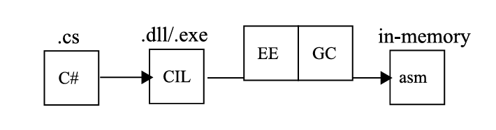
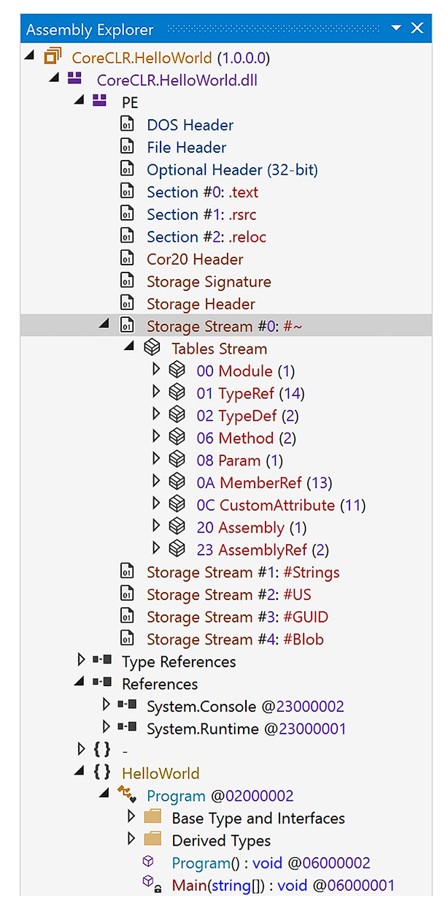
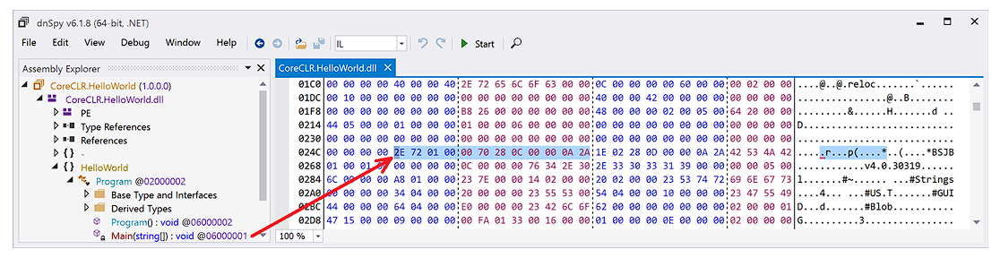

# Внутреннее устройство .NET

Когда вы пишете программу на C или C++, компилятор преобразует исходный код в исполняемый файл. Этот файл может быть напрямую выполнен на целевой машине, так как он содержит двоичный код, который процессор может выполнять напрямую.

С другой стороны, среда выполнения .NET имеет множество важных дополнительных обязанностей, чтобы иметь возможность выполнять наши приложения. В отличие от программ, написанных на C или C++, когда вы пишете программу на C#, F# или любом другом языке, совместимом с .NET, она компилируется в CIL (Common Intermediate Language, общий промежуточный язык). Среда выполнения CLR (Common Language Runtime) выполняет множество магических действий, прежде чем приложение сможет запуститься. Над CLR существует более общая концепция всего .NET Framework, включая все стандартные библиотеки и инструменты (поэтому у нас есть различные версии .NET Framework, которые могут или не могут включать изменения в среде выполнения). CLR имеет несколько обязанностей, среди которых можно выделить:

  * JIT-компилятор (Just-in-Time компилятор): Его функция заключается в преобразовании CIL-кода вызываемых методов в машинный код.

  * Система типов: Она отвечает за механизмы контроля типов и их совместимости. Она включает, среди прочего, Common Type System (CTS, общую систему типов) и некоторые метаданные (используемые механизмом Reflection).

  * Обработка исключений: Она отвечает за обработку исключений как на уровне пользовательской программы, так и на уровне самой среды выполнения. Здесь используются как встроенные механизмы операционных систем (например, Windows SEH, Structured Exception Handling), так и исключения C++.

  * Управление памятью (часто называемое сборщиком мусора, Garbage Collector): Это целая часть среды выполнения, которая управляет памятью, используемой средой выполнения и нашими приложениями. Очевидно, одна из ее основных обязанностей — забота об автоматическом освобождении объектов, которые больше не нужны.


Мы часто разделяем эти обязанности на две основные части:

  * Execution Engine (Исполняющая система): Она отвечает за большинство обязанностей среды выполнения, упомянутых ранее, таких как JIT-компиляция и обработка исключений. В ECMA-335 она называется Virtual Execution System (VES, Виртуальная исполняющая система) и описывается как «ответственная за загрузку и выполнение программ, написанных для CLI. Она предоставляет услуги, необходимые для выполнения управляемого кода и данных, используя метаданные для соединения отдельных сгенерированных модулей во время выполнения».

  * Сборщик мусора (Garbage Collector): Он отвечает за управление памятью, выделение объектов и освобождение областей памяти, которые больше не используются. В ECMA-335 он описывается как «процесс, посредством которого выделяется и освобождается память для управляемых данных».


Все эти элементы работают вместе, как в хорошо слаженной машине, состоящей из множества больших и маленьких частей. Трудно удалить один из них и ожидать, что вся машина продолжит работать. То же самое относится и к управлению памятью. Мы можем говорить о механизмах управления памятью, но важно понимать, что другие компоненты тесно взаимодействуют с ним. Например, JIT-компилятор создает информацию о времени жизни переменных, которая затем используется сборщиком мусора. Система типов предоставляет информацию, необходимую для принятия ключевых решений — например, имеет ли тип так называемый финализатор. Реализация P/Invoke учитывает механизмы освобождения памяти — например, чтобы учитывать приостановку, когда происходит сборка мусора. Мы часто можем слышать о «управляемом коде» в контексте .NET. Это означает, что код, выполняемый средой выполнения, должен быть способен взаимодействовать с ней. Как говорится в стандарте ECMA-335:

  


__Определение

Управляемый код: Код, который содержит достаточно информации, чтобы CLI мог предоставить набор основных услуг. Например, имея адрес метода внутри кода, CLI должен быть способен найти метаданные, описывающие этот метод. Он также должен уметь обходить стек, обрабатывать исключения, а также сохранять и извлекать информацию о безопасности.

Подводя итог, давайте взглянем на общую картину среды выполнения .NET, выполняющей наше приложение (см. [Рисунок 4-1](<#f-4-1>)).

<a id="f-4-1"></a>
<figure markdown="span" class="custom-figure">
   <figcaption>Рисунок 4-1. Исходный код (текстовые файлы) компилируется в Common Intermediate Language (CIL, бинарные файлы). Затем на целевой машине с установленным .NET он выполняется самой средой выполнения. Механизм выполнения (Execution Engine, EE) берет CIL из бинарных файлов и преобразует его в памяти в машинный код. Сборщик мусора (Garbage Collector, GC) управляет временем жизни объектов и использованием памяти на уровне операционной системы.</figcaption>
</figure>

Вы пишете свой код в редакторе по вашему выбору — Visual Studio, Visual Studio Code или любом другом. В результате вы получаете проект, содержащий набор исходных файлов. Это, проще говоря, текстовые файлы с исходным кодом вашей программы, написанной на C#, VB.NET, F# или любом другом поддерживаемом языке.

  * Вы компилируете свой проект с помощью соответствующего компилятора. В результате вы получаете набор файлов (сборок), содержащих двоичный код, представляющий инструкции на языке Common Intermediate Language (CIL). Этот код представляет вашу программу как набор низкоуровневых инструкций, работающих на «виртуальной» стековой машине (см. Главу 1). Также могут быть другие сборки, содержащие библиотеки, которые вы используете в своей программе. Эти сборки могут быть распространены среди других пользователей, например, в виде ZIP-архива или через установщик.

  * Запуск приложения — это, очевидно, самая важная часть, которая может быть разделена на следующие этапы:

    * Для .NET Framework: Исполняемый файл содержит загрузочный код, который загружает соответствующую версию среды выполнения .NET с поддержкой операционной системы Windows.

    * Для .NET Core: Кроссплатформенное решение не зависит от взаимодействия с Windows. Вы можете напрямую запустить исполняемый файл (даже на Linux) или использовать команду «dotnet» с файлом .dll в качестве параметра. Это запустит среду выполнения.

    * Среда выполнения .NET загрузит текущую необходимую часть кода CIL из сборки и передаст его JIT-компилятору.

    * JIT-компилятор скомпилирует код CIL в машинный код, оптимизированный для платформы, на которой он выполняется. Дополнительно он внедрит различные вызовы в механизм выполнения (Execution Engine), чтобы обеспечить хорошее взаимодействие между вашим кодом и средой выполнения .NET.

    * С этого момента ваш код выполняется как обычный нативный машинный код. Разница заключается в том, что, как упоминалось ранее, существует взаимодействие со средой выполнения.


Сейчас, вероятно, хорошее время, чтобы развеять некоторые распространенные заблуждения о среде .NET:

  * .NET не является виртуальной машиной в обычном понимании: Среда выполнения .NET не создает изолированного окружения и не симулирует какую-либо конкретную архитектуру или машину. На самом деле, среда выполнения .NET использует встроенные системные ресурсы, такие как управление памятью операционной системы, включая кучу (heap) и стек (stack), процессы и потоки, и так далее. Затем она добавляет некоторые дополнительные функции поверх них (автоматическое управление памятью — одна из них).

  * Нет единой среды выполнения .NET, работающей на машине: есть один двоичный дистрибутив, но он загружается и выполняется для каждого запущенного приложения .NET. Например, сборка мусора из процесса A не влияет напрямую на сборку мусора из процесса B. Очевидно, что существует некоторое совместное использование ресурсов на уровне оборудования и операционной системы, но в целом каждая среда выполнения .NET не знает о каком-либо другом управляемом приложении, запущенном их собственными экземплярами среды выполнения .NET. Фактически, вы можете разместить среду выполнения .NET внутри неуправляемого приложения (что имеет место в случае возможностей SQL Server CLR). Более того, вы можете разместить как среды выполнения .NET Framework, так и .NET Core в одном процессе, хотя практического использования такого поведения немного.


* * *

##  Пример программы в деталях

Давайте теперь пошагово рассмотрим процесс компиляции и запуска простого приложения Hello World (см. [Листинг 4-1](<#l-4-1>)), чтобы лучше понять некоторые внутренние аспекты .NET. Это позволит вам увидеть некоторые базовые концепции, которые понадобятся позже. Любой, кто когда-либо изучал C#, вероятно, узнает этот пример, единственная цель которого — вывести короткий текст на консоль.

Мы будем использовать его как наш полигон для запуска под .NET 8 на Windows. Очевидно, мы не будем углубляться слишком сильно, так как нас в основном интересуют вопросы управления памятью. Если вам действительно интересно, как среда выполнения .NET загружает себя, управляет типами и подобными темами, мы снова рекомендуем замечательные книги, упомянутые ранее.
    
<a id="l-4-1"></a>
<figure class="custom-code-wrapper"
        markdown="1">

``` csharp title="listing-4-1.cs" linenums="1"
using System;
namespace HelloWorld
{
  class Program
  {
    static void Main(string[] args)
    {
      Console.WriteLine("Hello world!");
    }
  }
}
```      

  <figcaption>Листинг 4-1. Пример программы Hello World, написанной на языке C#</figcaption>
</figure>

Пример кода из [Листинга 4-1](<#l-4-1>) в проекте CoreCLR.HelloWorld, когда компилируется компилятором C# (Roslyn с Visual Studio 2022), создаст один DLL-файл, который в этом примере называется CoreCLR.HelloWorld.dll. Этот файл содержит все данные, необходимые .NET для запуска этой программы. Вы можете подробно изучить его, например, открыв в dnSpy. Затем перейдите по различным декодированным разделам файла (см. [Рисунок 4-2](<#f-4-2>)):

  * Метаданные, описывающие себя (в терминах описания двоичного файла Windows или Linux) — называемые заголовками DOS и PE в случае двоичного файла Windows, показанного на [рисунке 4-2](<#f-4-2>).

  * Метаданные, описывающие содержимое, связанное с .NET, включая все типы, объявленные в сборке, их методы и другие свойства (отображаются как поток хранения #0 с именем #~)

  * Список ссылок на другие необходимые файлы, в которых определены ссылочные типы, например, сборка System.Console для вызова Console.WriteLine

  * Двоичный поток объявленных типов и их методов, закодированных в виде байтов, представляющих общий промежуточный язык.


<a id="f-4-2"></a>
<figure markdown="span" class="custom-figure">
   <figcaption>Рисунок 4-2. Содержимое двоичного файла CoreCLR.HelloWorld.dll – результат компиляции программы из листинга 4-1</figcaption>
</figure>


dnSpy доступен по адресу <https://github.com/0xd4d/dnSpy>. Подробнее об использовании читайте в Главе 3.

Каждый метод или тип имеет уникальный идентификатор, называемый токеном, и его местоположение в файле можно определить благодаря упомянутым ранее потокам метаданных. Благодаря этому мы можем идентифицировать области файла, содержащие тело каждого метода. Например, чтобы увидеть тело метода Main, щелкните его правой кнопкой мыши в Assembly Explorer и выберите опцию «Show Method Body in the Hex Editor» в контекстном меню (см. [Рисунок 4-3](<#f-4-3>)).

<a id="f-4-3"></a>
<figure markdown="span" class="custom-figure">
   <figcaption>Рисунок 4-3. Несколько байтов, содержащих инструкции на общем промежуточном языке для метода Program.Main (стрелка добавлена ​​для ясности)</figcaption>
</figure>

Конечно, понять значение этих необработанных байтов действительно сложно! Однако CIL каждого метода можно декодировать в более читаемую форму благодаря декомпиляции, упомянутой в главе 3: выберите метод Main в Assembly Explorer и выберите IL как язык декомпиляции в выпадающем списке на панели инструментов dnSpy.

Результат декомпиляции типа Program из CoreCLR.HelloWorld.dll показан в [Листинге 4-2](<#l-4-2>) (конструктор был удален для ясности). В комментариях мы можем увидеть оригинальный байт-код для указанных инструкций (например, байт 2A представляет инструкцию CIL ret), так что теперь мы можем полностью понять байты 2E7201000070280C00000A2A, выделенные на [рисунке 4-3](<#f-4-3>).

Если мы посмотрим на простой CIL-код метода Main (см. листинг 4-2), мы увидим, как он был скомпилирован в код для стековой машины:

  * ldstr "Hello World!": Ссылка на строковый литерал помещается в стек вычислений.

  * call System.Console::WriteLine: Static method is called, taking the first argument from the evaluation stack

  * ret: Метод завершает выполнение (без возвращаемого значения, так как в стеке вычислений ничего нет).

<a id="l-4-2"></a>        
<figure class="custom-code-wrapper"
        markdown="1">

``` csharp title="listing-4-2.cs" linenums="1"
// Token: 0x02000002
.class private auto ansi beforefieldinit HelloWorld.Program
      extends [System.Runtime]System.Object
{
  // Token: 0x06000001
  .method private hidebysig static
    void Main (
      string[] args
    ) cil managed
  {
    // Header Size: 1 byte
    // Code Size: 11 (0xB) bytes
    .maxstack 8
    .entrypoint
    ldstr     
    "Hello World!"
    call      
    void [System.Console]System.Console::WriteLine(string)
    ret
  } // end of method Program::Main
} // end of class HelloWorld.Program
```

  <figcaption>Листинг 4-2. Пример программы из листинга 4-1, преобразованной в Common Intermediate Language. Вывод получен с помощью инструмента dnSpy</figcaption>
</figure>


__Примечание

Если внимательно посмотреть на код из [листинга 4-2](<#l-4-2>), можно увидеть инструкцию .maxstack 8, которая, кажется, связана с выполнением программы. Однако это не инструкция CIL. Такое описание метаданных может использоваться различными инструментами для проверки безопасности кода. maxstack указывает, сколько элементов может быть помещено в стек вычислений во время выполнения метода. Обратите внимание, что это указывает на количество элементов, а не на их размер. Инструмент, такой как PEVerify, может использовать эту информацию для сравнения с тем, что хочет сделать CIL-код метода. Однако в настоящее время среда выполнения использует метаданные maxstack очень ограниченно, так как JIT самостоятельно вычисляет такие ограничения. Это в основном оставлено для сторонних инструментов, которые гипотетически могут зависеть от этого.

Если вам интересно, читайте подробнее на сайте <https://github.com/dotnet/runtime/issues/62913>.

Рассматривая стековую машину .NET, следует упомянуть важное понятие местоположений (locations). Хранение различных значений, необходимых для выполнения программы, может быть очень разным:

  * Локальные переменные в методе

  * Аргументы метода

  * Поле экземпляра другого значения

  * Статическое поле (внутри класса, интерфейса или модуля)

  * Локальный пул памяти

  * Временное хранение в стеке вычислений


Как каждое местоположение отображается в конкретную компьютерную архитектуру — это исключительная ответственность JIT-компилятора, и мы скоро углубимся в эту тему.

  


__Примечание

В экосистеме .NET в настоящее время доступно несколько движков JIT-компиляции:

  * Устаревший x86 JIT, используемый средой выполнения .NET (до версии 4.5.2) и .NET Core 1.0/1.1 для архитектуры x86 (32-битные версии).

  * Устаревший x64 JIT, используемый средой выполнения .NET до версии 4.5.2.

  * RyuJIT, используемый .NET Core 2.0 (и более поздними версиями) и .NET Framework 4.6 (и более поздними версиями) для 32- и 64-битной компиляции.

  * Mono JIT для платформ x86 и x64.


Здесь мы сосредоточимся только на движке RyuJIT.

Теперь давайте попробуем использовать WinDbg, чтобы увидеть, как IL-код программы был преобразован в машинные инструкции с помощью JIT в случае 64-битной Windows. Вам нужно запустить приложение, чтобы инициировать загрузку среды выполнения и JIT-компиляцию необходимых методов.

Выберите меню File и нажмите Launch executable (advanced) на панели Start Debugging, затем укажите следующие параметры (предполагая, что решение находится в C:\Projects):

  * Executable: C:\Program Files\dotnet\dotnet.exe

  * Arguments:  \CoreCLR.HelloWorld.dll

  * Start directory: C:\Projects\CoreCLR.HelloWorld\bin\Release\net8.0


  


__Примечание

Многие предпочитают запускать WinDbg из командной строки для отладки программ, используя следующую команду:

windbgx C:\ProgramFiles\dotnet\dotnet.exe C:\Projects\CoreCLR.HelloWorld\bin\x64\Release\net8.0\CoreCLR.HelloWorld.dll

После нажатия кнопки **Debug** приложение Hello World запустится, и его выполнение сразу же прервется. Теперь вам нужно установить точку останова, которая остановит программу непосредственно перед завершением (после вывода сообщения "Hello World!") с помощью следующей команды:

bp coreclr!EEShutDown

Не удивляйтесь, если вы получите следующий результат:

Bp expression 'coreclr!EEShutDown' could not be resolved, adding deferred bp

Это происходит потому, что coreclr.dll не загружен, когда WinDbg прерывает выполнение приложения.

Теперь нажмите Go (или введите команду g) и подождите немного, пока не сработает точка останова. Помните, что расширение SOS должно было автоматически загрузиться WinDbg. Найдите метод Main, используя следующую команду:

!name2ee CoreCLR.HelloWorld.dll!HelloWorld.Program.Main

Следующий вывод показывает, что JIT-код для метода Main расположен по адресу 00007ffb47df0ab0:

<figure class="console-wrapper" markdown="1">

``` text
Module:      00007ffb47ec2448
Assembly:    CoreCLR.HelloWorld.dll
Token:       0000000006000001
MethodDesc:  00007ffb47ec4398
Name:        HelloWorld.Program.Main(System.String[])
JITTED Code Address: 00007ffb47df0ab0
```              

</figure>

Вы можете использовать команду !U 00007ffb47df0ab0, чтобы увидеть сгенерированный ассемблерный код, и результаты представлены в [листинге 4-3](<#l-4-3>). Вот основные шаги выполнения, соответствующие вызову Console.WriteLine:

  * mov rcx, 266E35F04E8h: Сохранить адрес 266E35F04E8h в регистре rcx (это указатель на строковый литерал "Hello World!", который используется здесь из-за механизма "интернирования строк", объясненного позже).

  * call qword ptr [00007ffb47ef17c8]: Вызвать статический метод Console.WriteLine, передавая текст для отображения в регистре rcx.

Остальное соответствует прологу и эпилогу метода для сохранения и восстановления используемых регистров (в данном случае rcx).

<a id="l-4-3"></a>
<figure class="custom-code-wrapper"
        markdown="1">

``` assembly title="listing-4-3.asm" linenums="1"
Normal JIT generated code
HelloWorld.Program.Main(System.String[])
ilAddr is 000002264CA62050 pImport is 0000024C516FCDC0
Begin 00007FFB47DF0AB0, size 25

>>> 00007ffb`47df0ab0 55              push    rbp
sub     rsp,20h
lea     rbp,[rsp+20h]
mov     qword ptr [rbp+10h],rcx
mov rcx,266E35F04E8h ("Hello world!")
call    qword ptr [00007ffb`47ef17c8]
nop
add     rsp,20h
pop     rbp
ret
```      

  <figcaption>Листинг 4-3. Машинный код, полученный с помощью JIT-компиляции кода из [листинга 4-2](<#l-4-2>)</figcaption>
</figure>

Вот так наша простая программа на C# была преобразована через CIL в исполняемый код. Местоположение в стеке вычислений, используемое инструкцией ldstr и передаваемое в Console.WriteLine, было преобразовано JIT-компилятором в регистр процессора rcx. Внутри метода >Main нет выделения памяти в стеке или куче — но, пожалуйста, помните, что некоторые выделения памяти уже были выполнены самой средой выполнения и сборками фреймворка (вы думаете, массив строк, передаваемый в метод Main, появился из ниоткуда?).

  


__Примечание

Поскольку существует множество возможных способов использования регистров и памяти для передачи аргументов при вызовах функций, существуют стандартизированные подходы, называемые соглашениями о вызовах (calling conventions). Они определяют, как передавать аргументы и управлять стеком во время вызова метода, а также как возвращать значение. В этой книге, иллюстрируя ассемблерный код, мы предполагаем использование соглашения о вызовах Microsoft x64. Упрощенно для наших целей, набор правил выглядит следующим образом:

  * Первые четыре целочисленных аргумента и аргумента-указателя передаются через регистры RCX, RDX, R8 и R9.

  * Первые четыре аргумента с плавающей точкой передаются через регистры Xmm0–Xmm3.

  * Дополнительные аргументы помещаются в стек.

  * Целочисленные возвращаемые значения возвращаются через регистр RAX, если их размер не превышает 64 бит.


Обратите внимание, что соглашения о вызовах для Linux x64 отличаются и не будут рассматриваться в этой книге.

Мы надеемся, что это очень краткое и слегка ошеломляющее путешествие показало вам, какие обязанности выполняет среда выполнения .NET. В конечном итоге все вызываемые методы JIT-компилируются в обычный ассемблерный код, при необходимости используя некоторые "управляемые" части среды выполнения.