# Области памяти процесса

Как упоминалось в Главе 2 и показано на Рисунке 2-20, среда выполнения .NET в процессе управляет несколькими областями памяти. При рассмотрении использования памяти процессом .NET необходимо учитывать каждую из этих областей. Давайте рассмотрим их одну за другой, чтобы понять анатомию процесса .NET. Мы будем использовать инструмент SysInternals VMMap, который показывает нам детали областей памяти, используемых в процессе. Области памяти, показанные ниже, относятся к моменту непосредственно перед завершением работы приложения из [Листинга 4-1](<#l-4-1>).

Когда вы заглянете внутрь процесса dotnet.exe, выполняющего приложение Hello World, вы увидите области памяти, как указано на [рисунке 4-4](<#f-4-4>). Чтобы интерпретировать такой вывод VMMap, стоит вспомнить описание областей виртуальной памяти, представленное в главе 2. Как видите, процесс имеет почти 128 ТБ свободной памяти (что соответствует 128 ТБ виртуального адресного пространства на 64-битных платформах).

<figure markdown="span" class="custom-figure">
   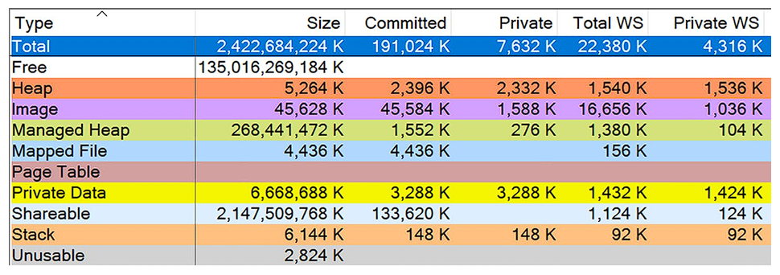<figcaption>Рисунок 4-4. Области памяти, показанные в инструменте VMMap для 64-разрядного приложения из листинга 4-1, работающего под управлением .NET 8.0</figcaption>
</figure>

Загрузите VMMap с <https://learn.microsoft.com/en-us/sysinternals/downloads/vmmap> и прочитайте главу 3 для получения более подробной информации о его использовании.

Давайте рассмотрим все эти элементы вместе с кратким описанием и их значением с точки зрения .NET:

  * Shareable (около 2 GiB): Общая память, которая нас не особо интересует — 100 MiB выделено, и только 2 MiB находится в физической памяти. Эти области предназначены для системных целей управления, не связанных с .NET.

  * Mapped files (около 4 MiB): Как упоминалось в Главе 2, эти области содержат отображенные файлы, такие как шрифты и файлы локализации. Хотя они используются средой выполнения .NET, эти области не должны вызывать проблем в ваших приложениях.

<figure markdown="span" class="custom-figure">
   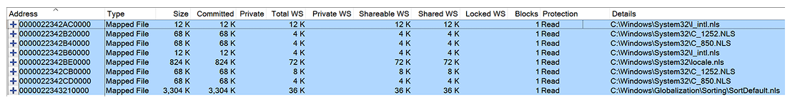<figcaption>Рисунок 4-4a. Области памяти, показанные в инструменте VMMap для 64-разрядного приложения из листинга 4-1, работающего под управлением .NET 8.0</figcaption>
</figure>

  * Images (около 43 MiB): Бинарные образы, соответствующие различным бинарным файлам, включая саму среду выполнения .NET, библиотеки, на которые ссылается наша сборка .NET, и системные DLL, реализующие используемые Windows API. Обратите внимание, что большая часть этого пространства является общей, и только 988 KiB выделено как приватный рабочий набор. Это файлы, загруженные с диска во время запуска приложения.

<figure markdown="span" class="custom-figure">
   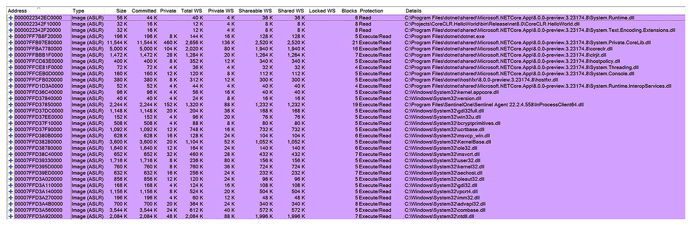<figcaption>Рисунок 4-4b. Области памяти, показанные в инструменте VMMap для 64-разрядного приложения из листинга 4-1, работающего под управлением .NET 8.0</figcaption>
</figure>

  * Stacks (около 7 MiB): В нашем приложении Hello World пять потоков, поэтому для них выделено пять стеков. Поскольку почти никакие методы не вызывались, выделено только 168 KiB.

<figure markdown="span" class="custom-figure">
   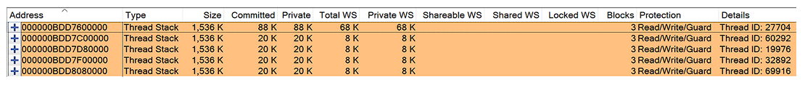<figcaption>Рисунок 4-4c. Области памяти, показанные в инструменте VMMap для 64-разрядного приложения из листинга 4-1, работающего под управлением .NET 8.0</figcaption>
</figure>

  * Heap и Private Data (около 6 MiB выделенной памяти): Это различные области нативной памяти, управляемые средой выполнения .NET для внутренних целей. Они в основном хранят данные, не имеющие отношения к нам (и даже неизвестные без изучения исходного кода .NET). Однако вы можете заметить, что здесь хранятся некоторые фундаментальные структуры данных, используемые Execution Engine и сборщиком мусора, такие как:

    * Списки меток и таблицы карт, с которыми вы познакомитесь в Главах 5, 8 и 11.

    * Интернирование строк.

    * Различные временные области памяти, необходимые во время JIT-компиляции.

    * Обратите внимание, что две последние области памяти помечены флагами защиты Execute/Read/Write. Это области, куда JIT-компилятор помещает машинный код при компиляции CIL-кода. Вот почему они помечены флагом Execute, так как они должны быть вызываемы, как и любой другой ассемблерный код. Эти области фактически составляют ядро нашего приложения, выполняя код, который мы пишем. Если по какой-то причине ваше приложение активно использует JIT-компиляцию, вы можете наблюдать постоянный рост таких областей памяти с флагами Execute/Read/Write.

<figure markdown="span" class="custom-figure">
   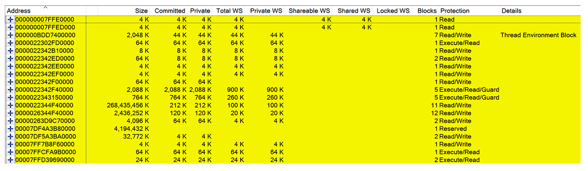<figcaption>Рисунок 4-4d. Области памяти, показанные в инструменте VMMap для 64-разрядного приложения из листинга 4-1, работающего под управлением .NET 8.0</figcaption>
</figure>

  * Managed Heaps (поддержка .NET Core и .NET добавлена во время написания этой книги): Основная часть управления памятью в .NET — это управляемая куча (Managed Heap), поддерживаемая сборщиком мусора, и другие кучи, используемые средой выполнения. Поскольку это, безусловно, самая важная область памяти для нас, мы рассмотрим ее отдельно чуть позже. На следующем скриншоте показано, что VMMap отображает для нашего примера Hello World, работающего на .NET 8:

<figure markdown="span" class="custom-figure">
   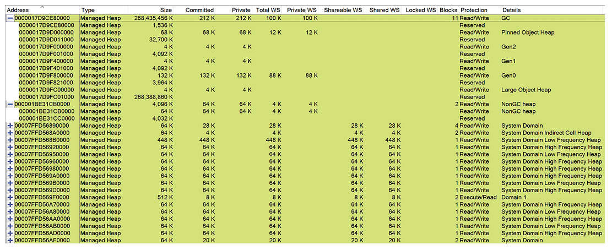<figcaption>Рисунок 4-4e. Области памяти, показанные в инструменте VMMap для 64-разрядного приложения из листинга 4-1, работающего под управлением .NET 8.0</figcaption>
</figure>

  * Unusable (более 2 MiB): Из-за гранулярности выделения страниц, описанной в Главе 2, некоторые части адресного пространства стали непригодными для использования.

Управляемые кучи можно разделить на следующие категории:

  * GC Heap: Самая важная куча для нас, управляемая сборщиком мусора. Большинство экземпляров типов, создаваемых вашими приложениями, попадают сюда: это будет основным фокусом этой книги. Все главы с Главы 5 до конца книги будут описывать, как GC управляет этой кучей. С точки зрения того, что вы уже узнали, это Free Store, управляемый механизмом сборщика мусора и его аллокатором.

  * NonGC heap (ранее называлась Frozen heap): Содержит неизменяемые управляемые объекты, такие как строковые литералы, экземпляры System.Type и статические неизменяемые экземпляры простых типов, таких как Object или массивы простых типов.

  * Other domain heaps: Каждый домен приложения (AppDomain) имеет свой набор куч, поэтому могут быть кучи для Shared Domain, System Domain, Default Domain и любых других динамически загруженных доменов. Каждый может иметь несколько подобластей:

    * High Frequency Heap: Используется для хранения данных, часто используемых доменом приложения для внутренних целей. Как указано в комментариях исходного кода .NET, это «кучи для выделения данных, которые сохраняются на протяжении всего времени жизни домена приложения. Объекты, которые часто выделяются, должны размещаться в HighFreq heap для лучшего управления страницами». Например, High Frequency Heap Shared Domain содержит наиболее часто используемые метаданные, связанные с типами, такие как описания методов и полей. Здесь также хранятся статические данные примитивных типов.

    * Low Frequency Heap: Содержит менее часто используемые метаданные, связанные с типами, такие как EEClass и другие данные, необходимые для JIT-компиляции, Reflection и механизмов загрузки типов.

    * Stub Heap: Как говорится в старом выпуске MSDN Magazine, он «содержит заглушки, которые облегчают безопасность доступа к коду (CAS), вызовы COM-оберток и P/Invoke».

  * Virtual Call Stub: Содержит структуры данных и код, используемые техникой виртуального вызова заглушек (VSD), которая использует заглушки для вызова виртуальных методов вместо традиционной таблицы виртуальных методов. Они делятся на кучи типов Cache Entry Heap, Dispatch Heap, Indirection Cell Heap, Lookup Heap и Resolve Heap. Все они включают различные типы данных, необходимых для работы VSD. Эти кучи довольно малы (сотни кибибайт), даже для тысяч интерфейсов в ваших приложениях.

  * High Frequency Heap, Low Frequency Heap, Stub Heap и различные Virtual Call Stub Heaps вместе называются Loader Heap, так как они отвечают за хранение данных, необходимых для системы типов (и, следовательно, загрузки типов). Вопреки тому, что вы иногда можете услышать, нет такой вещи, как Loader Heap, созданный как отдельная область памяти. Это просто концепция группировки упомянутых областей вместе.

  

__Примечание

Эти кучи по умолчанию небольшие, порядка одной страницы – обычно около 64 КиБ. Мы можем увидеть это в определениях размеров по умолчанию для .NET Core.
    
    
    #define LOW_FREQUENCY_HEAP_RESERVE_SIZE     (3 * GetOsPageSize())
    #define LOW_FREQUENCY_HEAP_COMMIT_SIZE      (1 * GetOsPageSize())
    #define HIGH_FREQUENCY_HEAP_RESERVE_SIZE    (10 * GetOsPageSize())
    #define HIGH_FREQUENCY_HEAP_COMMIT_SIZE     (1 * GetOsPageSize())
    #define STUB_HEAP_RESERVE_SIZE              (3 * GetOsPageSize())
    #define STUB_HEAP_COMMIT_SIZE               (1 * GetOsPageSize())
    

Помните, что любой тип, загруженный в область кучи загрузчика, не будет выгружен до тех пор, пока не будет выгружен весь соответствующий Appdomain. Если вы постоянно загружаете множество типов (например, динамически загружаете или создаете сборки), вы можете столкнуться с большим использованием памяти. Более того, стандартный Appdomain не будет выгружен до тех пор, пока программа не завершит свою работу.

Как упоминалось в Главе 2, возможно изменить размер стека по умолчанию для потоков программы, используя командную программу editbin.exe, которая распространяется с Visual Studio. Выполнив следующую команду, вы можете соответствующим образом отредактировать заголовок бинарного файла предоставленного исполняемого файла:

editbin DotNet.HelloWorld.exe /stack:8000000

Это работает для .NET исполняемого файла, но должно рассматриваться как неподдерживаемый метод – нет гарантии, что в будущем .NET будет учитывать эти значения при создании потоков. Таким образом, хотя манипулирование размером стека описанным способом возможно, не стоит на него полагаться.

Давайте теперь перейдем к одной из повторяющихся секций этой книги, посвященной типичным сценариям: она состоит из описания ситуации вместе с описанием подхода к анализу и решению этой ситуации.

* * *

## Сценарий 4-1 — Насколько велика моя программа в памяти?

Проблема: Клиенты, для которых вы разрабатываете приложение на .NET, спрашивают, сколько оперативной памяти оно требует и каково его типичное использование памяти, потому что они подозревают, что оно потребляет слишком много ресурсов. Это вызывает проблемы в команде, потому что оказывается, что никто не знает ответа и даже как правильно измерить эти показатели. Каждый предлагает разные инструменты с разными способами интерпретации результатов. Предположим, вы разработчики Paint.NET ([www.getpaint.net/)](<https://www.getpaint.net/>)!

Ответ: Чтобы правильно ответить на вопрос ваших клиентов, вы должны понимать, как операционная система видит использование памяти вашим процессом. Это было кратко описано в Главе 2, и вы, вероятно, заметили, что между различными инструментами нет большой согласованности. С точки зрения высокого уровня, вам следует сосредоточиться на следующих измерениях:

  * Private working set (Приватный рабочий набор): Указывает объем физической оперативной памяти, занимаемой процессом. Это, очевидно, может быть основным узким местом для контейнеров, поэтому вам следует сначала обратить внимание на это.

  * Private bytes (Приватные байты, также известные как commit size): Указывает объем памяти как в физической оперативной памяти, так и в файле подкачки. Вам не нужно чрезмерное использование подкачки, поэтому, если этот размер значительно больше приватного рабочего набора, вам следует насторожиться. Неограниченный рост файла подкачки также опасен, так как ваши жесткие диски не имеют бесконечного объема памяти.

  * Virtual bytes (Виртуальные байты): Указывает все виртуальные байты, как выделенные (приватные), так и только зарезервированные, независимо от их местоположения. Это измерение является наиболее абстрактным, поскольку оно не приводит к значительному потреблению физических ресурсов, за исключением таблиц страниц (см. Главу 2). Только в 32-битном сценарии вам нужно убедиться, что вы не достигаете предела в 2 ГБ. В 64-битных системах .NET Core резервирует 2 ТБ, так что не пугайтесь, когда увидите это!

В Windows для измерения этих размеров вы можете просто использовать вкладку Details в Диспетчере задач, где они отображаются как Memory (private working set) и Commit size соответственно (виртуальные байты там не отображаются) — см. [Рисунок 4-5](<#f-4-5>).

<figure markdown="span" class="custom-figure">
   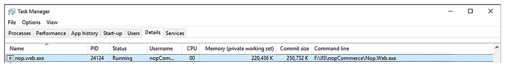<figcaption>Рисунок 4-5. Диспетчер задач окна, показывающий основные данные об использовании памяти</figcaption>
</figure>

Вы также можете использовать инструмент Performance Monitor (см. [Рисунок 4-6](<#f-4-6>)) для записи счетчиков \Process(processname)\ Working Set - Private, \Process(processname)\Private Bytes и \Process(processname)\Virtual Bytes с течением времени. Помимо абсолютных размеров, тенденции, конечно же, также важны.

<figure markdown="span" class="custom-figure">
   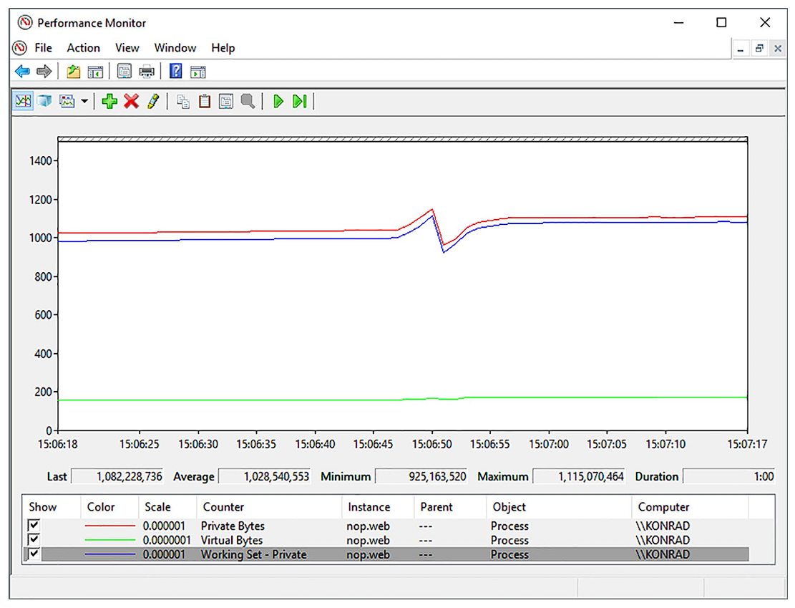<figcaption>Рисунок 4-6. Счетчики производительности, показывающие основные данные об использовании памяти</figcaption>
</figure>

Вы также можете рассмотреть возможность анализа того, что включено в измеряемый размер процесса, с помощью инструмента VMMap на Windows (см. [Рисунок 4-4](<#f-4-4>), где он уже был представлен). Там вы найдете те же столбцы измерений: Private WS, Private и Size. Что касается типов памяти, важно сначала посмотреть на Managed Heap. Однако также стоит обратить внимание на другие типы памяти. Если вы подозреваете утечку памяти, наблюдайте за размерами всех типов памяти с течением времени и попытайтесь обнаружить, что постоянно растет. Утечка памяти может быть как в вашем управляемом коде, так и в каком-либо используемом неуправляемом компоненте (даже неявно, когда вы об этом не знаете).

На Linux вы можете использовать инструмент top и соответствующие столбцы, описанные в Главе 2. Также можно использовать CLI-инструмент dotnet-counters, представленный в Главе 3, с командой monitor -p <идентификатор процесса>. Вы получите как размер управляемой памяти (путем суммирования счетчиков Gen1 Size (B), Gen2 Size (B), LOH Size (B) и POH (Pinned Object Heap) Size (B)), так и размер рабочего набора (с помощью счетчика Working Set (MB)), как показано на [Рисунке 4-7](<#f-4-7>).

<figure markdown="span" class="custom-figure">
   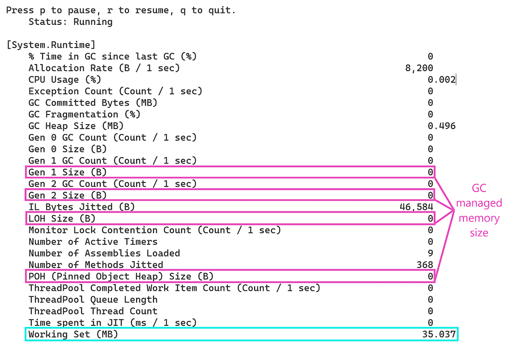<figcaption>Рисунок 4-7. Использование dotnet-counters для просмотра рабочего набора и использования управляемой памяти</figcaption>
</figure>

Вы могли заметить счетчик GC Committed Bytes (MB): он показывает совокупные выделенные байты во всех управляемых кучах (SOH, LOH, POH), включая NGCH, подробно описанный в Главе 5, а также свободные списки и непригодную для использования фрагментированную память, описанные в Главе 6.

Когда вы используете Server GC, помните, что использование памяти может варьироваться в зависимости от оборудования (количества ядер или доступной памяти).

* * *

## Сценарий 4-2 — Использование собственной памяти моей программой продолжает расти

Описание: Ваш клиент сообщает об исключении OutOfMemory после нескольких дней непрерывной работы с вашей службой Windows, написанной на .NET. Вам необходимо выяснить причину и, конечно, сделать это быстро.

Ответ: Учитывая, что вам не предоставлен полный дамп памяти процесса, вы можете начать расследование с мониторинга использования памяти программой с течением времени. Вы можете начать с инструмента Performance Monitor, чтобы отслеживать наиболее важные счетчики (см. [Рисунок 4-8](<#f-4-8>)):

  * \Process(имя_процесса)\Working Set - Private

  * \Process(имя_процесса)\Private Bytes

  * \Process(имя_процесса)\Virtual Bytes

  * .NET CLR Memory(имя_процесса)# Total committed Bytes: Счетчик для наблюдения за использованием Managed Heap.

<figure markdown="span" class="custom-figure">
   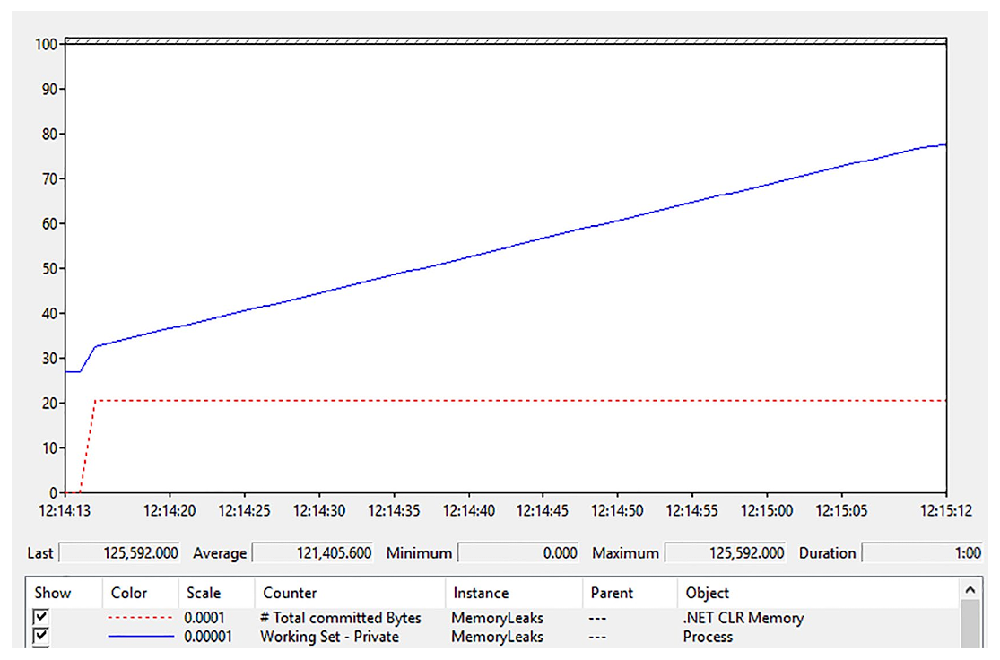<figcaption>Рисунок 4-8. Счетчики производительности для Сценария 4-2 показывают стабильный размер управляемой кучи, но приватный рабочий набор постоянно растет.</figcaption>
</figure>

Из того, что вы видите, очевидно, что существует утечка памяти — использование памяти процессом постоянно растет. Однако размер управляемой кучи (Managed Heap) очень стабилен, поэтому, вероятно, это утечка неуправляемой памяти, не связанная с вашим кодом на .NET (хотя, как вы увидите в Сценарии 4-3, это может быть и не так!). Зная это, стоит заглянуть внутрь процесса с помощью VMMap. Как вы можете заметить при кратком наблюдении, размер памяти типа Heap (Private) постоянно растет. Ваша программа медленно создает все больше и больше областей памяти Heap размером около 16 MiB (см. [Рисунок 4-9](<#f-4-9>)).

<figure markdown="span" class="custom-figure">
   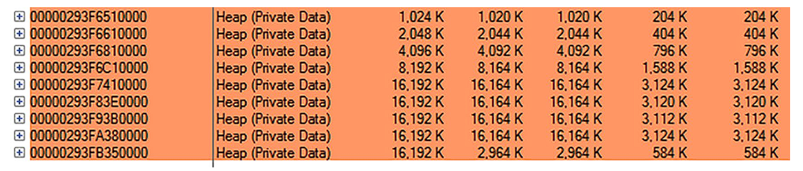<figcaption>Рисунок 4-9. Представление VMMap для областей памяти типа Heap в Сценарии 4-2. Постоянно растущие и периодически создаваемые области памяти Heap (Private Data).</figcaption>
</figure>

Это первый ключ в этом расследовании — области Heap, скорее всего, растут из-за активного использования API Heap (например, вызовов malloc в C или оператора new в C++). Теперь вам нужно выяснить, какой код вызывает это. Сделать это с помощью дампа памяти процесса может быть утомительно, поскольку анализ неуправляемой памяти очень сложен (особенно для людей, работающих с .NET и не привыкших к неуправляемому миру).

К счастью, есть гораздо более простой способ исследовать это с помощью PerfView. В его диалоговом окне Collect введите имя исполняемого файла в поле OS Heap Exe или идентификатор процесса в поле OS Heap Process (помните, что только во втором случае вы можете подключиться к уже запущенному процессу). Указание одного из параметров OS Heap включает отслеживание использования API Heap с помощью ETW. Запустите сбор данных и подождите соответствующее количество времени в зависимости от того, как быстро растет использование памяти вашим процессом.

После остановки сбора и завершения всей обработки вы должны открыть Net OS Heap Alloc Stacks из папки Memory Group. Постепенно раскрывайте отдельные элементы дерева, углубляясь в наиболее активно выделяющую память часть кода (с наибольшим значением в столбце Inc %). Для некоторых узлов может потребоваться загрузка символов (щелкните правой кнопкой мыши и выберите Lookup Symbols из контекстного меню). Также стоит отключить группировку модулей, используя опцию Ungroup Module из того же контекстного меню. Вскоре вы сможете четко увидеть причину более 90% выделений памяти (см. [Рисунок 4-10](<#f-4-10>)). Это сила ETW у вас под рукой!

<figure markdown="span" class="custom-figure">
   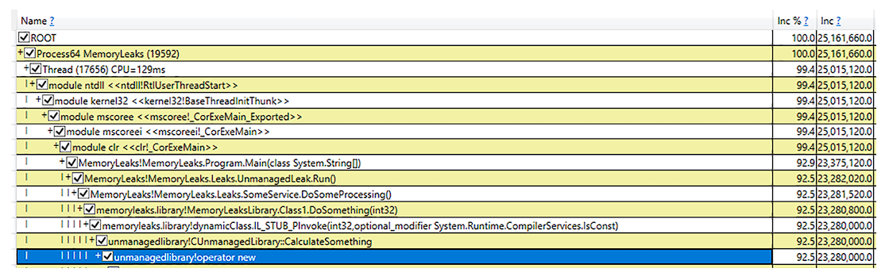<figcaption>Рисунок 4-10. Анализ PerfView для сценария 4-2. Вы видите агрегированный стек вызовов для оператора new</figcaption>
</figure>

Вы видите, что причина большинства выделений памяти — это использование оператора `new` внутри метода CUnmanagedLibrary::CalculateSomething, который вызывается другими компонентами .NET-приложения. Это действительно коренная причина проблемы, так как упомянутый метод имеет специально подготовленную, довольно глупую реализацию (см. [Листинг 4-4](<#l-4-4>)).

  

    
    
        
    int CUnmanagedLibrary::CalculateSomething(int size)
    {
      int* buffer = new int[size];
      return 2 * size;
    }
        
      

Листинг 4-4. Причина утечки памяти в сценарии 4-2

В реальных сценариях может быть множество других источников выделения памяти, поэтому вам придется исследовать их и сделать обоснованное предположение, что может быть настоящим вызовом. Также обратите внимание, что если у вас нет файлов символов для неуправляемых библиотек, используемых вашим приложением, вы не увидите конкретных имен методов и функций в представлении Net Virtual Alloc Stacks. Однако оно все равно укажет на компонент, вызывающий проблемы, поэтому вы можете связаться с его производителем или поискать решение в Интернете. Также стоит помнить, что трассировка ETW для API Heap может вносить значительные накладные расходы, поэтому будьте осторожны при ее включении, особенно в производственных средах.

* * *

## Сценарий 4-3 — Использование виртуальной памяти моей программой продолжает расти

Описание: На машинах клиента происходит что-то странное с вашим приложением. Использование памяти, кажется, растет бесконечно, хотя это не оказывает никакого негативного влияния, и программа работает правильно. Клиент сообщает, что потребляются «гигабайты памяти», хотя вы никогда не наблюдали такого поведения в своих средах. Никто не знает, стоит ли вам беспокоиться или нет.

Анализ: Вам следует снова начать расследование с мониторинга использования памяти программой с течением времени. Вы можете начать с инструмента Performance Monitor, чтобы отслеживать следующие счетчики производительности:

  * \Process(имя_процесса)\Working Set - Private

  * \Process(имя_процесса)\Private Bytes

  * \Process(имя_процесса)\Virtual Bytes

  * .NET CLR Memory(имя_процесса)# Total committed Bytes

Вскоре вы можете заметить, что использование управляемой кучи и размер приватного рабочего набора стабильны. Однако наблюдается постоянный рост приватных байтов — вероятно, большая часть выделенной памяти не находится в физической оперативной памяти. Виртуальные байты также постоянно растут, указывая на гигабайты виртуальной памяти, «потребляемой» в адресном пространстве процесса! При анализе процесса с помощью VMMap вы увидите причину этого (см. [Рисунок 4-11](<#f-4-11>)). Действительно, потребляется более 40 ГБ виртуальной памяти. Однако около 37 ГБ помечены как непригодные для использования! Это указывает на то, что кто-то выделяет страницы очень неэффективно (вспомните Главу 2). Вы можете проверить это предположение, взглянув на список областей памяти (см. [Рисунок 4-12](<#f-4-12>)), где есть множество страниц с непригодными данными.

<figure markdown="span" class="custom-figure">
   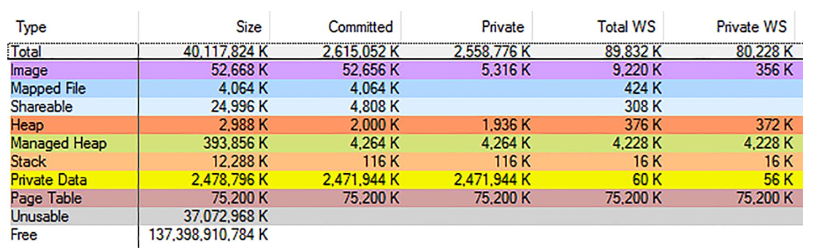<figcaption>Рисунок 4-11. Вид VMMap процесса для сценария 4-3. Существует огромное количество виртуальной памяти (Size), но большая ее часть неиспользуемая.</figcaption>
</figure>

<figure markdown="span" class="custom-figure">
   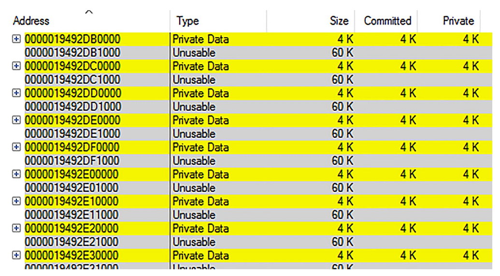<figcaption>Рисунок 4-12. Вид VMMap Неиспользуемых регионов для Сценария 4-3. Существует много, много таких регионов, перемежающихся с частными данными размером в одну страницу.</figcaption>
</figure>

Теперь вам нужно понять, какая часть вашей программы использует страницы таким неправильным образом. Снова вы можете использовать PerfView, но на этот раз вас интересует API Virtual (например, вызовы VirtualAlloc), так как тип памяти Private Data был идентифицирован (а не тип Heap). Вам следует установить флажок VirtAlloc в диалоговом окне Collect и начать сбор данных, пока ваше проблемное приложение работает. Включение этого провайдера вносит меньшие накладные расходы, чем API Heap, использованный в Сценарии 4-2.

После остановки сбора и завершения всей обработки вы должны открыть Net Virtual Alloc Stacks из папки Memory Group. Если утечка памяти значительна, вы, вероятно, найдете коренную причину в верхней части представленного списка — в этом примере 70,4% всех выделений памяти были вызваны вызовами VirtualAlloc (см. [Рисунок 4-13](<#f-4-13>)).

<figure markdown="span" class="custom-figure">
   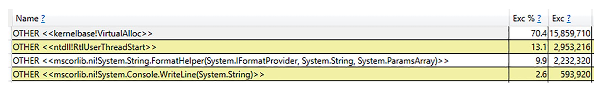<figcaption>Рисунок 4-13. Анализ PerfView для сценария 4-3 показывает очень большое количество вызовов VirtualAlloc</figcaption>
</figure>

Если вы дважды щелкните по нему, будет представлено дерево вызовов. Раскройте узлы с наибольшим вкладом в выделение памяти. При необходимости используйте загрузку символов и отключите группировку с помощью опций Lookup Symbols и Ungroup Module из контекстного меню. Теперь вы сможете найти самый большой источник виртуальных выделений: метод MemoryLeaks.Leaks.UnusableLeak.Run() из модуля MemoryLeaks в этом примере (см. [Рисунок 4-14](<#f-4-14>)).

<figure markdown="span" class="custom-figure">
   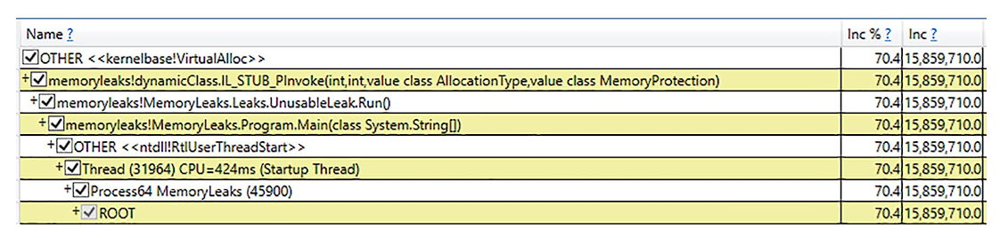<figcaption>Рисунок 4-14. Анализ PerfView для сценария 4-3 показывает агрегированный стек вызовов для VirtualAlloc</figcaption>
</figure>

И действительно, этот метод содержит вызов VirtualAlloc через interop, который выделяет только одну страницу (обычно 4 KiB), хотя, как вы знаете, гранулярность выделения на Windows составляет 64 KiB (см. [Листинг 4-5](<#l-4-5>)). Таким образом, непригодные 60 KiB памяти тратятся впустую для каждого вызова VirtualAlloc.
    
    
        
    ulong block = (ulong)DllImports.VirtualAlloc(IntPtr.Zero, new IntPtr(pageSize),
        DllImports.AllocationType.Commit,
        DllImports.MemoryProtection.ReadWrite);
        
      

Листинг 4-5. Фрагмент проблемного кода для сценария 4-3

В реальном сценарии какая-либо используемая неуправляемая библиотека может использовать VirtualAlloc таким неэффективным способом. Используя данные ETW для API Virtual, вы сможете отследить до конкретного вызова метода, ответственного за неэффективные виртуальные выделения памяти.

* * *

## Сценарий 4-4 — Использование управляемой памяти моей программой продолжает расти с ростом количества сборок

Описание: Ваш клиент жалуется на большое использование памяти вашим приложением. Оно постоянно растет до гигабайтов, а затем завершается сбоем из-за исключения OutOfMemory. Вы уверены, что код не использует никаких неуправляемых компонентов, поэтому убеждены, что утечка памяти происходит в коде на C# (хотя всегда помните, что библиотеки, которые вы используете, могут внутренне использовать неуправляемый код, так что... всегда будьте осторожны и помните о ранее представленных сценариях). Клиент прислал вам несколько скриншотов Диспетчера задач, показывающих, что все размеры памяти действительно постоянно растут.

Анализ: Вы начинаете анализ с типичного мониторинга следующих счетчиков производительности:

  * \Process(имя_процесса)\Working Set - Private

  * \Process(имя_процесса)\Private Bytes

  * \Process(имя_процесса)\Virtual Bytes

  * .NET CLR Memory(имя_процесса)# Total committed Bytes

Вы очень удивлены, потому что оказывается, что общее количество выделенных байтов управляемой кучи стабильно. Но действительно, все остальные наблюдаемые размеры растут, даже приватный рабочий набор. Инстинктивно вы заглядываете внутрь процесса с помощью VMMap. Вы видите через несколько минут наблюдения, что приватный рабочий набор управляемой кучи постоянно растет, поэтому, очевидно, ваша утечка памяти как-то связана с .NET. Но почему это не отражается на счетчике производительности? Взглянув на список типов Managed Heap в VMMap, вы замечаете что-то необычное (см. [Рисунок 4-15](<#f-4-15>)). Область Managed Heap, помеченная как GC (часть, которая хранит объекты, выделенные вашим приложением), растет очень медленно. С другой стороны, есть десятки областей Domain 1, Domain 1 Low Frequency Heap и Domain 1 High Frequency Heap! Это означает, что загружается множество дополнительных сборок, скорее всего, из-за динамического создания сборок.

<figure markdown="span" class="custom-figure">
   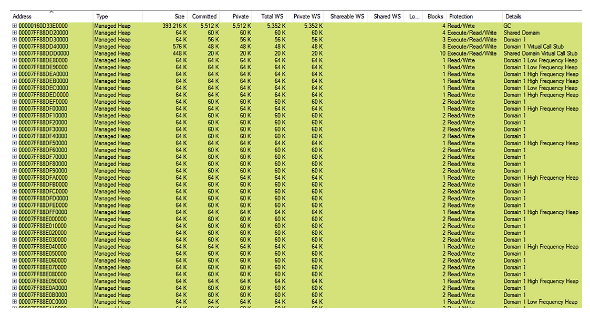<figcaption>Рисунок 4-15. Вид VMMap управляемых куч для сценария 4-4</figcaption>
</figure>

Вы подтверждаете эту ситуацию, возвращаясь к Performance Monitor и добавляя следующие дополнительные счетчики:

  * .NET CLR Loading(имя_процесса)\Bytes in Loader Heap

  * .NET CLR Loading(имя_процесса)\Current Classes Loaded

  * .NET CLR Loading(имя_процесса)\Current Assemblies

  * .NET CLR Loading(имя_процесса)\Current appdomains

Первые три счетчика постоянно растут, поэтому, очевидно, вы только что нашли коренную причину утечки памяти. Некоторый код загружает десятки динамических сборок.

Вы могли бы использовать dotnet-counters, чтобы увидеть, как счетчики Number of Assemblies Loaded и Number of Methods Jitted растут как сумасшедшие, как показано на [рисунке 4-16](<#f-4-16>).

<figure markdown="span" class="custom-figure">
   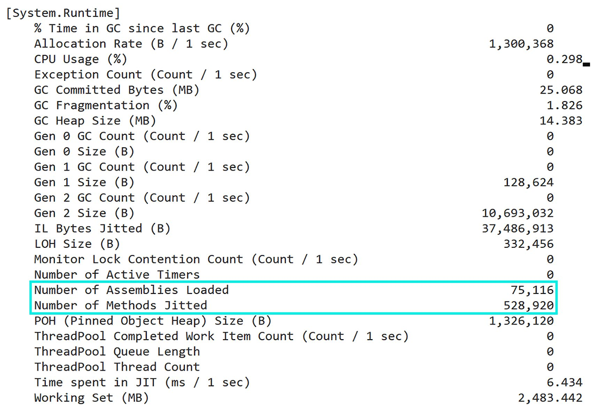<figcaption>Рисунок 4-16. Счетчики dotnet, отображающие огромное количество загруженных сборок и JIT-методов</figcaption>
</figure>

Наличие более 75 000 загруженных сборок с более чем 500 000 JIT-скомпилированных методов определенно не является признаком нормальной ситуации!

Снова на помощь приходят ETW и PerfView! На этот раз вас интересуют события, связанные с загрузкой сборок. Вы можете включить их отслеживание, используя поле Additional Providers в диалоговом окне Collect. Введите туда Microsoft-Windows-DotNETRuntime:LoaderKeyword:Always:@StacksEnabled=true, что означает, что вы заинтересованы в событиях, связанных с загрузкой, и хотите записывать стеки вызовов для каждого события. Запустите сбор данных и подождите соответствующее количество времени (например, в течение которого загрузка нескольких новых сборок будет видна благодаря счетчику Current Assemblies).

После остановки сбора и завершения всей обработки вы должны открыть список событий и найти события Microsoft-Windows-DotNETRuntime/Loader/AssemblyLoad для вашего процесса (см. [Рисунок 4-17](<#f-4-17>)).

<figure markdown="span" class="custom-figure">
   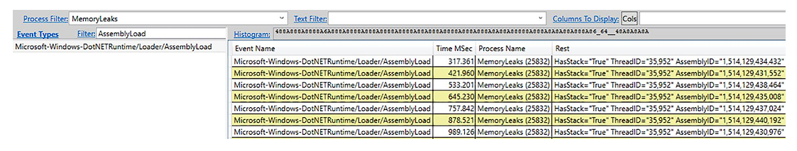<figcaption>Рисунок 4-17. Вид событий PerfView для сценария 4-4. Вы видите много событий AssemblyLoad</figcaption>
</figure>

Выберите одно из них и выберите опцию контекстного меню Open Any Stacks для столбца Time MSec (стек не будет отображаться, если щелкнуть правой кнопкой мыши на ячейке в любом другом столбце). Будет отображен стек вызовов этого события. Сгруппировав модули, которые вас не интересуют (например, модули среды выполнения .NET, такие как clr, mscoree или mscoreei), и разгруппировав свои собственные модули, вы четко определите источник создания динамических сборок (см. [Рисунок 4-18](<#f-4-18>)). Это конструктор XmlSerializer, вызываемый в вашем методе XmlSerializerLeak.Run().

<figure markdown="span" class="custom-figure">
   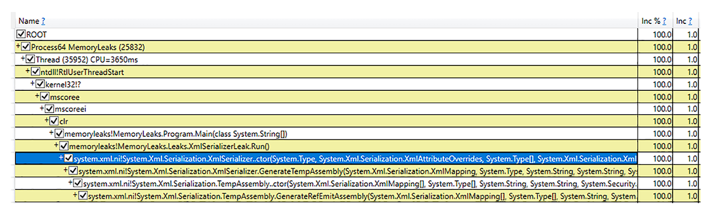<figcaption>Рисунок 4-18. Представление трассировки стека PerfView для одного события AssemblyLoad указывает на конструктор XmlSerializer</figcaption>
</figure>

Вы только что нашли проблему! Действительно, документация Microsoft для XmlSerializer гласит:

Чтобы повысить производительность, инфраструктура XML-сериализации динамически генерирует сборки для сериализации и десериализации указанных типов. Инфраструктура находит и повторно использует эти сборки. Это поведение происходит только при использовании следующих конструкторов:

  * XmlSerializer.XmlSerializer(Type)

  * XmlSerializer.XmlSerializer(Type, String)

Если вы используете любой из других конструкторов, генерируются несколько версий одной и той же сборки, которые никогда не выгружаются, что приводит к утечке памяти и снижению производительности. Самое простое решение — использовать один из двух упомянутых выше конструкторов. В противном случае вы должны кэшировать сборки в Hashtable, как показано в следующем примере.

В этом примере, как показано на [Рисунке 4-18](<#f-4-18>), используется один из других неудачных конструкторов: сгенерированные сборки не переиспользуются, что приводит к наблюдаемой утечке памяти.

  

__Примечание

Причина проблемы может быть аналогично устранена в других ситуациях, связанных с динамическим созданием сборок, таких как вызов AppDomain.CreateDomain без его выгрузки или использование различных механизмов выполнения скриптов, создающих сборки для скомпилированных скриптов.

* * *

## Сценарий 4-5 — Моя программа не может выгрузить плагины

Описание: Вы написали программу, которая использует сборки с возможностью выгрузки (через AssemblyLoadContext) для загрузки и выгрузки плагинов. Но, очевидно, что-то не так. Использование памяти вашей программой, как видно из Диспетчера задач, медленно и бесконечно растет

Анализ: Вы начинаете предварительный анализ с помощью dotnet-counters и наблюдаете ключевые показатели:

  * Working Set (MB)

  * GC Committed Bytes (MB)

  * GC Heap Size (MB)

Вы можете легко заметить, что Working Set быстро достигает значений порядка 1 ГБ, в то время как управляемая куча (Managed Heap) очень мала — порядка нескольких десятков мегабайт.

Текст ...

Текст ...

Текст ...

Текст ...

Текст ...

Текст ...
